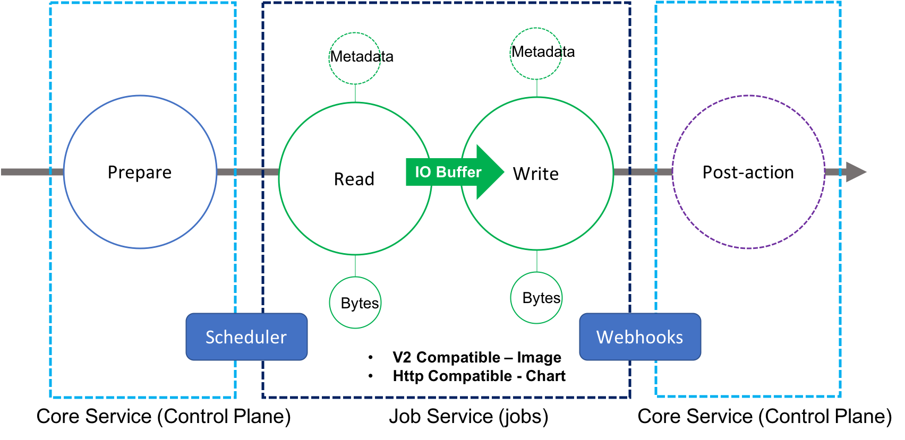
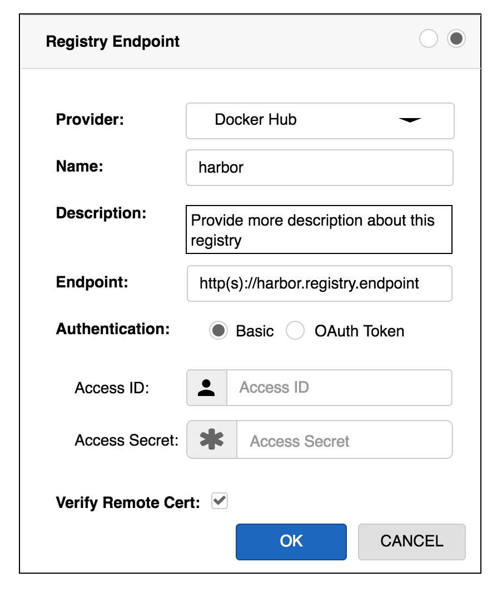
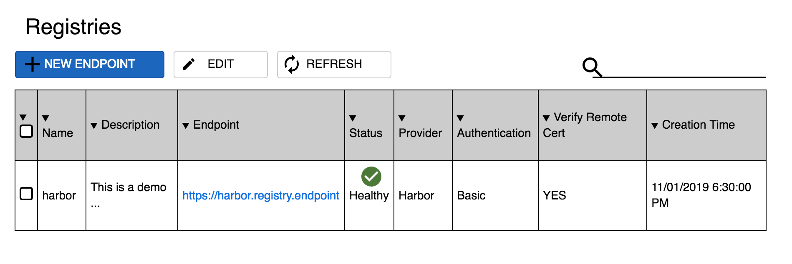
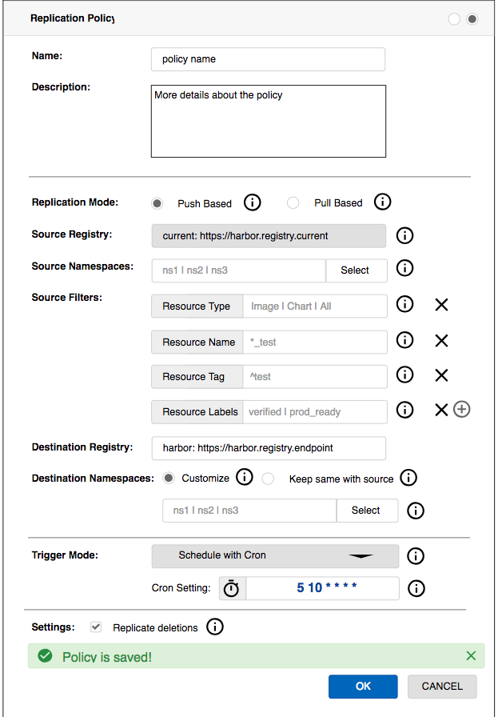
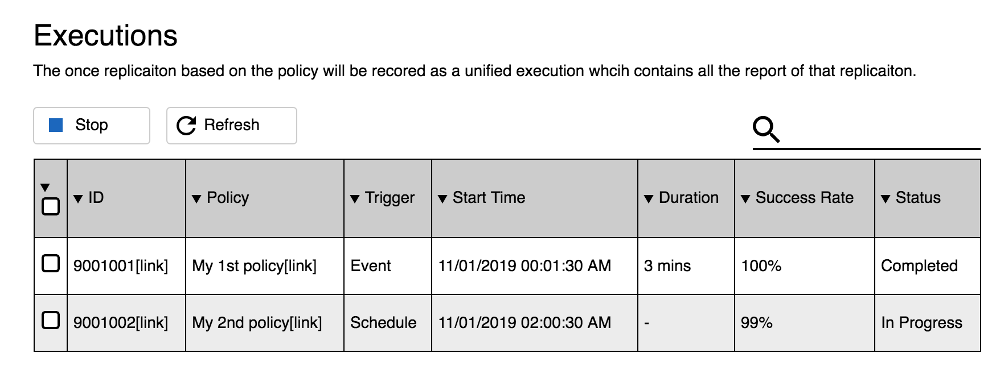
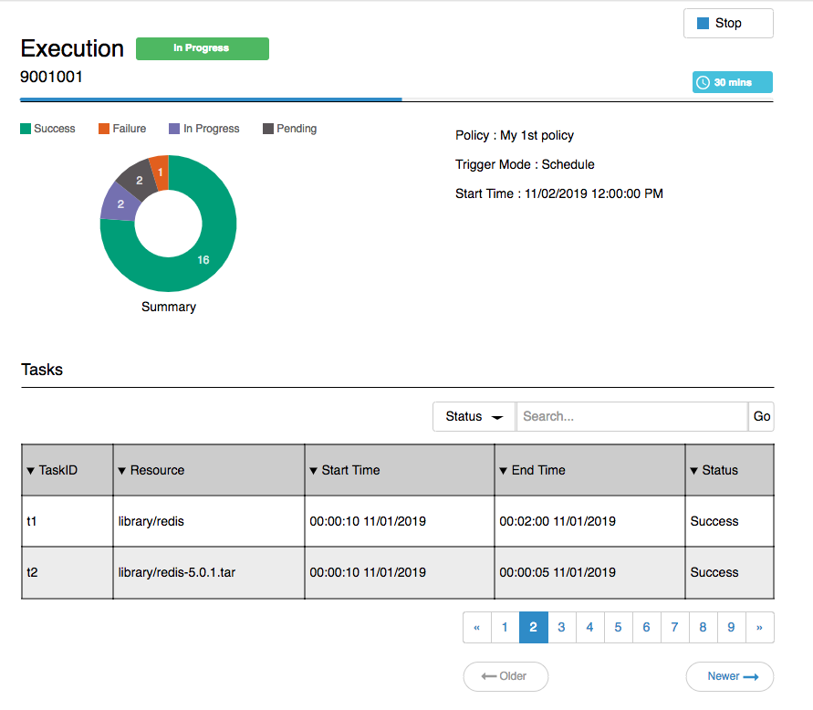

# Proposal: Content Replication NG (Next Generation)

Author: **Replication Workgroup**
Group members:
* Steven Zou@VMware ([steven-zou](https://github.com/steven-zou))
* Wenkai Yin@VMware ([ywk253100](https://github.com/ywk253100))
* De Chen@CaiCloud ([cd1989](https://github.com/cd1989))
* Fanjian Kong@Qihoo360 ([kofj](https://github.com/kofj))
* Mingming Pei@Netease ([mmpei](https://github.com/mmpei))
* Lei Yuan@HuaWei ([yuanshuhan](https://github.com/yuanshuhan))

Discussion: None

## Abstract

Improve the replication service to support replicating both images and charts between Harbor registry and other well-known image registry services or chart repository services, e.g: Docker hub, HW cloud registry, Netease cloud registry, ECS, ACS, GCS and Ali ACS etc. with reasonable performance and efficiencies.

## Background

Currently, Harbor user can use replication service to synchronize images from the source Harbor registry to the target Harbor registry per projects. `Name`、`tag` and `label` filters can be applied to narrow down the replication source list. The replication process can be triggered with manual, scheduled and event-based ways.

However, the current solution provides very limited capabilities. Many replication scenarios cannot be covered. It should be improved to extend the usage scope and scenarios. The goal of this proposal is to propose a enhanced replication solution (named as replication NG solution) to achieve the capabilities:

* Replicate both image and chart
* Replicate content from Harbor to other non Harbor registries
* Replicate content from other registries to Harbor
* Easily extended to onboard the replication between Harbor and a new non Harbor registry

## Proposal

### Use Cases

The replication NG should cover the following use cases:

* User can manage and monitor both Harbor and non-Harbor registry endpoints
* User can create replication policies to trigger replication
* User can replicate both image and helm charts content
* User can replicate filtered content (may be from multiple sources) from upstream registry (Harbor or non-Harbor) to current Harbor registry `pull-based`
* User can replicate filtered content in current Harbor registry to the downstream registry (Harbor or non-Harbor) `push-based`
* User can check the replication summary report
* User can track and control (stop/cancel/pause?/resume?) the replication process
* User can use replication cross-geo to sync content with reasonable performance

### Prerequisite

#### Process flow

To support the [use cases](#use-cases) described in the above section, first thing we need to clarify is what the replication flow should look like.

Considering kinds of factors and requirements and try best to use a unified flow to drive the different scenarios, we propose the following process flow.



The whole flow will be covered by two processes: the core service and job service. The control plane laid in core service mainly take charge of accessing, scheduling and controlling. The content data transferring will be occurred in job service side. 

The flow is logically splitted into three stages: prepare, data transferring and post-actions:

* **Prepare**: All the preparations work is happened here.
  * The connectivity of upstream/downstream registries will be checked to achieve a early failure in case there is something wrong;
  * The replicating resources are retrieved with filter policies if set from the upstream registry;
  * Prepare the downstream registry replicating environment, most cases are creating corresponding namepsaces;
  * Do other necessary actions if necessary.
* **Data Transferring**: Do the real data transfer action here. The data upstream and downstream are connected through an IO buffer to achieve the purpose of improving performance by reading and writing at the same time.
* **Post Action**: Do some clean work if needed or send notifications to the interested parts after the replication completed.

#### Resource

To significantly simplify the process, a top level abstracted resource should be defined to make the resource object unified and consistent.

The resource mentioned in this proposal refer to container image and Helm Chart. Those two kinds of resource can be delegated by the following resource abstraction:

* Header
  * Kind: Image/Chart
  * URI: resource url to identify the object if applicable
* Metadata
  * namespace: the isolation group that resource in if applicable
  * name: name of the resource
  * vtag: the tag or version of the resource
  * labels: the label list applied to the resource if applicable
* Additional Info
  * Registry: the registry info in which the resource is maintained
* Extended
  * k-v: Other properties to describe the resource

### Overall Architecture

Here is the over all architecture for the replication NG service.


#### Restful API

The replication restful APIs are supported by three parts:
**WARNING: New API routes breaks the compatibilities**

* API for policy management
  * Current API route definitions

  ```go
  GET    "/api/policies/replication"              // List policies
  POST   "/api/policies/replication"              // Create policy
  GET    "/api/policies/replication/:id([0-9]+)"  // Get the specified policy
  PUT    "/api/policies/replication/:id([0-9]+)"  // Update the specified policy
  DELETE "/api/policies/replication/:id([0-9]+)"  // Remove the specified policy
  ```

  * **NG API route definitions**

  ```go
  /**
  * 1. Add `replication` as a API group context to indicate those APIs handle replication related things.
  * 2. `/api/replication/policies` explicitly figure out the policy is for replication.
  * 3. For querying, use query parameters.
  */
  GET    "/api/replication/policies"              // List policies
  POST   "/api/replication/policies"              // Create policy
  GET    "/api/replication/policies/:id([0-9]+)"  // Get the specified policy
  PUT    "/api/replication/policies/:id([0-9]+)"  // Update the specified policy
  DELETE "/api/replication/policies/:id([0-9]+)"  // Remove the specified policy
  ```

* API for registry management
  * Current API route definitions

  ```go
  GET    "/api/targets"                       // List registries
  POST   "/api/targets"                       // Add registry endpoint
  POST   "/api/targets/ping"                  // Check connectivity of registry endpoint
  GET    "/api/targets/:id([0-9]+)"           // Get the specified registry endpoint
  PUT    "/api/targets/:id([0-9]+)"           // Update the specified registry endpoint
  DELETE "/api/targets/:id([0-9]+)"           // Remove the specified registry endpoint
  GET    "/api/targets/:id([0-9]+)/policies/" // List registries by registry
  ```

  * **NG API route definitions**:

  ```go
  /**
  * 1. As the managed registries may be sources or targets in replication NG, the `targets` term in the API routes of registry management is not suitable anymore. Use `registries` to instead.
  * 2. As the health checking is handled by the backend monitor, ping can be moved out.
  * 3. API of listing policies by target is also moved out.
  * 4. Left an open question here: is it still necessary to limit the ":id" with only numbers?
  */
  GET    "/api/registries"             // List registries
  POST   "/api/registries"             // Add registry endpoint
  GET    "/api/registries/:id([0-9]+)" // Get the specified registry endpoint
  PUT    "/api/registries/:id([0-9]+)" // Update the specified registry endpoint
  DELETE "/api/registries/:id([0-9]+)" // Remove the specified registry endpoint

  ```

* API for replication operations like triggering and getting replication histories
  * Current API route definitions

  ```go
  GET    "/api/jobs/replication/"                // List all replication executions
  PUT    "/api/jobs/replication/"                // Stop replication jobs
  DELETE "/api/jobs/replication/:id([0-9]+)"     // Delete the replication execution
  GET    "/api/jobs/replication/:id([0-9]+)/log" // Check the log data of the replication execution
  POST   "/api/replications"                     // Start replication based on the policy
  ```

  * **NG API route definitions**

  ```go
  /**
  * 1. Add `replication` as a API group context to indicate those APIs handle replication related things.
  * 2. Each replication running based on the policy will be recorded as an `Execution`.
  * 3. Move the DELETE replication execution out.
  */
  POST "/api/replication/executions"                  // Start/trigger a replication execution
  GET  "/api/replication/executions"                  // List all the summaries of replication executions
  GET  "/api/replication/executions/:id([0-9]+)"      // Get the specified execution detail
  GET  "/api/replication/executions/:id([0-9]+)/logs" // Get all the task logs of the specified execution
  GET  "/api/replication/executions/:id([0-9]+)/logs/:id([0-9]+)"  // Get the log text data of the specified replication execution log
  PUT  "/api/replication/executions/:id([0-9]+)"      // Operate (stop) the replication execution
  ```

* API for registry adapter management

```go
GET "/api/replication/adapters"           // List the summaries of the adapters
GET "/api/replication/adapters/:identity" // Get the details of specified adapter
```

#### Common models

There are some common variables or data models used in the following section:

```go
// CredentialType represents the supported credential types,
// e.g: u/p, OAuth token.
type CredentialType String

// Credential keeps the access key and/or secret for the related registry.
type Credential struct {
    // Type of the credential
    Type CredentialType
    // The key of the access account, for OAuth token, it can be empty
    AccessKey string
    // The secret or password for the key
    AccessSecret string
}

// Namespace represents the full path of resource isolation unit;
// if the namespace has hierarchical structure, e.g organization->team,
// it should be converted to organization.team
type Namespace string

// Return if the namespace is valid
func (ns Namespace) Valid() bool{}

// ResourceType represents the type of the resource.
type ResourceType string

// Resource represents the general replicating content
type Resource struct{
    Type         ResourceType           `json:"resource_type"`
    URI          string                 `json:"uri"`
    Metadata     *Metadata              `json:"metadata"`
    Registry     *Registry              `json:"registry"`
    ExtendedInfo map[string]interface{} `json:"extended_info"`
    // Indicate if the resource is a deleted resource
    Deleted      bool                   `json:"deleted"`
}

// Metadata of resource
type Metadata struct {
    Namespace string   `json:"namespace"`
    Name      string   `json:"name"`
    Vtag      string   `json:"v_tag"`
    Labels    []string `json:"labels"`
}
```

#### Policy Management

The policy is actually a data model to define the replication template, the policy manager will cover the **CURD** operations of that policy data model.

* The policy should define:
  * From which registry (src registry) to pull content
  * From which namespaces (src namespaces) to pull content
  * What types of content will be pulled
  * What filters can be applied to narrow down the replication (name, version and labels?)
  * Push content to which registry (dest registry)
  * Push content to which namespaces
  * How to trigger this policy
    * Schedule a time
    * Event based (push/delete)
    * Manual (not automatically executed)
* Policy modes
  * Repeatable policies which can be managed and triggered with unlimited times until it's disabled/deleted
  * One-kick policy which is used to replicate images on demand, only executed once. It is created and used by the replication service itself and not visible to users.

Current policy data model:

```go
// ReplicationPolicy defines the structure of a replication policy.
type ReplicationPolicy struct {
	ID                int64 // UUID of the policy
	Name              string
	Description       string
	Filters           []Filter
	ReplicateDeletion bool
	Trigger           *Trigger // The trigger of the replication
	ProjectIDs        []int64  // Projects attached to this policy
	TargetIDs         []int64
	Namespaces        []string // The namespaces are used to set immediate trigger
	CreationTime      time.Time
	UpdateTime        time.Time
}

// Filter is the data model represents the filter defined by user.
type Filter struct {
	Kind    string      `json:"kind"`
	Pattern string      `json:"pattern"` // deprecated, use Value instead
	Value   interface{} `json:"value"`
}

// Trigger is replication launching approach definition
type Trigger struct {
	Kind          string         `json:"kind"`           // the type of the trigger
	ScheduleParam *ScheduleParam `json:"schedule_param"` // optional, only used when kind is 'schedule'
}

// ScheduleParam defines the parameters used by schedule trigger
type ScheduleParam struct {
	Type    string `json:"type"`    // daily or weekly
	Weekday int8   `json:"weekday"` // Optional, only used when type is 'weekly'
	Offtime int64  `json:"offtime"` // The time offset with the UTC 00:00 in seconds
}
```

**NG policy data model**:

```go

type Policy struct {
    // metadata
    ID             string     `json:"id"`
    Name           string     `json:"name"`
    Description    string     `json:"description"`
    Creator        string     `json:"creator"`
    CreationTime   time.Time  `json:"creation_time"`
    UpdateTime     time.Time  `json:"update_time"`
    // source
    SrcRegistryID  int64      `json:"src_registry_id"`
    SrcNamespaces  []string   `json:"src_namespaces"`
    // destination
    DestRegistryID int64      `json:"dest_registry_id"`
    // Only support two dest namespace modes:
    // Put all the src resources to the one single dest namespace
    // or keep namespaces same with the source ones (under this case,
    // the DestNamespace should be set to empty)
    DestNamespace string   `json:"dest_namespace"`
    // Filters
    Filters        []*Filter  `json:"filters"`
    // Triggers
    Triggers       []*Trigger `json:"triggers"`
    // Settings
    Deletion       bool       `json:"deletion"`
    // If override the image tag
    Override       bool       `json:"override"`
    // Operations
    Enabled        bool       `json:"enabled"`
}

// FilterType represents the type info of the filter.
type FilterType string

type Filter struct {
    Type    FilterType  `json:"type"`
    Value   interface{} `json:"value"`
}

// TriggerType represents the type of trigger.
type TriggerType string

type Trigger struct {
    Type     TriggerType      `json:"type"`
    Settings *TriggerSettings `json:"trigger_settings"`
}

type TriggerSettings struct {
    Cron string `json:"cron"`
}
```

The CURD operations to policy can be defined in a interface:

```go
type Manager interface {
    // Create new policy
    CreatePolicy(policy *Policy)(string, error)
    // List all the policies
    ListPolicies()([]*Policy, error)
    // Get policy with specified ID
    GetPolicy(ID string)(*Policy, error)
    // Update the specified policy
    UpdatePolicy(policy *Policy)error
    // Remove the specified policy
    RemovePolicy(ID string)(*Policy, error)
}
```

#### Registry Management

The registry endpoints are managed by the registry manager. From registry manager perspective, it only handles the data models of registry endpoint. A daemon monitor will help to continuously check the health of all the managed registry endpoints and update the healthy status in the data model of registry endpoint.

About the connectivity checking of registry endpoint,

* The registry API compatibilities should be checked;
* Only the V2 is accepted.

To handle the different kinds of registries, most of the general authentication methods should be supported:

* Service account
* Access key/secret
* Username/password
* OAuth access token

Current registry data model:

```go
type RepTarget struct {
	ID           int64     `orm:"pk;auto;column(id)" json:"id"`
	URL          string    `orm:"column(url)" json:"endpoint"`
	Name         string    `orm:"column(name)" json:"name"`
	Username     string    `orm:"column(username)" json:"username"`
	Password     string    `orm:"column(password)" json:"password"`
	Type         int       `orm:"column(target_type)" json:"type"`
	Insecure     bool      `orm:"column(insecure)" json:"insecure"`
	CreationTime time.Time `orm:"column(creation_time);auto_now_add" json:"creation_time"`
	UpdateTime   time.Time `orm:"column(update_time);auto_now" json:"update_time"`
}
```
**NG registry data model**:

```go
// Indicate the type of registry
type RegistryType string

// Registry keeps the related info of registry
// Data required for the secure access way is not contained here.
// DAO layer is not considered here
type Registry struct {
    // UUID of the registry endpoint
    ID int64               `json:"id"`
    // Name of the registry endpoint
    Name string            `json:"name"`
    // One sentence to describe the registry
    Description string     `json:"description"`
    // Type of registry
    Type RegistryType      `json:"registry_type"`
    // The access endpoint
    URL string             `json:"url"`
    // The healthy status of the registry
    Status string          `json:"status"`
    // If it is a insecure registry
    SkipVerifyCert bool    `json:"insecure"`
    // Credential to access the registry
    Credential *Credential `json:"credential"`
}
```

The related operations to registry is defined in a interface:

```go

// Manager is designed to maintain the registry endpoints
type Manager interface {
    // Add new registry
    AddRegistry(registry *Registry) (string, error)
    // List all the registries
    ListRegistries()([]*Registry, error)
    // Get the specified registry
    GetRegistry(ID string)(*Registry, error)
    // Update the registry
    UpdateRegistry(registry *Registry) error
    // Remove the registry with the specified ID
    RemoveRegistry(ID string) (*Registry, error)
}
```

#### Replication Operation

The replication operation module take the responsibility of drive the overall flow we defined in [Process flow](#process-flow).

The `Controller` component provides unified access interfaces to the restful API layers based on the backend components.

The `Replication Flow Controller` accepts the replication call from the `Controller` and start to initialize the flow process. Get the policy from the `Policy Manager` and parse it and inject into the flow. Get the registry data from the `Registry Endpoint Manager` and wrap data into the flow. Base on the above data, retrieve and constructed related registry adapters from the `Adapter Manager`. Retrieve resources (image/chart/all) from the specified source registry and apply filter polices to get the replicating resource candidates.

The `Scheduler` schedule jobs to do the real data transferring of the resource candidates generated by the `Replication Flow Controller` by calling job service APIs. The `Scheduler` should follow the below interface:

```go
// Schedule tasks to transfer resource data
type Scheduler interface {
    // Schedule tasks
    Schedule(srcResources []*Resource, destResources []*Resource) error
}

```

The `Hooks` listens to the job execution status/result via web hook mechanism and update those data to the replication record via `Replication Manager`. The hook route can be:

```go

POST "/api/replication/executions/:id([0-9]+)/notifications" // Notify the task executing result for the specified replication execution
```

The main work of `Replication Manager` is maintaining and managing the replication record (named to execution) which is an aggregated report containing all the results of one execution of the policy. e.g:

> (Resource Total): 20
> Failed: 2
> Succeed: 16
> In Progress: 2
> Start Timestamp: 2019/01/01 12:00:00
> Duration: 2 minutes
> Logs:
> job log 1 ...
> job logs 2 ...

```go
// Result summary of the once replication execution.
type Execution struct{
    ID         int64       `json:"id"`
    PolicyID   int64       `json:"policy_id"`
    Total      int         `json:"total"`
    Failed     int         `json:"failed"`
    Succeed    int         `json:"succeed"`
    InProgress int         `json:"in_progress"`
    StartTime  time.Time   `json:"start_time"`
    EndTime    time.Time   `json:"end_time"`
    Logs       []*TaskLog  `json:"logs"`
}

// The task log
type TaskLog struct {
    // The task ID
    ID           int64     `json:"id"`
    SrcResource  string    `json:"src_resource"`
    DestResource string    `json:"dest_resource"`
    StartTime    time.Time `json:"start_time"`
    EndTime      time.Time `json:"end_time"`
    Status       string    `json:"status"`
    LogDataPath  string    `json:"log_data_path"`
}

// Manager is designed to manage the replication executions.
type Manager interface{
    // Create a new execution
    CreateExecution(execution *Execution) (string, error)
    // List the summaries of executions
    // Query parameters can be supported here
    ListExecutions()([]*Execution, error)
    // Get the specified execution
    GetExecution(ID string) (*Execution, error)
    // Update the data of the specified execution
    UpdateExecution(execution *Execution) error
}
```

Those replication histories can be queried through `Controller` interface.

#### Adapter/Handler Management (Library)

This will be a golang libray and provided to the upper layers/components. The code will be kept in a separate code repository for easy managing and extending.

To shield the differences of kinds of registries, a registry adapter interface will be defined. Each registry provide should implement and register their own adapter to enable the replication functionality with their registry.

All the registered adapter implementation is maintained in the `Registry Adapter Registry` and utility methods provided to get the corresponding adapter by the adapter identity.

```go
// The type of adapter
type AdapterType string

// AdapterInfo provides base info and capability declarations of the adapter.
type AdapterInfo struct {
    // UUID of the adapter
    Identity string                       `json:"identity"`
    // Display name of the adapter
    Name string                           `json:"name"`
    // One sentence to describe the adapter
    Description string                    `json:"description"`
    // The supported resource types
    SupportResourceTypes   []ResourceType `json:"support_resource_types"`
    SupportResourceFilters []FilterType   `json:"support_resource_filters"`
}

// Adapter interface defines the capabilities of registry
type Adapter interface {
    // Info return the information of this adapter.
    Info()*AdapterInfo
    // Get all the available namespaces under the specified registry with the
    // provided credential/token.
    // Query parameters can be supported by this method.
    GetNamespaces()([]Namespace, error)
    // Create a new namespace
    // This method should guarantee it's idempotent
    CreateNamespace(ns Namespace) error
    // Fetch the content resource under the namespace by filters
    // SUGGESTION: Adapter provider can do their own filter based on the filter pattern
    // or call the default `DoFilter` function of the filter to complete resource filtering.
    FetchResources(ns Namespace, filters []*Filter)([]*Resource, error)
}

// Adapter factory function to create a specified registry adapter
type AdapterFactory func(registry *Registry) (Adapter, error)

// A static adapter registry to keep kinds of adapters
var AdapterRegistry = map[AdapterType]AdapterFactory{}

```

Towards different resource types (image/chart), the underline data transferring way may be various. A top transfer handler interface is defined. There will be different handler implementations for different resource types. Those handler implementations are managed and maintained in the `Transfer Handler Registry` and also utility functions are provided to get the corresponding handler by the type identity of resource.

```go
// ResourceHandler is designed to handle the resource data transfer work.
type ResourceHandler interface{
    // Transfer resource data from src to the dest
    Transfer(src *Resource, dest *Resource) error
}

// Handler factory function to create a specified resource handler
type ResourceHandlerFactory func() (ResourceHandler, error)

// A static resource handler to keep kinds of handlers
var ResourceHandlerRegistry = map[ResourceType]ResourceHandlerFactory{}
```

#### Resource Transfer Job

This transfer job is simple, get the corresponding transfer handler to complete the data transfer process based on the input resource.

### Policy Scope

The replication policy may be created in different scopes:

* **system**: The policy is created by a user with `system admin` role and managed at the system level.
* **namespace**: The policy is created by the user with `namepsace admin` (`project admin`) or `system admin`role and managed under the specified namespace (project).

The system scope policies will shown in the referred projects with read-only mode. And the project scope policy can not conflict/overhead with the system policy. e.g:

> system policy 1: replicate images from ns1 and ns2 to the destination registry ns3
> namespace policy 2 under ns2: replicate images from ns2 to the destination registry ns4
> The creation of `policy 2` will be rejected.

### UI Design

Provide some draft UI mockup design of the replication NG as references to the UX designer. Please pay attention that all the mockup described here are not the finalized version. The final UI design should be confirmed after the review of the UI designer/expert of community.

#### Registry Management

First, the creation/updating wizard of registry management should be enhanced. See the following mockup.



Second, the registry list should also be enhanced to provide more necessary info. See mockup below.



#### Replication Policy and Execution

The policy wizard need to be enhanced to support the new complicated replication policy. The picture attached below show the mockup of policy wizard.



As we define `execution` to aggregate all the executing results of once replication, the job list need to change to be execution list view. See the picture below.



Clicking the id link can open the detail page to display more rich info.



## Non-Goals

* This proposal only covers the replication base framework design, not include the designs of each concrete adapters for kinds of registries.
* This proposal only provides the main content of the replication NG, not contain all the details of the service/components. The missing detail can be provided in the concrete implementation code.

## Compatibility

* Data schema will be changed, so migration needs to be take care
* API routes changes are compatibility breaking way

## Implementation

The replication NG implementation will be divided into the following steps:

### Step 1

(Within Rel 1.8 timeline SP51-SP53)

* Design the specs and interfaces - _**Steven Z@VMware**_ together with workgroup
* Implement the registry adapter management (with transfer handlers management) - _**Steven Z@VMware**_
* Implement replication flow controller - _**Steven Z@VMware**_
* Implement replication controller - _**Wenkai Yin@VMware**_
* Implement scheduler - _**YuanLei@Huawei**_
* Implement replication manager - _**Mingming Pei@Netease**_
* Implement hooks to listen the status of tasks - _**Mingming Pei@Netease**_
* Implement registry management - _**De Chen@CaiCloud**_
* Implement policy management - _**Fanjian Kong@Qihoo360**_
* Implement the data transfer handlers for resource type `image` and `chart` - _**Wenkai Yin@VMware**_

### Step 2

(Within Rel 1.8 timeline SP55-SP56)

* Support Harbor <-> Harbor
* Support Harbor <-> Docker Hub
* Support Harbor <-> HuaWei registry
* Support Harbor <-> Netease registry

### Step 3

(NO settled timeline yet)

* Support Harbor <-> ECR
* Support Harbor <-> GCR
* Support Harbor <-> ACR
* Support Harbor <-> Ali-ACR

### Step 4

(NO settled timeline yet)

* Support Harbor <-> other registries by demand

## Open issues (if applicable)

* [6526](https://github.com/goharbor/harbor/issues/6526) Helm repository proxy
* [6311](https://github.com/goharbor/harbor/issues/6311) 如何把harbor管理的镜像全部复制一份到阿里云提供的仓库
* [6226](https://github.com/goharbor/harbor/issues/6226) harbor should be able to replicate images to other registries
* [5528](https://github.com/goharbor/harbor/issues/5528) Can we support pull direction replication?
* [4583](https://github.com/goharbor/harbor/issues/4583) [FEATURE] - Choosing multiple projects to replicate in 1 rule
* [4451](https://github.com/goharbor/harbor/issues/4451) Can't setup replication between harbor and an ECS registry
* [1256](https://github.com/goharbor/harbor/issues/1256) 希望推出全库复制功能
* [1236](https://github.com/goharbor/harbor/issues/1236) How can I use a registry mirror pull from Harbor Registry？
* [1214](https://github.com/goharbor/harbor/issues/1214) Add import image from third docker hub or other private docker registry for Harbor
* [580](https://github.com/goharbor/harbor/issues/580) Synchronize with external registries