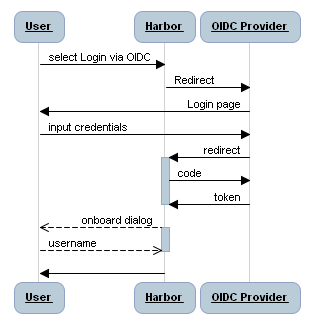

# Proposal: `Support authentication based on OIDC token`

Author: `reasonerjt` `ktbartholomew`

## Abstract

It proposes an approach to enable Harbor to support SSO via 3rd party OIDC provider. 

## Background

There has been several requests asking for support SSO/OIDC in Harbor, meanwhile, Harbor needs a more extensible way to 
integrate with external ID managers.

## Proposal

I propose we make enhancement so that a unified workflow for user to configure and integrate external OIDC providers with 
Harbor.  Admin can configure an OIDC provider, after that, user can use this OIDC provider as authentication
approach to kick off an SSO flow to log into Harbor's UI Portal.  Besides that, user should be able to use a valid OIDC token
to access Harbor's API, the user should also be able to use docker and helm CLI.

More details for each major use case as follow:

* #### Administrator Configuring OIDC Endpoint

The Administrator of Harbor should be able to configure the OIDC Provider via Portal or configuration API.
The OIDC authentication will be exclusive to other authentication methods, i.e. when admin set to OIDC authentication, 
user registration will be disabled.

The attributes of OIDC provider:

* **Name**: This is the name of the OIDC provider.   
* **Endpoint URL**: The Endpoint URL of the OIDC provider.  It has to be https protocol and is a required attribute. 
* **Scope**: By default, the value will be `openid, email, profile`.  This attribute may be hidden from the UI to avoid 
user error.
* **Client ID**: The registered Client ID for accessing the OIDC provider.  It is a required attribute.
* **Client Secret**: The secret of the registered client for accessing the OIDC provider, it is an optional attribute.
* **Verify Certificate**: This is a switch so user can turn it off to false to skip the certificate verification, in case the 
OIDC provider service is running with self-signed certificate.

After setting the values the Administrator should be able to test the connection to the OIDC provider and verify the 
client ID and Secret.

**There will be some limitations:**
* Minimized attributes: Some OIDC providers may require additional attributes in configuration, for them the flow may not 
work.
* Only one OIDC endpoint will be supported:  There is some limitation in Harbor's configuration management that there is
no good way to support list as a configuration group.

* #### User login to UI portal via SSO with OIDC provider

After the administrator configured the OIDC provider, there should be a link on the UI login page.  By clicking that link
the user will kick off the OIDC SSO flow: 

   
   
For the users that login to Harbor via OIDC flow for the first time, there will be an "onboard" process, in which a record
will be inserted into Harbor's Database, so that it can be associated with projects, roles... like a regular user.  In this
process, user will be asked to set the username and it will be shown in the user list, or be used when a project admin is 
adding a member.  The onboard process should happen only once, next time the same user authenticates against the OIDC provider,
he should be logged in with the onboarded username. 

**NOTE:**
There are other attributes in user's profile, such as email, it is not modifiable during onboard process, the code will try 
to use the claim in the token to fill in such values and user can modify it after onboard.  The username is not modifiable once 
is onboarded.

* #### User onboarded via the OIDC authentication flow accessing the API.

After a user is onboarded via OIDC authentication flow and assigned proper permissions, he should be able to trigger API 
of Harbor using his identity.
When a request is sent to trigger Harbor's API, the code in Harbor should be able to validate a OIDC token based on the 
setting of OIDC provider, and map to a user in DB, such that the permission can be checked according to the user.  This 
implies this user has to be onboarded to Harbor when he makes the call to API with OIDC token.

**NOTE:**
For the users authenticated via OIDC provider, the basic auth will not be supported for accessing the API, because Harbor 
cannot verify the password in the request.

* #### User onboarded via the OIDC authentication flow using docker/helm CLI 
After a user is onboarded and assigned proper permissions, he should be able to  use docker/helm CLI to pull/push artifacts 
from/to Harbor.
There's a gap in this scenario given the fact that the CLI tools does not support redirection, that user cannot authenticate 
against the external OIDC provider.  To avoid adding extra dependencies to user, we don't want to create another CLI tool.
There are some possible solutions as follow:

1. Provide a _CLI password_ mechanism.  After a user is onboarded via OIDC, he has to create a CLI password and use this 
password and his username to authenticate while using the docker/helm CLI.  Some more details in the proposal:
https://github.com/goharbor/community/pull/63
2. Use OIDC token as password, or expose some random string as "secret" to map to the OIDC token, so the OIDC token is verified
in the authentication process when using CLI.  The problem with this approach is that OIDC token normally expires in hours, after 
that user will have to login to Harbor again to get a new token.  

## Non-Goals

* Integration with non-OIDC identity managers such as Keystone
* Support multiple identity managers, such as OIDC/LDAP, OIDC/DB at the same time.

## Compatibility

For verification, we'll need to ensure it works with the following OIDC providers:
* Google, [dex](https://github.com/dexidp/dex) -- P0
* [Keycloak](https://github.com/keycloak/keycloak) -- P1

## Implementation
1. Create configuration items for OIDC provider configuration, and update UI to enable the configuration via Portal.
2. Update `systeminfo` API so UI can render a SSO login link in the login page.
3. Create `controller` to handle the redirect from OIDC provider, and finish the oAuth flow.
4. Create table for `sub` and `username` mapping, and support the onboard flow (including UI)
5. Add filter to handle OIDC token so the request carrying an OIDC token can be verified and mapped to local user record,
such that `local security context` can be used for permission checking.

