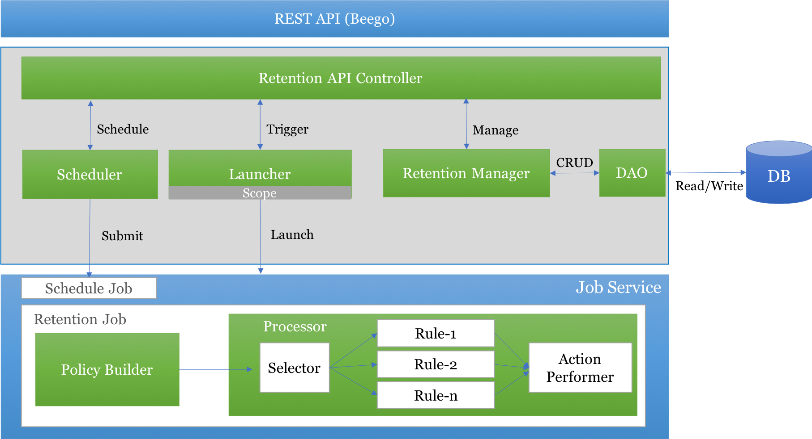
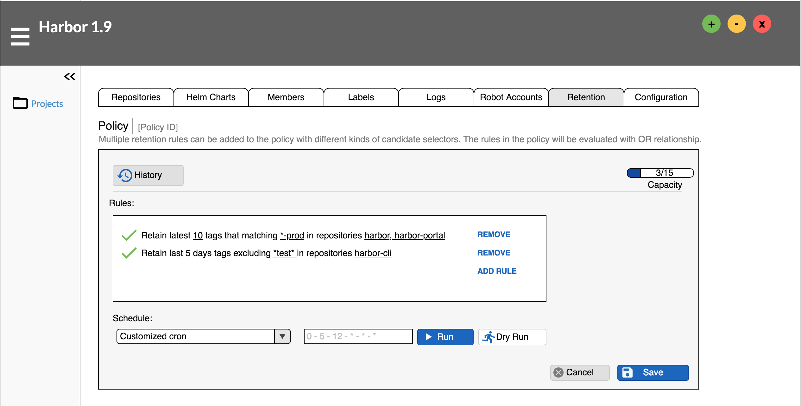
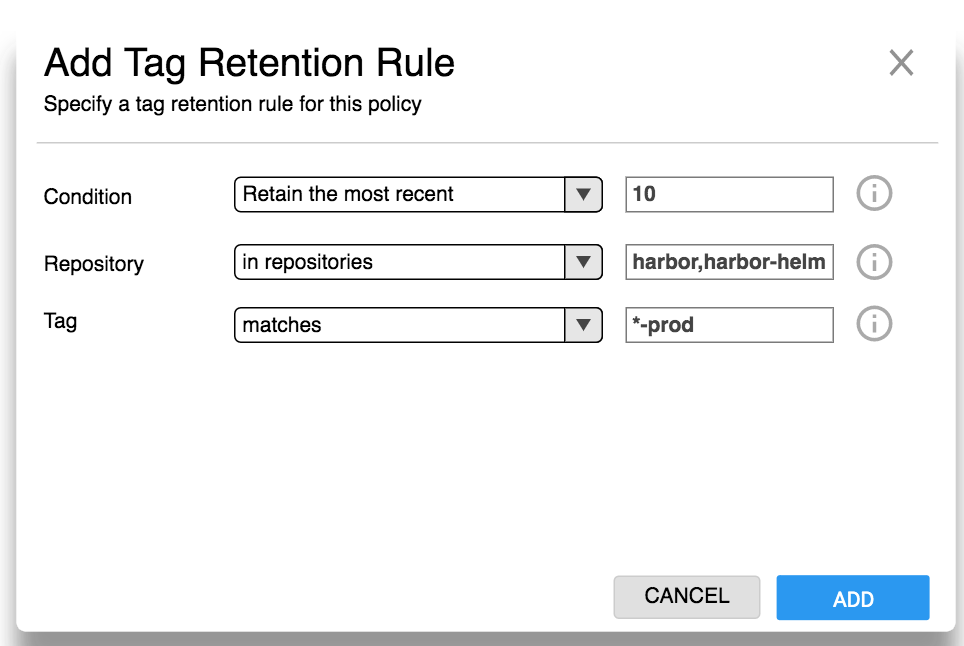
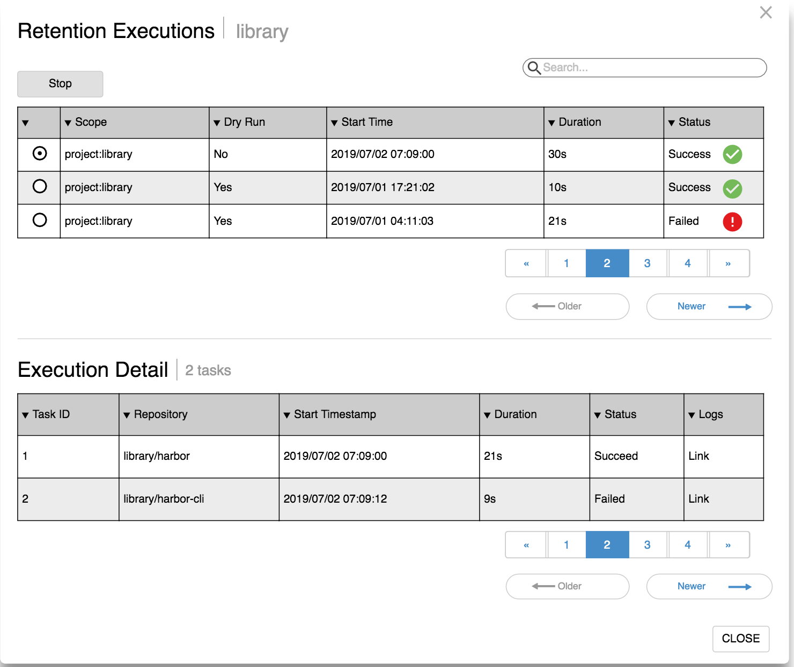

# Proposal: `Tag Retention Patch`

Author: [Steven Zou](https://github.com/steven-zou)

please see updated user guide at https://github.com/goharbor/harbor/blob/release-1.10.0/docs/user_guide.md

Discussion:

* See epic [#6654][https://github.com/goharbor/harbor/issues/6654]
* More details, check [Tag Retention Project board](https://github.com/goharbor/harbor/projects/5)

## Abstract

This proposal is a patch of the original [proposal](https://github.com/goharbor/community/blob/master/proposals/5882-Tag-Retention-Policies.md) about tag retention policy feature to revise some technical designs which reflect the latest related discussions. To learn more background and the primary idea of tag retention, you can check the above original proposal document.

## Background

See original background [statements](https://github.com/goharbor/community/blob/master/proposals/5882-Tag-Retention-Policies.md#background).

## Proposal

### Overall Design

#### Retention Policy

The request of performing retention will be defined as a retention policy. That means retention will be policy based. A retention policy should include:

* a collection of related retention rules defined in the below section.
  * option of limiting the number of rules in a policy is supported
* a trigger approach declaring how to launch the retention operation process
  * CRON-like schedule
  * Pre-defined `None` represents no schedule enabled
* a scope declaration about the target range to apply the retention operation (each scope only needs attach 1 policy as a default design)
  * system level
  * project level
  * repository level

The relationship among rules in one policy will be **OR** way, e.g:

Policy attached to the project _hello-world_ has two rules,

Rule-0 outputs retain `[repo_x/tag1, repo_y/tag2]`
Rule-1 outputs retain `[repo_x/tag3, repo_z/tag5]`

after execution, the tags `[repo_x/tag1, repo_y/tag2, repo_x/tag3, repo_z/tag5]` will be retained, all the others not in the above list will be removed.

**Notes:**

* Although _AND_ relationship is not covered in this proposal, the framework proposed here will consider enough flexibilities for the future _AND_ supporting.
* To make retention easier to use, we'll add the below limitation:
  * scope with same level will refer only 1 policy (multiple rules). e.g: each project can have only 1 policy. The limitation will enabled in both API and front UI end.

#### Retention Rule

A rule is a definition to describe what action will be performed to which resources when what conditions are matched. Here are examples:

Example 1:
> Retain the most recently pushed 10 images matches *-prod in repositories a,b

Example 2:
> Retain the images from the last 10 days excludes *test* not in repositories a,b,c

Example 3:
> Retain the most recently pulled 20 images with labels [a,b] in repositories d,e

Example 4:
> Retain the most recent active 5 images without labels [x,y] in repositories a,c

The retention rule can be abstracted to a general format with the following segments:

`RULE=[ACTION][DECORATED CONDITION(PARAMETERS)][TAG SELECTORS][SCOPE SELECTORS]`

In this proposal,

* only `Retain` action is supported to purchase the retention goal with a safe and positive way. All the resources NOT in the `Retain` list will be cleared.
* the following decorated conditions will be prioritized and covered in order:
  * `the most recently pushed # images` which is evaluated based on the _push time_ of the resource
    * parameter required: the number of resources (see above example 1)
  * `the images from the last # days` which is evaluated based on the _push time_ of the resource
    * parameter required: the life time with day unit (see above example 2)
  * `the most recently pulled # images` which is evaluated based on the _pull time_ of the resource
    * parameter required: the number of resources (see above example 3)
  * `the most recent active # images` which is evaluated based on the latest one in _pull time_ or _push time_ of the resource
    * parameter required: the number of resources (see above example 4)
* resource selectors below will also be prioritized and implemented in order:
  * wildcard `**` to match all
  * regular expression selector with several pre-defined patterns
    * matches _expression pattern_
    * excludes _expression pattern_
  * label selector
    * with labels _label list_
    * without labels _label list_

For empty policy (no any rules), `Retain everything` will be performed as default design.

The rule will be pre defined as full rule template and initialized as rule instance by letting admins provide the related required parameters when adding to its parent policy.

In summary, the following rule templates will be supported in priority order one by one:

| Rule Template |  Parameter |  Selector |  Priority |
|---------------|------------|-----------|-----------|
|Retain everything|  NO        | **        |  P0       |
|Retain most recently pushed # images | number of tags| All  | P0 |
|Retain images from last # days | life time of tag | All | P0 |
|Retain most recently pulled # images | number of tags | All | P1 |
|Retain most recent active # images | number of tags | All | P1 |

In the future, we can support more other rules.

### User Stories

#### Full Management

* As a (system/project) admin, Steven can view and remove the rules of the retention policy attached to the specified project.
* As a (system/project) admin, Steven can add new rule into the policy attached with the specified project by selecting the rule template and providing the required parameter.
* As a (system/project) admin, Steven can select pre-defined schedule (daily, weekly or monthly etc.) or set customized CRON like (* * 24 * * *) schedule to launch the retention process.
* As a (system/project) admin, Steven can luanch a `dry run` process and check the overall summary containing what tags will be cleared if launching this policy.
* As a (system/project) admin, Steven can run the retention policy immediately (manually trigger).
* As a (system/project) admin, Steven can check the retention executing history which includes overall status, related timestamps and what tags are cleared.
* As a (system/project) admin, Steven can disable the retention by setting `None` schedule or clearing the policy.

#### View

* As a developer, Jack can view the rules of the retention policy attached to the specified project.

### Architecture

#### Overall

The following graph shows the overall architecture of tag retention.


* API controller provides unified interface at the top level and serve the request from the upper rest API layer. It will also listen to the retention job execution status hook events and update the related stats info and history.
* Manager implements the CRUD operations of policy, rule templates and execution history based on the DAOs.
* Scheduler schedules/unschedules a periodic job to generate interval events which launch the retention job.
* Launcher retrieves the raw policy from the manager and gets the repositories based on the scope. Then it launches retention jobs for each of matched repositories.
* A new retention job will be implemented to drive the policy execution.
  * Policy builder builds the policy execution object (a processor) based on the raw policy extract from the job context and gets the artifact candidates for the next step.
  * The processor does the real action of retention
    * Selectors can be applied to narrow down the candidate list before passing to the concreted rules
    * Rules check whether the candidates match the settled conditions or not
    * All the output from rules will send to the performer to do the clear work (all non kept ones will be cleared)

#### Models & Interfaces

##### Metadata of policy

```go
package policy

const (
  // AlgorithmOR for OR algorithm
  AlgorithmOR = "or"
)

// Metadata of policy
type Metadata struct {
  // UUID of the policy
  ID string `json:"id"`

  // Algorithm applied to the rules
  // "OR" / "AND"
  Algorithm string `json:"algorithm"`

  // Rule collection
  Rules []rule.Metadata `json:"rules"`

  // Trigger about how to launch the policy
  Trigger *Trigger `json:"trigger"`

  // Which scope the policy will be applied to
  Scope *Scope `json:"scope"`

  // The max number of rules in a policy
  Capacity int `json:"cap"`
}

// Trigger of the policy
type Trigger struct {
  // Const string to declare the trigger type
  // 'Schedule'
  Kind string `json:"kind"`

  // Settings for the specified trigger
  // '[cron]="* 22 11 * * *"' for the 'Schedule'
  Settings map[string]interface{} `json:"settings"`

  // References of the trigger
  // e.g: schedule job ID
  References map[string]interface{} `json:"references"`
}

// Scope definition
type Scope struct {
  // Scope level declaration
  // 'system', 'project' and 'repository'
  Level string `json:"level"`

  // The reference identity for the specified level
  // '' for 'system', project ID for 'project' and repo ID for 'repository'
  Reference string `json:"ref"`
}

// LiteMeta contains partial metadata of policy
type LiteMeta struct {
  // Algorithm applied to the rules
  // "OR" / "AND"
  Algorithm string `json:"algorithm"`

  // Rule collection
  Rules []rule.Metadata `json:"rules"`
}
```

#### Metadata of rule

```go
package rule

// Metadata of the retention rule
type Metadata struct {
  // UUID of rule
  ID string `json:"id"`

  // Priority of rule when doing calculating
  Priority int `json:"priority"`

  // Action of the rule performs
  // "retain"
  Action string `json:"action"`

  // Template ID
  Template string `json:"template"`

  // The parameters of this rule
  Parameters Parameters `json:"params"`

  // Selector attached to the rule for filtering tags
  TagSelectors []*Selector `json:"tag_selectors"`

  // Selector attached to the rule for filtering scope (e.g: repositories or namespaces)
  ScopeSelectors map[string]*Selector `json:"scope_selectors"`
}

// Selector to narrow down the list
type Selector struct {
  // Kind of the selector
  // "regularExpression" or "label"
  Kind string `json:"kind"`

  // Decorated the selector
  // for "regularExpression" : "matches" and "excludes"
  // for "label" : "with" and "without"
  Decoration string `json:"decoration"`

  // Param for the selector
  Pattern string `json:"pattern"`
}

// Parameters of rule, indexed by the key
type Parameters map[string]Parameter

// Parameter of rule
type Parameter interface{}
```

#### Models for execution

```go
// Retention execution
type Execution struct {
  ID string `json:"id"`
  PolicyID string `json:"policy_id"`
  StartTime time.Time string `json:"start_time"`
  EndTime time.Time string `json:"end_time"`
  Status string `json:"status"`
  Scope *Scope `json:"scope"`
}

// Retention history
type History struct {
  ExecutionID string `json:"execution_id"`
  Rule struct {
    ID string `json:"id"`
    DisplayText string `json:"display_text"`
  } `json:"rule_id"`
  Artifact string `json:"tag"` // full path: :ns/:repo:tag
  Timestamp time.Time string `json:"timestamp"`
  Operation string `json:"operation"`
}
```

##### Manager Interface

```go
// Manager defines operations of managing policy
type Manager interface {
  // Create new policy and return uuid
  CreatePolicy(p *policy.Metadata) (string, error)
  // Update the existing policy
  // Full update
  UpdatePolicy(p *policy.Metadata) error
  // Delete the specified policy
  // No actual use so far
  DeletePolicy(ID string) error
  // Get the specified policy
  GetPolicy(ID string) (*policy.Metadata, error)
  // Create a new retention execution
  CreateExecution(execution *Execution) (string, error)
  // Update the specified execution
  UpdateExecution(execution *Execution) error
  // Get the specified execution
  GetExecution(eid string) (*Execution, error)
  // List execution histories
  ListExecutions(query *q.Query) ([]*Execution, error)
  // Add new history
  AppendHistory(history *History) error
  // List all the histories marked by the specified execution
  ListHistories(executionID string, query *q.Query) ([]*History, error)
}
```

##### Launcher Interface

```go
package retention

// Launcher provided function to launch the jobs to run retentions
type Launcher interface {
  Launch(policy *policy.Metadata) ([]string, error)
}
```

##### Scheduler Interface

```go
package retention

// Scheduler of launching retention jobs
type Scheduler interface {
  // Schedule the job to periodically run the retentions
  //
  //  Arguments:
  //    policyID string : uuid of the retention policy
  //    cron string     : cron pattern like `0-59/5 12 * * * *`
  //  Returns:
  //    the returned job ID
  //    common error object if any errors occurred
  Schedule(policyID string, cron string) (string, error)

  // Unschedule the specified retention policy
  //
  //  Arguments:
  //    policyID string : uuid of the retention policy
  //
  //  Returns:
  //    common error object if any errors occurred
  UnSchedule(policyID string) error
}
```

##### Builder Interface

```go
package policy

// Builder builds the runnable processor from the raw policy
type Builder interface {
  // Builds runnable processor
  //
  //  Arguments:
  //    policy *policy.LiteMeta : simple metadata of the retention policy
  //
  //  Returns:
  //    Processor : a processor implementation to process the candidates
  //    error     : common error object if any errors occurred
  Build(policy *policy.LiteMeta) (alg.Processor, error)
}
```

##### Processor Interface

Target candidate object:

```go
package res

// Candidate for retention processor to match
type Candidate struct {
  // Namespace
  Namespace string
  // Repository name
  Repository string
  // Kind of the candidate
  // "image" or "chart"
  Kind string
  // Tag info
  Tag string
  // Pushed time in seconds
  PushedTime int64
  // Pulled time in seconds
  PulledTime int64
  // Created time
  CreationTime int64
  // Labels attached with the candidate
  Labels []string
}
```

```go
package alg

// Processor processing the whole policy targeting a repository.
// Methods are defined to reflect the standard structure of the policy:
// list of rules with corresponding selectors plus an action performer.
type Processor interface {
  // Process the artifact candidates
  //
  //  Arguments:
  //    artifacts []*res.Candidate : process the retention candidates
  //
  //  Returns:
  //    []*res.Result : the processed results
  //    error         : common error object if any errors occurred
  Process(artifacts []*res.Candidate) ([]*res.Result, error)
}

// Parameter for constructing a processor
// Represents one rule
type Parameter struct {
  // Evaluator for the rule
  Evaluator rule.Evaluator

  // Selectors for the rule
  Selectors []res.Selector

  // Performer for the rule evaluator
  Performer action.Performer
}

// Factory for creating processor
type Factory func([]*Parameter) Processor
```

All the processor implementations can be indexed by their algorithms.

```go
// index for keeping the mapping between algorithm and its processor
var index sync.Map

// Register processor with the algorithm
func Register(algorithm string, processor Factory) {}

// Get Processor
func Get(algorithm string, params []*Parameter) (Processor, error) {}
```

##### Rule Evaluator Interface

```go
// Evaluator defines method of executing rule
type Evaluator interface {
  // Filter the inputs and return the filtered outputs
  //
  //  Arguments:
  //    artifacts []*res.Candidate : candidates for processing
  //
  //  Returns:
  //    []*res.Candidate : matched candidates for next stage
  //    error            : common error object if any errors occurred
  Process(artifacts []*res.Candidate) ([]*res.Candidate, error)

  // Specify what action is performed to the candidates processed by this evaluator
  Action() string
}

// Factory defines a factory method for creating rule evaluator
type Factory func(parameters Parameters) Evaluator
```

last x days rule:

```go
package lastx

// evaluator for evaluating last x days
type evaluator struct {
  // last x days
  x int
}

// Process the candidates based on the rule definition
func (e *evaluator) Process(artifacts []*res.Candidate) ([]*res.Candidate, error) {
  // TODO: REPLACE SAMPLE CODE WITH REAL IMPLEMENTATION
  return artifacts, nil
}

// Specify what action is performed to the candidates processed by this evaluator
func (e *evaluator) Action() string {
  return action.Retain
}

```

latest k tags rule:

```go
package latestk

// evaluator for evaluating latest k tags
type evaluator struct {
  // latest k
  k int
}

// Process the candidates based on the rule definition
func (e *evaluator) Process(artifacts []*res.Candidate) ([]*res.Candidate, error) {
  // TODO: REPLACE SAMPLE CODE WITH REAL IMPLEMENTATION
  return artifacts, nil
}

// Specify what action is performed to the candidates processed by this evaluator
func (e *evaluator) Action() string {
  return action.Retain
}
```

All rule implementations can be indexed by its template ID:

```go
package rule

// index for keeping the mapping between template ID and evaluator
var index sync.Map

// Register the rule evaluator with the corresponding rule template
func Register(meta *IndexMeta, factory Factory) {
}

// Get rule evaluator with the provided template ID
func Get(templateID string, parameters Parameters) (Evaluator, error) {
}

// Index returns all the metadata of the registered rules
func Index() []*IndexMeta {
}
```

##### Selector Interface

```go
package res

// Selector is used to filter the inputting list
type Selector interface {
  // Select the matched ones
  //
  //  Arguments:
  //    artifacts []*Candidate : candidates for matching
  //
  //  Returns:
  //    []*Candidate : matched candidates
  Select(artifacts []*Candidate) ([]*Candidate, error)
}

// SelectorFactory is factory method to return a selector implementation
type SelectorFactory func(decoration string, pattern string) Selector
```

regular expression selector:

```go
package regexp

// selector for regular expression
type selector struct {
  // Pre defined pattern declarator
  // "matches" and "excludes"
  decoration string
  // The pattern expression
  pattern string
}

// Select candidates by regular expressions
func (s *selector) Select(artifacts []*res.Candidate) ([]*res.Candidate, error) {
  // TODO: REPLACE SAMPLE CODE WITH REAL IMPLEMENTATION
  return artifacts, nil
}
```

label selector:

```go
package label

// selector is for label selector
type selector struct {
  // Pre defined pattern decorations
  // "with" or "without"
  decoration string
  // Label list
  labels []string
}

// Select candidates by regular expressions
func (s *selector) Select(artifacts []*res.Candidate) ([]*res.Candidate, error) {
  // TODO: REPLACE SAMPLE CODE WITH REAL IMPLEMENTATION
  return artifacts, nil
}
```

All the selector can be indexed by its kind:

```go
// Register the selector with the corresponding selector kind and decoration
func Register(kind string, decorations []string, factory res.SelectorFactory) {
}

// Get selector with the provided kind and decoration
func Get(kind, decoration, pattern string) (res.Selector, error) {
}

// Index returns all the declarative selectors
func Index() []*IndexedMeta {
}
```

##### Performer Interface

```go
// Performer performs the related actions targeting the candidates
type Performer interface {
  // Perform the action
  //
  //  Arguments:
  //    candidates []*res.Candidate : the targets to perform
  //
  //  Returns:
  //    []*res.Result : result infos
  //    error     : common error if any errors occurred
  Perform(candidates []*res.Candidate) ([]*res.Result, error)
}

// PerformerFactory is factory method for creating Performer
type PerformerFactory func(params interface{}) Performer
```

Retain action performer implementation:

```go
// retainAction make sure all the candidates will be retained and others will be cleared
type retainAction struct {
  all []*res.Candidate
}

// Perform the action
func (ra *retainAction) Perform(candidates []*res.Candidate) ([]*res.Result, error) {
  // TODO: REPLACE SAMPLE CODE WITH REAL IMPLEMENTATION
  results := make([]*res.Result, 0)

  for _, c := range candidates {
    results = append(results, &res.Result{
      Target: c,
    })
  }

  return results, nil
}
```

Performer is indexed with its action:

```go
// index for keeping the mapping action and its performer
var index sync.Map

// Register the performer with the corresponding action
func Register(action string, factory PerformerFactory) {
}

// Get performer with the provided action
func Get(action string, params interface{}) (Performer, error) {
}
```

#### API definitions

`GET /api/retentions/:id`

Get the content of the specified retention policy.

* Request body: None
* Response:
  * 200 OK: retention [Policy](#model-for-policy-and-rule)
  * 401 Unauthorized : Common error object
  * 403 Forbidden: Common error object
  * 404 Not found: Common error object
  * 500 Server Internal: Common error object

`POST /api/retentions`

Create a new retention policy with the provided data.

* Request body: retention [Policy](#model-for-policy-and-rule) without ID
* Response:
  * 200 OK: ID of created retention policy
  * 400 Bad request : Common error object
  * 401 Unauthorized : Common error object
  * 403 Forbidden: Common error object
  * 500 Internal Server: Common error object

`PATCH /api/retentions/:id`

Update the retention policy like schedule and rule set with an **INCREMENTAL** way.

* Request body: retention [Policy](#model-for-policy-and-rule) with ID
* Response:
  * 200 OK: Updated retention [Policy](#model-for-policy-and-rule)
  * 400 Bad request : Common error object
  * 401 Unauthorized : Common error object
  * 403 Forbidden: Common error object
  * 500 Internal Server: Common error object

`Delete /api/retentions/:id`

Delete the specified retention policy. Just a placeholder, no actual use so far.

`POST /api/retentions/:id/executions`

Run the retention immediately (manually trigger). If `dry_run` is set to be true, no real clear actions will be performed.

* Request body:

```json
  {
    "dry_run" : true
  }
```

* Response:
  * 201 Created: ID of the execution
  * 400 Bad request : Common error object
  * 401 Unauthorized : Common error object
  * 403 Forbidden: Common error object
  * 500 Internal Server: Common error object

`PATCH /api/retentions/:id/executions/:eid`

Terminate the running retention with the provided id. If the specified retention has already been stopped, 200 OK should returned.

* Request body:

```json
{
  "action": "stop"
}
```

* Response:
  * 200 OK: retention [Execution](#model-for-policy-and-rule)
  * 400 Bad request : Common error object
  * 401 Unauthorized : Common error object
  * 403 Forbidden: Common error object
  * 404 Not found: Common error object
  * 500 Internal Server: Common error object

`GET /api/retentions/:id/executions/:eid`

Get the retention execution with the specified ID.

* Request body: None
* Response:
  * 200 OK: retention [Execution](#model-for-policy-and-rule)
  * 401 Unauthorized : Common error object
  * 403 Forbidden: Common error object
  * 404 Not found: Common error object
  * 500 Server Internal: Common error object

`GET /api/retentions/:id/executions`

* Request body: query parameters
* Response:
  * 200 OK: list of retention [Execution](#model-for-policy-and-rule)
  * 401 Unauthorized : Common error object
  * 403 Forbidden: Common error object
  * 404 Not found: Common error object
  * 500 Server Internal: Common error object

`GET /api/retentions/:id/executions/:eid/histories`

Get the detailed history of the specified executions, which included what tags are cleared by what rules.

* Request body: query parameters
* Response:
  * 200 OK: list of retention [History](#model-for-policy-and-rule)
  * 401 Unauthorized : Common error object
  * 403 Forbidden: Common error object
  * 404 Not found: Common error object
  * 500 Server Internal: Common error object

**Notes:** The relationship between scope and policy will depend on the scope relevant API. For example, for `project` scope, the retention policy ID will be kept in the project settings.

### UI Design

Here are several mockups to describe the primary UE scenarios.

The (system/project) admin can configure the retention policy in the configuration tab of the project. Besides launching by cron-like schedule, the (system/project) admin can try the dry run of the retention policy and check the progress of the launched execution.


Adding new rule through the rule adding dialog by specifying what condition, repository selector and tag selector are used.


The execution detailed history will be saved for admin to do auditing.


**Notes:** The display text of the rule template needs i18n translation support. The rule (evaluator) implementation providing the default text (probably use ID of the rule template) which can be used as i18n text key to get the right display text.

## Non-Goals

[N/A]

## Rationale

[N/A]

## Compatibility

[A discussion of any compatibility issues that need to be considered]

## Implementation

This feature should be delivered into V1.9 (FC: Aug 5th GA: Aug 28th) release as a anchored feature. The work should include the backend service components implementations and the heavy UI work. Base on the release plan of V.9 and the related work of this feature, the plan is defined as following one:

* Before July 2nd: Clarify the use cases (stories) and finalize the technical design details (ready for code). Moreover, do some ground work like interface definitions etc.
  * MM & Alex
  * Nathan
  * Steven Z
* July 2nd - July 30th: Complete the base service components development work and implement the top 3 concrete rules.
  * Steven Z
  * Nathan?
  * Another one?
* July 2nd - July 9th: Confirm the UX design with the designer
  * Louis
  * Steven Z
  * Alex?
* July 9th - July 30th: Implement the UI
  * Shijun Sun (&/ other one?)
* July 30th - August 5th: e2e verifications and p0 bugs fixes
  * All

## Open issues (if applicable)

* Check epic [#6654][https://github.com/goharbor/harbor/issues/6654]
