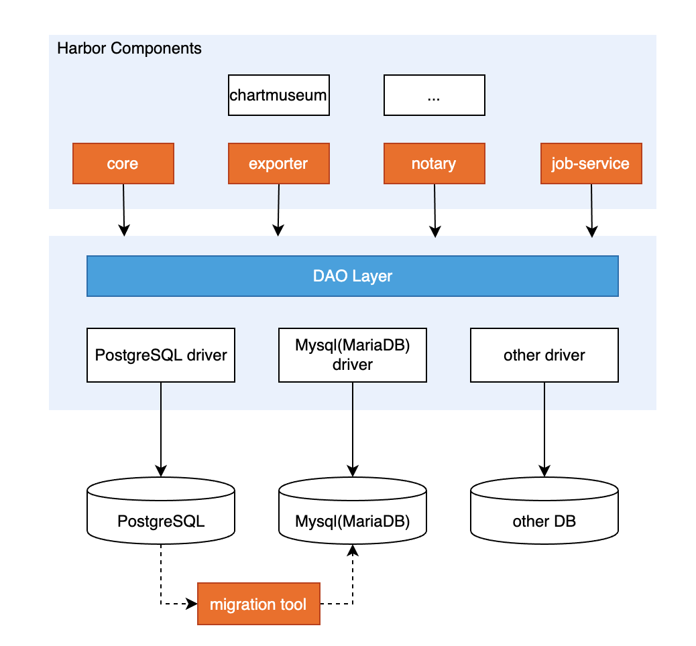
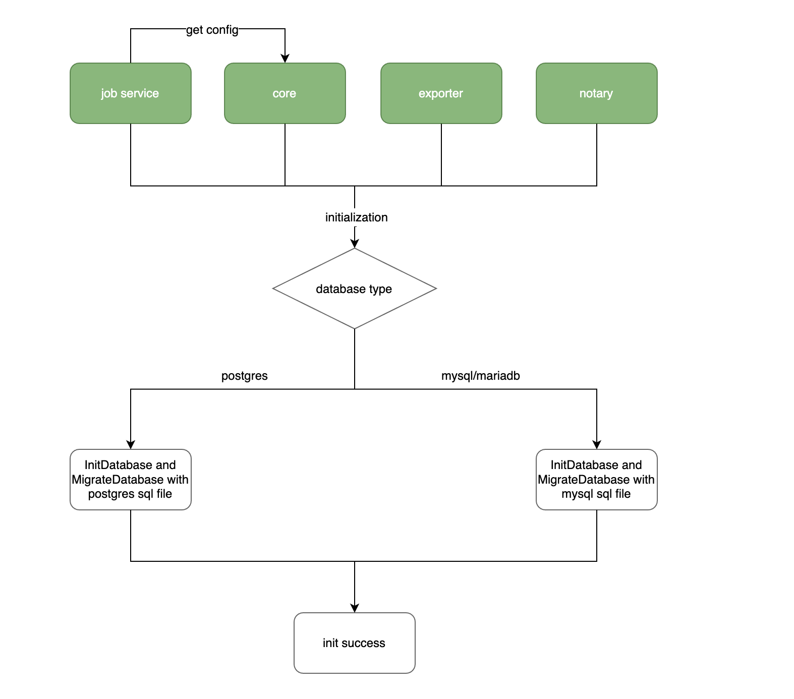
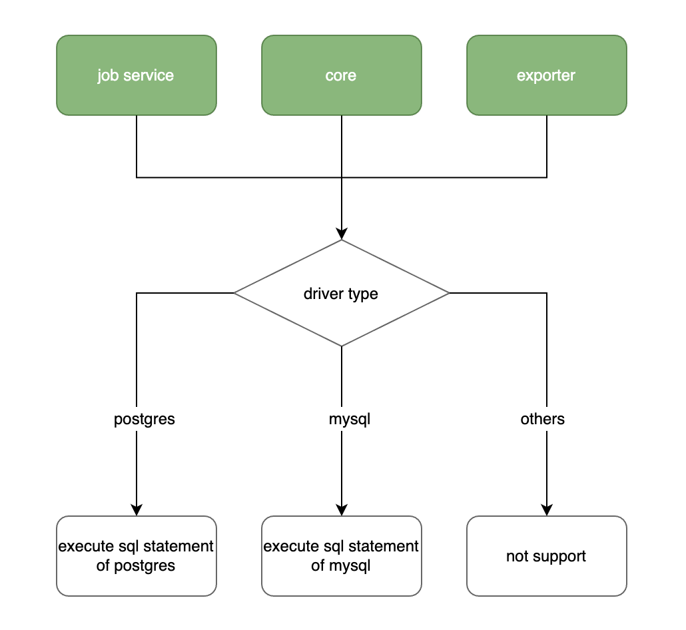

# Proposal: `Adapt Multiple Type of Database for Harbor`

Author:

- Yvonne [@JinXingYoung](https://github.com/JinXingYoung)
- Yiyang Huang [@hyy0322](https://github.com/hyy0322)
- De Chen [@cd1989](https://github.com/cd1989)
- Minglu [@ConnieHan2019](18302010059@fudan.edu.cn)

Links:

- Previous Discussion: [goharbor/harbor#6534](https://github.com/goharbor/harbor/issues/6534)
- Related PR from Others Before: [goharbor/harbor#14265](https://github.com/goharbor/harbor/pull/14265)

## Abstract

Propose to support other databases in Harbor, the first step is to support MySQL/MariaDB. This proposal introduces an abstract DAO layer in Harbor, different database can have their drivers to implement the interface. So that Harbor can adapt to other databases as long as a well tested database driver provided.


## Background

As previous discussion([goharbor/harbor#6534](https://github.com/goharbor/harbor/issues/6534)) shown, there are certain amount of users(especially in China) lack the experiences of maintaining PostgreSQL for HA, disaster recovery, etc. And meanwhile they are more familiar with other databases such as MySQL/MariaDB. They prefer to use MariaDB/MySQL instead of PostgreSQL to keep their production environments stable.

As we all know that Harbor used MySQL before. But scanner clair use PostgreSQL as database. In order to keep consistency with clair and reduce maintenance difficulties. Harbor unified database using PostgreSQL.

Since Harbor v2.0 use trivy as default scanner instead of clair，there's no strongly requirement to use PostgreSQL anymore. Therefore, it is possible to adapt different kind of database now.

## Proposal

Support other databases in Harbor other than PostgreSQL.

### Goals

- Keep using PostgreSQL as default database. The Implementation will be compatible with current version of Harbor.
- Abstract DAO layer for different type of databases.
- Support MariaDB(10.5.9), MySQL(8.0) by implementing corresponding drivers and resolving sql compatibility.
- Provide migration tool or guide for users to migrate data from PostgreSQL to MariaDB/MySQL.

### Non-Goals

- Support other type of database this time, such as MongoDB, Oracle, CockroachDB. (This is restricted to this effort, we welcome other data implementations in our framework and welcome to join us to support more databases)
- Implement Mariadb/MySQL operator for internal database case.

## Implementation

### Overview







### Component Detail

**Common**

Unify database config settings: src/lib/config/metadata/metadatalist.go
 ```go
var (
	// ConfigList - All configure items used in harbor
	// Steps to onboard a new setting
	// 1. Add configure item in metadatalist.go
	// 2. Get/Set config settings by CfgManager
	// 3. CfgManager.Load()/CfgManager.Save() to load/save from configure storage.
	ConfigList = []Item{
        ...
        {Name: common.DBDatabase, Scope: SystemScope, Group: DatabaseGroup, EnvKey: "DB_DATABASE", DefaultValue: "registry", ItemType: &StringType{}, Editable: false},
        {Name: common.DBHOST, Scope: SystemScope, Group: DatabaseGroup, EnvKey: "DB_HOST", DefaultValue: "postgresql", ItemType: &StringType{}, Editable: false},
        {Name: common.DBPassword, Scope: SystemScope, Group: DatabaseGroup, EnvKey: "DB_PASSWORD", DefaultValue: "root123", ItemType: &PasswordType{}, Editable: false},
        {Name: common.DBPort, Scope: SystemScope, Group: DatabaseGroup, EnvKey: "DB_PORT", DefaultValue: "5432", ItemType: &PortType{}, Editable: false},
        {Name: common.DBSSLMode, Scope: SystemScope, Group: DatabaseGroup, EnvKey: "DB_SSLMODE", DefaultValue: "disable", ItemType: &StringType{}, Editable: false},
        {Name: common.DBUsername, Scope: SystemScope, Group: DatabaseGroup, EnvKey: "DB_USERNAME", DefaultValue: "postgres", ItemType: &StringType{}, Editable: false},
        {Name: common.DBMaxIdleConns, Scope: SystemScope, Group: DatabaseGroup, EnvKey: "DB_MAX_IDLE_CONNS", DefaultValue: "2", ItemType: &IntType{}, Editable: false},
        {Name: common.DBMaxOpenConns, Scope: SystemScope, Group: DatabaseGroup, EnvKey: "DB_MAX_OPEN_CONNS", DefaultValue: "0", ItemType: &IntType{}, Editable: false},
        ...
}
```

Add DB type in configs: make/photon/prepare/utils/configs.py
```
if external_db_configs:
    config_dict['external_database'] = True
    # harbor db
    config_dict['harbor_db_type'] = external_db_configs['harbor']['type']
    config_dict['harbor_db_host'] = external_db_configs['harbor']['host']
    config_dict['harbor_db_port'] = external_db_configs['harbor']['port']
    config_dict['harbor_db_name'] = external_db_configs['harbor']['db_name']
    config_dict['harbor_db_username'] = external_db_configs['harbor']['username']
    ...
```

MySQL struct: src/common/models/database.go
```go
type MySQL struct {
Host         string `json:"host"`
Port         int    `json:"port"`
Username     string `json:"username"`
Password     string `json:"password,omitempty"`
Database     string `json:"database"`
Collation    string `json:"collation"`
MaxIdleConns int    `json:"max_idle_conns"`
MaxOpenConns int    `json:"max_open_conns"`
}
```

Get database infos for different db types: src/common/dao/base.go
```go
func getDatabase(database *models.Database) (db Database, err error) {
	switch {
	case utils.IsDBPostgresql(database.Type):
		db = NewPGSQL(
			database.PostGreSQL.Host,
			strconv.Itoa(database.PostGreSQL.Port),
			database.PostGreSQL.Username,
			database.PostGreSQL.Password,
			database.PostGreSQL.Database,
			database.PostGreSQL.SSLMode,
			database.PostGreSQL.MaxIdleConns,
			database.PostGreSQL.MaxOpenConns,
		)
	case utils.IsDBMysql(database.Type):
		db = NewMySQL(
			database.MySQL.Host,
			strconv.Itoa(database.MySQL.Port),
			database.MySQL.Username,
			database.MySQL.Password,
			database.MySQL.Database,
			database.MySQL.Collation,
			database.MySQL.MaxIdleConns,
			database.MySQL.MaxOpenConns,
		)
	default:
		err = fmt.Errorf("invalid database: %s", database.Type)
	}
	return
}
```

MigrateDB with certain sql file: src/migration/migration.go
```go
// MigrateDB upgrades DB schema and do necessary transformation of the data in DB
func MigrateDB(database *models.Database) error {
	var migrator *migrate.Migrate
	var err error

	// check the database schema version
    switch {
	case utils.IsDBPostgresql(database.Type):
		migrator, err = dao.NewMigrator(database.PostGreSQL)
	case utils.IsDBMysql(database.Type):
		migrator, err = dao.NewMysqlMigrator(database.MySQL)
	default:
		migrator, err = dao.NewMigrator(database.PostGreSQL)
	}
	...
}
```

Migration sql file architecture
```
harbor/
├── make
│   ├── migrations
│   │   ├── mysql
│   │   │   ├── 0001_initial_schema.up.sql  // File content may different with postgresql
│   │   │   ├── ...
│   │   ├── postgresql
│   │   │   ├── 0001_initial_schema.up.sql  
│   │   │   ├── ...
```

DAO layer make different databases compatible. We can extend database support by implementing mysql implementation.

Define mysqlDao with original dao Implements and rewrite functions that are incompatible with postgres.
eg: src/pkg/blob/dao/mysql_dao.go
```go
// NewMysqlDao returns an instance of the mysql DAO
func NewMysqlDao() DAO {
	return &mysqlDao{}
}

type mysqlDao struct {
	*dao
}
...
func (d *mysqlDao) ExistProjectBlob(ctx context.Context, projectID int64, blobDigest string) (bool, error) {
	o, err := orm.FromContext(ctx)
	if err != nil {
		return false, err
	}

	sql := "SELECT COUNT(*) FROM project_blob JOIN `blob` ON project_blob.blob_id = blob.id AND project_id = ? AND digest = ?"

	var count int64
	if err := o.Raw(sql, projectID, blobDigest).QueryRow(&count); err != nil {
		return false, err
	}

	return count > 0, nil
}
...
```

**Core**

make/photon/prepare/templates/core/env.jinja:
```
DATABASE_TYPE={{harbor_db_type}}
DB_HOST={{harbor_db_host}}
DB_PORT={{harbor_db_port}}
DB_USERNAME={{harbor_db_username}}
DB_PASSWORD={{harbor_db_password}}
DB_DATABASE={{harbor_db_name}}
DB_MAX_IDLE_CONNS={{harbor_db_max_idle_conns}}
DB_MAX_OPEN_CONNS={{harbor_db_max_open_conns}}
DB_SSLMODE={{harbor_db_sslmode}}
DB_COLLATION={{harbor_db_collation}}
```

**Exporter**

make/photon/prepare/templates/exporter/env.jinja
```
HARBOR_DATABASE_TYPE={{harbor_db_type}}
HARBOR_DATABASE_HOST={{harbor_db_host}}
HARBOR_DATABASE_PORT={{harbor_db_port}}
HARBOR_DATABASE_USERNAME={{harbor_db_username}}
HARBOR_DATABASE_PASSWORD={{harbor_db_password}}
HARBOR_DATABASE_DBNAME={{harbor_db_name}}
HARBOR_DATABASE_SSLMODE={{harbor_db_sslmode}}
HARBOR_DATABASE_MAX_IDLE_CONNS={{harbor_db_max_idle_conns}}
HARBOR_DATABASE_MAX_OPEN_CONNS={{harbor_db_max_open_conns}}
HARBOR_DATABASE_COLLATION={{harbor_db_collation}}
```

**JobService**

JobService get configs from Core, then initDatabase with db config obtained.
src/pkg/config/manager.go
```go
// GetDatabaseCfg - Get database configurations
func (c *CfgManager) GetDatabaseCfg() *models.Database {
	ctx := context.Background()
	database := &models.Database{}
	database.Type = c.Get(ctx, common.DatabaseType).GetString()

	switch {
	case utils.IsDBPostgresql(database.Type):
		postgresql := &models.PostGreSQL{
			Host:         c.Get(ctx, common.DBHOST).GetString(),
			Port:         c.Get(ctx, common.DBPort).GetInt(),
			Username:     c.Get(ctx, common.DBUsername).GetString(),
			Password:     c.Get(ctx, common.DBPassword).GetString(),
			Database:     c.Get(ctx, common.DBDatabase).GetString(),
			SSLMode:      c.Get(ctx, common.DBSSLMode).GetString(),
			MaxIdleConns: c.Get(ctx, common.DBMaxIdleConns).GetInt(),
			MaxOpenConns: c.Get(ctx, common.DBMaxOpenConns).GetInt(),
		}
		database.PostGreSQL = postgresql
	case utils.IsDBMysql(database.Type):
		mysql := &models.MySQL{
			Host:         c.Get(ctx, common.DBHOST).GetString(),
			Port:         c.Get(ctx, common.DBPort).GetInt(),
			Username:     c.Get(ctx, common.DBUsername).GetString(),
			Password:     c.Get(ctx, common.DBPassword).GetString(),
			Database:     c.Get(ctx, common.DBDatabase).GetString(),
			Collation:    c.Get(ctx, common.DBCollation).GetString(),
			MaxIdleConns: c.Get(ctx, common.DBMaxIdleConns).GetInt(),
			MaxOpenConns: c.Get(ctx, common.DBMaxOpenConns).GetInt(),
		}
		database.MySQL = mysql
	}

	return database
}
```

### Migration

Considering that there may be a need to migrate data from pg to mysql, we provide a migration tool for the data migration part. Users can choose to use this solution or migrate the data by yourself.

#### Implement a tool to migrate data.

1. Using data models in harbor project.
2. Read data from postgreSQL and map to data model.
3. Transfer postgreSQL data model to MariaDB/MySQL data model.
4. Write data to MariaDB/MySQL database

We define Migrator interface for different type of database to migrate.
For every data table, for example, here we will migrate data for table Access.
We define AccessMigrator interface to dump and insert data.
Then, we will implement Dump() function to read data from PostgreSQL.
By implement Insert() function. we will transfer data model and insert data model to MySQL.

```
type Migrator interface {
	Migrate(dbType string) error
}

type AccessMigrator interface {
    Dump() ([]*dao.Access, error)
    Insert([]*dao.Access) error
}

type AccessMigrators map[string]AccessMigrator

func (a AccessMigrators) Migrate(dbType string) error {
	data, err := a[dbType].Dump()
	if err != nil {
		log.Error(err)
		return err
	}
	err = a[dbType].Insert(data)
	if err != nil {
		log.Error(err)
		return err
	}
	return nil
}

func (a *Access) Dump() ([]*dao.Access, error) {
    ...
}

func (a *Access) Insert(objs []*dao.Access) error {
    ...
}
```

### Database Compatibility Testing

**MySQL 8.0**

We have done some test for SQL compatibility. Here we list some SQL Incompatible points.

sql file | Compatibility test | comment (typical issue)
------------|------------|------------
 | 0001_initial_schema.up.sql | Pass | TRIGGER is not needed in MySQL. Just use default CURRENT_TIMESTAMP ON UPDATE CURRENT_TIMESTAMP.
 | 0002_1.7.0_schema.up.sql | Pass | Loop keyword is different between MySQL and PostgreSQL
 | 0003_add_replication_op_uuid.up.sql | Pass |  
 | 0004_1.8.0_schema.up.sql | Pass | SERIAL type in MySQL is bigint unsigned. So a column reference other column type SERIAL must define as bigint unsigned. 
 | 0005_1.8.2_schema.up.sql | Pass |  
 | 0010_1.9.0_schema.up.sql | Pass |  
 | 0011_1.9.1_schema.up.sql | Pass |  
 | 0012_1.9.4_schema.up.sql | Pass | Alter column type in MySQL must use MODIFY
 | 0015_1.10.0_schema.up.sql | Pass | Create index not support IF NOT EXIST in MySQL
 | 0030_2.0.0_schema.up.sql | Pass |  
 | 0031_2.0.3_schema.up.sql | Pass |  
 | 0040_2.1.0_schema.up.sql | Pass |  Alter table add column not support IF NOT EXIST in MySQL,resolve with PROCEDURE ```CREATE PROCEDURE PROC_ADD_COLUMN (in TB_NAME varchar(64), in CL_NAME varchar(64), in CL_TYPE varchar(64)) BEGIN ... END; CALL PROC_ADD_COLUMN('project', 'registry_id', 'int');```
 | 0041_2.1.4_schema.up.sql | Pass |  
 | 0050_2.2.0_schema.up.sql | Pass |  
 | 0051_2.2.1_schema.up.sql | Pass |  
 | 0052_2.2.2_schema.up.sql | Pass |  
 | 0053_2.2.3_schema.up.sql | Pass |  
 | 0060_2.3.0_schema.up.sql | Pass |  
 | 0061_2.3.4_schema.up.sql | Pass |  
 | 0070_2.4.0_schema.up.sql | Pass |  
 | 0071_2.4.2_schema.up.sql | Pass |  
 | 0080_2.5.0_schema.up.sql | Pass |  

**MariaDB 10.5.9**

sql file | Compatibility test | comment (typical issue)
------------|------------|------------
 | 0001_initial_schema.up.sql | Pass | In the mariadb multi-master cluster, id increases by the number of cluster instances (e.g., 3), so when library is inserted into project, owner_id=1 is changed to query user_id from harbor_user.```insert into project (owner_id, name, creation_time, update_time) select user_id , 'library', NOW(), NOW() from harbor_user where username = 'admin';```
 | 0002_1.7.0_schema.up.sql | Pass | 
 | 0003_add_replication_op_uuid.up.sql | Pass |  
 | 0004_1.8.0_schema.up.sql | Pass |  
 | 0005_1.8.2_schema.up.sql | Pass |  
 | 0010_1.9.0_schema.up.sql | Pass |  
 | 0011_1.9.1_schema.up.sql | Pass |  
 | 0012_1.9.4_schema.up.sql | Pass |  
 | 0015_1.10.0_schema.up.sql | Pass | add json check: CHECK (report is null or JSON_VALID (report)) 
 | 0030_2.0.0_schema.up.sql | Pass | while drop column need to drop index first: ALTER TABLE artifact DROP INDEX unique_artifact;ALTER TABLE artifact DROP COLUMN tag;<br><br>add json check: CHECK (annotations is null or JSON_VALID (annotations))
 | 0031_2.0.3_schema.up.sql | Pass | 
 | 0040_2.1.0_schema.up.sql | Pass | json transform: ->> usage <br><br>in pg: SELECT data::json->'trigger'->'settings'->>'cron' AS cron FROM retention_policy;<br><br>in mysql/mariadb: SELECT replace(json_extract(data,'$.trigger.settings.cron'),'"','') AS cron FROM retention_policy; 
 | 0041_2.1.4_schema.up.sql | Pass |  
 | 0050_2.2.0_schema.up.sql | Pass |  
 | 0051_2.2.1_schema.up.sql | Pass |  
 | 0052_2.2.2_schema.up.sql | Pass |  
 | 0053_2.2.3_schema.up.sql | Pass |  
 | 0060_2.3.0_schema.up.sql | Pass |  
 | 0061_2.3.4_schema.up.sql | Pass |  
 | 0070_2.4.0_schema.up.sql | Pass |  
 | 0071_2.4.2_schema.up.sql | Pass |  
 | 0080_2.5.0_schema.up.sql | Pass |  

### How To Use

Users can configure database type to use MariaDB/MySQL in external_database mode. PostgreSQL will be used by default.

Set harbor_db_type configuration under external_database and db type under notary db configuration:
```
external_database:
  harbor:
    # database type, default is postgresql, options include postgresql, mariadb and mysql
    type: mysql
    host: mysql.test.cn
    port: 3306
    db_name: harbor
    username: root
    password: root
    ssl_mode: disable
    max_idle_conns: 2
    max_open_conns: 0
    collation: utf8mb4_general_ci
  notary_signer:
    type: mysql
    host: mysql.test.cn
    port: 3306
    db_name: notary_signer
    username: root
    password: root
    ssl_mode: disable
  notary_server:
    type: mysql
    host: mysql.test.cn
    port: 3306
    db_name: notary_server
    username: root
    password: root
    ssl_mode: disable
```

