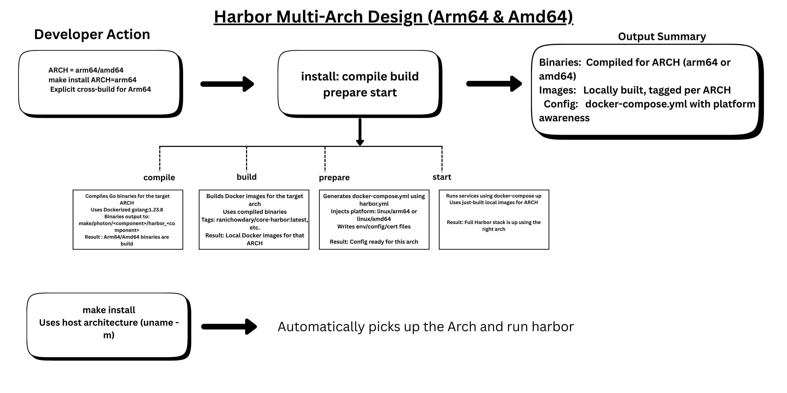

# Proposal: Arm64 Support and Multi-Architecture Image Publishing for Harbor

Author: Rani Chowdary Mandepudi, Arm (@ranimandepudi)

Discussion: https://github.com/goharbor/harbor/pull/21825

## Abstract

This proposal introduces native Arm64 support and multi-architecture image publishing for all Harbor components. The goal is to enable Harbor to run natively on Arm64 hardware, align with CNCF best practices, and enhance Harbor's portability across modern infrastructure environments.

## Background

Harbor is a popular cloud-native container registry. While it provides full-featured registry services, its official builds and Docker images target only the Amd64 architecture. The growing adoption of Arm64 in cloud-native and edge computing environments has created demand for native Arm64 support.

Currently, deploying Harbor on Arm64 requires emulation or custom builds, reducing performance and maintainability.

## Proposal

Note: This proposal introduces no changes to Harbor’s core functionality. It adds support for additional architectures while keeping existing behavior unchanged.

All Harbor component images have been built and tagged for the Arm64 architecture. These images have been pushed to my DockerHub repository under the namespace ranichowdary/ (replacing the original goharbor/ namespace) for testing and validation purposes. Once the review is complete, the image names can be reverted to the original naming convention.

Additionally, the Dockerfile paths and image naming conventions have been modified to support multi-architecture builds. This ensures compatibility and seamless operation on both x86 and Arm64 platforms using the same codebase and Docker images.

These changes allow Harbor to be built, packaged, and installed cleanly on Arm64 hosts such as AWS Graviton and also on x86 as images are multi arch. 

This proposal introduces native Arm64 builds for Harbor components using `Docker Build` and multi-architecture manifests. Each image is tested and published in a way that maintains compatibility with existing Amd64-based deployments.

## Design Goals

Build Harbor component images (core, jobservice, registryctl, etc.) for both Arm64 and Amd64 using native compilation per architecture and multi-arch manifest merging.

Published multi-arch images to Docker Hub using unified manifest lists, enabling transparent arch-specific pulls without impacting existing deployments.

Supported native and cross-platform builds via docker buildx and architecture-specific runners.

Ensure deterministic and repeatable builds across architectures using consistent Makefile targets and validated build.

Provide documentation for Arm64 validation, and plan to publish a learning path on learn.arm.com post-upstreaming.

Integrate Arm64 builds into Harbor’s CI and release workflows using GitHub Actions. This will require coordination with Harbor maintainers—I’m happy to assist or contribute directly as needed.

## CI changes: 

Multi Arch CI integration on Harbor:

Objective: 
To ensure Harbor's CI system validates code changes across both amd64 and arm64 architectures for pull requests. This enhancement guarantees feature compatibility and stability on both platforms.

Changes: 
* CI.yml

This file defines main test matrix for harbor on pull requests and pushes. Ensure that Harbor's CI pipeline executed on both arm64 and amd64 architectures for every PR or push
  * Enabled Matrix strategy for Architecture: Before jobs like UTTEST, APITEST_DB ran only on `ubuntu-latest` (default amd64). With this each job uses:
  
  strategy:
    matrix:
        include:
        - arch:amd64
          runner: ubuntu-22.04
        - arch:arm64
          runner: ubuntu-24.04-arm

Job names updated for architecture clarity.
Unit, API, and UI test logic unchanged, but now dynamically detects platform via `uname -m`.

* build_package.yml: 
    * Added matrix to support parallel builds on amd64 and arm64
    * Artifacts now uploaded to `gs://harbor-build/amd64/..` and `gs://harbor-builds/arm64/..`
    * Docker images pushed as `docker push ranichowdary/core-harbor:<tag>-arm64` and `docker push ranichowdary/core-harbor:<tag>-amd64`
    * Multi-arch manifest created on amd64 runner.

* publish-release.yml: Matrix used to ensure images pushed for both architectures. Preserved existing functionality. 
* conformance_test.yml: Added Matrix strategy for architecture. Architecture specific report upload(report-amd64.html, report-arm64.html)
* docker-compose.yml: Changed images names to multi-arch images

## Architecture Overview:

## Image Structure:

Image tags follow the pattern: goharbor/<component>:<version>
During development and testing, images are published under the ranichowdary/* namespace on Docker Hub (e.g., ranichowdary/core-harbor, ranichowdary/jobservice-harbor).
Finalized multi-arch images will match upstream Harbor naming conventions.

Images:
MultiArch Images links:

Nginx:
ranichowdary/nginx-harbor
ranichowdary/nginx-base-harbor
Db:
ranichowdary/db-harbor
ranichowdary/db-base-harbor
Redis:
ranichowdary/redis-harbor
ranichowdary/redis-base-harbor 
Log:
ranichowdary/log-harbor
ranichowdary/log-base-harbor
Core:
ranichowdary/core-harbor
ranichowdary/core-base-harbor
Exporter:
ranichowdary/exporter-base-harbor 
Jobservice
ranichowdary/jobservice-harbor
ranichowdary/jobservice-base-harbor
Registry:
ranichowdary/registry-harbor
ranichowdary/registry-base-harbor
Registryctl:
ranichowdary/registryctl-harbor
ranichowdary/registryctl-base-harbor 
Portal:
ranichowdary/portal-harbor
ranichowdary/portal-base-harbor
Trivy:
ranichowdary/trivy-adapter-harbor
ranichowdary/trivy-base-harbor

## Build and Push Workflow (Per Architecture)

Each image is built and pushed in the following steps:
On Amd64 Host:
- Generated amd64 binary.
- Build image: docker build -t ranichowdary/core-harbor:amd64 .
- Push the docker push ranichowdary/core-harbor:amd64
On Arm64 Host:
- Run make build-core on Arm64 instance to generate native binary.
-  Build image: docker build -t ranichowdary/core-harbor:arm64 .
- Push the docker push ranichowdary/core-harbor:arm64

Created manifest to ensure final image : `latest` tag resolves to the correct architecture during image pull based on the target environment.

Process Overview:
- Generated amd64-native binary for the components and build the docker image as 
`docker build -t ranichowdary/<component>-harbor:amd64 . `
- Push the image
`docker push ranichowdary/<component>-harbor:amd64`

- Generated arm64-native binary for the components and build the docker image as 
`make build-<component>`
`docker build -t ranichowdary/<component>-harbor:arm64 . `
- Push the image 
`docker push ranichowdary/<component>-harbor:arm64`

Finally on amd64 Host (Create and push manifest)

`docker manifest create ranichowdary/db-harbor:latest ranichowdary/db-harbor:amd64 ranichowdary/db-harbor:arm64`

`docker manifest push ranichowdary/db-harbor:latest`

Result: 

This creates a multi-architecture manifest under the tag `latest` that points to the appropriate architecture-specific image. When a user pull the image:

`docker pull ranichowdary/db-harbor:latest`
Docker will automatically fetch either the amd64 or arm64 version, depending on the user's platform. 

## Architecture Diagram

The following diagram illustrates the high-level design for Harbor's multi-architecture support across Arm64 and Amd64 platforms:

## Testing 

To validate that our custom-built Harbor instance with Arm64 support works correctly across components and architectures, I performed the following levels of testing:

- tools/spectral/Dockerfile - Uses arch-specific spectral binary; dynamically selects amd64/arm64

- tools/migrate_chart/migrate_chart.sh- this script is architecture-neutral and works on both amd64 and arm64 as long as a compatible `helm` binary is available.

- tools/migrate_chart/Dockerfile - It currently hardcodes the Helm binary for `linux-amd64` so it is not architecture-neutral and must be updated to support Arm64 by dynamically resolving the appropriate Helm binary for the target architecture.
Made this docker image multi-architecture (`docker pull ranichowdary/migrate-chart:latest`)

tools/notary-migration-fix.sh - No changes
tools/swagger/Dockerfile - No changes

- tools/release/release_utils.sh: In getAssets() function adding `arch` parameter because builds are now organized under subfolder like `amd64/` and `arm64/`. Updated GCS `gsutil cp` paths to ensure it looks under the correct architecture folder. Used `mkdir -p` to prevent errors if assetsPath already exists. Also updated `publish_release.yml` where it calls `getAssets`.
I can work on this but this need maintainers to work as we need to deal with few enhancements.

Container Health Validation:

- Ensuring auxiliary tools handled for both `amd64` and `arm64` architectures when building Harbor via the Makefile:

- Verified all Harbor services (core, registry, jobservice, portal, proxy, etc.) were up and marked as healthy via docker ps.
- Ensured correct images (ranichowdary/*-harbor) were used with linux/arm64 platform and linux/amd64.

Web UI Access:

- Loaded the Harbor UI successfully at http://<host>/harbor.
- Confirmed login, project navigation, and artifact listing worked from the browser.

API-Level Testing:
- Used Harbor’s REST API to validate backend services:
    - GET /api/v2.0/ping → responded with pong confirming core service health.
    - GET /api/v2.0/projects → confirmed API access and project metadata retrieval.
    - POST /api/v2.0/projects → tested project creation via API.
    - GET /api/v2.0/repositories and /artifacts → verified image metadata retrieval.

- Image Push and Pull Tests (Registry Validation)
- Multi-Architecture Image Validation

These tests confirm that Harbor can function fully on Arm64 & Amd64, including UI, API, registry, and multi-architecture artifact handling. The environment is now ready for use in cloud-native, edge, or hybrid deployments.

Thanks for reviewing this work! Since I'm the author of this contribution from Arm, I believe this is a high-priority topic within the Harbor community and it could be introduced as a new feature soon. A formal proposal like this document will help align on the design and technical implementation.

I welcome feedback, collaboration, or questions from the Harbor community

## References:

www.arm.com/migrate
https://learn.arm.com/
https://hub.docker.com/u/ranichowdary
