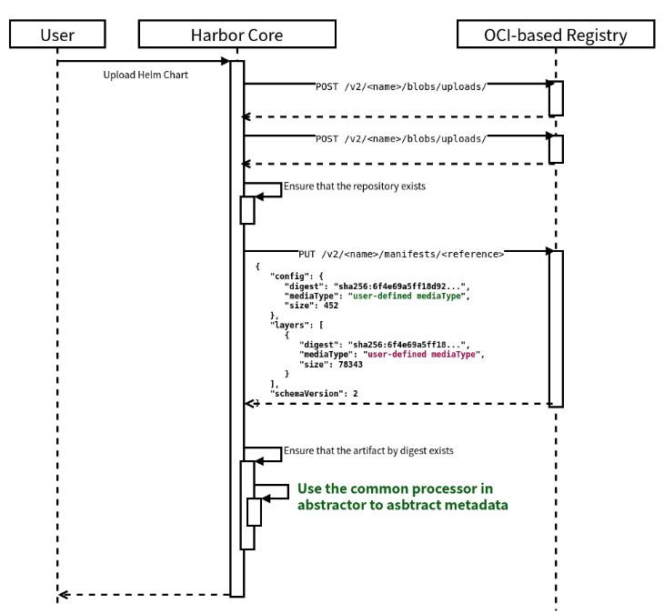

<!-- START doctoc generated TOC please keep comment here to allow auto update -->
<!-- DON'T EDIT THIS SECTION, INSTEAD RE-RUN doctoc TO UPDATE -->
**Table of Contents**  *generated with [DocToc](https://github.com/thlorenz/doctoc)*

- [Proposal: `Enhanced Default Processor`](#proposal-enhanced-default-processor)
  - [Abstract](#abstract)
  - [Background](#background)
  - [Motivation](#motivation)
  - [Goals](#goals)
  - [Non-Goals](#non-goals)
  - [Implementation](#implementation)
    - [Config schema](#config-schema)
    - [Enhanced Default Processor](#enhanced-default-processor)

<!-- END doctoc generated TOC please keep comment here to allow auto update -->

# Proposal: `Enhanced Default Processor`

Author:

- Yiyang Huang [@hyy0322](https://github.com/hyy0322) \<huangyiyang@caicloud.io\> (Corresponding Author)
- Ce Gao [@gaocegege](https://github.com/gaocegege)
- Jian Zhu [@zhujian7](https://github.com/zhujian7)

Links:

- Discussion: [goharbor/harbor#12013](https://github.com/goharbor/harbor/issues/12013)
- Slides: [Feature Request: Harbor Artifact Processor Extender](https://docs.google.com/presentation/d/1rX7v9IhXjXEAmbJP29nkSU2RJXUrpLJujL8iemqcjnU/edit#)

Status:

- 2020-06-24 Draft v3
- 2020-06-15 [Draft v2](https://github.com/hyy0322/community/blob/7349e0a4325d021b9d52ed61afbc6118f30c7774/proposals/artifact-processor-extender.md)
- 2020-05-28 [Draft v1](https://github.com/gaocegege/community-2/blob/enhancement/proposals/artifact-processor-extender.md)

## Abstract

Harbor v2.0 makes Harbor the first OCI-compliant open source registry capable of storing a multitude of cloud-native artifacts like container images, Helm charts, OPAs, Singularity, and much more. It found strong demand on extending artifact types to support more complex scenarios. But the artifact authors now have to implement the processing logic in Harbor Core, which is not extensible.

The current design might go against the adoption of Harbor in industries since there are always proprietary artifact types. Thus we design the artifact processor extender to address the problem in this proposal. When new custom artifact types are registered into Harbor Core, the core service will communicate with the remote artifact processor extender via RESTful API. Artifact-specific logic will keep in the extender, and the Harbor Core will be artifact-neutral.

## Background

There are four types of artifacts, which are image, helm v3, CNAB, OPA bundle, supported by Harbor. Each of them implements its processor to abstract metadata into artifact model defined by harbor. If users want to define a new kind of artifact, they have to implement the processor logic in Harbor Core service, which greatly limits the scalability and extensibility of Harbor.

## Motivation

When we use Harbor to store custom artifacts, we cannot get the expected result from the API provided by Harbor `{}/api/v2.0/projects/{}/repositories/{}/artifacts/{}`. For example, we store a new artifact using [caicloud/ormb](https://github.com/caicloud/ormb), which is a OCI artifact specification for Machine Learning models, we get the result from the API:

```
{
  "digest": "sha256:123aa..",
  "id": 2,
  "manifest_media_type": "application/vnd.oci.image.manifest.v1+json",
  "media_type": "application/vnd.caicloud.model.config.v1alpha1+json",
  "project_id": 2,
  "repository_id": 1,
  "size": 12927980,
  "tags": [
    {
      "artifact_id": 2,
      "id": 2,
      "immutable": false,
      "name": "v1",
      "pull_time": "0001-01-01T00:00:00.000Z",
      "push_time": "2020-05-15T04:04:19.516Z",
      "repository_id": 2,
      "signed": false
    }
  ],
  "type": "MODEL"
}
```

But when we store the Helm Chart and send request to the same API, we get more attributes. The extra attributes store the content of the config layer of the Helm Chart. Thus we can think the result is self-contained.

```diff
{
+  "extra_attrs": {
+    "apiVersion": "v1",
+    "appVersion": "0.8.0",
+    "description": "Host your own Helm Chart Repository",
+    "home": "https://github.com/helm/chartmuseum",
+    "icon": "https://raw.githubusercontent.com/helm/chartmuseum/master/logo2.png",
+    "keywords": [
+      "chartmuseum",
+    ],
+    "maintainers": [
+      {
+        "email": "opensource@codefresh.io",
+        "name": "codefresh-io"
+      }
+    ],
+    "name": "chartmuseum",
+    "version": "1.8.2"
+  },
  "digest": "sha256:123aa..",
  "id": 1,
  "manifest_media_type": "application/vnd.oci.image.manifest.v1+json",
  "media_type": "application/vnd.cncf.helm.config.v1+json",
  "project_id": 2,
  "repository_id": 2,
  "size": 12927980,
  "tags": [
    {
      "artifact_id": 1,
      "id": 1,
      "immutable": false,
      "name": "v1",
      "pull_time": "0001-01-01T00:00:00.000Z",
      "push_time": "2020-05-15T04:04:19.516Z",
      "repository_id": 2,
      "signed": false
    }
  ],
  "type": "CHART"
}
```

The self-contained response is also necessary for these user-defined artifact types. Or we cannot use Harbor directly for most scenarios. The `extra_attrs` field is processed by the Helm Chart processor, which is an implementation of artifact processor interface `Processor`.

The current design of the artifact processor is shown in Fig. 1. `Processor` interface is defined in Harbor Core, and there are four implementations for different types which embeds `base.IndexProcessor` and `base.ManifestProcessor`.

<p align="center">

<p align="center">Fig. 1 Current Design of Harbor Artifact Processor</p>
</p>

When artifact authors extend the artifact types, they implement corresponding processor logic in Harbor Core, as shown in Fig. 2. For example, there will be four new processor implementations in Harbor Core with at least four different maintainers from different communities if we want to support these four artifact types.

<p align="center"> 

<p align="center">Fig. 2 More Harbor Artifact Processor in Harbor Core</p>
</p>

Besides this, there will be more proprietary artifact types in industries, just like Kubernetes CRDs, as shown in Fig. 3. Each artifact vendor has to maintain their own fork to keep their proprietary artifact types, which may make Harbor a fragmented platform.

<p align="center">

<p align="center">Fig. 3 Fragmented Problems in Harbor</p>
</p>

## Goals

This proposal is to:

- Design the new processor to extend artifact types in runtime.
- Keep non-invasive to the current built-in processors, at the same time.

## Non-Goals

This proposal is not to:

- Support whitelist for artifact types. [goharbor/harbor#12061](https://github.com/goharbor/harbor/issues/12061)

## Implementation

To address these problems, we propose a new feature **Enhanced default processor** in Harbor Core. The contributions of the proposal are:

- Define a JSON schema for the config layer of an artifact.
- The enhanced default processor implementation to support user-defined artifacts.

### Config schema
manifest
```
{
   "schemaVersion": 2,
   "mediaType": "application/vnd.docker.distribution.manifest.v2+json",
   "config": {
      "mediaType": "application/vnd.custom.artifact.config.v1+json",
      "size": 11830,
      "digest": "sha256:2ffd3c3d87aac9d99c93ba84fbec6ae59c9946cbef2531bb1dc5e02fb905971a"
   },
   "layers": []
}
```
As is showed above, we can define a media type ```application/vnd.custom.artifact.config.v1+json``` to show it is a media type of user-defined artifact config


config layer
```
{ 
    // user defined config
    // abstract metadata will use this config data as extra attrs
    "key1": ...,
    "key2": ...,

    // harbor defined config
    "harbor": {
        // artifact config
        "artifactMetadata":{
            // artifact type
            "type": "ORMB",
            // artifact media type
            "mediaType": "application/vnd.caicloud.ormb.xxx",
            // additions
            "additions": [
                {
                    // content type
                    "contentType": "plain"
                    // addition type name, one of addition type
                    "type": "type_xxx",
                    "digest": "sha256:xxx"
                },
                {
                    "contentType": "json",
                    "type": "type_xxx",
                    "digest": "sha256:xxx"
                },
                {
                    "contentType": "markdown"
                    "type": "type_xxx",
                    "digest": "sha256:xxx"
                },
                ...
            ]
        }
    }
}
```
Mainly there are two parts about this config. One is custom for user to put their config, the other is harbor defined config.

### Enhanced Default Processor

We propose to have the similar arguments for all methods in Processor interface:
```diff
// Processor processes specified artifact
type Processor interface {
    // GetArtifactType returns the type of one kind of artifact specified by media type
-   GetArtifactType() string
+   GetArtifactType(ctx context.Context, artifact *artifact.Artifact) string
    // ListAdditionTypes returns the supported addition types of one kind of artifact specified by media type
-   ListAdditionTypes() []string
+   ListAdditionTypes(ctx context.Context, artifact *artifact.Artifact) []string
    // AbstractMetadata abstracts the metadata for the specific artifact type into the artifact model,
    // the metadata can be got from the manifest or other layers referenced by the manifest.
-   AbstractMetadata(ctx context.Context, manifest []byte, artifact *artifact.Artifact) error
+   AbstractMetadata(ctx context.Context, artifact *artifact.Artifact, manifest []byte) error
    // AbstractAddition abstracts the addition of the artifact.
    // The additions are different for different artifacts:
    // build history for image; values.yaml, readme and dependencies for chart, etc
    AbstractAddition(ctx context.Context, artifact *artifact.Artifact, additionType string) (addition *Addition, err error)
}
```

The pseudo code of the `defaultProcessor` is here:

```go
func (d *defaultProcessor) GetArtifactType(artifact *artifact.Artifact) string {
	// try to parse the type from the media type
	strs := artifactTypeRegExp.FindStringSubmatch(d.mediaType)
	if len(strs) == 2 {
		return strings.ToUpper(strs[1])
	}
	// can not get the artifact type from the media type, return unknown
	return ArtifactTypeUnknown
}

func (d *defaultProcessor) ListAdditionTypes(artifact *artifact.Artifact) []string {
  configLayer := pullBlob(artifact.manifest.config.digest)
  if configLayer.Harbor == nil {
    return nil
  }
	// Traverse configLayer.Harbor.ArtifactMetadata.Additions array to get all addition type
	return []string{configLayer.Harbor.ArtifactMetadata.Additions.Type...}
}

func (d *defaultProcessor) AbstractMetadata(artifact *artifact.Artifact) error {
  configLayer := pullBlob(artifact.manifest.config.digest)
  // Extract the extra attributes according to the config.
  extraAttrs := extractAttrsFromConfig(configLayer.Harbor)
  artifact.ExtraAttrs = extraAttrs
  return nil
}

func (d *defaultProcessor) AbstractAddition(artifact artifact *artifact.Artifact, additionType string) (addition *Addition, err error) {
	configLayer := pullBlob(artifact.manifest.config.digest)
	// make a map map[type]struct{
	//                         contentType
	//                         digest
	//                     }
	additionDigest := map[type]struct.digest
	additionLayer := pullBlob(additionDigest)
	return Addition{
		Content: additionType,
		Content: additionLayer,
	}
}
```

<p align="center">

<p align="center">Fig. 4 Workflow of Pushing an Artifact using the General Processor</p>
</p>
