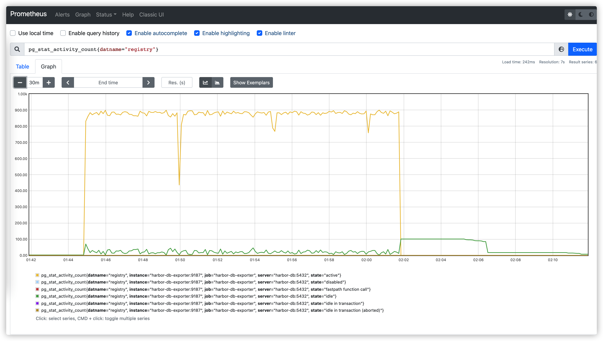
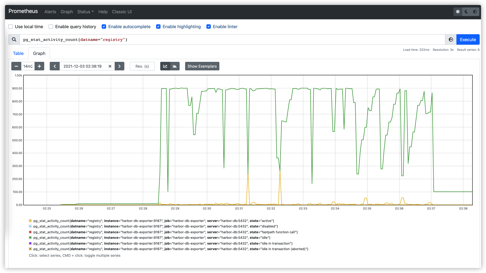
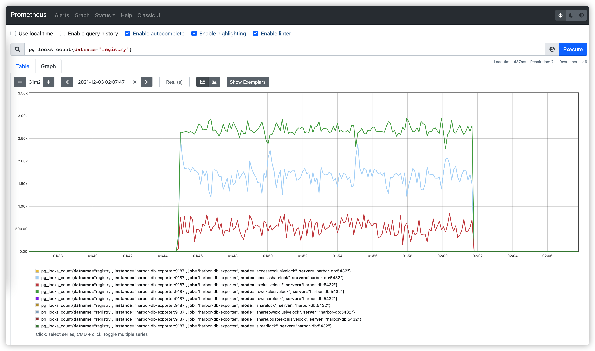
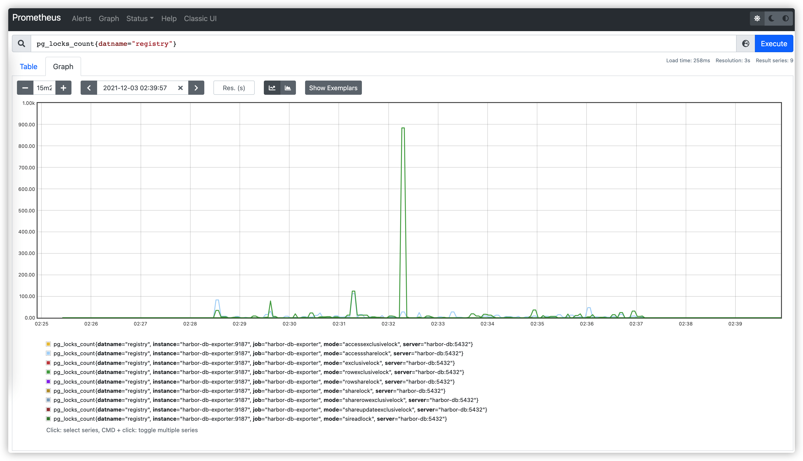
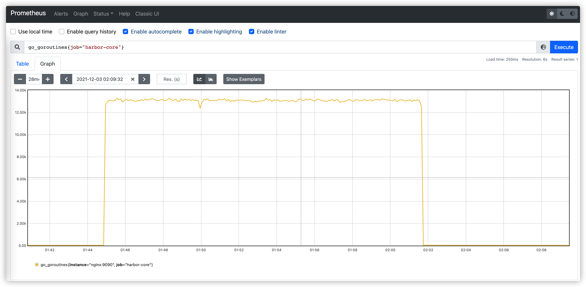
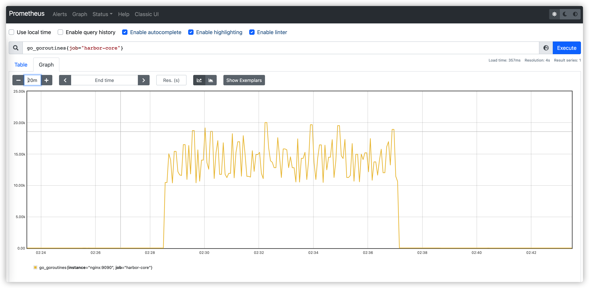

# Proposal: Asynchronous update of artifact's `pull_time` and `pull_count`

Author: ChenYu Zhang / [chlins](https://github.com/chlins)

## Background

Currently, if the user pulls an artifact from the harbor, the `harbor-core` component
will raise two goroutines to update the artifact's `pull_time` and `pull_count`
in the background for every `pull` request, and since it is a concurrent
operation on a single record of the same table, problems such as goroutines
piling up and database lock waiting can occur in the case of a high concurrent pull,
this will also take up the number of connections to the database and thus reduce
the performance of harbor.

## Abstract

Asynchronous update and merge the update operations of artifact's `pull_time` and `pull_count` to reduce
the duplication of update work to the database, and also provide the
configuration to keep the original version update("sync mode").

## Goals

* Reduce the number of database locks.

* Fewer operations on the database update.

* Improve the throughput of the harbor in the case of high concurrent pull.

## Non-Goals

* Fully accurate `pull_time` and `pull_count` of artifact.

* Immediate synchronized `pull_time` and `pull_count` of artifact after pulling.

### Side Effects

The async update operations will bring up some side effects, like tag retention
and GC which depends on the artifact's `pull_time` to judge candidates. But
the probability of issues is depended on the async flush time duration, if the
interval is relatively small then the probability of problems will be lower.

## Implementation

Related code path: `src/controller/event/handler/internal/artifact.go`

### Rationale

* Cache the operation of pull into the cache storage.

* Merge the operations and only cache the final state.

* Periodically flush data from cache to the database.

#### Cache selection

**Redis**

Advantages

* Redis service can be deployed in HA mode.

* The data of `pull_time` and `pull_count` will not lost if core crash or scale.

Disadvantages

* The performance of redis can become a potential performance bottleneck.

* Frequent network IO operations between redis and core.

* The business side needs to implement additional distributed locks to ensure data consistency when multiple core instances exist.

**Memory**

Advantages

* Memory operation is very fast and no network IO needed.

* Low maintenance and retrofitting costs.

* Multiple core handles their self update operation so no additional logic needed to
  keep the operation sequence.

Disadvantages

* Memory data will be lost if core restart.

* Similar update work when multiple core instances exist.

After all the considerations, we intend to use memory as a caching solution
which has less maintenance costs. Although it may bring the problem of data loss, but we can reduce the
probability of the problem by adjusting the flush cycle smaller.

### Model

Extend the previous artifact event Handler.

```go
// Handler preprocess artifact event data
type Handler struct {
	// once for initialize operation
	once sync.Once
	// pullCountStore caches the pull count group by repository
	// map[repositoryID]counts
	pullCountStore map[int64]uint64
	// pullCountLock mutex for pullCountStore
	pullCountLock sync.Mutex
	// pullTimeStore caches the latest pull time group by artifact
	// map[artifactID:tagName]time
	pullTimeStore map[string]time.Time
	// pullTimeLock mutex for pullTimeStore
	pullTimeLock sync.Mutex
}
```

Adjust the logic of the `onPull` function.

```go
func (a *Handler) onPull(ctx context.Context, event *event.ArtifactEvent) error {
	a.once.Do(func() {
		a.pullTimeStore = make(map[string]time.Time)
		a.pullCountStore = make(map[int64]uint64)

		go a.asyncFlushPullTime(orm.Context())
		go a.asyncFlushPullCount(orm.Context())
	})

	a.updatePullTime(ctx, event)
	a.addPullCount(ctx, event)
	return nil
}
```

Refactor `updatePullTime` and `addPullCount` to cache and merge operations in
memory.

```go
func (a *Handler) updatePullTime(ctx context.Context, event *event.ArtifactEvent) {
	var tagName string
	if len(event.Tags) != 0 {
		tagName = event.Tags[0]
	}

	key := fmt.Sprintf("%d:%s", event.Artifact.ID, tagName)

	a.pullTimeLock.Lock()
	defer a.pullTimeLock.Unlock()

	a.pullTimeStore[key] = time.Now()
}

func (a *Handler) addPullCount(ctx context.Context, event *event.ArtifactEvent) {
	a.pullCountLock.Lock()
	defer a.pullCountLock.Unlock()

	a.pullCountStore[event.Artifact.RepositoryID] = a.pullCountStore[event.Artifact.RepositoryID] + 1
}
```

Implement new functions for async update `pull_time` and `pull_count`
periodically.

```go

var (
    // this variable will be exposed as environment variable, if use want to `sync mode` can set this value to `0`,
	// and the default value of this variable is 10 seconds if not provide.
	asyncFlushDuration = 10 * time.Second
)


func (a *Handler) asyncFlushPullCount(ctx context.Context) {
	for {
		<-time.After(asyncFlushDuration)
		a.pullCountLock.Lock()

		for repositoryID, count := range a.pullCountStore {
			if err := repository.Ctl.AddPullCount(ctx, repositoryID, count); err != nil {
				log.Debugf("failed to add pull count repository %d, %v", repositoryID, err)
			}
		}

		a.pullCountStore = make(map[int64]uint64)
		a.pullCountLock.Unlock()
	}
}

func (a *Handler) asyncFlushPullTime(ctx context.Context) {
	for {
		<-time.After(asyncFlushDuration)
		a.pullTimeLock.Lock()

		for key, time := range a.pullTimeStore {
			var tagID int64

			keys := strings.Split(key, ":")
			artifactID, err := strconv.ParseInt(keys[0], 10, 64)
			if err != nil {
				log.Errorf("failed to parse artifact id %s, %v", key, err)
				continue
			}
			// with tag name
			if len(keys) > 1 && keys[1] != "" {
				tags, err := tag.Ctl.List(ctx, &q.Query{
					Keywords: map[string]interface{}{
						"ArtifactID": artifactID,
						"Name":       keys[1],
					},
				}, nil)
				if err != nil {
					log.Infof("failed to list tags when to update pull time, %v", err)
				} else {
					if len(tags) != 0 {
						tagID = tags[0].ID
					}
				}
			}

			if err := artifact.Ctl.UpdatePullTime(ctx, artifactID, tagID, time); err != nil {
				log.Debugf("failed to update pull time form artifact %d, %v", artifactID, err)
			}
		}

		a.pullTimeStore = make(map[string]time.Time)
		a.pullTimeLock.Unlock()
	}
}
```

### Comparison of optimization

Scenarios

Harbor deployed by `docker-compose` in the host which with 16 cpu cores and 16G
memory, use `k6` to simulate 5k concurrency to pull the same image manifest.

performance test tool: [perf](https://github.com/goharbor/perf)

#### summary

before

```bash
running (0d00h16m53.4s), 0000/5000 VUs, 500000 complete and 0 interrupted iterations
default ✓ [======================================] 5000 VUs  0d00h16m53.4s/24h0m0s  500000/500000 shared iters


     data_received..................: 660 MB 652 kB/s
     data_sent......................: 99 MB  98 kB/s
     http_req_blocked...............: avg=24.54ms  min=745ns   med=2µs     max=3.92s    p(90)=3.48µs  p(95)=4.61µs
     http_req_connecting............: avg=990.65µs min=0s      med=0s      max=281.21ms p(90)=0s      p(95)=0s
     http_req_duration..............: avg=10.06s   min=77.31ms med=7.64s   max=1m0s     p(90)=18.9s   p(95)=25.36s
       { expected_response:true }...: avg=9.95s    min=77.31ms med=7.63s   max=59.99s   p(90)=18.73s  p(95)=24.97s
     http_req_failed................: 0.21%  ✓ 1072       ✗ 498928
     http_req_receiving.............: avg=58.79µs  min=0s      med=54.41µs max=24.57ms  p(90)=82.5µs  p(95)=92.77µs
     http_req_sending...............: avg=16.02µs  min=5.52µs  med=13.24µs max=19.21ms  p(90)=24.34µs p(95)=29.34µs
     http_req_tls_handshaking.......: avg=23.54ms  min=0s      med=0s      max=3.78s    p(90)=0s      p(95)=0s
     http_req_waiting...............: avg=10.06s   min=76.85ms med=7.64s   max=1m0s     p(90)=18.9s   p(95)=25.36s
     http_reqs......................: 500000 493.390077/s
     iteration_duration.............: avg=10.08s   min=84.13ms med=7.67s   max=1m0s     p(90)=18.93s  p(95)=25.37s
     ✓ { scenario:default }.........: avg=10.08s   min=84.13ms med=7.67s   max=1m0s     p(90)=18.93s  p(95)=25.37s
     iterations.....................: 500000 493.390077/s
     success........................: 99.78% ✓ 498928     ✗ 1072
     vus............................: 211    min=211      max=5000
     vus_max........................: 5000   min=5000     max=5000
```

after

```bash
running (0d00h08m36.4s), 0000/5000 VUs, 500000 complete and 0 interrupted iterations
default ✓ [======================================] 5000 VUs  0d00h08m36.4s/24h0m0s  500000/500000 shared iters


     data_received..................: 660 MB  1.3 MB/s
     data_sent......................: 99 MB   191 kB/s
     http_req_blocked...............: avg=21.86ms min=794ns   med=1.67µs  max=3.05s   p(90)=3.12µs p(95)=4.15µs
     http_req_connecting............: avg=1.24ms  min=0s      med=0s      max=312.9ms p(90)=0s     p(95)=0s
     http_req_duration..............: avg=5.12s   min=16.33ms med=4.87s   max=20.81s  p(90)=7.56s  p(95)=8.42s
       { expected_response:true }...: avg=5.12s   min=16.33ms med=4.87s   max=20.81s  p(90)=7.56s  p(95)=8.42s
     http_req_failed................: 0.00%   ✓ 0          ✗ 500000
     http_req_receiving.............: avg=46.43µs min=17.24µs med=40.67µs max=37.29ms p(90)=66.4µs p(95)=77.75µs
     http_req_sending...............: avg=13.89µs min=5.22µs  med=9.93µs  max=17.08ms p(90)=21µs   p(95)=26.15µs
     http_req_tls_handshaking.......: avg=20.6ms  min=0s      med=0s      max=2.94s   p(90)=0s     p(95)=0s
     http_req_waiting...............: avg=5.12s   min=16.28ms med=4.87s   max=20.81s  p(90)=7.56s  p(95)=8.42s
     http_reqs......................: 500000  968.318185/s
     iteration_duration.............: avg=5.14s   min=16.43ms med=4.89s   max=20.81s  p(90)=7.59s  p(95)=8.46s
     ✓ { scenario:default }.........: avg=5.14s   min=16.43ms med=4.89s   max=20.81s  p(90)=7.59s  p(95)=8.46s
     iterations.....................: 500000  968.318185/s
     success........................: 100.00% ✓ 500000     ✗ 0
     vus............................: 1023    min=1023     max=5000
     vus_max........................: 5000    min=5000     max=5000
```

#### pg_stat_activity

before



after



#### pg_locks_count

before



after



#### harbor_core_goroutines

before



after



## Open issues

<https://github.com/goharbor/harbor/issues/15963>
