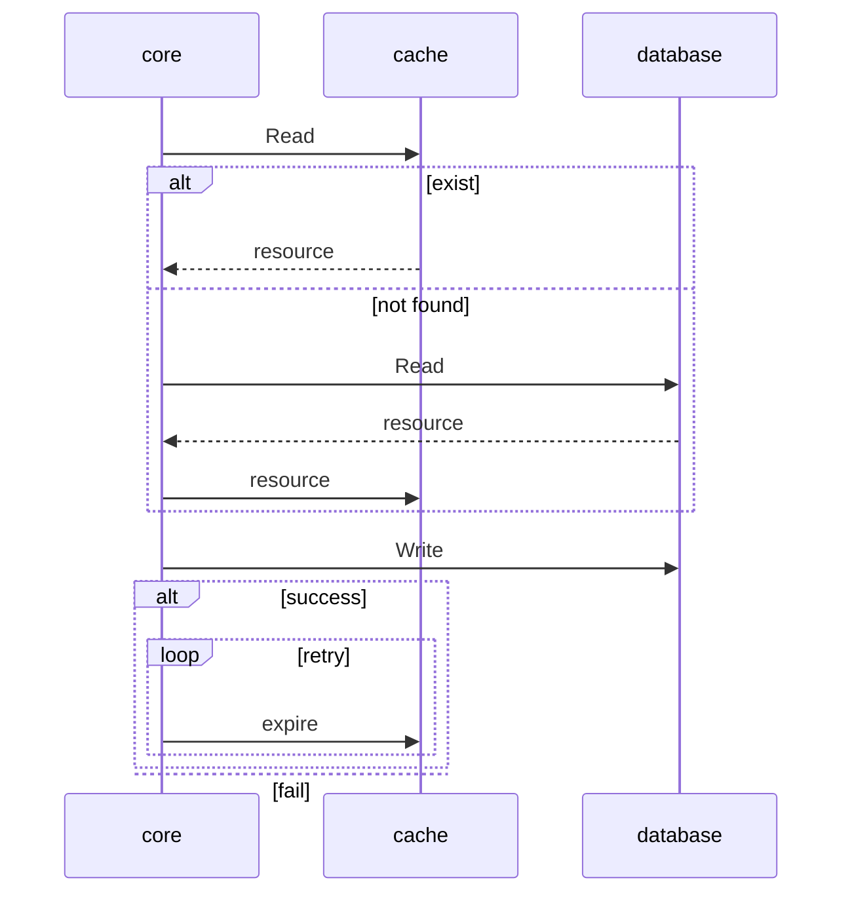
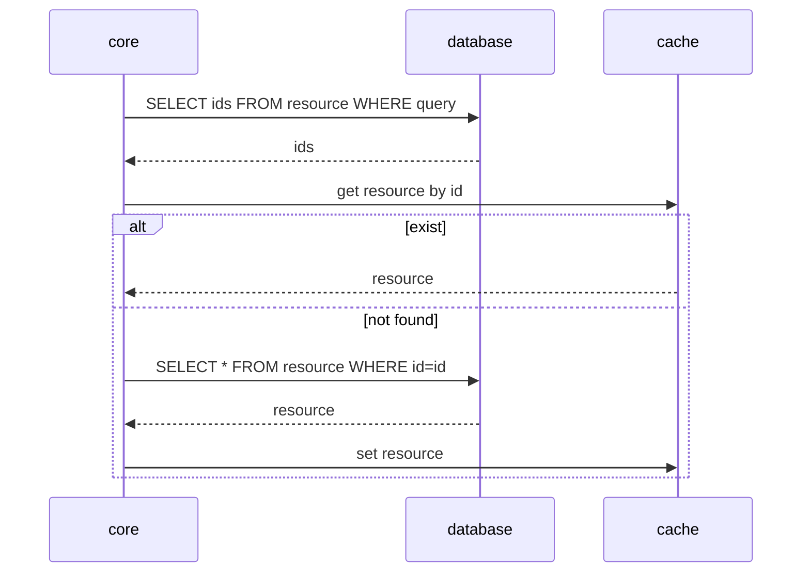

# Proposal: Introduce cache layer for harbor to improve performance

Author: ChenYu Zhang/[chlins](https://github.com/chlins), Yan Wang/[wy65701436](https://github.com/wy65701436)

## Background

As the number of harbor artifacts increases, and with the more integrations with other
systems, there are rapidly increasing external requests to harbor,
especially in some high concurrency scenarios, the API response of harbor will
become slower or fail as well as the pressure on the database will be higher.

## Abstract

Introduce cache layer for frequently used resources in harbor, like
artifact, project, tag, etc. Caching these resources can effectively improve the
API query latency and also reduce the requests to the database, thus improving
the performance of harbor.

## Goals

- Improve the throughout

- Accelerate API response

- Reduce operations to the database

## Non-Goals

- Cache all resources

## Investigation

Do multiple sets of tests to locate performance bottlenecks.

### Tests

The following tests are based on the version 2.4 and disable `pull_time` &
`pull_count` to reduce interference, also use external database to close to real
scenarios.

#### Redis benchmark

Benchmark single host redis by `redis-benchmark` as reference.

```bash
redis [ ~ ]$ redis-benchmark -t get -d 1024 -n 5000 -q
GET: 84745.77 requests per second

redis [ ~ ]$ redis-benchmark -t get -d 10240 -n 10000 -q
GET: 91743.12 requests per second
```

#### Set 1 - Pull Manifest

In the case of large concurrent pull image, the client need to pull manifest
firstly, so we pressure testing the GET manifest API.

##### No Cache

```bash
running (0d00h01m06.0s), 0000/5000 VUs, 100000 complete and 0 interrupted iterations
default ✓ [======================================] 5000 VUs  0d00h01m06.0s/24h0m0s  100000/100000 shared iters


     data_received..................: 136 MB 2.1 MB/s
     data_sent......................: 22 MB  326 kB/s
     http_req_blocked...............: avg=147.18ms min=0s      med=1.74µs  max=4.81s    p(90)=4.46µs  p(95)=326.7ms
     http_req_connecting............: avg=10.68ms  min=0s      med=0s      max=529.56ms p(90)=0s      p(95)=125.15ms
     http_req_duration..............: avg=3.06s    min=0s      med=2.92s   max=12.31s   p(90)=5.31s   p(95)=5.87s
       { expected_response:true }...: avg=3.13s    min=21.71ms med=2.97s   max=12.31s   p(90)=5.33s   p(95)=5.88s
     http_req_failed................: 2.28%  ✓ 2282        ✗ 97718
     http_req_receiving.............: avg=45.65µs  min=0s      med=40.45µs max=24.18ms  p(90)=65.41µs p(95)=75.93µs
     http_req_sending...............: avg=23µs     min=0s      med=10.53µs max=33.32ms  p(90)=25.11µs p(95)=35.35µs
     http_req_tls_handshaking.......: avg=138.08ms min=0s      med=0s      max=4.48s    p(90)=0s      p(95)=268.1ms
     http_req_waiting...............: avg=3.06s    min=0s      med=2.92s   max=12.31s   p(90)=5.31s   p(95)=5.87s
     http_reqs......................: 100000 1515.720996/s
     iteration_duration.............: avg=3.21s    min=21.81ms med=3.01s   max=12.31s   p(90)=5.4s    p(95)=6.1s
     ✓ { scenario:default }.........: avg=3.21s    min=21.81ms med=3.01s   max=12.31s   p(90)=5.4s    p(95)=6.1s
     iterations.....................: 100000 1515.720996/s
     success........................: 97.71% ✓ 97718       ✗ 2282
     vus............................: 1657   min=1657      max=5000
     vus_max........................: 5000   min=5000      max=5000
```

##### Cache DB

redis lib use `github.com/gomodule/redigo/redis` (Remove `TestOnBorrow` option)

```bash
running (0d00h01m02.8s), 0000/5000 VUs, 100000 complete and 0 interrupted iterations
default ✓ [======================================] 5000 VUs  0d00h01m02.8s/24h0m0s  100000/100000 shared iters


     data_received..................: 136 MB 2.2 MB/s
     data_sent......................: 22 MB  343 kB/s
     http_req_blocked...............: avg=133.15ms min=0s      med=1.74µs  max=4.58s    p(90)=4.57µs  p(95)=72.65ms
     http_req_connecting............: avg=6.68ms   min=0s      med=0s      max=320.78ms p(90)=0s      p(95)=77.57ms
     http_req_duration..............: avg=2.92s    min=0s      med=2.95s   max=10.33s   p(90)=4.65s   p(95)=5.16s
       { expected_response:true }...: avg=2.98s    min=24.61ms med=3s      max=10.33s   p(90)=4.67s   p(95)=5.17s
     http_req_failed................: 2.36%  ✓ 2365        ✗ 97635
     http_req_receiving.............: avg=47.3µs   min=0s      med=40.18µs max=7.67ms   p(90)=65.9µs  p(95)=77.96µs
     http_req_sending...............: avg=18.05µs  min=0s      med=10.46µs max=12.16ms  p(90)=26.31µs p(95)=37.5µs
     http_req_tls_handshaking.......: avg=128.07ms min=0s      med=0s      max=4.26s    p(90)=0s      p(95)=71.25ms
     http_req_waiting...............: avg=2.92s    min=0s      med=2.95s   max=10.33s   p(90)=4.65s   p(95)=5.16s
     http_reqs......................: 100000 1592.057169/s
     iteration_duration.............: avg=3.05s    min=24.72ms med=3.03s   max=10.94s   p(90)=4.77s   p(95)=5.41s
     ✓ { scenario:default }.........: avg=3.05s    min=24.72ms med=3.03s   max=10.94s   p(90)=4.77s   p(95)=5.41s
     iterations.....................: 100000 1592.057169/s
     success........................: 97.63% ✓ 97635       ✗ 2365
     vus............................: 864    min=864       max=5000
     vus_max........................: 5000   min=5000      max=5000
```

redis lib use `github.com/go-redis/redis/v8`

```bash
running (0d00h00m59.9s), 0000/5000 VUs, 100000 complete and 0 interrupted iterations
default ✓ [======================================] 5000 VUs  0d00h00m59.9s/24h0m0s  100000/100000 shared iters


     data_received..................: 136 MB 2.3 MB/s
     data_sent......................: 22 MB  360 kB/s
     http_req_blocked...............: avg=136.78ms min=0s      med=1.69µs  max=4.68s    p(90)=4.27µs  p(95)=101.5ms
     http_req_connecting............: avg=7.67ms   min=0s      med=0s      max=347.96ms p(90)=0s      p(95)=89.5ms
     http_req_duration..............: avg=2.82s    min=0s      med=2.93s   max=10.79s   p(90)=4.5s    p(95)=4.96s
       { expected_response:true }...: avg=2.89s    min=10.63ms med=2.97s   max=10.79s   p(90)=4.52s   p(95)=4.97s
     http_req_failed................: 2.53%  ✓ 2539        ✗ 97461
     http_req_receiving.............: avg=44.4µs   min=0s      med=39.27µs max=14.33ms  p(90)=63.68µs p(95)=73.94µs
     http_req_sending...............: avg=17.42µs  min=0s      med=10.21µs max=14.85ms  p(90)=25.51µs p(95)=36.4µs
     http_req_tls_handshaking.......: avg=131.17ms min=0s      med=0s      max=4.33s    p(90)=0s      p(95)=99.84ms
     http_req_waiting...............: avg=2.82s    min=0s      med=2.93s   max=10.78s   p(90)=4.5s    p(95)=4.96s
     http_reqs......................: 100000 1668.655546/s
     iteration_duration.............: avg=2.96s    min=10.73ms med=2.99s   max=11.14s   p(90)=4.63s   p(95)=5.13s
     ✓ { scenario:default }.........: avg=2.96s    min=10.73ms med=2.99s   max=11.14s   p(90)=4.63s   p(95)=5.13s
     iterations.....................: 100000 1668.655546/s
     success........................: 97.46% ✓ 97461       ✗ 2539
     vus............................: 4355   min=4355      max=5000
     vus_max........................: 5000   min=5000      max=5000
```

From above results we can see the package `github.com/go-redis/redis/v8`
performance is better than `github.com/gomodule/redigo/redis`.

> FYI: [Fastest Redis Client Library for Go](https://levelup.gitconnected.com/fastest-redis-client-library-for-go-7993f618f5ab)

##### Cache DB & Cache Manifest

```bash
running (0d00h00m29.0s), 0000/5000 VUs, 100000 complete and 0 interrupted iterations
default ✓ [======================================] 5000 VUs  0d00h00m29.0s/24h0m0s  100000/100000 shared iters


     data_received..................: 96 MB  3.3 MB/s
     data_sent......................: 21 MB  738 kB/s
     http_req_blocked...............: avg=122.97ms min=0s       med=1.62µs  max=3.84s    p(90)=3.97µs  p(95)=189.64ms
     http_req_connecting............: avg=5.83ms   min=0s       med=0s      max=308.69ms p(90)=0s      p(95)=3.02ms
     http_req_duration..............: avg=1.26s    min=0s       med=1.34s   max=4.85s    p(90)=1.47s   p(95)=1.51s
       { expected_response:true }...: avg=1.28s    min=4.23ms   med=1.35s   max=4.85s    p(90)=1.47s   p(95)=1.51s
     http_req_failed................: 1.27%  ✓ 1270        ✗ 98730
     http_req_receiving.............: avg=42.22µs  min=0s       med=35.73µs max=28.38ms  p(90)=56.43µs p(95)=65.14µs
     http_req_sending...............: avg=17.95µs  min=0s       med=9.87µs  max=21.64ms  p(90)=24.78µs p(95)=35.46µs
     http_req_tls_handshaking.......: avg=117.12ms min=0s       med=0s      max=3.57s    p(90)=0s      p(95)=150.94ms
     http_req_waiting...............: avg=1.26s    min=0s       med=1.34s   max=4.85s    p(90)=1.47s   p(95)=1.51s
     http_reqs......................: 100000 3453.000488/s
     iteration_duration.............: avg=1.39s    min=518.41µs med=1.35s   max=6.92s    p(90)=1.49s   p(95)=1.64s
     ✓ { scenario:default }.........: avg=1.39s    min=518.41µs med=1.35s   max=6.92s    p(90)=1.49s   p(95)=1.64s
     iterations.....................: 100000 3453.000488/s
     success........................: 98.72% ✓ 98730       ✗ 1270
     vus............................: 2819   min=2819      max=5000
     vus_max........................: 5000   min=5000      max=5000
```

##### Cache DB & Cache Manifest & Remove MiddleWares

MiddleWares includes common and registry-specific.

```go
// MiddleWares returns global middlewares
func MiddleWares() []beego.MiddleWare {
	return []beego.MiddleWare{
		mergeslash.Middleware(),
		trace.Middleware(),
		metric.Middleware(),
		requestid.Middleware(),
		log.Middleware(),
		session.Middleware(),
		csrf.Middleware(),
		orm.Middleware(pingSkipper),
		notification.Middleware(pingSkipper), // notification must ahead of transaction ensure the DB transaction execution complete
		transaction.Middleware(dbTxSkippers...),
		artifactinfo.Middleware(),
		security.Middleware(pingSkipper),
		security.UnauthorizedMiddleware(),
		readonly.Middleware(readonlySkippers...),
	}
}
```

```go
	root := router.NewRoute().
		Path("/v2")
		Middleware(v2auth.Middleware())

	root.NewRoute().
		Method(http.MethodGet).
		Path("/*/manifests/:reference").
		Middleware(metric.InjectOpIDMiddleware(metric.ManifestOperationID)).
		Middleware(repoproxy.ManifestMiddleware()).
		Middleware(contenttrust.Middleware()).
		Middleware(vulnerable.Middleware()).
```

```bash
running (0d00h00m08.3s), 0000/5000 VUs, 100000 complete and 0 interrupted iterations
default ✓ [======================================] 5000 VUs  0d00h00m08.3s/24h0m0s  100000/100000 shared iters


     data_received..................: 83 MB  10 MB/s
     data_sent......................: 21 MB  2.6 MB/s
     http_req_blocked...............: avg=118.62ms min=0s       med=1.4µs    max=3s       p(90)=4.15µs   p(95)=152.54ms
     http_req_connecting............: avg=6.5ms    min=0s       med=0s       max=316.63ms p(90)=0s       p(95)=9.48ms
     http_req_duration..............: avg=281.55ms min=0s       med=338.99ms max=2.59s    p(90)=418.91ms p(95)=495.78ms
       { expected_response:true }...: avg=284.69ms min=739.62µs med=340.23ms max=2.59s    p(90)=419.64ms p(95)=498.3ms
     http_req_failed................: 1.79%  ✓ 1798         ✗ 98202
     http_req_receiving.............: avg=66.64µs  min=0s       med=28.16µs  max=372.42ms p(90)=51.79µs  p(95)=131.67µs
     http_req_sending...............: avg=27.18µs  min=0s       med=8.38µs   max=73.01ms  p(90)=31.94µs  p(95)=70.32µs
     http_req_tls_handshaking.......: avg=112.1ms  min=0s       med=0s       max=2.87s    p(90)=0s       p(95)=140.69ms
     http_req_waiting...............: avg=281.46ms min=0s       med=338.95ms max=2.59s    p(90)=418.76ms p(95)=495.31ms
     http_reqs......................: 100000 12063.371303/s
     iteration_duration.............: avg=401.71ms min=432.12µs med=341.8ms  max=4.78s    p(90)=430.28ms p(95)=603.08ms
     ✓ { scenario:default }.........: avg=401.71ms min=432.12µs med=341.8ms  max=4.78s    p(90)=430.28ms p(95)=603.08ms
     iterations.....................: 100000 12063.371303/s
     success........................: 98.20% ✓ 98202        ✗ 1798
     vus............................: 5000   min=5000       max=5000
     vus_max........................: 5000   min=5000       max=5000
```

#### Set 2 - Get API Version

The API `/api/version` is the basic and simple api in harbor, it has no
business logic and do not need to communicate with redis or database, so this
group test can help to determinate the limit of web framework.

##### No MiddleWares

```bash
running (0d00h00m06.0s), 0000/5000 VUs, 100000 complete and 0 interrupted iterations
default ✓ [======================================] 5000 VUs  0d00h00m06.0s/24h0m0s  100000/100000 shared iters


     data_received..................: 50 MB   8.3 MB/s
     data_sent......................: 14 MB   2.4 MB/s
     http_req_blocked...............: avg=123.96ms min=744ns    med=1.56µs  max=3.77s    p(90)=5.23µs   p(95)=106.16ms
     http_req_connecting............: avg=6.26ms   min=0s       med=0s      max=307.68ms p(90)=0s       p(95)=31.4ms
     http_req_duration..............: avg=121.14ms min=421.33µs med=69.92ms max=3.05s    p(90)=250.57ms p(95)=372.69ms
       { expected_response:true }...: avg=121.14ms min=421.33µs med=69.92ms max=3.05s    p(90)=250.57ms p(95)=372.69ms
     http_req_failed................: 0.00%   ✓ 0            ✗ 100000
     http_req_receiving.............: avg=65.69µs  min=12.07µs  med=27.54µs max=65.56ms  p(90)=50.57µs  p(95)=89.75µs
     http_req_sending...............: avg=75.49µs  min=4.11µs   med=8.35µs  max=59.76ms  p(90)=29.19µs  p(95)=61.06µs
     http_req_tls_handshaking.......: avg=117.67ms min=0s       med=0s      max=3.59s    p(90)=0s       p(95)=24.01ms
     http_req_waiting...............: avg=121ms    min=390.88µs med=69.7ms  max=3.05s    p(90)=250.3ms  p(95)=372.43ms
     http_reqs......................: 100000  16657.055829/s
     iteration_duration.............: avg=246.73ms min=473.2µs  med=72.4ms  max=5.13s    p(90)=279.06ms p(95)=1.09s
     ✓ { scenario:default }.........: avg=246.73ms min=473.2µs  med=72.4ms  max=5.13s    p(90)=279.06ms p(95)=1.09s
     iterations.....................: 100000  16657.055829/s
     success........................: 100.00% ✓ 100000       ✗ 0
     vus............................: 48      min=48         max=5000
     vus_max........................: 5000    min=5000       max=5000
```

##### No MiddleWares & No Sessions

Disable `beego` session(it use redis as backend and referenced lib is `github.com/gomodule/redigo/redis`).

```bash
default ✓ [======================================] 5000 VUs  0d00h00m04.6s/24h0m0s  100000/100000 shared iters


     data_received..................: 42 MB   9.3 MB/s
     data_sent......................: 14 MB   3.2 MB/s
     http_req_blocked...............: avg=137.43ms min=688ns    med=1.18µs  max=4.04s    p(90)=4.48µs   p(95)=148.16ms
     http_req_connecting............: avg=9.79ms   min=0s       med=0s      max=482.85ms p(90)=0s       p(95)=36.08ms
     http_req_duration..............: avg=47.11ms  min=222.22µs med=17.11ms max=1.94s    p(90)=90.23ms  p(95)=181.76ms
       { expected_response:true }...: avg=47.11ms  min=222.22µs med=17.11ms max=1.94s    p(90)=90.23ms  p(95)=181.76ms
     http_req_failed................: 0.00%   ✓ 0            ✗ 100000
     http_req_receiving.............: avg=61.74µs  min=9.38µs   med=20.34µs max=461.84ms p(90)=37.91µs  p(95)=46.9µs
     http_req_sending...............: avg=130.18µs min=3.65µs   med=6.45µs  max=28.52ms  p(90)=20.06µs  p(95)=33.83µs
     http_req_tls_handshaking.......: avg=127.62ms min=0s       med=0s      max=3.79s    p(90)=0s       p(95)=69.95ms
     http_req_waiting...............: avg=46.91ms  min=204.74µs med=16.97ms max=1.92s    p(90)=89.99ms  p(95)=181.66ms
     http_reqs......................: 100000  21902.976752/s
     iteration_duration.............: avg=185.1ms  min=265.05µs med=17.76ms max=4.41s    p(90)=118.51ms p(95)=307.7ms
     ✓ { scenario:default }.........: avg=185.1ms  min=265.05µs med=17.76ms max=4.41s    p(90)=118.51ms p(95)=307.7ms
     iterations.....................: 100000  21902.976752/s
     success........................: 100.00% ✓ 100000       ✗ 0
     vus............................: 2658    min=2658       max=5000
     vus_max........................: 5000    min=5000       max=5000
```

##### No MiddleWares & No Sessions & No TLS

Disable TLS in nginx.

```bash
running (0d00h00m03.0s), 0000/5000 VUs, 100000 complete and 0 interrupted iterations
default ✓ [======================================] 5000 VUs  0d00h00m03.0s/24h0m0s  100000/100000 shared iters


     data_received..................: 18 MB   6.1 MB/s
     data_sent......................: 9.6 MB  3.2 MB/s
     http_req_blocked...............: avg=4.89ms   min=661ns    med=1.2µs   max=247.15ms p(90)=4.92µs   p(95)=11.96ms
     http_req_connecting............: avg=4.87ms   min=0s       med=0s      max=247.11ms p(90)=0s       p(95)=11.91ms
     http_req_duration..............: avg=129.22ms min=222.07µs med=35.51ms max=733.23ms p(90)=463.59ms p(95)=554.99ms
       { expected_response:true }...: avg=129.22ms min=222.07µs med=35.51ms max=733.23ms p(90)=463.59ms p(95)=554.99ms
     http_req_failed................: 0.00%   ✓ 0            ✗ 100000
     http_req_receiving.............: avg=61.29µs  min=7.72µs   med=18.94µs max=48.75ms  p(90)=52.45µs  p(95)=172.76µs
     http_req_sending...............: avg=297.41µs min=3.61µs   med=6.6µs   max=43.97ms  p(90)=72.36µs  p(95)=346.12µs
     http_req_tls_handshaking.......: avg=0s       min=0s       med=0s      max=0s       p(90)=0s       p(95)=0s
     http_req_waiting...............: avg=128.86ms min=205.32µs med=35.38ms max=733.09ms p(90)=463.44ms p(95)=554.94ms
     http_reqs......................: 100000  33657.278185/s
     iteration_duration.............: avg=135.75ms min=257.7µs  med=36.62ms max=777.84ms p(90)=481.46ms p(95)=561.82ms
     ✓ { scenario:default }.........: avg=135.75ms min=257.7µs  med=36.62ms max=777.84ms p(90)=481.46ms p(95)=561.82ms
     iterations.....................: 100000  33657.278185/s
     success........................: 100.00% ✓ 100000       ✗ 0
     vus............................: 5000    min=5000       max=5000
     vus_max........................: 5000    min=5000       max=5000
```


##### No MiddleWares & No Sessions & No Proxy & No TLS

Expose `core` port to the host to avoid proxy between nginx and core, that also
means no TLS.

```bash
running (0d00h00m02.2s), 0000/5000 VUs, 100000 complete and 0 interrupted iterations
default ✓ [======================================] 5000 VUs  0d00h00m02.2s/24h0m0s  100000/100000 shared iters


     data_received..................: 14 MB   6.2 MB/s
     data_sent......................: 9.6 MB  4.4 MB/s
     http_req_blocked...............: avg=4.96ms   min=661ns   med=1.74µs  max=264.97ms p(90)=4.95µs   p(95)=393.78µs
     http_req_connecting............: avg=4.94ms   min=0s      med=0s      max=264.92ms p(90)=0s       p(95)=9.57µs
     http_req_duration..............: avg=73.67ms  min=9.07ms  med=58.11ms max=337.21ms p(90)=162.31ms p(95)=216.98ms
       { expected_response:true }...: avg=73.67ms  min=9.07ms  med=58.11ms max=337.21ms p(90)=162.31ms p(95)=216.98ms
     http_req_failed................: 0.00%   ✓ 0            ✗ 100000
     http_req_receiving.............: avg=122.19µs min=8.96µs  med=12.62µs max=146ms    p(90)=56.39µs  p(95)=191.59µs
     http_req_sending...............: avg=364.96µs min=3.9µs   med=6.58µs  max=101.31ms p(90)=98.51µs  p(95)=2ms
     http_req_tls_handshaking.......: avg=0s       min=0s      med=0s      max=0s       p(90)=0s       p(95)=0s
     http_req_waiting...............: avg=73.18ms  min=1.36ms  med=57.64ms max=332.35ms p(90)=161.49ms p(95)=216.58ms
     http_reqs......................: 100000  45446.182407/s
     iteration_duration.............: avg=100.64ms min=12.39ms med=73.32ms max=389.18ms p(90)=216.18ms p(95)=246.76ms
     ✓ { scenario:default }.........: avg=100.64ms min=12.39ms med=73.32ms max=389.18ms p(90)=216.18ms p(95)=246.76ms
     iterations.....................: 100000  45446.182407/s
     success........................: 100.00% ✓ 100000       ✗ 0
     vus............................: 5000    min=5000       max=5000
     vus_max........................: 5000    min=5000       max=5000
```

> [Golang web framework performance comparison](https://web-frameworks-benchmark.netlify.app/result?l=go)

In conclusion, multiple aspects affect harbor's performance, includes database,
middleware, proxy and underlying package like redis lib `redigo` and web framework `beego`.

## Proposal

Implement cache layer in the resource `Manager` level, the caller of manager is
unaware of the cache, refactor the resource manager to query from cache firstly
and when not hit cache, query from the database directly then set it to the cache
with TTL(Time To Live).

### Scope

Currently we design add cache layer for four resources, they are `Artifact`,
`Tag`, `Repository` and `Project`, they are very important basic resources in
harbor, the frequency of use is also relatively more, many APIs can benefit from
it if have cache. Below are some typical APIs.

| Resource   | Typical API                                                                        | Description                                                                  |
| ---------- | ---------------------------------------------------------------------------------- | ---------------------------------------------------------------------------- |
| Artifact   | /projects/{project_name}/repositories/{repository_name}/artifacts                  | List artifacts under the specific project and repository                     |
|            | /projects/{project_name}/repositories/{repository_name}/artifacts/{reference}      | Get the artifact specified by the reference under the project and repository |
| Tag        | /projects/{project_name}/repositories/{repository_name}/artifacts/{reference}/tags | List tags of the specific artifact                                           |
| Repository | /projects/{project_name}/repositories/{repository_name}                            | Get the repository specified by name                                         |
|            | /projects/{project_name}/repositories                                              | List repositories of the specified project                                   |
| Project    | /projects                                                                          | List projects                                                                |
|            | /projects/{project_name_or_id}                                                     | Get specific project                                                         |
|            | /projects/{project_name_or_id}/summary                                             | Get summary of project                                                       |


## Implementation

### Configuration

Provide related configurations to `harbor.yml`(docker-compose) and
`values.yml`(helm chart) for user.

| Name                | Default                 | Description                   |
| ------------------- | ----------------------- | ----------------------------- |
| cacheEnable         | false                   | whether to enable cache layer |
| cacheExpireDuration | 24 * 3600 * time.Second | cache expire duration         |

### Cache Selection

We consider use redis as cache service because it is very mature and stable,
and also it is already included in the harbor stack. Redis also have many
solutions to be deployed with high available mode.

*Why not use memory cache?*

Harbor core component can be deployed with multiple instances as load balance,
the different instances need to sync memory with other peers and the cost of
implementation is relatively high, although community have solutions to resolve
the situation but it will bring up new library or component to harbor which will
increase the complexity and instability of harbor.

### Cache Pattern

#### Cache-Aside

##### Read

Try to read from cache firstly and read from database if not found in cache,
then save it to cache.

##### Write

Update data to database directly, and then expire cache after database operation
success.

*Why expire cache instead of update cache?*

If use update, multiple clients writing concurrently can cause dirty data,
unless adopt a consistency algorithm like Paxos/Raft, and it not easy to
implement and expensive. But deletes are idempotent, multiple deletes
concurrently lead to same result.

Notice: if expire cache failed, this data will become dirty for a certain period
of time until reach cache expire duration. It's a trade-off between performance
and consistency, but we can do some additional work like retry for expire
operation to reduce probability of problems.



### Design

#### DB Resources

Harbor has implemented different manager for resources, and every manager is the
abstract interface and a wrapper for DAO,  the interface expose the
`Get/List/Update/Delete/...` methods for caller. The List method is special
because it receive `query` as one of parameters, the `query` definition is
designed for common sql query to database.

Query model

```go
// KeyWords ...
type KeyWords = map[string]interface{}

// Query parameters
type Query struct {
	// Filter list
	Keywords KeyWords
	// Sort list
	Sorts []*Sort
	// Page number
	PageNumber int64
	// Page size
	PageSize int64
	// Deprecate, use "Sorts" instead
	Sorting string
}
```

Manager for tag resource

```go
// Manager manages the tags
type Manager interface {
	// Count returns the total count of tags according to the query.
	Count(ctx context.Context, query *q.Query) (total int64, err error)
	// List tags according to the query
	List(ctx context.Context, query *q.Query) (tags []*tag.Tag, err error)
	// Get the tag specified by ID
	Get(ctx context.Context, id int64) (tag *tag.Tag, err error)
	// Create the tag and returns the ID
	Create(ctx context.Context, tag *tag.Tag) (id int64, err error)
	// Update the tag. Only the properties specified by "props" will be updated if it is set
	Update(ctx context.Context, tag *tag.Tag, props ...string) (err error)
	// Delete the tag specified by ID
	Delete(ctx context.Context, id int64) (err error)
	// DeleteOfArtifact deletes all tags attached to the artifact
	DeleteOfArtifact(ctx context.Context, artifactID int64) (err error)
}
```

Since the `query` is designed for the database model but not suitable for redis
model, so we consider split two parts to implement, one part is for single
resource operation and another part is for multiple resources operation.

##### Phase 1

Single resource operation is method like `Get/Update/Delete` which only operate
one resource every time.

The naming convention for redis key is `resource:indexField:indexValue:[optional
multi fields]`, for example:

| Key                                                                                     | Value               | Description                         |
| --------------------------------------------------------------------------------------- | ------------------- | ----------------------------------- |
| artifact:id:100                                                                         | {artifact}   | cache artifact by id                |
| artifact:digest:sha256:c40f74881d348721e96d5a516b0ca8eff27f8765e166cf74e330281190613af0 | {artifact}   | cache artifact by digest            |
| tag:id:100                                                                              | {tag}        | cache tag by id                     |
| tag:repository_id:100:name:latest                                                       | {tag}        | cache tag by repository_id and name |
| project:id:100                                                                          | {project}    | cache project by id                 |
| project:name:library                                                                    | {project}    | cache project by name               |
| repository:id:100                                                                       | {repository} | cache repository by id              |

Pseudo-code

```go
// Get method for manager
func (m *Manager) Get(ctx context.Context, id int64) (interface{}, error) {
    key := generateKey(id)
    // key like `cache:artifact:id:100`

    // return from cache if exist in cache
    if cache.Contains(key) {
        return cache.Get(key), nil
    }

    // not exist in cache, read from db and cache it to cache
    obj, err := dao.Get(ctx, id)
    if err != nil {
        return nil, err
    }

    cache.Save(key, obj)
    return obj, nil
}

// Update/Delete method for manager
func(m *Manager) Update(ctx context.Context, artifact *Artifact) error {
    key := generateKey(artifact.ID)
    // key like `cache:artifact:id:100`

    err := dao.Update(ctx, artifact)
    if err != nil {
        return err
    }

    // expire cache if update/delete
    retry(n) {
        cache.Delete(key)
    }
}

```

##### Phase 2

Multiple resources operation is method like `Count/List` which operate multiple
resources every time by query. The design of this part is uncertain and here are
some collected ideas.

###### Query as key

A simple solution is convert `query` to string key or `hash(query)` as key, and
next time the same query can fetch data from cache instead of querying from
database.

| Key                                | Value       |
| ---------------------------------- | ----------- |
| cache:artifact:page=1&pageSize=100 | []artifacts |
| cache:artifact:fbcea83c8a378bf1    | []artifacts |

But this way has two obvious defects, one is bad reusability, the data can't be
shared when they have overlap. For example, one query lists 50 pages data, and
another lists 100 pages data, the latter one will duplicate the storage of the
previous 50 pages. The second serious issue is no way to clean the `query as
key` value, because when artifact be created or deleted, it will affect the
query results, but we have no way to map this action to query unless deleting
all `query` related items however that too expensive.

###### Minimum cost list

This solution still needs to query from database but with less cost, in the
previous implementation, `List` will select all fields from database, but we can
only select primary key like id from database, and filter `ids` to group one set
for listing from cache and another set for listing from database then cache it.

From this way, we could benefit from the database to parse the `query` but part
of query from the cache, we don't have to deal with complex paging and search
logic, but introduce more processes which may not bring improvement in small
stress scenarios.




#### Registry Resources

##### Manifest

Although distribution has cache capability to store metadata in registry, but
these meta cache will not help to improve performance in the concurrent pulling
scenario. Reading manifest from disk is too slow to meet high concurrency
requirements.

###### Cache Manifest

The `v2` related APIs are proxied by harbor core, so cache layer can intercept
these APIs to handle cache logic before proxy to `distribution`, but not only we
need to cache manifest, we also need to cache or construct the header because
the docker client will parse header returned from `distribution`.

```bash
Server: nginx
Date: Mon, 17 Jan 2022 03:52:19 GMT
Content-Type: application/vnd.docker.distribution.manifest.v2+json
Content-Length: 529
Connection: keep-alive
Docker-Content-Digest: sha256:8e2073b7fb974d6430994c3e80e8468a2d90562a45abf17dd000d7776b0bed0e
Docker-Distribution-Api-Version: registry/2.0
Etag: "sha256:8e2073b7fb974d6430994c3e80e8468a2d90562a45abf17dd000d7776b0bed0e"
Set-Cookie: sid=fccd773190678c2cbe9c069c076d8a63; Path=/; HttpOnly
Traceparent: 00-ba1af3d808eca3937a3331bb10f19c9f-8ad9fdeb71e2ca58-01
Vary: Cookie
X-Harbor-Csrf-Token: UA+mTOi4hZ806EGgYs2AQld2gGKLlJD5HmK30LVPAT4vY8J9PdO6JmDyJekAIjQv3XrsXW7U6y6FjmSQ7Mgesw==
X-Request-Id: 85a61201-9a98-41e0-8658-be6539f442c2
Strict-Transport-Security: max-age=31536000; includeSubdomains; preload
X-Frame-Options: DENY
Content-Security-Policy: frame-ancestors 'none'
```

```json
{
   "schemaVersion": 2,
   "mediaType": "application/vnd.docker.distribution.manifest.v2+json",
   "config": {
      "mediaType": "application/vnd.docker.container.image.v1+json",
      "size": 1812,
      "digest": "sha256:84e902a593028d26ba7379ddeb36ec52815f061bc5810ea915ea33b98fb76c86"
   },
   "layers": [
      {
         "mediaType": "application/vnd.docker.image.rootfs.diff.tar.gzip",
         "size": 16795556,
         "digest": "sha256:91519930665a4bfc2290f8ef632ca9cd0b74c25bc4ebe19fd49d95f6f3b7a047"
      }
   ]
}
```

| Key                                                                           | Value      |
| ----------------------------------------------------------------------------- | ---------- |
| cache:manifest:sha256:8e2073b7fb974d6430994c3e80e8468a2d90562a45abf17dd000d7776b0bed0e | {manifest} |

## Action Items

- Replace harbor-core redis library(not include jobservice because it's
  dependency).

- Implement session provider by harbor self instead of using beego session provider.

- Cache layer for resource manager's Get/Update/Delete method.

- Cache layer for manifest.

## Future Works

- Cache layer for resource manager's List method.

- Organizing middlewares to perform less database query and more efficiency.

- Migrate underlying web framework from `beego` to other which has better
  usability and performance.

