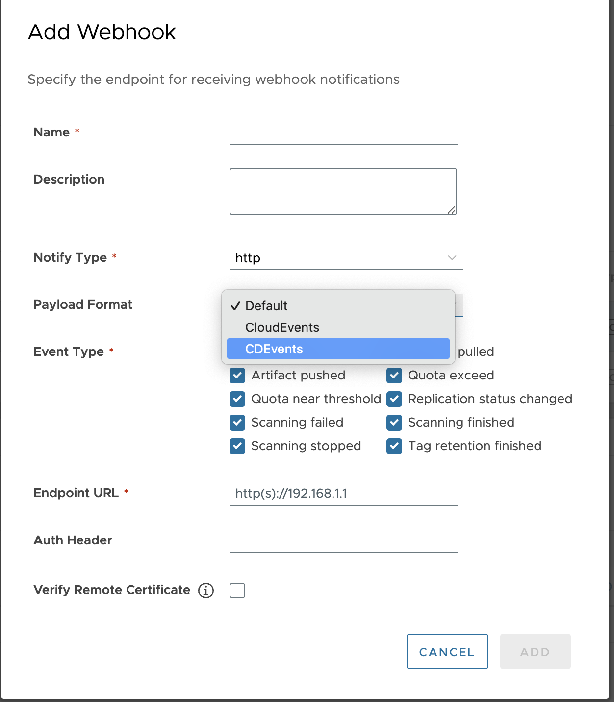
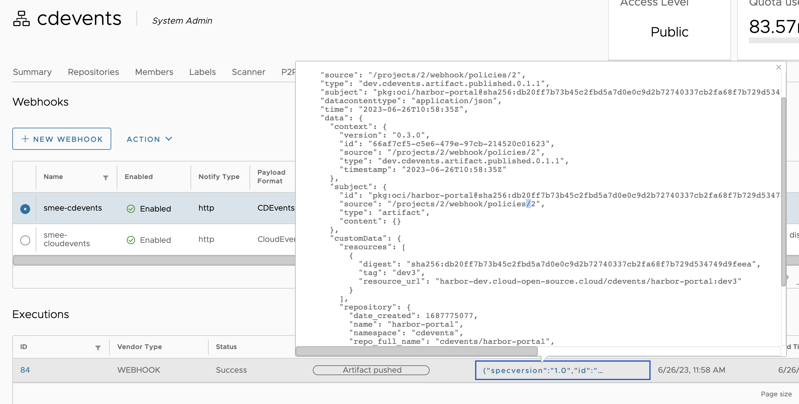

# Proposal: CDEvents Support

Authors:
- Andrea Frittoli (afrittoli), IBM

Discussion: [github.com/goharbor/community/issues/225][cdevents-discussion]

## Overview
- [Proposal: CDEvents Support](#proposal-cdevents-support)

## Abstract
The Harbor open source registry recently [announced][harbor-28] support for [CloudEvents][cloudevents] based webhooks. CloudEvents enrich Harbor with a tool agnostic event payload format, which is a great addition to the project in the direction of interoperability.
To further increase interoperability, we propose the adoption of [CDEvents][cdevents]. CDEvents is an open source project, incubated at the [Continuous Delivery Foundation (CDF)][cdfoundation], that aims to standardize the content of events in the continuous delivery space, thus introducing interoperability across different tools.

## Background

The CDF recently announced the [adoption of CDEvents][cdevents] by several open source tools, like Jenkins, Tekton, Spinnaker and Testkube. Since then, the implementation of CDEvents in those tools continues to progress and more open source communities expressed interest, like Harbor, ArgoCD, Tracetest and more. CDEvents is supported by several companies like Fidelity, Apple, Ericsson, IBM, SAS and others. The project is setting up collaborations with other groups, like the CNCF TAG App Delivery and the Value Stream Management Interoperability group at Oasis.

## Goals

- Harbor emits CDEvents payload as an alternative to the existing notification formats
- Update the Harbor portal component to allow for configuration of CDEvents notification format
- Align, if possible, to any existing compatibility policy for notification format, or document any relevant exception

## Non-Goals

- Replace existing notification formats
- Harbor consumes CDEvents. This may be addressed as a separate proposal is relevant.
- Harbor supports CloudEvents bindings other than webhook. This may be a separate conversation about whether it makes sense for Harbor to produce events for other transport types. While CDEvents are typically transported over the CloudEvents HTTP binding, the webhook binding allows for similar interoperability benefits
- No changes are expected for the helm and operators components
- The terraform provider may be updated after this proposal is implemented

## Use Cases

A non-exhaustive list of use cases:

- Audit trail: Harbor is used to store artifacts as part of software development lifecycle (SDLC) workflows. The CDEvents produced by Harbor are stored along with those produced by the SCM tools used to manage the source code, the build and test tools used to build it and the deployment tools used to deploy the artifacts. All these events can be used to build an audit trail for artifacts stored in Harbor.

- GitOps: tools like Argo CD and Flux can poll image registries and detect a new version or tag for an image associated with a deployment they manage. They react by pushing a PR to the SCM repository which in turn triggers a deployment of the new image version. Both tools could react to an event rather than polling. If such event was in CDEvents format they can implement support for one event type rather than integrating with every possible registry. Argo CD has an RFC open to implement support of CDEvents. The CDEvent community reached out to Flux as well to discuss CDEvents support. 

## Proposal

### Supported Events

Harbor events support today are documented in the [webhook notification documentation][harbor-webhook].
CDEvents todays supports an equivalent of `PUSH_ARTIFACT` event. More events could be added to the CDEvents specification to match what Harbor does. 

| Harbor Event | CDEvents Event | Notes |
|---|---|---|
| `PUSH_ARTIFACT` | [`artifact.published`][cdevent-artifact-published] |   |
| `PULL_ARTIFACT` | `artifact.pulled` | Not defined in CDEvents, to be added |
| `DELETE_ARTIFACT` | `artifact.deleted` | Not defined in CDEvents, to be added |
| `SCANNING_COMPLETED` | tbd | We could consider using testing events, or define a new event |
| `SCANNING_STOPPED` | tbd | Does this mean that the scanning was interrupted by a user? |
| `SCANNING_FAILED` | tbd | We could consider using testing events, or define a new event |
| `QUOTA_EXCEED` | tbd | Not sure there is an interop use case for this? |
| `QUOTA_WARNING` | tbd | Not sure there is an interop use case for this? |
| `REPLICATION` | tbd | Not sure there is an interop use case for this? |
| `TAG_RETENTION` | tbd | Not sure there is an interop use case for this? |

#### PUSH_ARTIFACT

The CloudEvent notification, from the [documentation][harbor-webhook] looks like:

```json
{
  "specversion": "1.0",
  // id is a generated UUID to make sure the unique
  "id": "66e18103-09c1-41f6-982f-37df223f3eeb",
  // requestid is the http request id for tracing the source request of this event
  "requestid": "51c0b694-0168-4f3c-b0db-282565455d7b",
  "source": "/projects/2/webhook/policies/15",
  "type": "harbor.artifact.pushed",
  "datacontenttype": "application/json",
  "time": "2023-04-03T06:04:46Z",
  "data": {
    "resources": [
      {
        "digest": "sha256:954b378c375d852eb3c63ab88978f640b4348b01c1b3456a024a81536dafbbf4",
        "tag": "sha256:954b378c375d852eb3c63ab88978f640b4348b01c1b3456a024a81536dafbbf4",
        "resource_url": "localhost/harbor/alpine@sha256:954b378c375d852eb3c63ab88978f640b4348b01c1b3456a024a81536dafbbf4"
      }
    ],
    "repository": {
      "date_created": 1680501893,
      "name": "alpine",
      "namespace": "harbor",
      "repo_full_name": "harbor/alpine",
      "repo_type": "private"
    }
  },
  "operator": "harbor-jobservice"
}
```

This is a CloudEvent in [structured][ce-structured], i.e. the event metadata and data are kept together in the payload in [JSON format][ce-json-format]. The `requestid` and `operator` fields are not part of the CloudEvents specification, and are thus Harbor own extensions.

The [CDEvent CloudEvents binding][cde-ce-binding] describes how CDEvents field map to CloudEvents metadata, which results in the following event payload:

```json
{
  "specversion": "1.0",
  // id is a generated UUID to make sure the unique
  "id": "66e18103-09c1-41f6-982f-37df223f3eeb",
  // requestid is the http request id for tracing the source request of this event
  "requestid": "51c0b694-0168-4f3c-b0db-282565455d7b",
  "source": "/projects/2/webhook/policies/15",
  "type": "dev.cdevents.artifact.published.0.1.1",
  "datacontenttype": "application/json",
  "time": "2023-04-03T06:04:46Z",
  "data": {
	"context": {
		"version": "0.3.0",
		"id": "66e18103-09c1-41f6-982f-37df223f3eeb",
		"source": "/projects/2/webhook/policies/15",
		"type": "dev.cdevents.artifact.published.0.1.1",
		"timestamp": "2023-04-03T06:04:46Z"
	},
	"subject": {
		// id is in pURL format
		"id": "pkg:localhost/harbor/alpine@sha256:954b378c375d852eb3c63ab88978f640b4348b01c1b3456a024a81536dafbbf4",
		"source": "/projects/2/webhook/policies/15",
		"type": "artifact",
		"content": {}
	}
    "customData": {
		"repository": {
			"date_created": 1680501893,
			"name": "alpine",
			"namespace": "harbor",
			"repo_full_name": "harbor/alpine",
			"repo_type": "private"
		}
	}
  },
  "operator": "harbor-jobservice"
}
```

The `repository` section does not have an equivalent today in the CDEvents data model. We could discuss on CDEvents side weather to include that. In the meanwhile, the `repository` data may be included in the `customData` section.

CDEvents users [`pURL`][purl] to describe artifact IDs. The `pURL` format can be used to describe the tag, sha and location in one string. It is still possible to include them as separate strings as part of the `customData`.

The `resources` field in the Harbor CloudEvent is represented as an array. If this means that a single event can be used to represent the push of multiple resources, this means that in CDEvents this would be mapped to a series of events.

### Implementation Design

A new notifier format will be added for CDEvents.
This class will produce a CDEvent using the CDEvents go-sdk, and it will bin then rendered as a CloudEvent.
Harbor specific CloudEvents extensions will be set in the same way they are set by the CloudEvents formatter.

The resulting JSON payload will look as follows:

```json
{
   "specversion":"1.0",
   "requestid": "2eedfab8-61d3-4f3c-8ec3-8f82d1ec4c84",
   "id":"4b2f89a6-548d-4c12-9993-a1f5790b97d2",
   "source":"/projects/1/webhook/policies/3",
   "type":"harbor.artifact.pushed",
   "datacontenttype":"application/json",
   "time":"2023-03-06T06:08:43Z",
   "data":{
		"context": {
			"version": "0.3.0",
			"id": "2d47734c-83e2-41dc-bcbf-23bd2a3734a2",
			"source": "/projects/1/webhook/policies/3",
			"type": "dev.cdevents.artifact.published.0.1.1",
			"timestamp": "2023-03-06T00:08:43-06:00"
		},
		"subject": {
			"id": "pkg:oci/busybox@sha256:dde8e930c7b6a490f728e66292bc9bce42efc9bbb5278bae40e4f30f6e00fe8c?repository_url=harbor.dev%2Flibrary%2Fbusybox:v1.0@sha256:dde8e930c7b6a490f728e66292bc9bce42efc9bbb5278bae40e4f30f6e00fe8c&tag=v1.0",
			"source": "/projects/1/webhook/policies/3",
			"type": "artifact",
			"content": {}
		},
		"customData": {
			"resources": [
			{
				"digest": "sha256:dde8e930c7b6a490f728e66292bc9bce42efc9bbb5278bae40e4f30f6e00fe8c",
				"tag": "v1.0",
				"resource_url": "harbor.dev/library/busybox:v1.0@sha256:dde8e930c7b6a490f728e66292bc9bce42efc9bbb5278bae40e4f30f6e00fe8c"
			}
			],
			"repository": {
			"date_created": 1677053165,
			"name": "busybox",
			"namespace": "library",
			"repo_full_name": "library/busybox",
			"repo_type": "public"
			}
		},
		"customDataContentType": "application/json"
   },
   "operator":"robot$library+scanner-Trivy-51fe4548-bbe5-11ed-9217-0242ac14000d"
}
```

Initially only the Harbor `PUSH_ARTIFACT` event will be supported.
Other events, if selected, will generate an error in the logs, and no notification will be sent.

### User Interface

Configuration:


View CDEvents notifications:


#### Configuration

An additional CDEvents format will be added to the list of available format, see ["User Interface"](#user-interface) for and example.

#### Compatibility Policy

CDEvents follows [semantic versioning][semver], and its versioning strategy is further described in the [CDEvents primer][cdevents-versions]. The current version of the specification is v0.3. Event though the CDEvents projects strives to avoid backward-incompatible  changes, events in version v0.4 of the spec may include backward-incompatible  changes compared to v0.3.

A new version of Harbor may include a new version of CDEvents which implies that CDEvents based notification may include backward-incompatible changes. This needs to be clarified in the Harbor compatibility policy.

#### Evolution

Future versions of Harbor will continue to include newer versions of CDEvents.
CDEvents SDK should be updated to benefit from security patches (if any).

## Implementation

The proposed implementation plan will be as follows:
- Implement experimental support with CDEvents v0.3
	- `PUSH_ARTIFACT` support only
	- Other events are not sent when selected
	- List of Harbor PRs:
    - [Core and UI changes](https://github.com/goharbor/harbor/pull/18853)
    - Documentation: TBD
- Implement new events and spec changes required in CDEvents v0.4 (planned for 31.08)
	- \[List of CDEvents PRs\]
- Implement full CDEvents support
	- Full test and docs coverage
	- \[List of Harbor PRs\]

## Known Issue

[harbor-28]: https://goharbor.io/blog/harbor-2.8/
[cdevents]: https://cdevents.dev
[cdfoundation]: https://cd.foundation
[cloudevents]: https://cloudevents.io/
[adoption of CDEvents]: https://cd.foundation/blog/2023/05/08/cdevents-real-world-adoption/
[harbor-webhook]: https://goharbor.io/docs/main/working-with-projects/project-configuration/configure-webhooks/
[cdevent-artifact-published]: https://github.com/cdevents/spec/blob/v0.3.0/continuous-integration.md#artifact-published
[ce-structured]:https://github.com/cloudevents/spec/blob/main/cloudevents/bindings/http-protocol-binding.md#32-structured-content-mode
[ce-json-format]: https://github.com/cloudevents/spec/blob/main/cloudevents/formats/json-format.md
[cde-ce-binding]: https://github.com/cdevents/spec/blob/v0.3.0/cloudevents-binding.md
[purl]: https://github.com/package-url/purl-spec
[semver]: https://semver.org/
[cdevents-versions]: https://cdevents.dev/docs/primer/#versioning
[cdevents-discussion]: https://github.com/goharbor/community/issues/225