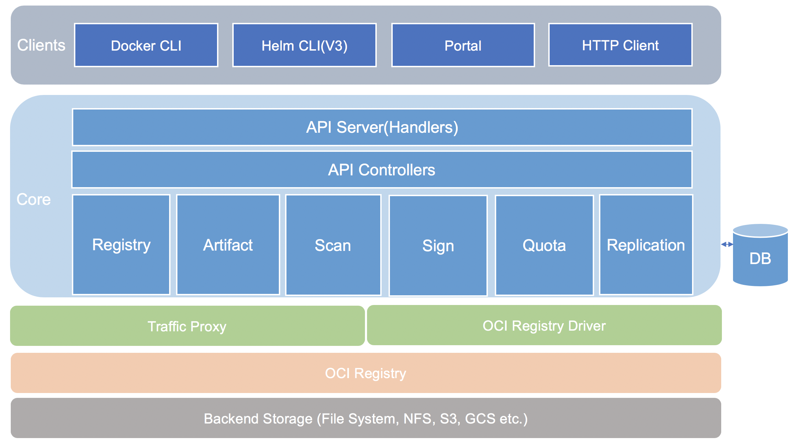
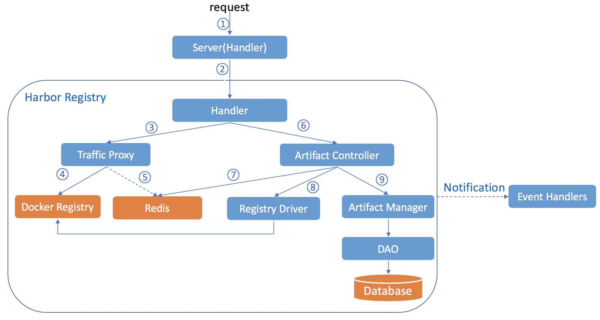
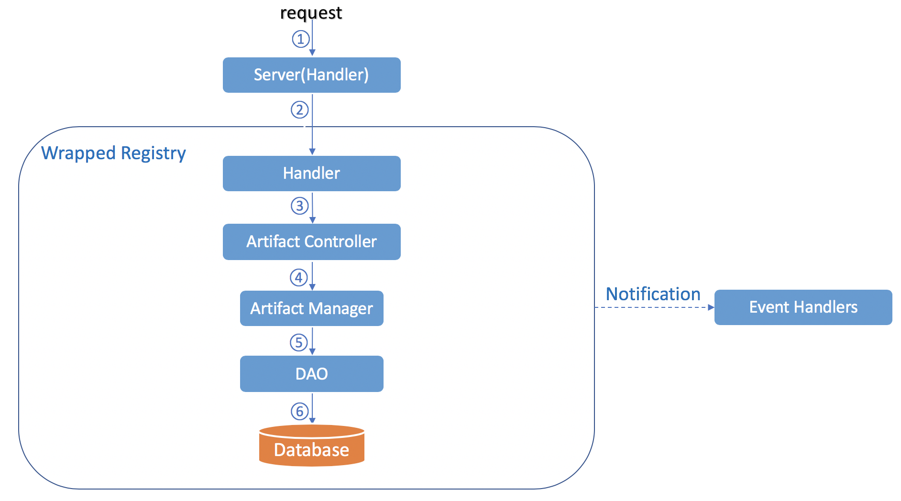
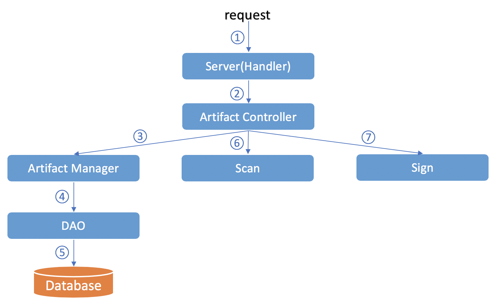
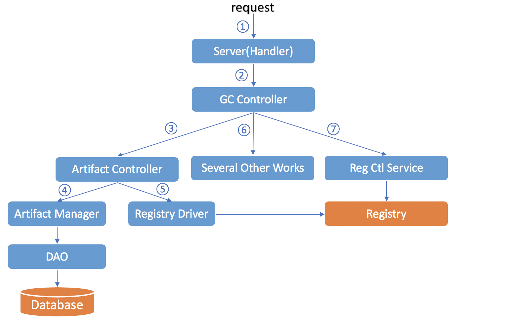

# Proposal: Cloud Native Registry Support

Authors: 
* WenkaiYin
* Alex Xu
* Steven Ren
* Daniel Jiang
* Steven Zou
* Ziming Zhang

## Overview
- [Proposal: Cloud Native Registry Support](#proposal-cloud-native-registry-support)
	- [Overview](#overview)
	- [Abstract](#abstract)
	- [Background](#background)
	- [Goals](#goals)
	- [Non-Goals](#non-goals)
	- [Proposal](#proposal)
		- [Overall Architecture](#overall-architecture)
		- [API](#api)
			- [Pattern](#pattern)
			- [Error](#error)
			- [Evolution](#evolution)
			- [Adapter](#adapter)
		- [Take Database Data As Final](#take-database-data-as-final)
		- [Work Flow](#work-flow)
			- [Pushing Manifest(Registry API)](#pushing-manifestregistry-api)
			- [Delete Manifest(Registry API)](#delete-manifestregistry-api)
			- [Get Artifact(Harbor API)](#get-artifactharbor-api)
			- [Garbage Collection(Harbor API)](#garbage-collectionharbor-api)
		- [Model Definition](#model-definition)
			- [Business Logic Level Model](#business-logic-level-model)
			- [Data Level model](#data-level-model)
		- [Artifact Controller](#artifact-controller)
		- [Artifact Manager](#artifact-manager)
		- [OCI Registry Driver](#oci-registry-driver)
		- [Helm chart repository supporting](#helm-chart-repository-supporting)
	- [Implementation](#implementation)
	- [Known Issue](#known-issue)

## Abstract
Proposal is for Harbor to extend support for new cloud-native artifact types such as Helm and CNAB and OPAs and others through following a common set of industry favored APIs (such as OCI standard). All OCI-compliant artifacts should subsequently be able to be onboarded to Harbor if desired. This means that Harbor will host new artifact types and correctly support all corresponding actions of all various artifacts based on `artifact type` such as when they need to be pushed, discovered through catalog & search APIs, scanned, pulled, replicated, webhooks being fired as a results etc. This is largely an engineering refactor/remodularization effort that allows Harbor to stay ahead and quickly absorb new cloud-native artifact types as they gain traction in the market. Support for these artifacts can be just as easily removed from Harbor as it is added. 

## Background
Registries started out as a content store for just docker images but are quickly evolving to support other file formats as new cloud native artifacts thrive. Besides being able to support files of varying sizes and formats, registries should have a secure, layered, cross-referenceable file system that can easily expand to support new cloud native artifacts. 

## Goals
* Make Harbor compatible with OCI registry
* Be able to onboard any other OCI artifact if desired
* Support the popular registry client:
  * Docker
  * The container runtimes used by Kubernetes to pull images: https://kubernetes.io/docs/setup/production-environment/container-runtimes/
* The tag can be deleted separately without deleting all other sharing-digest tags
* Replication/quota/tag retention/scan/immutable tag/etc can work as expected after introducing the new artifacts
* Make sure performance and scale doesn't have any regression from v1.10 release

## Non-Goals
* Develop new client for upload/download artifacts (this is on artifact authors).
* Introduce a new standard to store artifacts.  We are going with OCI specification based on current momentum and are not in the business of building standards but active participate in discussions
* Introduce new format for packaging / bundling artifacts (such as operator).  
* Serving artifacts that cannot be stored in OCI registry or other general content (e.g. rpm, maven, npm files), with potential to expand to additional file types if needed
* Client tooling that interfaces with Harbor (for push pull etc)

## Proposal
An artifact managed by Harbor can contain multiple tags which references the same digest manifest. Some APIs and operations get updated based on this.  

For clarification, the following items are all artifacts, `goharbor` is the project/namespace part, `harbor/core` is the repository part, `sha256:426dxxx...`is the digest and the `1`, `1.0`, `1.0.0`, `latest`, `2.0` are the tags:
* `goharbor/harbor/core@sha256:426dxxx...`
* `goharbor/harbor/core:[1, 1.0, 1.0.0, latest, ...]`(the digest for all tags are same) 
* `goharbor/harbor/core:2.0`(the digest is different with `goharbor/harbor/core:1`)

The `goharbor/harbor/core@sha256:426dxxx...` has no tags, it's `untagged` artifact; the `goharbor/harbor/core:[1, 1.0, 1.0.0, latest, ...]` and `goharbor/harbor/core:2.0` have one or more tags, they are `tagged` artifacts.  

### Overall Architecture



### API

#### Pattern

| Function | v1(Current) | v2 | Request | Response| Comment |
| -------- | ------------| -- | ------- | ------- | ------- |
| List artifacts | GET /api/repositories/{repository_name}/tags | GET /api/v2/projects/{project_id}/repositories/{repository_id}/artifacts | Query string:  label=true/false(default): return label or not  signature=true/false(default): return signature or not  vulnerability=true/false(default): return vulnerability or not  type=image/chart  tag=xxx  label_id=1  page=1  size=10 | Artifact list |  |
| Get an artifact | GET /api/repositories/{repository_name}/tags/{tag} | GET /api/v2/projects/{project_id}/repositories/{repository_id}/artifacts/{id} | Query string:  label=true/false(default)  signature=true/false(default)  vulnerability=true/false(default) | Artifact |  |
| Delete an artifact | DELETE /api/repositories/{repository_name}/tags{tag} | DELETE /api/v2/projects/{project_id}/repositories/{repository_id}/artifacts/{id} |  |  |  |
| Delete a tag | None | DELETE /api/v2/projects/{project_id}/repositories/{repository_id}/artifacts/{id}/{tag} |  |  | This API provides the capability that deleting one tag will not delete other tags even though the digests of them are same |
| Retag/Copy from | POST /api/repositories/{repository_name}/tags | POST /api/v2/projects/{project_id}/repositories/{repository_id}/artifacts | Query string: from=source_artifact_id  Request Body:  { "tags": ["1.0", "latest"]} |  | When the query string`from` presents, this endpoint is used to copy, else it is used to upload(not support currently). Only works for image. The chart name and version is recorded in "Chart.yaml" |
| Get labels of an artifact | GET /api/repositories/{repository_name}/tags/{tag}/labels | GET /api/v2/projects/{project_id}/repositories/{repository_id}/artifacts/{id}/labels |  |  |  |
| Add label to an artifact | POST /api/repositories/{repository_name}/tags/{tag}/labels | POST /api/v2/projects/{project_id}/repositories/{repository_id}/artifacts/{id}/labels | Request Body:  {  "label_id": 1  } |  | The labels can only be added to the top level artifacts |
| Delete label from an artifact | DELETE GET /api/repositories/{repository_name}/tags/{tag}/labels/{labels_id} | DELETE /api/v2/projects/{project_id}/repositories/{repository_id}/artifacts/{id}/labels/{label_id} |  |  |  |
| Scan an artifact | POST /api/repositories/{repository_name}/tags/{tag}/scan | POST /api/v2/projects/{project_id}/repositories/{repository_id}/artifacts/{id}/scan |  |  |  |
| Get vulnerabilities of an artifact | GET /api/repositories/{repository_name}/tags/{tag}/vulnerability/details | GET /api/v2/projects/{project_id}/repositories/{repository_id}/artifacts/{id}/vulnerabilities |  |  |  |
| Get addition properties for different artifact type(image: build history, chart: values, readme, dependencies) | None | GET /api/v2/projects/{project_id}/repositories/{repository_id}/artifacts/{id}/additions/{build_history, values, readme, dependencies} |  |  | Index has no build history |
| Get all signatures of a repository | GET /api/repositories/{repository_name}/signatures | REMOVE |  |  |  |
| Get top repositories | GET /api/repositories/top | REMOVE |  |  |  |
| Get manifest | GET /api/repositories/{repository_name}/tags/{tag}/manifest | REMOVE |  |  |  |

#### Error
The API error consists of two parts:
* HTTP Response Code
* Error Payload 
    * code: The const error code
    * message: The summary error message
    * detail: The error detail to describe the detail information about the error
```
HTTP/1.1 400 Bad Request
{
    "code": "INVALID_INPUT",
    "message": "The input is invalid",
    "detail": "The name of project must contains 2 characters at least, and ..."
}
```
For one kind of error we should use one same error code, message and different detail.  
Such as for HTTP 400 error, may contain the following specified error:  
* invalid json
* invalid field
* field missing

For 415:  
* quota exceeded
* content trust policy violated
* vulnerability policy violated

#### Evolution
All APIs will bump up to 2.0 and will break the forward compatibility with the APIs in Harbor 1.x. And we won't maintain the 1.x APIs in Harbor 2.x anymore.  
If any new break change is introduced to any API in 2.x, bump up the minor version of all APIs to the version of Harbor that the change is made in.  
We'll maintain the latest two versions of APIs with the same major version in the future releases. 
The version doesn't change if the change breaks nothing.  
e.g. The API version will be 2.0 when Harbor 2.0 is released. If there is no change during Harbor 2.1, the version of API will still be 2.0. When a break change is introduced to artifact API in Harbor 2.2, all APIs will bump up to version 2.2. So in Harbor 2.2, there will be two version of API: 2.0 and 2.2, and the API 2.0 will be marked as being deprecated and will be removed once new version of API comes out.  
If we cannot guarantee the support for the latest two versions of API when making the break change, the change should be introduced in a new major version of Harbor and the major version of API will be bumped up as well.  

#### Adapter
We may need the adapters to translate the V1 APIs to use the new data.

### Take Database Data As Final
One big change made in this proposal is that **take database data as final**. That means if there is any inconsistence between database and registry, take database data as final. Such as: 
* When pushing an image, the image is put successfully in the registry but the artifact record isn't inserted into the database, the operation fails
* When deleting an artifact, we can just delete the database record, and the real data in the registry will be cleaned up when running garbage collection  

Based on this, some of the registry APIs need to be re-implemented, some of them need to be intercepted and some of them can be proxied to the backend registry directly. All APIs are listed as following and all implementation should follow the OCI registry spec https://github.com/opencontainers/distribution-spec/blob/master/spec.md:

| API | Function | Comment |
| ------------ | ------| ------ |
| **Re-implement** | | |
| GET /v2/_catalog | List repositores | Return the repositories based on database |
| GET /v2/{name}/tags/list | List tags | Return the tags based on database |
| DELETE /v2/{name}/manifests/{reference} | Delete the manifest | Delete the artifact record in the database direclty |
| **Intercept** | | |
| GET /v2/{name}/manifests/{reference} | Pull the manifest | Check the existence of artifact before proxying |
| HEAD /v2/{name}/manifests/{reference} | Check the existence of the manifest | Check the existence of artifact before proxying |
| **Proxy directly** | | |
| GET /v2/ | API version check | |
| PUT /v2/{name}/manifests/{reference} | Push a manifest | |
| GET /v2/{name}/blobs/{digest} | Pull the layer | |
| HEAD /v2/{name}/blobs/{digest} | Check the existence of the layer | |
| POST /v2/{name}/blobs/uploads/ | Start an upload or cross repository blob mount| |
| GET /v2/{name}/blobs/uploads/{uuid} | Get upload status | |
| PUT /v2/{name}/blobs/uploads/{uuid} | Monolithic upload or complete the chunked upload| |
| PATCH /v2/{name}/blobs/uploads/{uuid} | Chunked upload | |
| DELETE /v2/{name}/blobs/uploads/{uuid} | Cancel the upload | |
| DELETE /v2/{name}/blobs/{digest} | Delete a layer | |

The way of authentication/authorization for registry clients needs to be updated either, both of them are done in the `core`, we'll support the basic auth first, and the `bearer token` is the stretch goal.  

The auth between `core` and `registry` will use a simple method(basic auth).  

### Work Flow
This section describes several work flows covering the typical scenarios.  
#### Pushing Manifest(Registry API)



Step 1: the `Server` receives the request  
Step 2: `Harbor Registry` handles the request  
The detail steps inside the `Harbor Registry`:  
Step 3, 4: store the manifest in `Docker Registry` via `Traffic Proxy`  
In the meanwhile, step 5 caches the manifest in the `Redis`(the config layer is also cached when handling pushing blob request)  
Then the `Artifact Controller` creates the metadata of artifacts in the database:  
Step 6, 7: `Artifact Controller` tries to read the necessary data(manifest and config layer) from `Redis` first. If got nothing, step 8 `Artifact Controller` reads them from `Docker Registry` via `Registry Driver`  
Step 9: `Artifact Controller` stores the metadata into the database via `Artifact Manager`  

Here is the more explanation: most of the metadata of the artifact will be from the uploaded content. And then we need to extract the related info from the uploaded content when pushing/uploading is done. By design, the content uploading will go through the `Traffic Proxy` and some of the content will be cached. When the process is successfully done, the controller will get the manifest and config.json content bytes in the cache or via the driver and process the zipped bytes to extract the necessary information. If the data is ready, then an artifact object can be created if it is new (identified by digest) or the existing artifact is retrieved from the manager. The related properties can be updated and then save back to the database by the manager.  

After all these done, an event will be fired to the interested parties to do the follow-up actions.  

#### Delete Manifest(Registry API)



Step 1: the `Server` receives the request  
Step 2: `Wrapped Registry` handles the request  
The detail steps inside the `Wrapped Registry`:  
Step 3, 4, 5, 6: `Artifact Controller` deletes the artifact metadata in database via `Artifact Manager`  

#### Get Artifact(Harbor API)



Step 1: the `Server` receives the request  
Step 2: the `Artifact Controller` assembles the artifact information from different modules: metadata from `Artifact Manager`(step 3,4,5), scanning summary/detail from `Scan` module, sign information from `Sign` module. The scanning and sign information are optional according to the request   

#### Garbage Collection(Harbor API)
Three action items need to be done:
* Clean up the useless artifact records in database. An useless artifact is the artifact referenced by no tags or other artifacts(index). It appears when pushing a same name but different digest artifact
* Remove the artifacts that exist in docker registry but not exist in database from docker registry. This can be done by comparing the data in database and registry and calling deleting manifest API to remove the extra data. This kind of artifacts appear:
  * when calling Harbor API to delete tag
  * when pushing artifact, the manifest is stored in registry, but the artifact record failed to be inserted into the database
* Run GC to clean up the useless blobs in docker registry



Step 1: the `Server` receives the request  
Step 2: call `GC Controller` to do the real work  
Step 3, 4: clean up the useless artifacts in database 
Step 5: remove the artifacts that exist in docker registry but not exist in database from docker registry  
Step 6: several other works during the GC  
Step 7: clean up the useless blobs in registry  

### Model Definition
#### Business Logic Level Model
```go
type Artifact struct {
	ID            int64                      `json:"id"`
	Type          string                     `json:"type"` // image, chart, etc
	Repository    *Repository                `json:"repository"`
	Tags          []*Tag                     `json:"tags"`       // the list of tags that attached to the artifact
	MediaType     string                     `json:"media_type"` // the specific media type
	Digest        string                     `json:"digest"`
	Size          int64                      `json:"size"`
	UploadTime    time.Time                  `json:"upload_time"`
	Labels        []*Label                   `json:"labels"`
	Signature     *Signature                 `json:"signature"`      // add the signature in the artifact level rather than tag level as we cannot make sure the signature always apply to tag
	ExtraAttrs    map[string]interface{}     `json:"extra_attrs"`    // only contains the simple attributes specific for the different artifact type, most of them should come from the config layer
	AdditionLinks map[string][]*AdditionLink `json:"addition_links"` // the resource link for build history(image), scan result(image), values.yaml(chart), dependency(chart), etc
	Annotations   map[string]string          `json:"annotations"`
	References    []*Reference               `json:"references"` // artifacts referenced by the artifact if the artifact is an index
}

type AdditionLink struct {
	HREF string `json:"href"`
}

type Reference struct {
	ArtifactID int64        `json:"artifact_id"`
	Platform   *v1.Platform `json:"platform"`
}

// Tag belongs to one repository and can only be attached to a single one artifact under the repository
type Tag struct {
	ID                 int64     `json:"id"`
	Name               string    `json:"name"`
	UploadTime         time.Time `json:"upload_time"`
	LatestDownloadTime time.Time `json:"latest_download_time"`
}
```

ExtraAttrs for the specific type artifact:
* Image
    * architecture
    * os
    * os version
    * docker version
    * creation time
    * authors
    * ...
* Chart
    * version
    * app version
    * keywords
    * description
    * maintainers
    * ...

Additions for the specific type artifact:
* Image
    * build history
    * vulnerability
* Chart
    * values.yaml
    * dependencies
    * readme

#### Data Level model
```golang
type Artifact struct {
	ID           int64     `orm:"pk;auto;column(id)"`
	Type         string    `orm:"column(type)"` // image or chart
	RepositoryID int64     `orm:"column(repository_id)"`
	MediaType    string    `orm:"column(media_type)"` // the specific media type
	Digest       string    `orm:"column(digest)"`
	Size         int64     `orm:"column(size)"`
	UploadTime   time.Time `orm:"column(upload_time)"`
	ExtraAttrs   string    `orm:"column(extra_attrs)"` // json string
	Annotations  string    `orm:"column(annotations)"` // json string
}

type Tag struct {
	ID                 int64     `orm:"pk;auto;column(id)"`
	RepositoryID       int64     `orm:"column(repository_id)"` // tags are the resources of repository, one repository only contains one same name tag
	ArtifactID         int64     `orm:"column(artifact_id)"`   // the artifact ID that the tag attaches to, it changes when pushing a same name but different digest artifact
	Name               string    `orm:"column(name)"`
	UploadTime         time.Time `orm:"column(upload_time)"`
	LatestDownloadTime time.Time `orm:"column(latest_download_time)"`
}

type Reference struct {
	ID          int64  `orm:"pk;auto;column(id)"`
	ArtifactID  int64  `orm:"column(artifact_id)"`
	ReferenceID int64  `orm:"column(reference_id)"`
	Platform    string `orm:"column(platform)"` // json string
}
```

### Artifact Controller
Interface definitions for the artifact controller:
```golang
type Controller interface {
	// List artifacts according to the query
	List(query *model.Query, option *model.Option) ([]*model.Artifact, error)
	// Get the artifact specified by the ID
	Get(id int64, option *model.Option) (*model.Artifact, error)
	// Create the artifact specified by the digest under the repository,
	// returns the artifact ID and error. If tags are provided, attach them
	// to the artifact.
	Create(repository *model.Repository, digest string, uploader *model.User, tags ...string) (int64, error)
	// Attach the tags to the artifact. If the tag doesn't exist, will create it.
	// If the tag is already attached to another artifact, will detach it first
	Attach(artifact *model.Artifact, uploader *model.User, tags ...string) error
	// As the deletion operation can be perfromed via registry API directly,
	// here we just delete the artifact from database, not from registry
	Delete(id int64) error
	// GetAddition returns the addition content of the artifact
	// The addition is different according to the artifact type: build history for
	// image; values.yaml, readme and dependencies for chart
	GetAddition(id int64, addition string) ([]byte, error)
	// Prune removes the useless artifact records in database. An useless artifact
	// is the artifact referenced by no tags or other artifacts(index)
	Prune() error
}

type Query struct {
	RepositoryID int64
	Digest       string
	Tag          string
	Type         string // index, image or chart
	Label        string
	Page         int64
	PageSize     int64
}

type Option struct {
	Repository    bool // whether returns the detail information of the repository that the artifact belongs to
	Vulnerability bool // whether returns the vulnerability information
	Signature     bool
	Label         bool
	Additions     bool // this isn't exposed in REST API
}
```

### Artifact Manager
Artifact Manager is designed to maintain the metadata of all the cloud-native artifacts no matter what original types they're before as a unique core component. All the cloud-native artifacts will be abstracted to unified logical objects in the harbor side and managed by this manager.  

Interface definitions for the artifact manager:
```golang
type Manager interface {
	List(*model.Query) ([]*model.Artifact, error)
	Get(int64) (*model.Artifact, error)
	// create artifact, tags, references and attach tags
	Create(*model.Artifact) (int64, error)
	Delete(int64) error
	// attach the tag to the artifact
	Attach(*model.Artifact, *model.Tag) error
	Prune() error
}
```

As we know, most of the artifact info is extracted from the artifact content. To make the extracting process more flexible, the following resolver interfaces will be defined.  

The main ideas are: The content can be treated as multiple data fragments, and for a specified fragment, a resolver implementation can be provided to do the extract work and fill the data into the artifact reference.  

A high-level data extractor will also be developed to call all the registered resolvers to complete the extracting work.  

```golang
// Content Extractor
package artifact
 
type Extractor interface {
  // Process the content and extarct all the required info and fill into the artifact
  Process(content []byte, artifact *Artifact) error
}
 
// a default implementation of Extractor interface
type basicExtractor struct {}
 
// Process the content
func (be *basicExtractor) Process(content []byte, artifact *Artifact) error {
  resolvers := resolver.List()
  for _, rf := range resolvers {
     r := rf(content)
     if err := r.Resolve(artifact); err != nil {
       return err
     }
  }
}

// Addition Resolver Interface
package artifact
 
// ResolverFactory is factory of the resolver
type ResolverFactory func(content []byte) Resolver
 
// Resolver resolves the specified data fragment to the artifact
type Resolver interface {
  // Write data to the artifact
  Resolve(artifact *Artifact) error
}

// Resolver Registry
package resolver
 
var registry *sync.Map
 
// Register resolver
func Register(resolver ResolverFactory) error {}
 
// List all the resolvers
func List() []ResolverFactory {}
```

### OCI Registry Driver
There will be another proposal to cover this part. For the first version of implementation, we can leverage the existing registry client do the work.  

### Helm chart repository supporting
Helm 3 introduces the supporting for pushing chart to OCI registry, but it's considered experimental and isn't enabled by default. For all helm 2 and most of helm 3 users, the chart repository is still needed. So we'll support both OCI registry and chart repository(with `chart museum`) for helm chart in Harbor 2.0. The `chart museum` maybe removed in the right time in future, and maybe we'll provide an external tool for the chart repository users to migrate the data to the OCI registry.

## Implementation
* Refactor UI
* Artifact module(controller/manager/dao/etc)
* Artifact API(leverage swagger)
* Implement the OCI registry API to make sure take database data as final:
  * Change auth method between core and registry to basic auth(this could effect the replication)
  * v2 API handler
  * Apply the existing middleware to the new implementation
  * Support basic auth for registry API
  * Fire notification(Delete the notification configuration from registry)
* Garbage collection
* Provide a package/util to handle common error
* OCI registry driver
* Make sure replication work as expected
* Make sure quota work as expected
* Make sure tag retention work as expected
* Make sure immutable tag work as expected
* Make sure scan work as expected
* Migration/Upgrade
    * Upgrade the existing database tables
    * Populate the detail info for the existing artifacts
* Verify the registry clients
* E2E test case

## Known Issue
* Registry GC issue: https://github.com/docker/distribution/issues/3004
