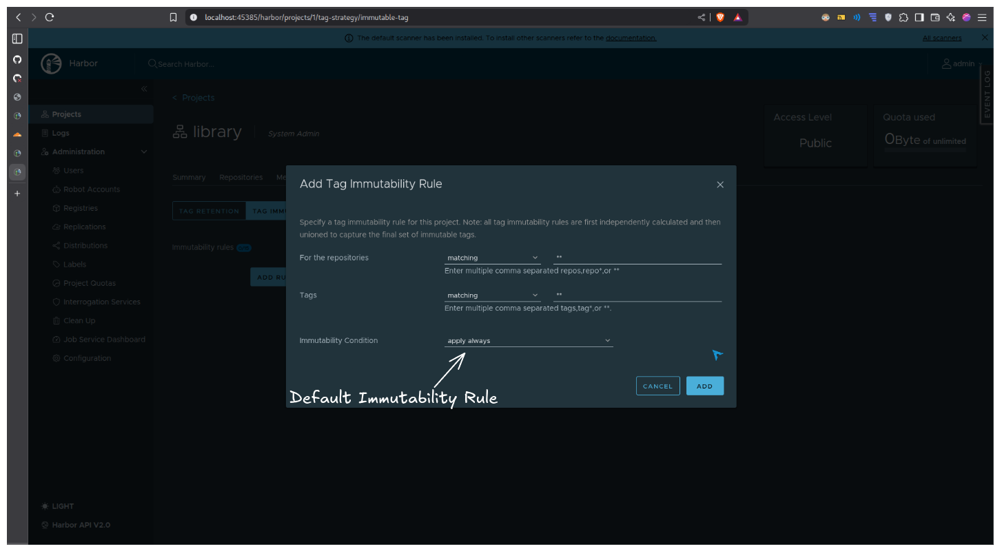
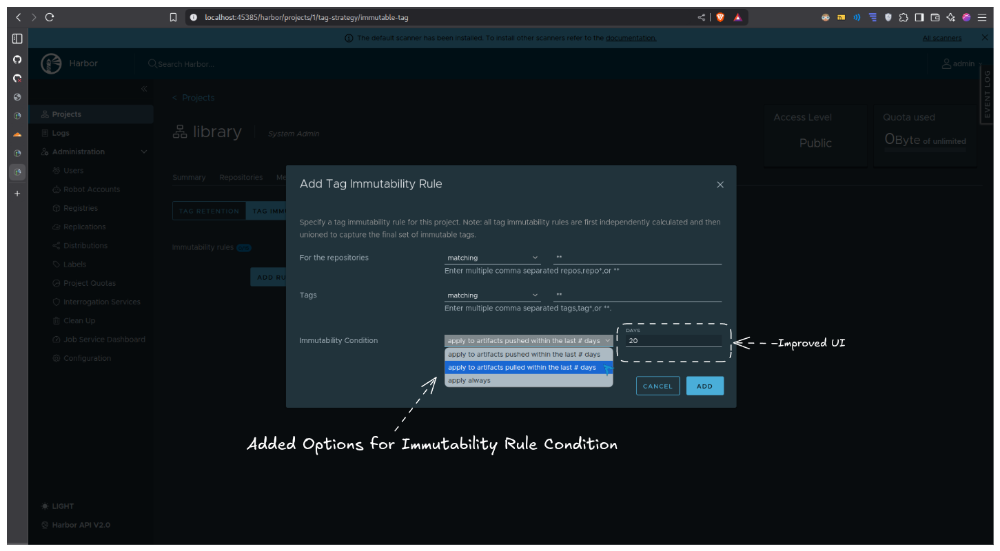
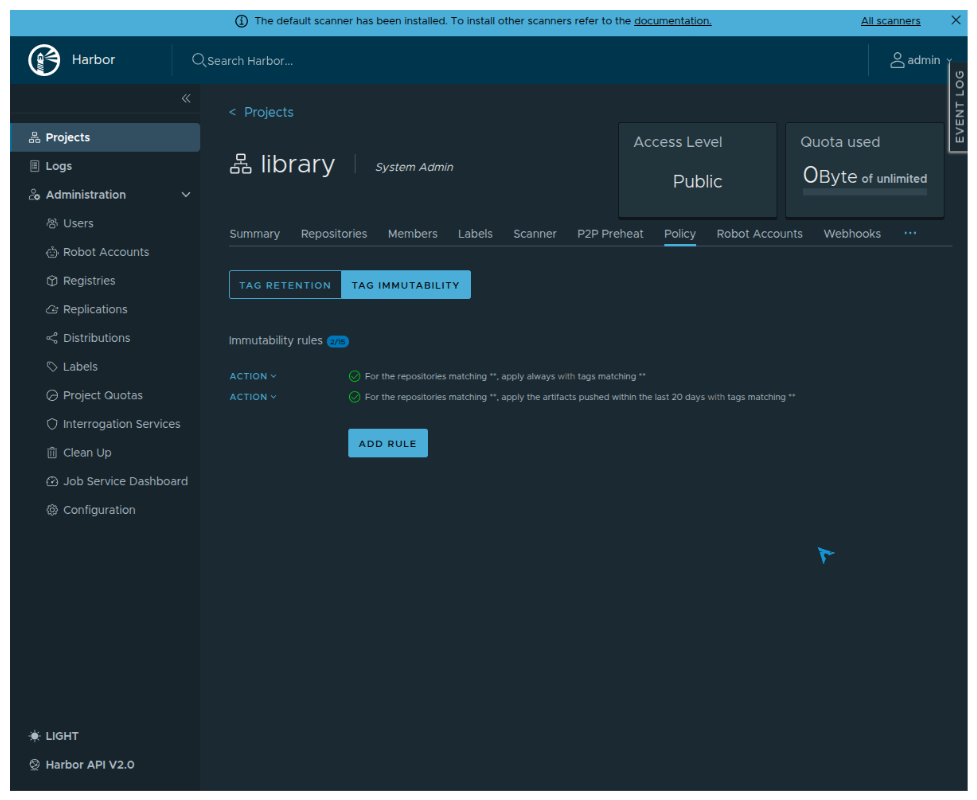
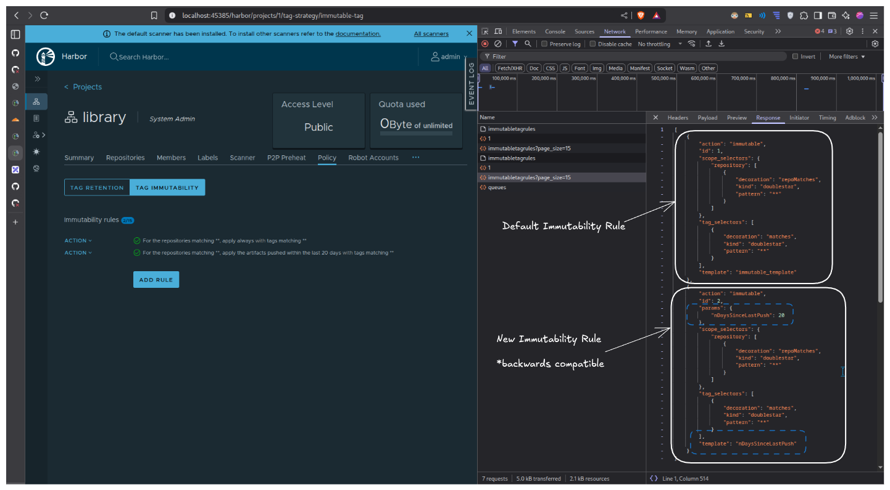

# Proposal: Conditional Immutability Policy

Author: Prasanth Baskar [bupd](https://github.com/bupd)

Discussion: https://github.com/goharbor/harbor/issues/20989

Pull Request: https://github.com/goharbor/harbor/pull/22047

## Abstract

Extend immutability rules with time-based conditions that allow artifacts to transition between mutable and immutable states based on pull/push activity. This enables retention policies to clean up stale artifacts without manual intervention.

## Background

Harbor's immutability feature currently operates as a binary lock: once an artifact matches an immutability rule, it remains immutable indefinitely. This design conflicts with retention policies because immutability blocks all delete operations at the API level.

Users who want both features must follow a manual workaround:

1. Disable immutability rules
2. Run retention policy
3. Re-enable immutability rules

This is error-prone and defeats the purpose of automated lifecycle management.

### Related Issues

- https://github.com/goharbor/harbor/issues/20989
- https://github.com/goharbor/harbor/issues/10506
- https://github.com/goharbor/harbor/issues/22543

## Proposal

Add a `template` and `params` field to immutability rules that define conditions under which an artifact is considered immutable. The implementation reuses the existing retention policy rule evaluators.

### Supported Conditions

| Template | Parameter | Description |
|----------|-----------|-------------|
| `immutable_template` | none | Always immutable (default, backward compatible) |
| `nDaysSinceLastPush` | `nDaysSinceLastPush` (int) | Immutable if pushed within last N days |
| `nDaysSinceLastPull` | `nDaysSinceLastPull` (int) | Immutable if pulled within last N days |

These evaluators are reused from the Tag Retention Policies feature. For full details on retention policies, see [Tag Retention Policies Proposal](./5882-Tag-Retention-Policies.md).

### Condition Calculation

Both time-based conditions use the same calculation logic from the retention policy evaluators:

`nDaysSinceLastPush`:

```
threshold = current_time_utc - (N * 24 hours)
artifact is immutable if: artifact.PushedTime >= threshold
```

`nDaysSinceLastPull`:

```
threshold = current_time_utc - (N * 24 hours)
artifact is immutable if: artifact.PulledTime >= threshold
```

The calculation:

- Uses UTC time for consistency across timezones
- Calculates based on 24-hour periods (not calendar days)
- Compares against the artifact's `PushedTime` or `PulledTime` unix timestamp
- Returns true (immutable) if the artifact activity is within the N-day window

Example: If N=15 and current time is Jan 7 2025 12:00 UTC:

- Threshold = Jan 7 2025 12:00 UTC - 360 hours = Dec 23 2024 12:00 UTC
- Artifact pushed on Dec 25 2024: PushedTime >= threshold, artifact is immutable
- Artifact pushed on Dec 20 2024: PushedTime < threshold, artifact is mutable

### Data Model Changes

The `Metadata` struct in immutable rules gains a `Parameters` field:

```go
type Metadata struct {
    // existing fields...
    Template   string     `json:"template"`
    Parameters Parameters `json:"params"`
}

type Parameters map[string]Parameter
type Parameter interface{}
```

### Evaluation Logic

When checking if an artifact is immutable:

1. If `template` is empty or `immutable_template`, artifact is immutable (backward compatible)
2. Otherwise, retrieve the appropriate evaluator using `policyindex.Get(template, params)`
3. Pass artifact candidates through the evaluator
4. Artifact is immutable only if it passes the condition evaluation

### Example Configurations

Protect recently pulled artifacts:

```json
{
  "template": "nDaysSinceLastPull",
  "params": { "nDaysSinceLastPull": 15 }
}
```

Artifacts pulled within 15 days are immutable. Older artifacts become mutable and eligible for retention cleanup.

Protect recently pushed artifacts:

```json
{
  "template": "nDaysSinceLastPush",
  "params": { "nDaysSinceLastPush": 30 }
}
```

Artifacts pushed within 30 days are immutable.

### User Scenario

A user configures:

- Retention policy: delete tags not pulled in the last 10 days
- Immutability policy: make tags immutable if pulled in the last 15 days

Result:

- Tags pulled within 15 days remain protected
- Tags not pulled for 15+ days become mutable
- Retention policy can delete tags not pulled for 10+ days (after they become mutable at day 15+)

## Non-Goals

- Pull count based conditions (e.g., "immutable if pulled more than X times")
- Explicit APPLY/RELEASE actions in the UI
- Per-artifact immutability toggles
- Custom condition plugins
- Latest K pushed/pulled artifact conditions for immutability (only available for retention) - maybe a future feature

## Rationale

### Reusing Retention Policy Evaluators

The implementation leverages existing retention policy rule evaluators rather than creating new condition logic. This approach:

- Reduces code duplication
- Ensures consistent behavior between retention and immutability conditions
- Makes the feature easier to maintain
- Provides a familiar UI pattern for users already using retention policies

### Alternative Considered: Explicit APPLY/RELEASE Actions

An earlier design proposed separate APPLY and RELEASE actions with independent conditions. This was simplified to a single conditional model because:

- A single condition implicitly defines both states (within window = immutable, outside = mutable)
- Simpler mental model for users
- Fewer edge cases to handle

## Compatibility

### Backward Compatibility

- Existing immutability rules without `template` or with `template: "immutable_template"` behave identically to current behavior
- No database migration required for existing rules
- API remains backward compatible; new fields are optional

### Retention Policy Interaction

When both retention and conditional immutability are configured:

1. Retention policy evaluates artifacts normally
2. Before deletion, the system checks immutability status
3. If artifact is currently immutable (condition evaluates true), deletion is blocked
4. If artifact is mutable (condition evaluates false), deletion proceeds

## Implementation

### Files Modified

Key changes across 40 files:

Core Logic:

- `src/pkg/immutable/match/rule/match.go` - Rule matching with condition evaluation
- `src/pkg/immutable/model/rule.go` - Model with Parameters field
- `src/pkg/retention/policy/action/performer/performer.go` - RetainAction moved to avoid circular dependencies
- `src/server/v2.0/handler/retention.go` - Added immutable templates to metadata

UI Components:

- `src/portal/src/app/base/project/tag-feature-integration/immutable-tag/` - Immutable tag rule configuration
- Multi-language i18n updates (9 files)

### UI Screenshots

Default backward-compatible immutable rule with "apply always" condition:



Updated rule selection dropdown showing new condition options:



Immutability rules page showing both default and conditional rules configured:



JSON schema comparison between default rule and new conditional rule:



### Testing

Unit tests verify:

- Tags pushed/pulled within N days remain immutable
- Tags outside the time window become mutable
- Backward compatibility with existing rules
- Integration with retention policy execution

## Open Issues

None.
