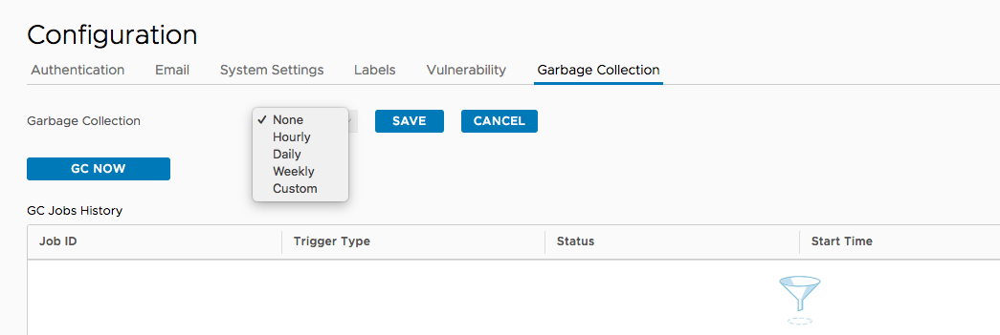
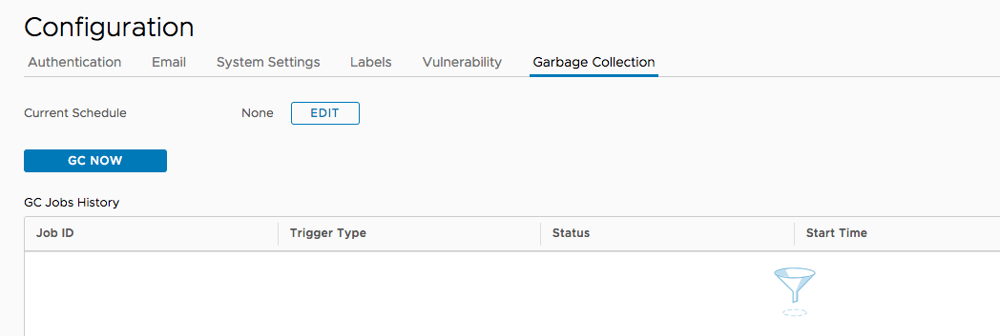
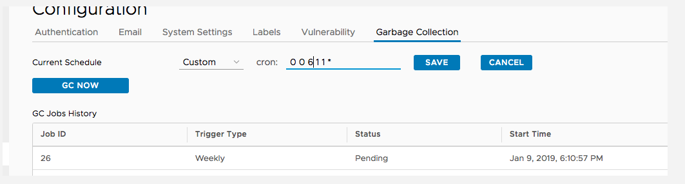

## Description: 
currently, harbor provide limitted schedule jobs for features: Garbage collection, vulnerbility Scan job and 
replication schedully. For these 3 types of schedule jobs. Harbor provide limited type of selections. Such like: Weekly  and daily. 
However, some users propose harbor to provide more flexsible options. The most efficient way is allow users to customize the schedule
tasks. 
This proposal provide users to customize the schedule use CRON format. 

From technical perspect of view. The backend schedule api need to change to use CRON as the parameter. 
APIs may be impacted are as follow:

* /api/system/gc/schedule
* /api/configurations
* /api/policies/replication

For /api/system/gc/schedule

payload:
```javascript
schedule: {type: string, offtime: number}
```
will change to:
```javascript
schedule: {cron: string}
```
For /api/configurations

payload:
```
{
    scan_all_policy: {
        type: string, 
        parameter: {
            daily_time: number
        }
    }
}
```
will change to:
```
{
    scan_all_policy: {
        cron:string
    }
}
```
For /api/policies/replication

payload: 
```
"trigger": {
  "kind": "string",
  "schedule_param": {
    "type": "string",
    "weekday": 0,
    "offtime": 0
  }
}
```
will change to:
```
"trigger": {
  "kind": string,
  "schedule_param": {
    cron: string
  }
}
```
**Note**
this Change will be done in Replication NG proposal.
Reference link: https://github.com/goharbor/community/pull/40

The frontend is as follows:
A new component will be provided. It would be something like:

    <cron-selection ng-model="myOutput"></cron-selection>

the output model will be a cron string. 

For example, a job selected to run every month on the 11th at 4:10 AM would output the follow:
```
'10 4 11 * *'
```

This component provide 3 predefined schedule jobs: 
> * hourly 
> * daily 
> * weekly

For the other customized cron, User need to input it in a input box. Frontend will check it based on Regex rules.
Mockup is as follows: 



