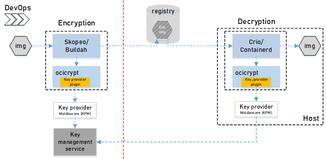
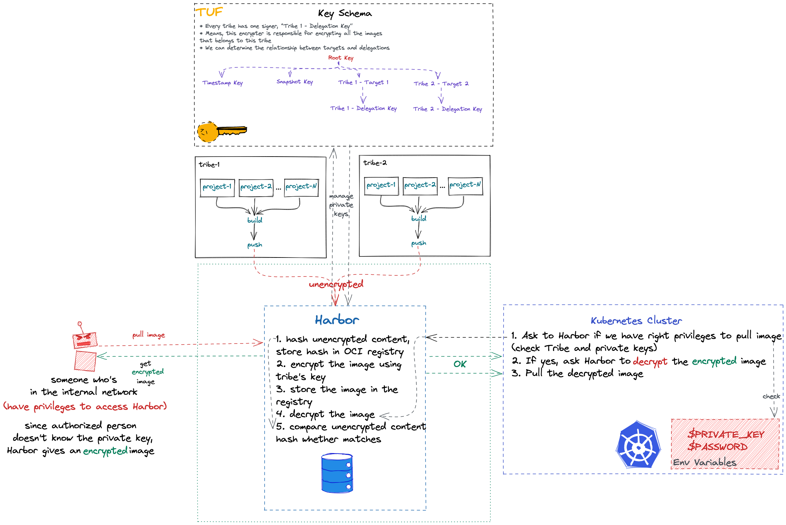

# Proposal: `Support Encrypted OCI Container images: TUF + ocicrypt`

Author: `Furkan Türkal / @Dentrax`, `Batuhan Apaydın / @developer-guy`

Discussion: [goharbor/harbor#15489](https://github.com/goharbor/harbor/issues/15489)

## Abstract

The proposal introduces a container layer encryption for unencrypted images that pushing into the registry.

## Background

IT companies may have sensitive images. Encrypted OCI Container images as a way to protect the confidentiality of container workloads, as well as how they can be used in an enterprise setting to help you achieve workload compliance. These provide a good overview of how to protect workloads in a high assurance environment.

See the [motivation of the work](https://developer.ibm.com/articles/enabling-advanced-key-usage-and-management-in-encrypted-container-images//), for more information.

## User Stories

### Story 1
As a project developer, I want to be able to keep my container image in encrypted state even though I do not encrypt in the CI/CD pipeline.

### Story 2
As a registry administrator, I should not be able to run the container images even I have pull access from the registry.

## Proposal

[TUF](https://github.com/theupdateframework/tuf) was designed with the premise that all software repositories will be compromised at a certain stage, therefore it incorporates separation of signing duties techniques that make possible to minimize the impact of a stolen private key in the environment.

The [ocicrypt](https://github.com/containers/ocicrypt) library is the OCI image spec implementation of container image encryption. More details of the spec can be seen in the [OCI repository](https://github.com/opencontainers/image-spec/pull/775). The purpose of this library is to encode spec structures and consts in code, as well as provide a consistent implementation of image encryption across container runtimes and build tools.

Pipelines will push the _unencrypted_ docker images directly into registry. Harbor will know every Tribe's private keys. So, as soon as new image store request received, we encrypt the image layers using `ocicrypt`. Filesystem may also be encrypted, but it does not matter since any authorized person have necessary access to pull images. Even if someone gets the target image somehow, it should not work on container runtimes. `ctr` command have an ability to ask encryption password if image encrypted. See the [imgcrypt](https://github.com/containerd/imgcrypt) project.

### Overview

## Rationale

**This is not a concern of Harbor**

I am not so sure if this problem is really a concern of Harbor. This is why I'm throwing this issue. We can discuss and brainstorm the idea.

We can encrypt our images in the CI/CD pipeline just before the push into container registry. And we can easily decrypt the images before deploying to cluster.

And we should find a way out about how to decrypt these securely after pull the image.

**Encrypting FS for storage instead of images**

Projects like [fscrypt](https://github.com/google/fscrypt), [encfs](https://github.com/vgough/encfs), etc. could take care of. But it does not solve the problem of what we want to achieve for. Images still in unencrypted state.

## Compatibility

To be discussed

## Implementation

To be discussed

## Open issues (if applicable)

No