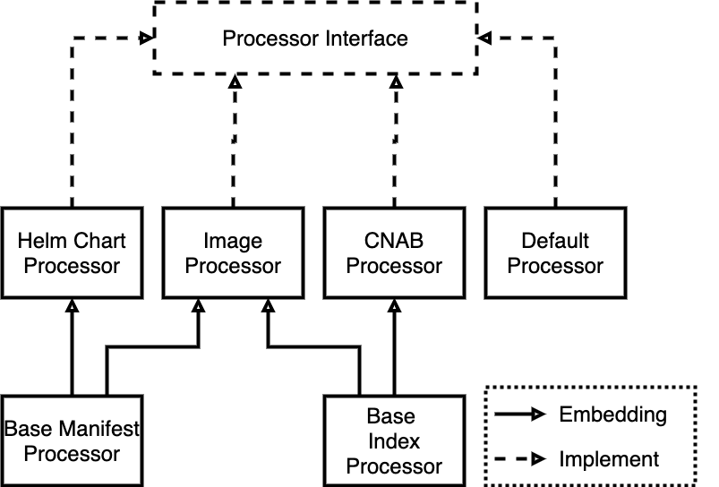
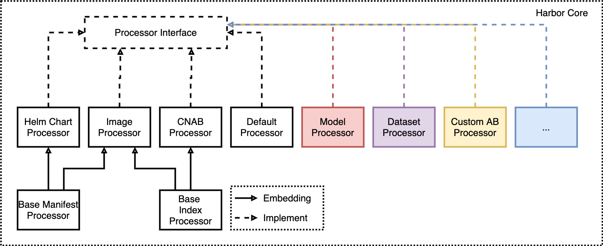
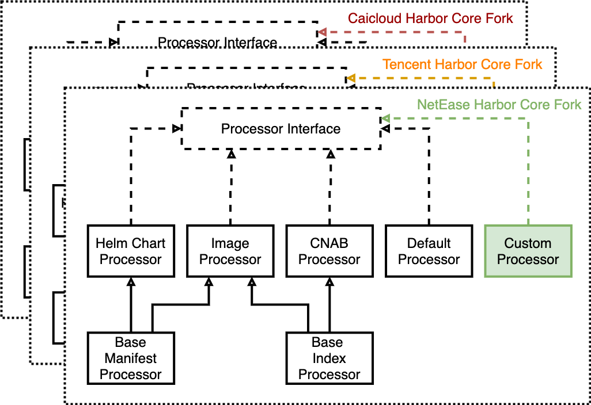

<!-- START doctoc generated TOC please keep comment here to allow auto update -->
<!-- DON'T EDIT THIS SECTION, INSTEAD RE-RUN doctoc TO UPDATE -->
**Table of Contents**  *generated with [DocToc](https://github.com/thlorenz/doctoc)*

- [Proposal: `Enhanced Default Processor`](#proposal-enhanced-default-processor)
  - [Abstract](#abstract)
  - [Background](#background)
  - [Motivation](#motivation)
  - [Glossary](#glossary)
  - [Goals](#goals)
  - [Non-Goals](#non-goals)
  - [Implementation](#implementation)
    - [Harbor-specific Configuration](#harbor-specific-configuration)
    - [Enhanced Default Processor](#enhanced-default-processor)
    - [Annotation Parser](#annotation-parser)
    - [Development Plan](#development-plan)

<!-- END doctoc generated TOC please keep comment here to allow auto update -->

# Proposal: `Enhanced Default Processor`

Author:

- Yiyang Huang [@hyy0322](https://github.com/hyy0322) \<huangyiyang.huangyy@bytedance.com\> (Corresponding Author)
- Ce Gao [@gaocegege](https://github.com/gaocegege)
- Jian Zhu [@zhujian7](https://github.com/zhujian7)

Links:

- Discussion: [goharbor/harbor#12013](https://github.com/goharbor/harbor/issues/12013)
- Slides: [Feature Request: Harbor Artifact Processor Extender](https://docs.google.com/presentation/d/1rX7v9IhXjXEAmbJP29nkSU2RJXUrpLJujL8iemqcjnU/edit#)

Status:

- 2020-08-05 Draft_v5
- 2020-07-30 [Draft v4](https://github.com/hyy0322/community/blob/0019bba3551132f764271d033fea2d635a11782b/proposals/enhanced-default-processor.md)
- 2020-06-24 [Draft v3](https://github.com/hyy0322/community/blob/4143b80fe75d737e3442c557655668f80f69f59f/proposals/enhanced-default-processor.md)
- 2020-06-15 [Draft v2](https://github.com/hyy0322/community/blob/7349e0a4325d021b9d52ed61afbc6118f30c7774/proposals/artifact-processor-extender.md)
- 2020-05-28 [Draft v1](https://github.com/gaocegege/community-2/blob/enhancement/proposals/artifact-processor-extender.md)

## Abstract

Harbor v2.0 makes Harbor the first OCI-compliant open source registry capable of storing a multitude of cloud-native artifacts like container images, Helm charts, OPAs, Singularity, and much more. It found strong demand on extending artifact types to support more complex scenarios. But the artifact authors now have to implement the processing logic in Harbor Core, which is not extensible.

The current design might go against the adoption of Harbor in industries since there are always proprietary artifact types. Thus we design a Harbor-specific schema in artifact manifest annotations and enhance the default processor to make it have ability to parse the custom artifact config.

## Background

There are four types of artifacts, which are image, helm v3, CNAB, OPA bundle, supported by Harbor. Each of them implements its processor to abstract metadata into artifact model defined by harbor. If users want to define a new kind of artifact, they have to implement the processor logic in Harbor Core service, which greatly limits the scalability and extensibility of Harbor.

## Motivation

When we use Harbor to store custom artifacts, we cannot get the expected result from the API provided by Harbor `{}/api/v2.0/projects/{}/repositories/{}/artifacts/{}`. For example, we store a new artifact using [caicloud/ormb](https://github.com/caicloud/ormb), which is a OCI artifact specification for Machine Learning models, we get the result from the API:

```
{
  "digest": "sha256:123aa..",
  "id": 2,
  "manifest_media_type": "application/vnd.oci.image.manifest.v1+json",
  "media_type": "application/vnd.caicloud.model.config.v1alpha1+json",
  "project_id": 2,
  "repository_id": 1,
  "size": 12927980,
  "tags": [
    {
      "artifact_id": 2,
      "id": 2,
      "immutable": false,
      "name": "v1",
      "pull_time": "0001-01-01T00:00:00.000Z",
      "push_time": "2020-05-15T04:04:19.516Z",
      "repository_id": 2,
      "signed": false
    }
  ],
  "type": "MODEL"
}
```

But when we store the Helm Chart and send request to the same API, we get more attributes. The extra attributes store the content of the config layer of the Helm Chart. Thus we can think the result is self-contained.

```diff
{
+  "extra_attrs": {
+    "apiVersion": "v1",
+    "appVersion": "0.8.0",
+    "description": "Host your own Helm Chart Repository",
+    "home": "https://github.com/helm/chartmuseum",
+    "icon": "https://raw.githubusercontent.com/helm/chartmuseum/master/logo2.png",
+    "keywords": [
+      "chartmuseum",
+    ],
+    "maintainers": [
+      {
+        "email": "opensource@codefresh.io",
+        "name": "codefresh-io"
+      }
+    ],
+    "name": "chartmuseum",
+    "version": "1.8.2"
+  },
  "digest": "sha256:123aa..",
  "id": 1,
  "manifest_media_type": "application/vnd.oci.image.manifest.v1+json",
  "media_type": "application/vnd.cncf.helm.config.v1+json",
  "project_id": 2,
  "repository_id": 2,
  "size": 12927980,
  "tags": [
    {
      "artifact_id": 1,
      "id": 1,
      "immutable": false,
      "name": "v1",
      "pull_time": "0001-01-01T00:00:00.000Z",
      "push_time": "2020-05-15T04:04:19.516Z",
      "repository_id": 2,
      "signed": false
    }
  ],
  "type": "CHART"
}
```

The self-contained response is also necessary for these user-defined artifact types. Or we cannot use Harbor directly for most scenarios. The `extra_attrs` field is processed by the Helm Chart processor, which is an implementation of artifact processor interface `Processor`.

The current design of the artifact processor is shown in Fig. 1. `Processor` interface is defined in Harbor Core, and there are four implementations for different types which embeds `base.IndexProcessor` and `base.ManifestProcessor`.

<p align="center">

<p align="center">Fig. 1 Current Design of Harbor Artifact Processor</p>
</p>

When artifact authors extend the artifact types, they implement corresponding processor logic in Harbor Core, as shown in Fig. 2. For example, there will be four new processor implementations in Harbor Core with at least four different maintainers from different communities if we want to support these four artifact types.

<p align="center"> 

<p align="center">Fig. 2 More Harbor Artifact Processor in Harbor Core</p>
</p>

Besides this, there will be more proprietary artifact types in industries, just like Kubernetes CRDs, as shown in Fig. 3. Each artifact vendor has to maintain their own fork to keep their proprietary artifact types, which may make Harbor a fragmented platform.

<p align="center">

<p align="center">Fig. 3 Fragmented Problems in Harbor</p>
</p>

## Glossary

| Term     	| Definition 	|
|----------	|------------	|
| Manifest 	| [OCI Image Manifest](https://github.com/opencontainers/image-spec/blob/master/manifest.md)	|

## Goals

This proposal is to:

- Define Harbor-specific schema to let default processor process user defined artifact.
- Keep non-invasive to the current built-in processors, at the same time.

## Non-Goals

This proposal is not to:

- Support allowlist for artifact types. [goharbor/harbor#12061](https://github.com/goharbor/harbor/issues/12061)

## Implementation

To address these problems, we propose a new feature **Enhanced default processor** in Harbor Core. The contributions of the proposal are:

- The Harbor-specific schema in artifact manifest to tell Harbor core more information about the user-defined artifacts.
- The enhanced default processor implementation to support user-defined artifacts.

### Harbor-specific Configuration

We introduce a harbor-specific configuration in the manifest annotations, which contains information that Harbor core needs to understand the artifact.

The harbor-specific configuration follows the style of [OCI Pre-Defined Annotation Keys](https://github.com/opencontainers/image-spec/blob/master/annotations.md#pre-defined-annotation-keys).
The annotation key must follow convention which is defined like this `io.goharbor.artifact.{annotation-version}.{key}`.

There is one proposed key in `manifest.config.annotations`:

- **io.goharbor.artifact.v1alpha1.skip-list** The list of skip keys. Harbor will ignore these keys in configuration. The value for this key should be type string separated by comma.

There is one key in `manifest.layers[].annotations` which is used to support icons:

- **io.goharbor.artifact.v1alpha1.icon** The identifier of artifact icon. The value for this key should be empty string. Only key will be processed, the value will not be used.

Here is an example.

```json
{
    "schemaVersion": 2,
    "config": {
        "mediaType": "application/vnd.caicloud.model.config.v1alpha1+json",
        "digest": "sha256:be948daf0e22f264ea70b713ea0db35050ae659c185706aa2fad74834455fe8c",
        "size": 187,
        "annotations": {
            "io.goharbor.artifact.v1alpha1.skip-list": "metrics,git"
        }
    },
    "layers": [
        {
            "mediaType": "image/png",
            "digest": "sha256:d923b93eadde0af5c639a972710a4d919066aba5d0dfbf4b9385099f70272da0",
            "size": 166015,
            "annotations": {
                "io.goharbor.artifact.v1alpha1.icon": ""
            }
        },
        {
            "mediaType": "application/tar+gzip",
            "digest": "sha256:d923b93eadde0af5c639a972710a4d919066aba5d0dfbf4b9385099f70272da0",
            "size": 166015
        }
    ]
}
```

### Enhanced Default Processor

We propose to unify arguments for all methods in Processor interface:
```diff
// Processor processes specified artifact
type Processor interface {
    // GetArtifactType returns the type of one kind of artifact specified by media type
-   GetArtifactType() string
+   GetArtifactType(ctx context.Context, artifact *artifact.Artifact) string
    // ListAdditionTypes returns the supported addition types of one kind of artifact specified by media type
-   ListAdditionTypes() []string
+   ListAdditionTypes(ctx context.Context, artifact *artifact.Artifact) []string
    // AbstractMetadata abstracts the metadata for the specific artifact type into the artifact model,
    // the metadata can be got from the manifest or other layers referenced by the manifest.
-   AbstractMetadata(ctx context.Context, manifest []byte, artifact *artifact.Artifact) error
+   AbstractMetadata(ctx context.Context, artifact *artifact.Artifact, manifest []byte) error
    // AbstractAddition abstracts the addition of the artifact.
    // The additions are different for different artifacts:
    // build history for image; values.yaml, readme and dependencies for chart, etc
    AbstractAddition(ctx context.Context, artifact *artifact.Artifact, additionType string) (addition *Addition, err error)
}
```

The pseudo code of the `defaultProcessor` is here:

```go
func (d *defaultProcessor) GetArtifactType(ctx context.Context, artifact *artifact.Artifact) string {
	// try to parse the type from the media type
	strs := artifactTypeRegExp.FindStringSubmatch(d.mediaType)
	if len(strs) == 2 {
		return strings.ToUpper(strs[1])
	}
	// can not get the artifact type from the media type, return unknown
	return ArtifactTypeUnknown
}

func (d *defaultProcessor) AbstractMetadata(ctx context.Context, artifact *artifact.Artifact, manifest []byte) error {
	configLayer := PullBlob(artifact.RepositoryName, manifest.Config.Digest)
	// Extract the extra attributes according to the annotation.
	annotationParser := annotation.NewParser()
	err = annotationParser.Parse(ctx, artifact, manifest)
	return
}
```

### Annotation Parser

As is described above, the annotation key follow `io.goharbor.artifact.{annotation-version}.{key}` convention will be parsed by Harbor.
For every annotation key, there is annotation-version bind with it. In order to parse annotation keys for different versions, different annotation parser for different version is needed. So we can abstract an interface for annotation parser.

```go
// Parser parses annotations in artifact manifest
type Parser interface {
	// Parse parses annotations in artifact manifest, abstracts data from artifact config layer into the artifact model
	Parse(ctx context.Context, artifact *artifact.Artifact, manifest []byte) (err error)
}
```
For different versions of parser, there is a specific annotation parser which implements Parser interface.
```go
type v1alpha1Parser struct {
	regCli reg.Client
}

func (p *v1alpha1Parser) Parse(ctx context.Context, artifact *artifact.Artifact, manifest []byte) error {
    // parse annotation in a specific way
}
```

All parsers will register to parser registry.
```go
// registry for registered annotation parsers
registry = map[string]Parser{}
```

With different versions of parsers, there is a wrapper annotation parser which also implements Parse interface, will use parsers in parser registry one by one in order to parser different version of annotations.
```go
type parser struct{}

func (p *parser) Parse(ctx context.Context, artifact *artifact.Artifact, manifest []byte) (err error) {
	for _, annotationVersion := range sortedAnnotationVersionList {
		err = GetAnnotationParser(annotationVersion).Parse(ctx, artifact, manifest)
		if err != nil {
			return err
		}
	}
	return nil
}
```


<p align="center">

<p align="center">Fig. 4 Workflow of Pushing an Artifact using the Default Processor</p>
</p>

### Development Plan
We will start to code as soon as the proposal is accepted. We are going to finish coding within 2 weeks before code freeze which before end of July.
