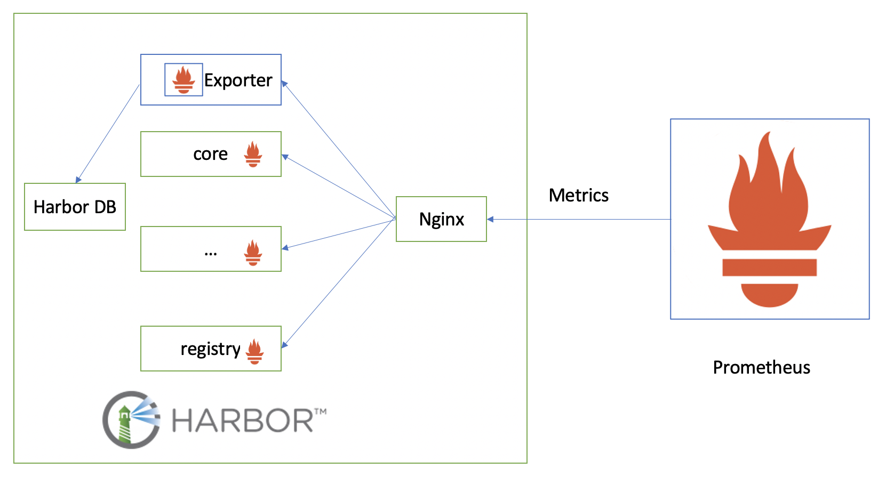
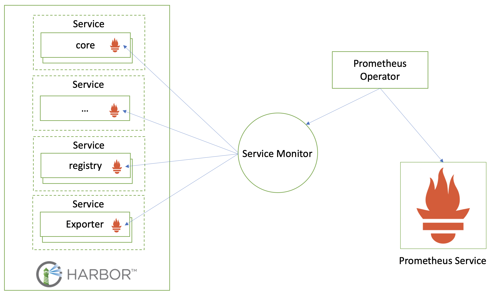
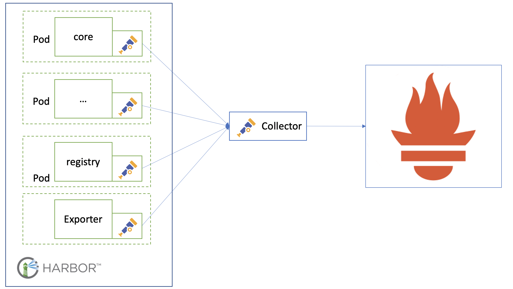

# Proposal: `Proposal of Adding Metrics`

Author: `< Qian Deng / @ninjadq >`

## Abstract

Expose prometheus metrics for Harbor.

Metrics should contain performance data and some important business data.

The solution needs to considerate standalone and k8s environment.

## Background

Observability is a key feature for operating a service in production.
Harbor should expose some level of internal infomations to the outside world to help the operators and admins to have more sense about the real status of harbor.
Which can help them to identify abnormal status and make the right decision when error happenning or to feel more confident if everything is fine.

## Proposal

In order to provide observability to harbor we propose expose some basic metrics in Harbor which can not only improve production experience but also can provide a scaffold to help adding more metrics in the future.

### What Contents to expose

* Runtime info from go library

* Performance metrics about all API requests in core

* Number of requests in core in flight

* Metrics provided by docker distribution itself

* Some data related to business logic which already exist in Harbor DB

* The metrics shoud expose in this stage

  * | Name                 | Description                  | labels                                   |
    | -------------------- | ---------------------------- | ---------------------------------------- |
    | project_total        | number of projects (p0)      | public or private,                       |
    | repositories_total   | number of repositories (p0)  | public or private, project id            |
    | images_total         | number of images (p0)        | public or private, project id, typename  |
    | project_member_total | number of member total (p0)  | project id                               |
    | project_quota_used   | Total usage occupied (p0)    | project id                               |
    | project_quota_total  | Quotas set (p0)              | project id                               |
    | image_pulled_total   | number of images pulled (p0) | project id, type (image, chart, OPA etc) |
    | image_pushed_total   | number of images pushed (p0) | project id, type (image, chart, OPA etc) |

### How to expose

* Expose the metrics in prometheus format
  * Use prometheus go SDK to expose runtime metrics like memory used
  * Use a go routing to run in the background to periodically update business related metrics
  * Write a middleware for all api handler to get the request performance data
  * The port of exposing metrics should different from the main service
* The architecture about Harbor standalong environment looks like below.
  * 
  * Enable Prometheus format metrics in Harbor components 
    * Only enabling instrumentation metrics in `Core` and `Registry` in stage 1
    * Metric format follow the Promtheus standard
  * Introuduce a new component called `Exporter`
    * Exporter expose the overall harbor status 
    * Most of status metrics are collected from harbor database
    * The metrics format follows the Prometheus standard either
  * Add new rule in nginx to expose metrics
    * On standalone Harbor, all the components metrics are exposed through `Nginx` gateway
    * Prometheus srapes differenct components's metrics the  via `Nginx` by provide a query string `?comp=xxx`
  * Harbor prepare script need updated to configure every for the users.

## Non-Goals

* Expose traces

* Expose logs

* Alert

* Implementing service discovery strategy to find harbor components.

## Rationale

* Why not expose metrics to Promethues Harbor components directly

  * All Harbor components are behind a nginx proxy, it needs to configured to expose metrics for each components
  * Prometheus needs to configure targets for each endpoint for scraping metric, but all of them are belong to harbor
  * Use multiple metric APIs for one product seems not a good practice
* Why add an `Exporter` component to expose the Harbor instead of providing this metrics form one of harbor component, say, core.
  * Because use exporter to expose this kind of metrics will make the whole artitecht more reasonable and clean.
  * In addition, if Harbor is deployed with HA mode in K8S, each component of harbor will has multiple instances. But one of these kind of metrics is enough for users. And multiple data will cunfuses user.
  * Moreover, some user may only want to collect harbor infomation data or harbor components performance data. Seperated component can provide this flexibility.

## Compatibility

* Third party monitoring system like Influx stack or Wavefront
  * Use telegraf to collect promethues data then send to InfluxDB or (wavefront proxy if you are using wavefront)
  * Use promethues to collect data can also set remote storage to InfluxDB or Wavefront backend

* K8S Environment

  * Promethues Operater
    * 
    * Service Monitor to collect harbor metrics

  * Otel Sidecar solution
    * 
    * Use an Otel agent as sidecar to start with harbor component's pod to collect metrics
    * Agents send the metrics to otel collector
    * Otel collector expose metrics to Promethus
