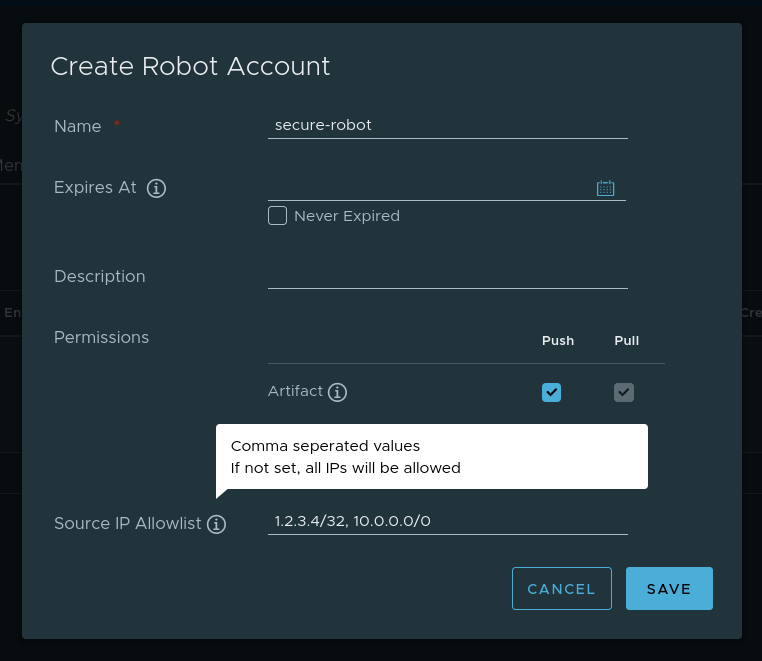

# Proposal: `Implementation of per project IP allowlist`

Author: `Joshua Hügli / joschi36`

~~Discussion: `Link do discussion issue, if applicable`~~

## Abstract

The idea of this proposal is to add an allowlist for Habor specific project actions issued by a robot account.

## Background

I'm working at a provider that has both internal Kubernetes services but also is using public services for CI/CD and app hosting. We would like to be able to manage from which IP a robot account gets access.

## Proposal

Create an additional field for the robot account that support comma separated CIDR notations that build the allowlist of Robot Accounts.

The core component filters requests by Robot Accounts and returns a 403 if source IP is not on allowlist.

## Non-Goals

- This proposal should not implement unauthenticated access for Robot Accounts. Like stated in: https://github.com/goharbor/harbor/pull/7918

## Rationale

There is space for some variations regarding this proposal:

- Also implement blocklist?
  - [ ] Yes
  - [ ] No (proposed)
- Implement it on robot account or per project?
  - [ ] per Robot Account (proposed)
  - [ ] per Project

## Compatibility

[N/A]

## Implementation

[N/A]
