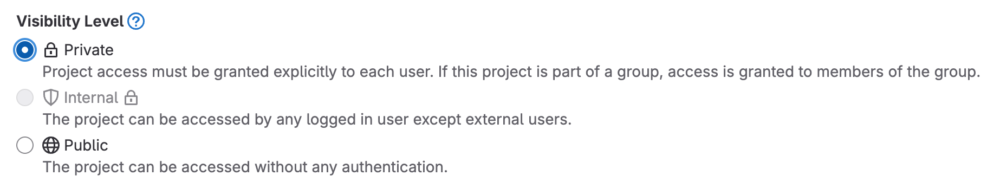

# Proposal: Multiple Visibility Levels and Control

Author: [Vadim Bauer](https://github.com/Vad1mo) - [8gears Container Registry](https://container-registry.com/)
Created time: 11 June 2024
Last updated:

## Abstract

This proposal extends Harbor with additional project visibility and permission levels, and upgrades the current public/private project visibility and access levels.

Once this proposal is implemented, additional uses will become possible, which will be outlined in the proposal.

Furthermore, it also removes confusion about the consequences of the current visibility of public-private projects.

## Background

Currently, only two visibility options for projects exist.  
Public and private projects are too limited and unsuitable for many use cases where Harbor is used in organizations.  
This is also reflected in many issues and feature requests from the Harbor community.

Harbor has a wide popularity and recognition for its proxy and replication capabilities.  
With this proposal,  we can leverage the existing features  and extend them to a wider audience and use cases.

Here are some related issues from the Harbor Community.
- https://github.com/goharbor/harbor/issues/10760
- https://github.com/goharbor/harbor/issues/12306
- https://github.com/goharbor/harbor/issues/5447
- https://github.com/goharbor/harbor/issues/12306

Similar Proposals:
- https://github.com/goharbor/community/pull/124

## Proposal

Extend the current public and private project visibility levels with additional options.

- **Private (Existing)**
  Same behavior as the current private project visibility.
  Only users and groups
  that are explicitly added as members to the project to get access,
  based on their access level.
- **Internal View Only**
  All authenticated (hence authenticated)
  users can view and pull artifacts from this project.
  But they are not allowed to pull any artifact from this project unless they are explicitly added as members to the project.
- **Internal**
  All authenticated users can view and pull artifacts from this project
- **Public View Only**
  Unauthenticated Users without a Harbor account can view artifacts and artifacts in this project,
  but they cannot pull artifacts, without being authenticated.
- **Public (Existing)**
  Same behavior as the current project visibility. Users don’t need to have an account to pull artifacts from this project.

For reference, here are the visibility levels in GitLab for projects:

### Project Level
On the project level, the project owner can set the visibility level of the project.

### System Level

On the system level, the system admin can set the maximum visibility level for new projects.
For example, If the maximum visibility level for new projects is set to "private", then newly created projects would have the visibility level "private" and the project admin would not be able to change it.

A system admin can change the visibility level for projects regardless of the system-level setting.

### Internal Project

Internal projects are a bit special in terms of visibility,
accessibility and perspective, as they can be both private or public, depending on the context.

The definition of internal can be interpreted as internal users or internal networks. 
In this context, we refer to internal as in internal networks.

On the one hand,
we want the internal projects
to be visible and accessible inside the organization, but private to the outside.
The same would apply to pulling artifacts,
internally without a pull secret and externally just like a private project with a pull secret.

To handle this the internal use case, we would need
to have a functionality
that can distinguish between access from internal or external networks.

### Robot Accounts in Context of Internal Project
Robot accounts for access to projects inside the organization aren't needed for pulling artifacts.

## Rationale

Looking at how Harbor is used in enterprise environments,
