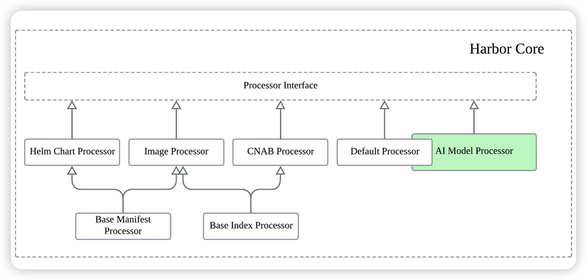
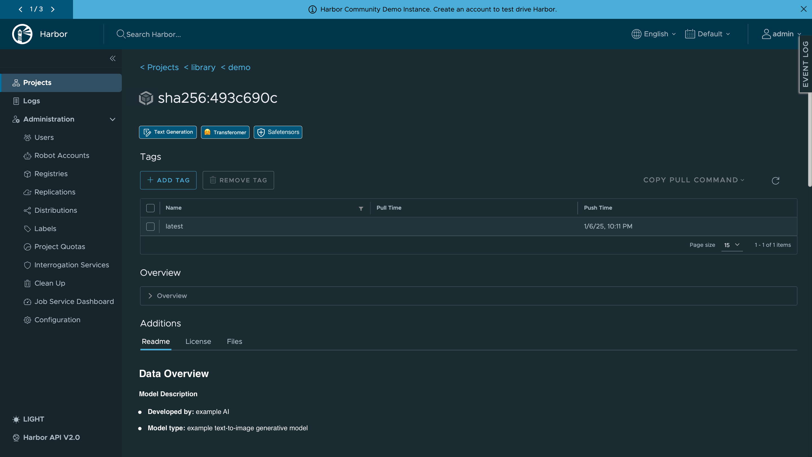
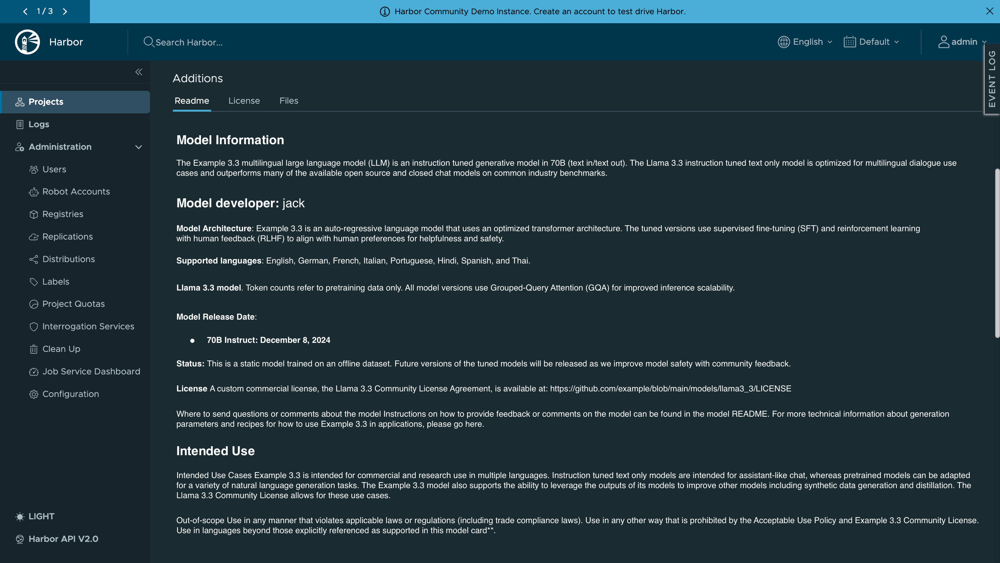
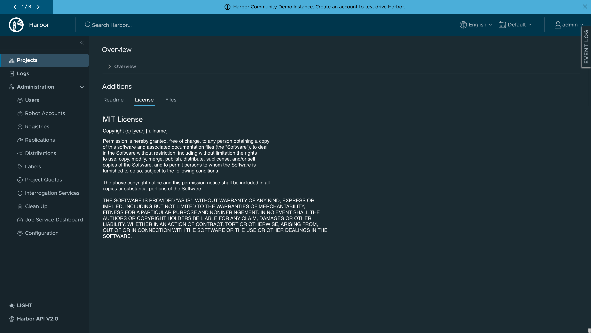
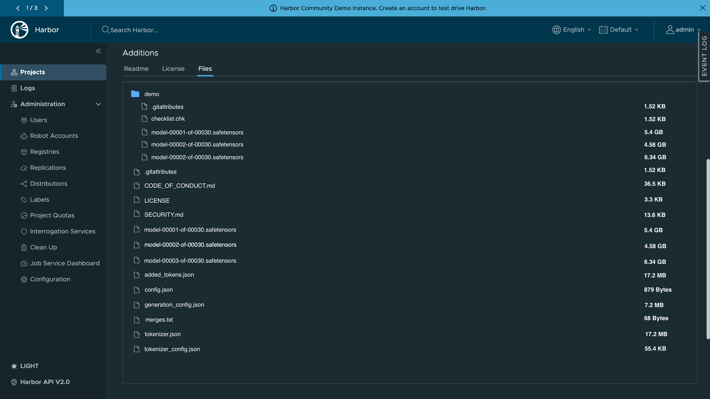
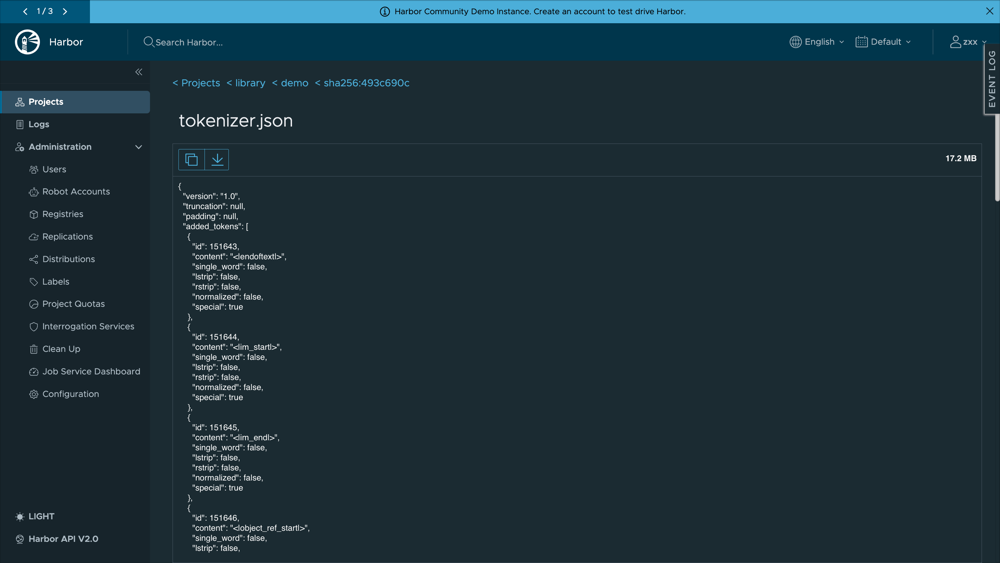

# Proposal: AI Model Processor

Author: [Chenyu Zhang](https://github.com/chlins)

## Abstract

This proposal aims to introduce an AI model processor to Harbor, which will parse AI model metadata based on a predefined [Model Spec](https://github.com/CloudNativeAI/model-spec).
This will allow Harbor users to more efficiently manage, discover, and deploy AI models, similar to how Harbor manages container images.

## Motivation

Effective model management is increasingly crucial due to the growing popularity of AI/ML applications.
While Harbor currently focuses on container image management with features like vulnerability scanning, replication, signature and more.
Harbor is also natively an OCI Artifact registry. Therefore, packaging AI models as OCI Artifacts and storing them in Harbor is a viable approach.
This would allow leveraging Harbor's existing features for improved AI model management, enhancing its applicability in AI/ML workloads and promoting model reusability and traceability.


## Goals

1. Ability to recognize that the AI model which based on `artifactType` and display the AI icon.
2. Provide support for parsing AI model metadata based on the [Model Spec](https://github.com/CloudNativeAI/model-spec).
3. Display the README, LICENSE and Files List of the AI model in the UI. (By existing artifact addition mechanism)

## Non-Goals

1. Ensure the current version is stable and there will be no subsequent changes, and no compatibility issues.
Because the current model spec is still in a relatively early stage, there may be iterations and updates in the future. (But we can ensure the backward compatibility of the API.)
2. Support to parse the AI model metadata from other artifact which were not bundled according to the [Model Spec](https://github.com/CloudNativeAI/model-spec).

## Personas and User Stories

This section lists the user stories regarding this enhancements for the different personas interacting with the AI model.

* Personas

Authorized users in Harbor which with the role of read permission of the artifact.

* User Stories (Model-Specific)

1. As a user with read permission of the model artifact, I can distinguish and view the AI model icon besides the artifact digest in the UI.
2. As a user with read permission of the model artifact, I can view the AI model metadata such as model architecture, name, family, format, etc.
3. As a user with read permission of the model artifact, I can click the `Readme` tab to view the README of the AI model.
4. As a user with read permission of the model artifact, I can click the `License` tab to view the LICENSE of the AI model.
5. As a user with read permission of the model artifact, I can click the `Files` tab to view the files list of the AI model.

* User Stories (Common-Case for OCI Artifact)

The following capabilities are acquired automatically as AI model artifacts following the OCI specification, so there is no additional work required.

1. As a user with replication permission of the artifact, I can replicate the AI model to other OCI registries.
2. As a user with preheat permission of the artifact, I can preheat the AI model to the p2p cluster.
3. As a user with retention permission of the artifact, I can set the retention policy for the AI model.
4. As a user with signature permission of the artifact, I can sign the AI model by 3rd-party signature tools such as cosign.
5. As a user with vulnerability permission of the artifact, I can scan the AI model for vulnerabilities. (depends on the scanner capability for scanning AI model)

## Scheme Changes

No schema changes of database are required for this proposal.

## Architecture

There will be a new AI model processor added to the artifact processors in Harbor core.



## UI

The UI changes are as follows:

1. Add the AI model icon besides the artifact digest in the artifact list page.
2. Add some tag labels on top of the artifact detail page, which will display the AI model metadata such as model architecture, name, family, format, etc.



3. Add a new tab named `Readme` to the artifact detail page, which will display the README of the AI model.



4. Add a new tab named `License` to the artifact detail page, which will display the LICENSE of the AI model.



5. Add a new tab named `Files` to the artifact detail page, which will display the files list of the AI model.



## API

There is no need to introduce new APIs for this proposal, as the existing "addition" API for the artifact can be utilized to extend capabilities for parsing AI model metadata.

The manifest of artifact bundled based on the [Model Spec](https://github.com/CloudNativeAI/model-spec) might look like this, please note that this may differ based on the spec version.

```json
{
  "schemaVersion": 2,
  "mediaType": "application/vnd.oci.image.manifest.v1+json",
  "artifactType": "application/vnd.cnai.model.manifest.v1+json",
  "config": {
    "mediaType": "application/vnd.cnai.model.config.v1+json",
    "digest": "sha256:eb9e987a8c340a40ba4354dd4ed96f7ef2e885e3d2e9f128676f995c967890ac",
    "size": 277
  },
  "layers": [
    {
      "mediaType": "application/vnd.cnai.model.doc.v1.tar",
      "digest": "sha256:5a96686deb327903f4310e9181ef2ee0bc7261e5181bd23ccdce6c575b6120a2",
      "size": 13312,
      "annotations": {
        "org.cnai.model.filepath": "LICENSE"
      }
    },
    {
      "mediaType": "application/vnd.cnai.model.doc.v1.tar",
      "digest": "sha256:44a6e989cc7084ef35aedf1dd7090204ccc928829c51ce79d7d59c346a228333",
      "size": 5632,
      "annotations": {
        "org.cnai.model.filepath": "README.md"
      }
    },
    {
      "mediaType": "application/vnd.cnai.model.weight.config.v1.tar",
      "digest": "sha256:a4e7c313c8addcc5f8ac3d87d48a9af7eb89bf8819c869c9fa0cad1026397b0c",
      "size": 2560,
      "annotations": {
        "org.cnai.model.filepath": "config.json"
      }
    },
    {
      "mediaType": "application/vnd.cnai.model.weight.config.v1.tar",
      "digest": "sha256:628ce381719b65598622e3f71844192f84e135d937c7b5a8116582edbe3b1f5d",
      "size": 2048,
      "annotations": {
        "org.cnai.model.filepath": "generation_config.json"
      }
    },
    {
      "mediaType": "application/vnd.cnai.model.weight.v1.tar",
      "digest": "sha256:0b2acb3b78edf2ca31de915cb8b294951c89e5e2d1274c44c2a27dabfcc2c5da",
      "size": 988099584,
      "annotations": {
        "org.cnai.model.filepath": "model"
      }
    },
    {
      "mediaType": "application/vnd.cnai.model.weight.config.v1.tar",
      "digest": "sha256:0480097912f4dd530382c69f00d41409bc51f62ea146a04d70c0254791f4ac32",
      "size": 7033344,
      "annotations": {
        "org.cnai.model.filepath": "tokenizer.json"
      }
    },
    {
      "mediaType": "application/vnd.cnai.model.weight.config.v1.tar",
      "digest": "sha256:ebea935e6c2de57780addfc0262c30c2f83afb1457a124fd9b22370e6cb5bc34",
      "size": 9216,
      "annotations": {
        "org.cnai.model.filepath": "tokenizer_config.json"
      }
    },
    {
      "mediaType": "application/vnd.cnai.model.weight.config.v1.tar",
      "digest": "sha256:3a2844a891e19d1d183ac12918a497116309ba9abe0523cdcf1874cf8aebe8e0",
      "size": 2778624,
      "annotations": {
        "org.cnai.model.filepath": "vocab.json"
      }
    }
  ]
}
```

### Endpoints

**Please notice that these endpoints are relies on the predefined annotation `org.cnai.model.filepath` which defined in the [Model Spec Annotations](https://github.com/CloudNativeAI/model-spec/blob/main/docs/annotations.md#layer-annotation-keys).**

#### GET README

The layer with the following characteristics will be identified as README.

| Property | Value |
| --- | --- |
| `mediaType` | `application/vnd.cnai.model.doc.v1.tar` |
| `annotations` | `org.cnai.model.filepath`: `README` or `README.md` |

Response Explanation:

| Status Code | Description |
| --- | --- |
| 200 | normal case |
| 404 | layer with README characteristics not found |
| 500 | internal server error(other runtime error or unexpected error) |

`GET /api/v2.0/projects/{project_name}/repositories/{repository_name}/artifacts/{reference}/additions/readme`

`Content-Type: text/markdown; charset=utf-8`

```text
# Llama 3 Model

## Overview

Llama 3 is the next generation of our large language model, designed for enhanced performance, reasoning, and safety. It builds upon the foundations of Llama 2, incorporating architectural improvements and a larger training corpus.

### Key Features

* **Improved Performance:** Llama 3 exhibits superior performance across various benchmarks compared to its predecessor.
* **Enhanced Reasoning:** The model demonstrates improved reasoning abilities, leading to more accurate and coherent responses.
* **Safety-First Approach:** We've prioritized safety in Llama 3's development, incorporating rigorous testing and evaluation.
* **Scalability:** Llama 3 is designed to scale to a variety of hardware configurations, enabling widespread accessibility.

......
```

#### GET LICENSE

The layer with the following characteristics will be identified as LICENSE.

| Property | Value |
| --- | --- |
| `mediaType` | `application/vnd.cnai.model.doc.v1.tar` |
| `annotations` | `org.cnai.model.filepath`: `LICENSE` or `LICENSE.txt` |

Response Explanation:

| Status Code | Description |
| --- | --- |
| 200 | normal case |
| 404 | layer with LICENSE characteristics not found |
| 500 | internal server error(other runtime error or unexpected error) |

`GET /api/v2.0/projects/{project_name}/repositories/{repository_name}/artifacts/{reference}/additions/license`

`Content-Type: text/plain; charset=utf-8`

```text
MIT License

Copyright (c) Meta Platforms, Inc. and affiliates.

Permission is hereby granted, free of charge, to any person obtaining a copy
of this software and associated documentation files (the "Software"), to deal
in the Software without restriction, including without limitation the rights
to use, copy, modify, merge, publish, distribute, sublicense, and/or sell
copies of the Software, and to permit persons to whom the Software is
furnished to do so, subject to the following conditions:

The above copyright notice and this permission notice shall be included in all
copies or substantial portions of the Software.

THE SOFTWARE IS PROVIDED "AS IS", WITHOUT WARRANTY OF ANY KIND, EXPRESS OR
IMPLIED, INCLUDING BUT NOT LIMITED TO THE WARRANTIES OF MERCHANTABILITY,
FITNESS FOR A PARTICULAR PURPOSE AND NONINFRINGEMENT. IN NO EVENT SHALL THE
AUTHORS OR COPYRIGHT HOLDERS BE LIABLE FOR ANY CLAIM, DAMAGES OR OTHER
LIABILITY, WHETHER IN AN ACTION OF CONTRACT, TORT OR OTHERWISE, ARISING FROM,
OUT OF OR IN CONNECTION WITH THE SOFTWARE OR THE USE OR OTHER DEALINGS IN THE
SOFTWARE.
```

#### GET Files List

The layer with the annotations `org.cnai.model.filepath` will be identified as the file, the API will construct a file tree by walking through the manifest layers and return a JSON object of the files list.

Response Explanation:

| Status Code | Description |
| --- | --- |
| 200 | normal case(empty list returned if no layer with annotations `org.cnai.model.filepath`) |
| 500 | internal server error(other runtime error or unexpected error) |

`GET /api/v2.0/projects/{project_name}/repositories/{repository_name}/artifacts/{reference}/additions/files`

`Content-Type: application/json; charset=utf-8`

```json
[
    {
      "name": "config.json",
      "type": "file",
      "size": 1024,
    },
    {
      "name": "tokenizer.json",
      "type": "file",
      "size": 1024,
    },
    {
      "name": "README.md",
      "type": "file",
      "size": 1024,
    },
    {
      "name": "LICENSE",
      "type": "file",
      "size": 1024,
    },
    {
      "name": "model-000001.safetensors",
      "type": "file",
      "size": 1048576,
    },
    {
      "name": "model-000002.safetensors",
      "type": "file",
      "size": 1048576,
    },
    {
      "name": "dir1",
      "type": "directory",
      "children": [
        {
          "name": "dir2",
          "type": "directory",
          "children": [
            {
              "name": "file1.txt",
              "type": "file",
              "size": 1024,
            }
          ]
        },
        {
          "name": "foo.txt",
          "type": "file",
          "size": 1024,
        },
        {
          "name": "bar.txt",
          "type": "file",
          "size": 1024,
        },
      ]
    },
]

```

## References

1. [Model Spec](https://github.com/CloudNativeAI/model-spec) (Cloud Native Artifacial Intelegence Model Format Specification)
2. [modctl](https://github.com/CloudNativeAI/modctl) (Command-line tools for managing OCI model artifacts which are bundled based on Model Spec)

## To Be Discussed(future features)

*The following content is only for discussion to introduce future iterative features, to be implemented as phase 2 in the future, and is not part of the implementation of this proposal.*

Should we think about offering the capability to open files? like `config.json` and `tokenizer.json`, but how should we handle model files? One approach could be to not display them or only show certain parameter information in the header, similar to what HuggingFace does.

Example:


