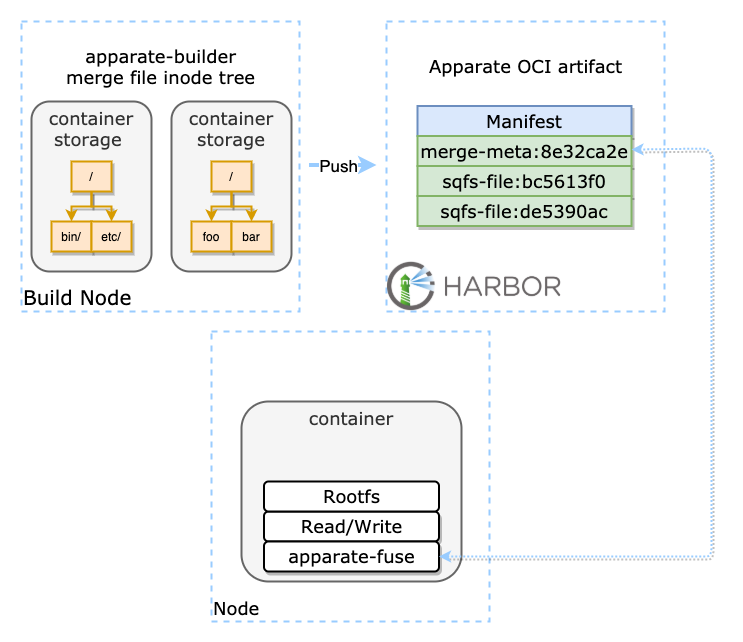
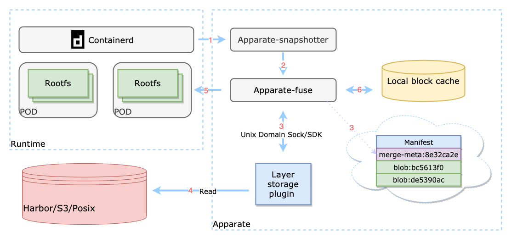

# Proposal: `Image Acceleration(Apparate)`

Author: TCR Members <marcriverli@tencent.com;blakezyli@tencent.com;fanjiankong@tencent.com;ivanscai@tencent.com;zichentian@tencent.com>

## Abstract

Provide a image acceleration mechanism and a sub-project to achieve it.

## Background

Nowadays, a large number of loads have been containerized, and different business scenarios have different requirements for container startup time. Offline computing and some online services that need to quickly increase computing resources (scaling groups) often require container startup quickly. In the entire cycle of container startup, the time of pulling images take up 70% or more. According to statistics, due to the large container image size of an offline computing service, each expansion of thousands of Pods takes up to 10 minutes. Image distribution has become a major obstacle to rapid and elastic container scaling.
 
## Motivation
Currently, the harbor community supports preheating third-party p2p components in image acceleration, but p2p still needs to pull the full amount of images, which may waste a lot of traffic and bandwidth. Moreover, in large-scale p2p pull scenarios of public clouds, a large number of concurrent write IO (docker extract gzip layer) is also very stressful on the cloud disk, which requiring special tuning. In that case, we want to provide a sub project which is harbor native image acceleration.

## Goals
- Make the Harbor project support image acceleration natively and enhance Harbor's capabilities.
- The data and metadata in the image format are stored in the Harbor through OCI artifact.
- Compatible with original and on-demand acceleration modes at the same node.

## Proposal
At present, goharbor's main project focuses on the R & D and maintenance of enterprise-level container registry, and introduces the images acceleration functions such as P2P preheating. However, this is not enough to meet the user's need to accelerate image distribution. Image acceleration has a large number of features and requirements, as well as relatively independent code development and maintenance work, and not suitable for hosting in the goharbor main project repository.

Here, we suggested that in the goharbor community, a image acceleration subproject be proposed to manage maintenance project requirements, development progress, and engineering code.

In this section, we introduce Apparate, a new kind of image acceleration mechanism.

### Overview

#### Glossary

- Apparate: name of our image acceleration system.
- Apparate-builder: client tool for build Apparate OCI artifact and push to Harbor or other data source.
- Apparate-snapshotter: a Containerd snapshotter plugin for prepare container rootfs.
- Apparate-fuse: a user space read-only file system, which can read image data on-demand.

Apparate introduces a new image format compatible with OCI standard to implement on-demand image pulling. In order to overcome some of the previous shortcomings of the tar format, Apparate uses the squashfs format as the data storage format for the image layer. In fact, we still retain the concept of layer and use layer as the minimum reuse unit.

We need to use three components to complete the entire process from image building to container operation. They are apparate-builder, apparate-fuse, and apparate-snapshotter.

### Story

**Kubernetes cluster administrator (Blake)**

- To use Apparate to accelerating image distribution, Blake should install a special containerd snapshotter for ever k8s work node.
- Blake should setting the network to let the snapshotter cloud access the backend storage or Registry, like Harbor and TCR.

**Developer/Ops (Frank)**

- To use Apparate, Frank should install tool chains of it, like `Apparate-builder` , `Apparate-snapshotter`.
- Frank should build a normal Docker Image, and then convert to `Apparate Special Artifact` via `Apparate-builder` layer by layer.
- Frank could use `Apparate-builder` convert image and push to the Registry.

**CI/CD Pipeline**

- Could auto build, convert and push image.

**Image Registry**

- To storage and distribution `Apparate Special Artifact`, the registry should be support OCI artifacts, like Harbor and TCR.

### Architecture



Apparate-builder can build image from the container local storage or convert any image that conforms to the OCI format that supports Apparate acceleration, and then push it to Harbor.
In order to improve the overall performance, we use the pre-overlay mechanism, that is, we will get the complete metadata view of the entire image when Apparate image has been converted and build. When Apparate-fuse is mounted, the final form of multiple image layers stacking is directly obtained. There is no need to perform overlay mounting.

Apparate-fuse is the core component to achieve on-demand pulling image. Apparate-snapshotter will mount Apparate-fuse when processing Apparate format artifact, which will load the pre-processed metadata information(file inode of layer and image layout) in Apparate artifact, and then provide it as Rootfs to the container starting. Therefore, when the container starts, the request for image data will be translated by apparate-fuse into a request for different data blocks, so that the image can be downloaded on demand at the remote data source, which greatly improves the startup speed of the container.

Apparate-snapshoter is a storage plugin of containerd, which can create on-demand image rootfs containers based on the type of artifacts in the Manifest or create containers that use the original method of local storage.

### Key features

1. Multiple data source: Registry, S3 and filesystem
2. Local file system cache
3. OCI image spec compatible
4. High Reliability: recover fuse process in running container rootfs
5. Prefetch data block support
6. Prepare metadata overlay
7. Data block checksum
8. Integrated with P2P system

### Workflow

1. Containerd use apparate-snapshotter to execute pod creating command or image pulling command.

2. Apparate-snapshotter will use apparate-fuse to construct container rootfs.

3. Apparate-fuse pull the merge-meta layer which superblock stored in. Then apparate-fuse will know the mapping between files and different layers and blocks.

4. Apparate supports Harbor/registry, object storage and local posix file system as the backend data storage layer.

5. Containerd create container(pod) in virtual read-only rootfs which provided from apparate-fuse, and use a overlayfs to mount a read/write upper layer for container.

6. When the container started, apparate-fuse as a file system will receive the actual read requests, and find out whether there is a corresponding data block cached locally, and return data from the local cache firstly. If data block has not been cached, it will read block from data source.

### Design
#### Layout

``` 
+-----------+----------+-----------+---------------+--------------+-------------+-----------+
|           |          |           |               |              |             |           |
|SuperBlock |BlobTable |InodeTable |DirectoryTable |FragmentTable |UID/GIDTable |XattrTable |
|           |          |           |               |  (optional)  |             |           |
+-----------+----------+-----------+---------------+--------------+-------------+-----------+
```
- SuperBlock, the first section of a apparate fs archive, and contains important information about the archive, including the locations of other sections of the archive.
- BlobTable, record a list of blob ids of all layers which the archive contains.
- Inode table, contain all inodes.
- DirectoryTable, record all inodes info in a directory.
- FragmentTable, record the location and size of these fragment blocks.if the size of a file is not equally divisible by block_size, the final chunk can be stored in a fragment.
- UID/GIDTable, record uid and gid.
- XattrTable, record  extended attributes key value pairs attaced to inodes.
- In Apparate, blob data  is stored in a number of data blocks, which are stored sequential.All data blocks must be of common size and then compressed.

#### Superblock
```
type SuperBlock struct {
	Magic uint32
	InodeCount  uint32
	BlockSize uint32
	FragmentEntryCount uint32
	CompressionId uint16
	Flags  uint16
	IdCount uint16
	RootInodeRef uint64
	// Total size of the file system in bytes, not counting padding.
	BytesUsed uint64
	IdTableStart uint64
	XattrIdTableStart uint64
	InodeTableStart uint64
	DirectoryTableStart  uint64
	FragmentTableStart  uint64
	BlobTableStart uint64
}
```
- CompressionId offers several flags to choose which compression algorithm.1 - GZIP；3 - LZO；5-LZ4.
- InodeTableStart is the byte offset at which the inode table starts.
- RootInodeRef is an reference to the inode of the root directory of the archive.
#### Inode table
The inode table starts at inode_table_start and ends at directory_table_start,containing all inodes. Each entry in the table has a common inode header and the real inode type struct.
##### Inode header and inode

``` 
type InodeHeader struct {
	Type   uint16
	Mode   uint64
	UidIdx uint16
	GidIdx uint16
	// Blob index in blob table
	BlobIdx uint16
	// The position of this inode in the full list of inodes
	InodeNumber uint16
}

type Inode struct {
	Header *InodeHeader
	// inode type struct
	Data  interface{}
	Extra []uint32
}

```
- The type of item described by the inode which follows this header.
- BlobIdx, blob index in blob table.
- Extral in inode, for regular file inodes, this is an array of compressed block sizes.For symlink inodes, this is actually a string holding the target.
##### Inode type
The data in inode could be file or directory and so on.The types are shown below.
| type | description |
| ------ | ------ |
| 1 | basic directory |
| 2 | basic file |
| 3 | basic symlink |
| 4 | basic block device |
| 5 | basic chart device |
| 6 | basic fifo |
| 7 | basic socket |
##### basic file inode

``` 
type InodeBasicFile struct {
	BlockStart     uint32
	FragmentIndex  uint32
	FragmentOffset uint32
	FileSize       uint32
}
```
- BlockStart, absolute position of the first compressed data block.
- FragmentIndex, index into the fragment table.
- FragmentOffset, offset into the uncompressed fragment block.
- FilseSize, uncompressed size of the file in bytes.
##### basic directory inode

``` 
type InodeDirectory struct {
	StartBlock uint32
	Nlink      uint32
	Size       uint16
	Offset     uint16
	ParentNode uint32
}
```
- StartBlock, offset from the directory table start to the location of  the first directory header.
- Nlink,bumber of hard links to this node.
- Size,combined size of all directory entries and headers in bytes.
- Offset,offset into the uncompressed start block where the header can be found.
- ParentNode, inode number of the parent directory.
#### Directory table
For each directory inode, the directory table stores a list of all entries stored inside, with references back to the inodes that describe those entries. Each table entry has  header and entry list

``` 
+----------------+------+------+------+----------------+------+------+------+
|                |      |      |      |                |      |      |      |
|DirectoryHeader |Entry |Entry | ...  |DirectoryHeader |Entry |Entry | ...  |
|                |      |      |      |                |      |      |      |
+----------------+------+------+------+----------------+------+------+------+
```

##### Diretory Header

``` 
type DirHeader struct {
	Count       uint32
	StartBlock  uint32
	InodeNumber uint32
}
```
- Count, the number of entryies that are following.
- StartBlock, the location of the  the inodes for the entries that follow, relative to the start of the inode table.
- InodeNumber, the inode number of the first entry.
##### Entry

``` 
type DirectoryEntry struct {
	Offset    uint16
	InodeDiff int16
	Type      uint16
	Size      uint16
	Name      []uint8
}
```
- Offset,  offset into the uncompressed meta data block containing the coresponding inode.
- InodeDiff,  difference of the inode number from the one in header.
- Size, the size of the entry name.
- Name, the name of the directory entry.
#### Blob Table
Blob table is the mapping from blob index of inode blob_idx to blob id.

``` 
+-------+-------+-------+-------+
|       |       |       |       |
|BlobId |BlobId |BlobId | ...   |
|       |       |       |       |
+-------+-------+-------+-------+
```

``` 
type BlobTable struct {
	BlobIds []uint32
}
```
#### Fragment Table
``` 
type FragmentEntry struct {
	StartOffset uint64
	Size        uint32
}
```
- StartOffset,  location of the fragment on-disk data block.
- Size, size of the fragment  in bytes.
#### Artifact Formart

A typical image manifest of Apparate OCI manifest consists:

- a config.json
- one Apparate metadata layer ("mediaType": "application/vnd.oci.image.layer.v1.tar.gz")
- one or more Apparate blob layers ("mediaType": "application/vnd.oci.image.layer.apparate.blob.v1").

```json
{
  "schemaVersion": 2,
  "mediaType": "application/vnd.docker.distribution.manifest.v2+json",
  "config": {
    "mediaType": "application/vnd.docker.container.image.v1+json",
    "size": 1507,
    "digest": "sha256:f70734b6a266dcb5f44c383274821207885b549b75c8e119404917a61335981a"
  },
  "layers": [
    {
      "mediaType": "application/vnd.oci.image.layer.apparate.blob.v1",
      "size": 2813316,
      "digest": "sha256:cbdbe7a5bc2a134ca8ec91be58565ec07d037386d1f1d8385412d224deafca08",
      "annotations": {
        "containerd.io/snapshot/apparate-blob": "true"
      }
    },
    {
      "mediaType": "application/vnd.oci.image.layer.apparate.blob.v1",
      "size": 351664,
      "digest": "sha256:014436560cf54889d20b22267e763a95012094c05bab16dd5af8119df9f2b00b",
      "annotations": {
        "containerd.io/snapshot/apparate-blob": "true"
      }
    },
    {
      "mediaType": "application/vnd.oci.image.layer.v1.tar.gz",
      "size": 5930,
      "digest": "sha256:6c098fc9cc8bc5c0acfb5e34ca1ca7c522a8cd7a90dd8464459d46b8a8aa3ff3",
      "annotations": {
        "containerd.io/snapshot/apparate-merge": "true"
      }
    }
  ]
}
```

## Compatibility

Apparate is compatible with OCI spec and distribution spec, so it should be pushed to harbor.

## Reference

1.Slacker: Fast Distribution with Lazy Docker Containers https://www.usenix.org/system/files/conference/fast16/fast16-papers-harter.pdf
