Proposal: Non-Blocking GC

Author: Yan Wang/He WeiWei

## Abstract

Garbage Collection is a automatically way to delete unused image layers, then saving the disk usage.

## Motivation

In the current release, Harbor uses online garbage collection, which needs Harbor to run with setting to readonly mode.
During this time, any pushes are prohibited. 
And in some cases, especially on the cloud based backend, the execution time of GC is longer than several hours. 

## Solution

This proposal wants to try to introduce a way to enable non-blocking GC without setting Harbor to readonly. Push is still 
work at the time of GC execute.

## Non Goal

1.  As in v1.10.0 & v2.0.0, Harbor doesn't clean table blob, the proposal doesn't cover the blob data clean part.

2. For the existing untagged manifest in Harbor(pre v2.0.0), the proposal doesn't handle them. In future, we can introduce
an new API to capture the untagged manifests and their blobs from storage, and let the registryCtl to delete them.

3. The proposal doesn't cover orphan blobs management. But, in future, we can consider showing them in UI? and enable orphan blobs deletion?

4. This proposal is assuming that the data in the Harbor Database is accurate, and any data asymmetry as following is out of scope. 

* It has artifact in Harbor DB but no corresponding manifest in registry storage.
* It has manifest in registry storage but no corresponding artifact in Harbor DB.

## Personas and User Stories 
This section lists the user stories for the different personas interacting with GC.

* Personas

Garbage Collection is a System Administrator only operation in Harbor.

* User Stories

1. As a System Administrator, I can trigger a GC and view the GC status in history page and view GC logs.
2. As a System Administrator, I can trigger a replication job when Harbor is in GC.
3. As a Project Administrator/Developer/Master Role, I can push a artifact/pull a artifact/delete a artifact/trigger Tag Retention when Harbor is in GC.
4. As a Project Guest, I can pull artifacts when Harbor is in GC.

### OCI Database

To facilitate non-blocking GC, Harbor builds up a OCI Data Base to track all the uploaded assets,

Before digging into details, let's to explain the OCI artifact components.

The components of a OCI artifact:

* Configuration file

It contains the architecture of the image and other metadata
* Layers

A list of image layers that are unioned which represents the image filesystem
* Manifest

The list of all blobs and configuration file for a artifact

#### OCI Data

Each artifact stored in Harbor is made up of several DB records, like library/hello-world:latest:

* Repository Table

| reposistory_id | name                | project_id | description | pull_count | star_count | creation_time              | update_time                |
|----------------|---------------------|------------|-------------|------------|------------|----------------------------|----------------------------|
| 1              | library/hello-world | 1          |             | 3          | 0          | 2020-03-19 10:57:38.295459 | 2020-03-20 04:00:26.564141 |

* Artifact Table

| id | project_id | repository_name     | digest                                                                  | type  | pull_time                  | push_time                  | repository_id | media_type                                     | manifest_media_type                                  | size | extra_attrs                                                                                    | annotations |
|----|------------|---------------------|-------------------------------------------------------------------------|-------|----------------------------|----------------------------|---------------|------------------------------------------------|------------------------------------------------------|------|------------------------------------------------------------------------------------------------|-------------|
| 1  | 1          | library/hello-world | sha256:92c7f9c92844bbbb5d0a101b22f7c2a7949e40f8ea90c8b3bc396879d95e899a | IMAGE | 2020-03-20 04:00:26.565073 | 2020-03-19 10:57:38.343449 | 1             | application/vnd.docker.container.image.v1+json | application/vnd.docker.distribution.manifest.v2+json | 3011 | {"architecture":"amd64","author":null,"created":"2019-01-01T01:29:27.650294696Z","os":"linux"} | NULL        |

* Tag Table

| id | repository_id | artifact_id | name   | push_time                  | pull_time |
|----|---------------|-------------|--------|----------------------------|-----------|
| 1  | 1             | 1           | latest | 2020-03-19 10:57:38.374554 | NULL      |

* Artifact&Blobs Table

| id 	| digest_af                                                               	| digest_blob                                                             	| creation_time              	|
|----	|-------------------------------------------------------------------------	|-------------------------------------------------------------------------	|----------------------------	|
| 1  	| sha256:92c7f9c92844bbbb5d0a101b22f7c2a7949e40f8ea90c8b3bc396879d95e899a 	| sha256:fce289e99eb9bca977dae136fbe2a82b6b7d4c372474c9235adc1741675f587e 	| 2020-03-19 10:57:38.389146 	|
| 2  	| sha256:92c7f9c92844bbbb5d0a101b22f7c2a7949e40f8ea90c8b3bc396879d95e899a 	| sha256:1b930d010525941c1d56ec53b97bd057a67ae1865eebf042686d2a2d18271ced 	| 2020-03-19 10:57:38.390572 	|
| 3  	| sha256:92c7f9c92844bbbb5d0a101b22f7c2a7949e40f8ea90c8b3bc396879d95e899a 	| sha256:92c7f9c92844bbbb5d0a101b22f7c2a7949e40f8ea90c8b3bc396879d95e899a 	| 2020-03-19 10:57:38.391286 	|

* Blobs Table

| id | digest                                                                  | content_type                                         | size | creation_time              |
|----|-------------------------------------------------------------------------|------------------------------------------------------|------|----------------------------|
| 1  | sha256:1b930d010525941c1d56ec53b97bd057a67ae1865eebf042686d2a2d18271ced | application/vnd.docker.image.rootfs.diff.tar.gzip    | 977  | 2020-03-19 10:57:37.951758 |
| 2  | sha256:fce289e99eb9bca977dae136fbe2a82b6b7d4c372474c9235adc1741675f587e | application/vnd.docker.container.image.v1+json       | 1510 | 2020-03-19 10:57:38.215314 |
| 3  | sha256:92c7f9c92844bbbb5d0a101b22f7c2a7949e40f8ea90c8b3bc396879d95e899a | application/vnd.docker.distribution.manifest.v2+json | 524  | 2020-03-19 10:57:38.385156 |

* Project_Blobs Table

| id | project_id | blob_id | creation_time              |
|----|------------|---------|----------------------------|
| 1  | 1          | 1       | 2020-03-19 10:57:38.384103 |
| 2  | 1          | 2       | 2020-03-19 10:57:38.382954 |
| 3  | 1          | 3       | 2020-03-19 10:57:38.385899 |

For OCI client starts to upload a artifact to finish, the above items are recorded in Harbor DB.

Base on the above data, what we knows:

    Indetifier of each blob/manifest.
    Reference count of each blob/manifest.

## Non-Blocking [optional 1]

As a system admin, you configure Harbor to run a garbage collection job on a fixed schedule. At the scheduled time, Harbor:

    Identifies and delete the untaggged artifact(optional)
    Identifies and marks unused image layers.
    Deletes the marked image layers.

### Remove the untagged artifact
GC job provides a optional for the end user to define whether to remove the untagged manifest.

#### Question 1, how to deal with the uploading untagged manifest at the phase of deleting untagged manifest.
Optimistic concurrency control, use blob update time.

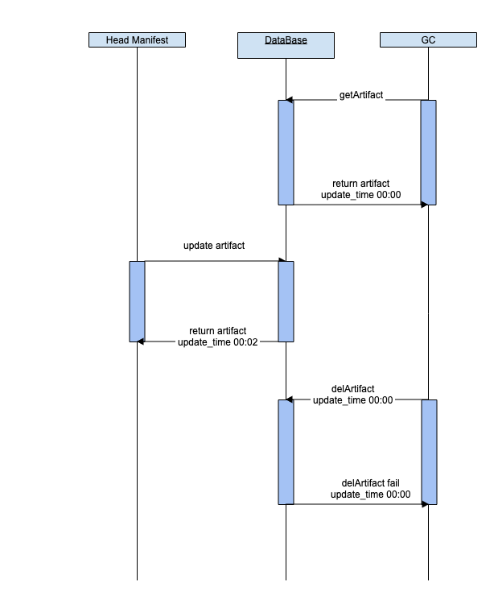


### Mark

Bases on the Harbor DB, we can count each blob/manifest's reference count, and select the reference count 0 as the candidate.
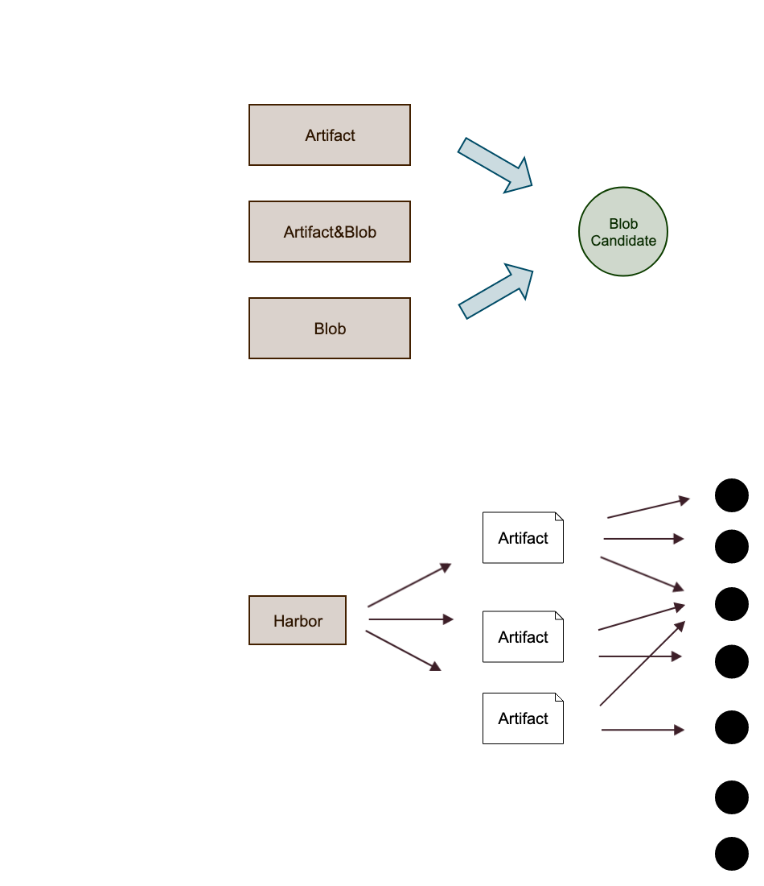


#### Question 1, how to deal with the uploading blobs at the phase of marking.
We do have a table to record the uploading blobs info, that's project & blob.
The delete candidate excludes all of blobs that in the project & blob.

1. candidate set 1 -- all blobs from table blob exclude the items in the table project & blob.
2. candidate set 1 excludes all of referenced blobs (artifact -> artifact & blob).

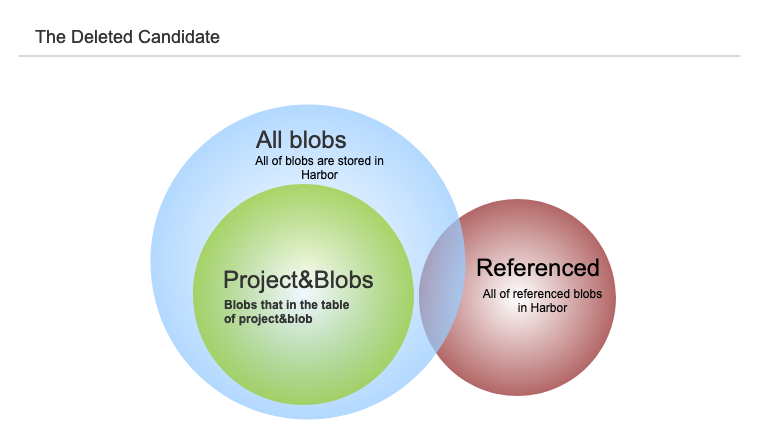

All of selected candidate are marked as status **delete**.

### Sweep

#### Blob Lifecycle
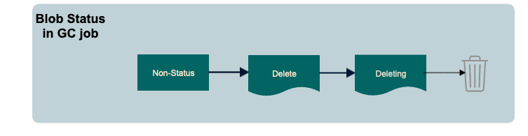

* Non-status(head - 200): normal blob that is being consumed by Harbor.
* Delete(head - 200): GC candidate
* Deleting(head - 404): The blob is being removed during GC.
* Delete Failed(head - 404): The blob fails to removed from storage, and it will be in the candidate in the next GC execution.

1. Non-status -> Delete : Mark the blob as candidate.
2. Delete -> Deleting : Select the blob and call the API to delete asset in the backend storage.
3. Deleting -> Trash : Delete success.
4. Delete -> Non-status : Client asks the existence of blob, remove it from the candidate.
5. Delete Failed -> Non-status : The delete failed blobs can be pushed again, and back to normal.
6. Delete Failed -> Delete : The delete failed blobs should be in the candidate.

The registry controller will grant the capability of deleting blob & manifest.

How does docker client push a blob?
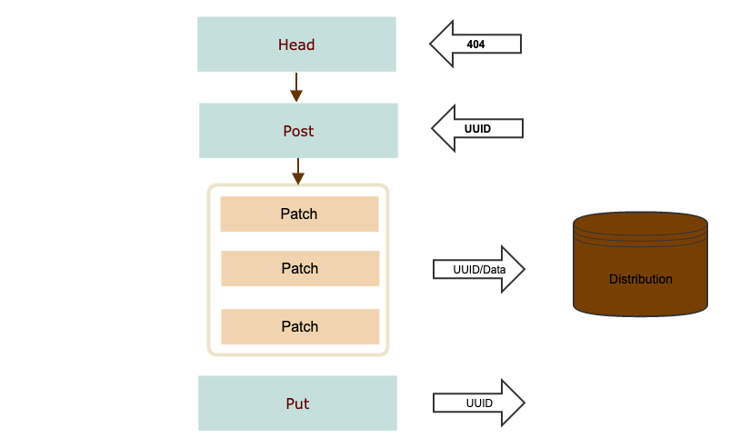

#### Question 1, how to deal with the uploading blobs at the phase of sweeping.
Docker client will send a head request to ask the existence of the blob, we will intercept that request.

1. if the blob is in deleting status, fail the request with 404. Docker client will continue to put the blob to registry, but at this time,
all of the uploaded data are stored at '_upload' folder.
2. if the blob is in delete status, remove it from the candidate.

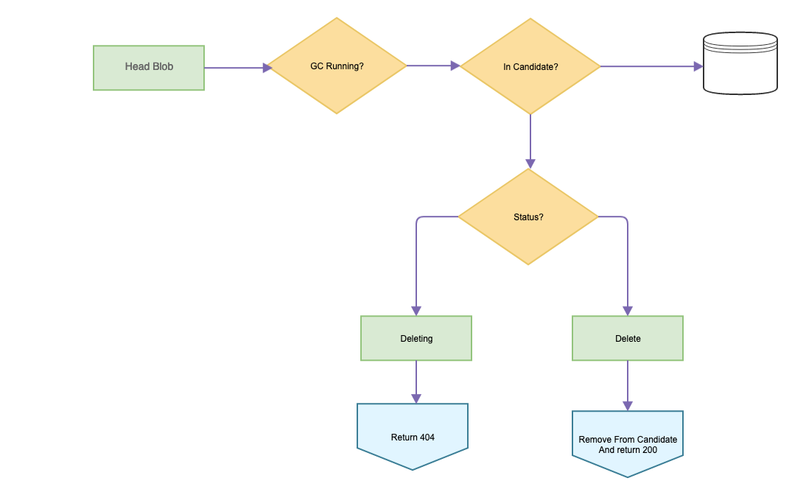

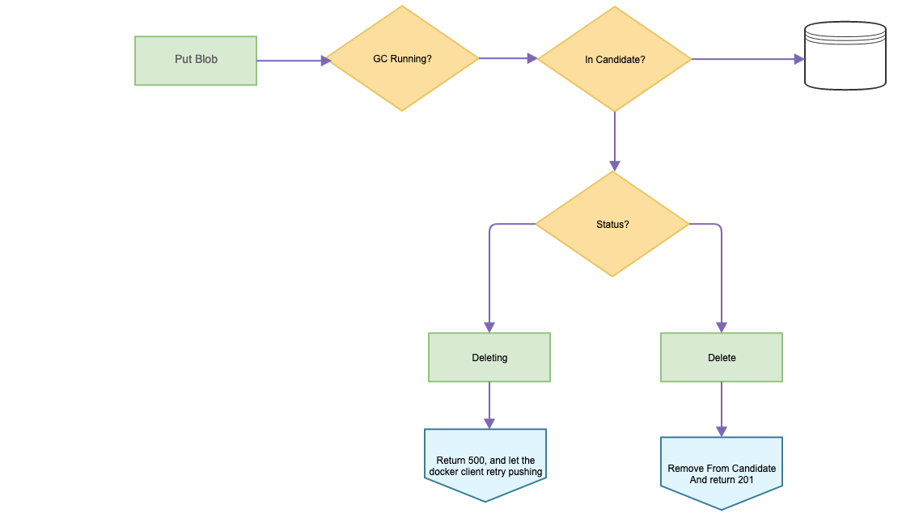

Not in candidate, Head request returns 200. But GC marks it as delete at this time.
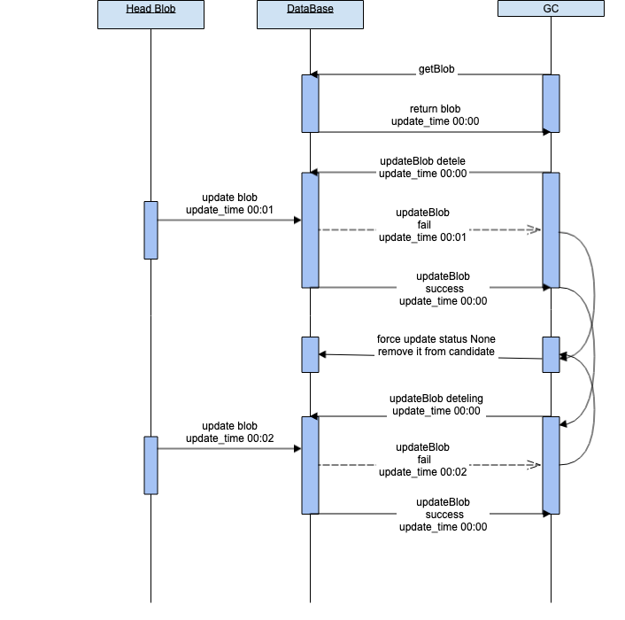

#### Question 2, how to deal with the uploading manifest at the phase of sweeping.
Docker client will always send a put request to push manifest(not for Index), we will intercept that request.

1. if the manifest is in deleting status, pause the request and wait for deletion. Fail it when timeout.
2. if the manifest is in delete status, remove it from the candidate.

The put manifest will be eventually passed to proxy, and let registry to deal with it.

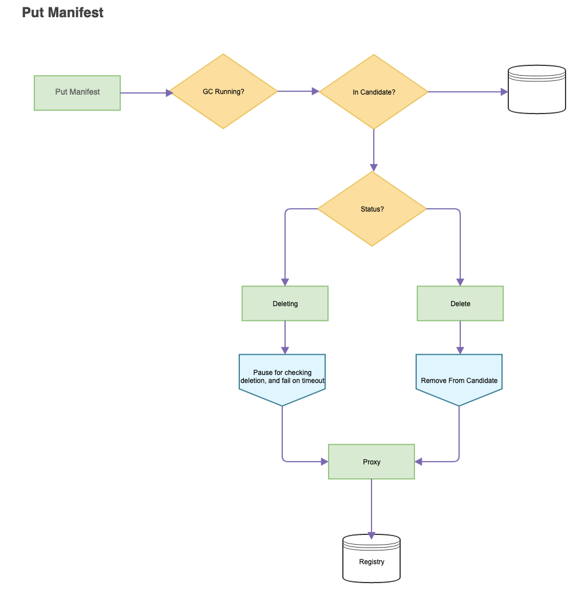

#### Question 3, how to deal with the uploading "untagged manifest" of a index at the phase of sweeping.
Different with push a stand alone artifact, docker client will send a head request before putting a manifest in push a **untagged** manifest in the process of pushing Index,  we will intercept that request.

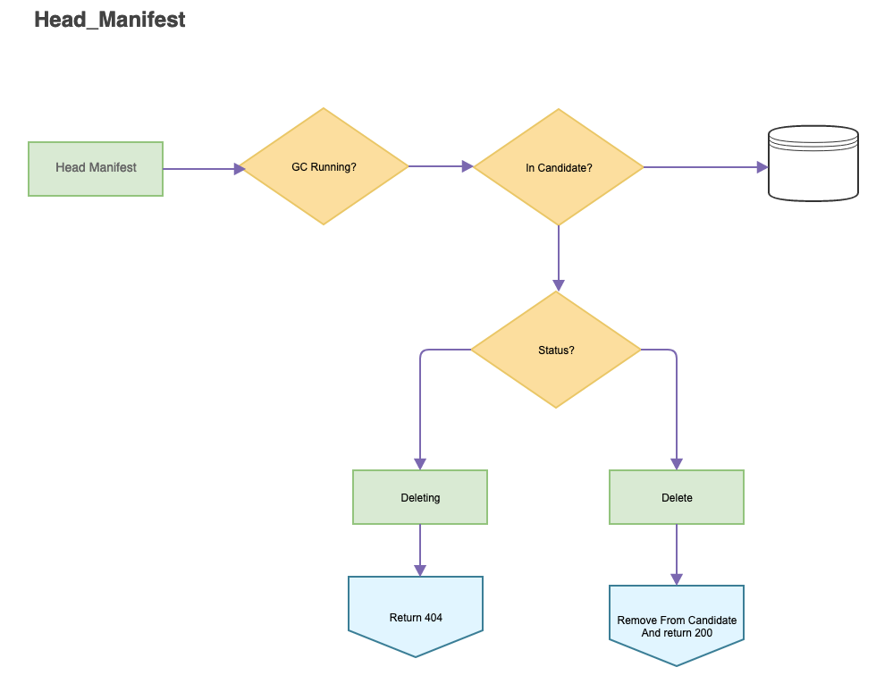

#### Question 4, what about if client only sends head request, and no put following.
The manifest or blob will only be removed from the deletion candidates, and it can be GCed in the next execution.

### Blob DB scheme

It needs to add two more attributes, **update_time and status**.

```
CREATE TABLE blob
(
  id            SERIAL PRIMARY KEY NOT NULL,
  /*
     digest of config, layer, manifest
  */
  digest        varchar(255)        NOT NULL,
  content_type  varchar(1024)       NOT NULL,
  size          bigint              NOT NULL,
  status        varchar(255)        NOT NULL, 
  update_time   timestamp default CURRENT_TIMESTAMP,
  creation_time timestamp default CURRENT_TIMESTAMP,
  UNIQUE (digest)
);
```

### Delete Blob & Manifest
We'd like to enable the registry controller to have the capability to delete blob & manifest via digest by leveraging the distribution code as library.

To grant the capability to delete blob & manifest, the registyctl should share the configuration file of registry.

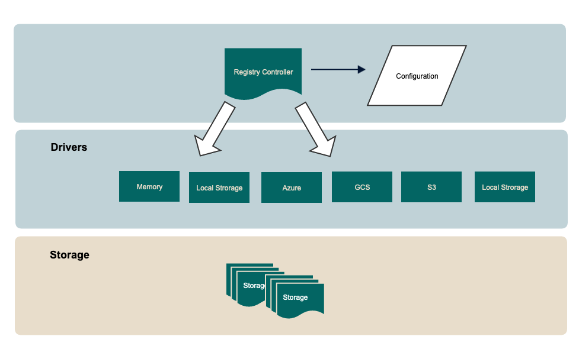

**DOUBLE GUARANTEE**

1. Cutoff time -- We need to introduce the cutoff time, any to be deleted blob & manifest, the update time must not be later than the cutoff time.
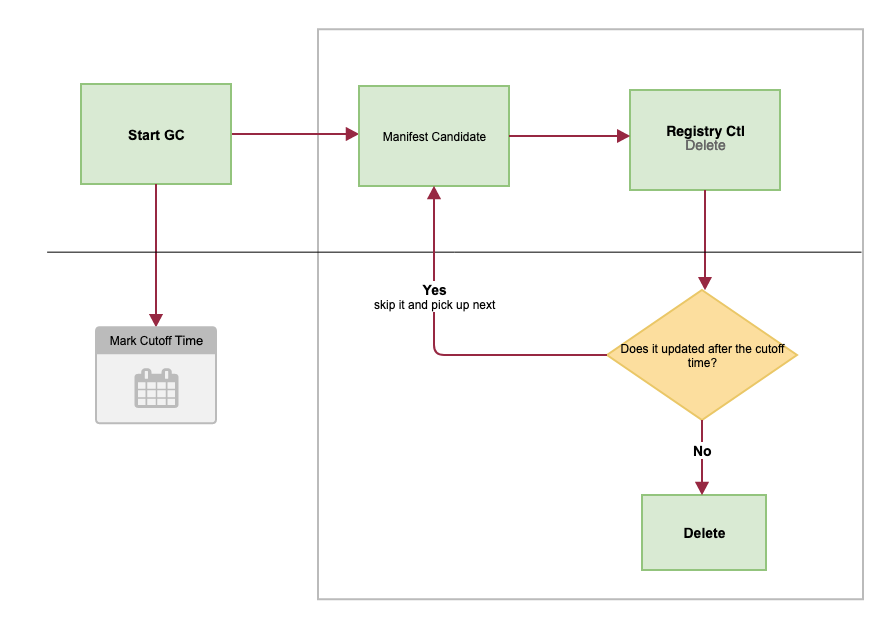

2. Time window -- We need to introduce the time window, the blobs/manifest in the time window will be reserved.
Even we introduce a update time to resolve the read/write, it still cannot resolve all of problems, like:
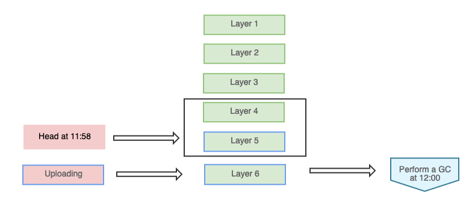

#### API

* Delete Blob
```
DELETE /api/registry/blob/{reference}

STATUS       : 202 Accepted
HEADERS      :
   Connection: keep-alive
   Content-Length: 0
   X-Request-Id: 92e7d4be-0291-4c50-92bd-889d71e1ec78
BODY         :

```

* Delete Manifest
```
DELETE /api/registry/{repo_name}/manifests/{reference}

STATUS       : 202 Accepted
HEADERS      :
   Connection: keep-alive
   Content-Length: 0
   X-Request-Id: 92e7d4be-0291-4c50-92bd-889d71e1ec78
BODY         :

```

Draft code PR has been created: https://github.com/goharbor/harbor/pull/12006

### Overall flow
The basic flow is:

* Mark the GC candidates in GC job.
* Trigger a GC job and pass the candidates.
* Call registry controller API to delete blob & manifest in GC job.

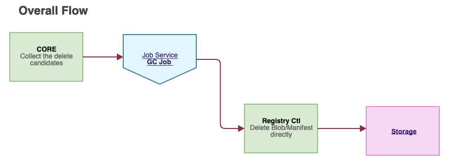

## Fragment Read-Only [optional 2]

The basic idea is that, Harbor selects a subset for the GC candidate full-set, marks these blob as read-only, and recover read-only after deletion success.
The read-only is not a system wide, just within the subset. Harbor only blocks the request that pushes blob & manifest belongs to the selected subset.

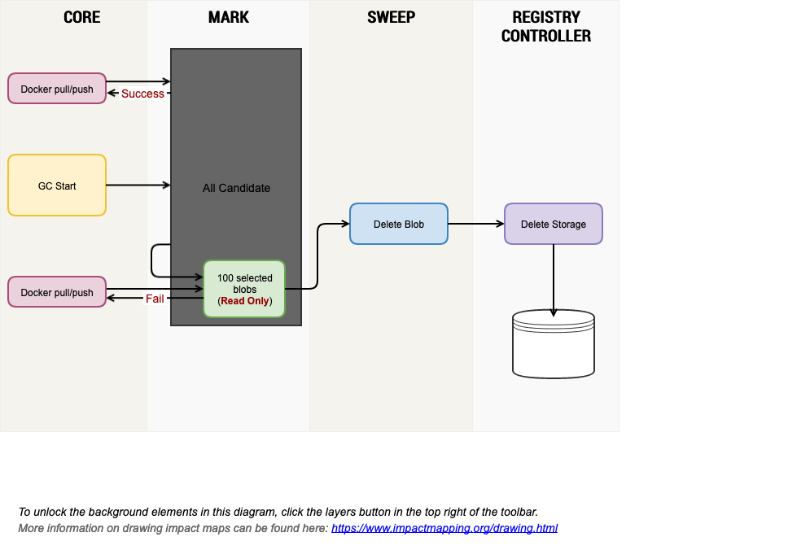

### To Be Discussed 

* (This can be handled by job-service) What about if harbor crash but the blob status was marked as **deleting**, for the current desgin, this blob cannot be pushed in the following operations.
 
* What about if harbor crash but the system was marked as **GC Running**? To erase it on core launching?

We can consider not to introduce it.
 