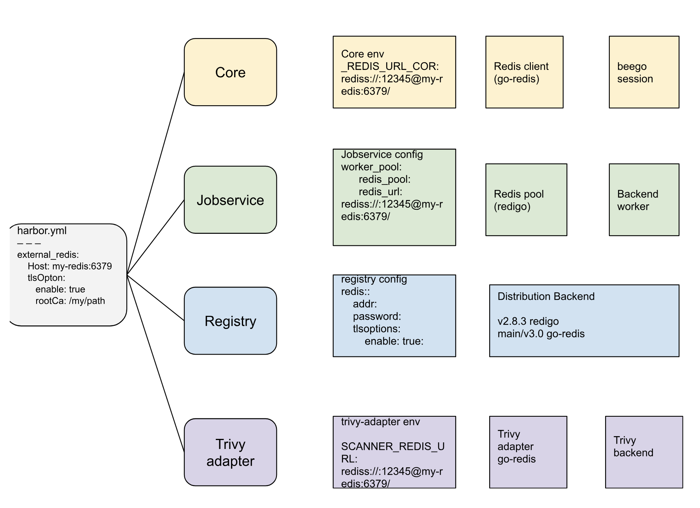
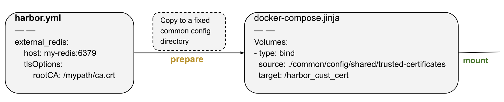
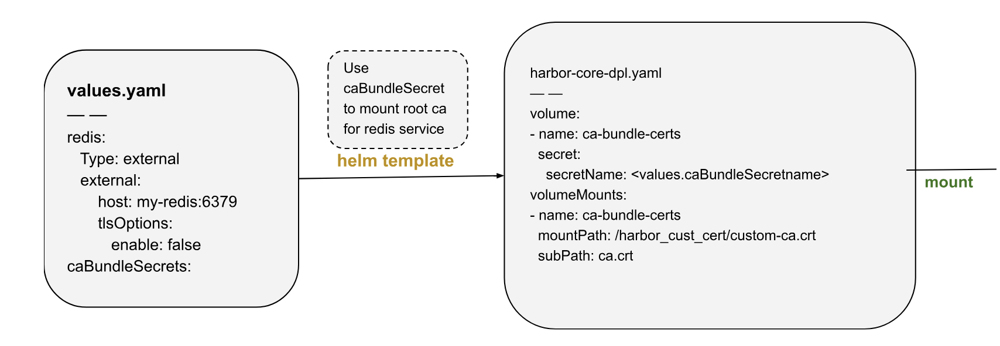

# Proposal: Support Redis TLS -Phase1

Author: MinerYang

Discussion:
* https://github.com/goharbor/harbor/issues/13223

## Background
While external redis been used for Harbor, allow users to secure their redis connection with Harbor components by SSL/TLS. 

## Abstract
With growing demand for secure Redis connections in cloud environments and it become a recommended best practice for an external managed redis services,like Azure cache for redis, Amzon ElasticCache or Redis in HA mode with Redis Sentinel, Harbor will support SSL/TLS encryption for external Redis connections, ensuring secure and reliable communication between Harbor services and Redis instances.

## Goals
- Server-authentication for TLS connection of external Redis service

## Non-Goals
- Internal Redis TLS support
- mTLS(both server and client authentication) support for Redis service

**NOTE:**
By default, standard [Redis uses mutual TLS](https://redis.io/docs/latest/operate/oss_and_stack/management/security/encryption/) and requires both server and clients to authenticate with valid certificates. However Harbor would not support mTLS in Phase-1. You may use `tls-auth-clients no` to disable client authentication.

## Implenmentation

## Config via offline-installer
Config external redis for harbor offline installer in `harbor.yml` file, we will use `tlsOptions.rootCA` to determine if enable the TLS connection and mount the redis CA to a system trusted directory.

## Config via harbor-helm
Config external redis for harbor-helm in `values.yaml` file, we will use `tlsOptions.enable` to determine if it is a redis TLS connection, and opting `caBundleSecrets` for CA mount to system trusted directory. Users need concatenate their own redis CA with other certificates for all external service that needs a certificate authentications, and create the secret with the `ca.crt` key. 
