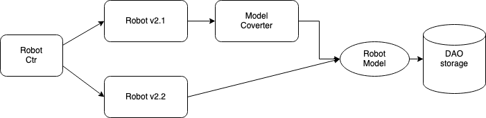
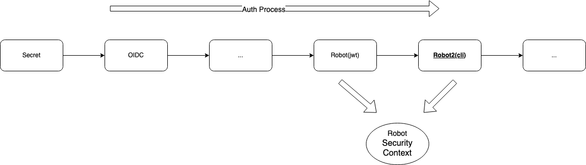
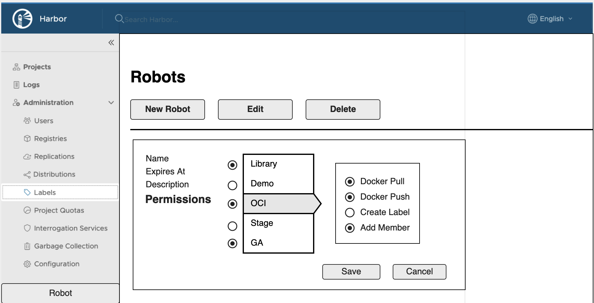

Proposal: Robot account enhancement

Author: Yan Wang

Discussion: [goharbor/harbor#10774](https://github.com/goharbor/harbor/issues/10774) [goharbor/harbor#11286](https://github.com/goharbor/harbor/issues/11286)

## Abstract

Robot account limited into one specific project, it cannot access multiple projects. 

## Motivation

In the current release, Harbor uses jwt as its token, but it cannot satisfy user's requirement, like manage multiple projects or edit access scope or expiration date. 

## Solution

This proposal wants to try to introduce a way to enable robot account access scope edition without creating a new robot, and system level robot account creation.

## Non Goal

1.  Do not migrate old mode robot, keep it as it is. The old mode robot account can be used as before, but cannot show/edit the access scope. 
2.  Do not support add a robot account into a project as a member to get the permission suite(Role binding).
3.  Do not support customize the pre-defined scope.
4.  Do not support update level of robot account, like from project level to system level.
5.  Do not support system level operations with robot account.

## Personas and User Stories

This section lists the user stories for the different personas interacting with robot account.

* Personas

Robot Account is a System Administrator and Project Administrator operation in Harbor.

* User Stories

1.  As a system admin, I can create a system level robot account with the selected projects and access scope.
2.  As a system admin, I can edit a system level robot account to enhance/reduce the access scope.
3.  As a system admin, I can edit a system level robot account to enhance/reduce the project scope.
4.  As a system admin, I can extend the expiration data of a system level robot account.
5.  As a system admin, I can view/edit the secret of a system level robot account and refresh the secret.
6.  As a system/project admin, I can create a project level robot account with the selected access scope.
7.  As a system/project admin, I can edit a project level robot account to enhance/reduce the access scope.
8.  As a system/project admin, I can extend the expiration data of a project level robot account.
9.  As a system/project admin, I can view/edit the secret of a project level robot account and refresh the secret.

## Main Points

1.  Replace JWT token with the secret.
2.  Store all things of robot into data base, expiration date, secret and permissions.
3.  Support both old and new robot mode authenticate.

## DB Scheme Change

Update the robot table to record the new format robot account.

```yaml

CREATE TABLE robot (
 id SERIAL PRIMARY KEY NOT NULL,
 name varchar(255),
 description varchar(1024),
 expiresat bigint,
 /*
  project_id 
    0 means, it's a system level robot
    non-0 means, it's a project level robot
  */
 project_id int,
 /*
  secret string used as the password of robot account.
  For v2.2, it stores the secret.
  */
 secret varchar(2048),
 disabled boolean DEFAULT false NOT NULL,
 creation_time timestamp default CURRENT_TIMESTAMP,
 update_time timestamp default CURRENT_TIMESTAMP,
 CONSTRAINT unique_robot UNIQUE (name, project_id)
);

```

```yaml

CREATE TABLE role_permission (
 id SERIAL PRIMARY KEY NOT NULL,
 role_type varchar(255),
 role_id int,
 rbac_policy_id int,
 creation_time timestamp default CURRENT_TIMESTAMP,
 update_time timestamp default CURRENT_TIMESTAMP,
 CONSTRAINT unique_role_permission UNIQUE (role_type, role_id, rbac_policy_id)
)

```

```yaml

CREATE TABLE rbac_policy (
 id SERIAL PRIMARY KEY NOT NULL,
 /*
  scope 
   system level: /system
   project level: /project/{id}
   all project: /project/*
  */
 scope string,
 resource varchar(255),
 action varchar(255),
 effect varchar(255),
 creation_time timestamp default CURRENT_TIMESTAMP,
 update_time timestamp default CURRENT_TIMESTAMP,
 CONSTRAINT unique_securable UNIQUE (scope, resource, action, effect)
)

```

## API

Entries:

1.  For system level:  api/v2.0/robots (for 2.2+)
2.  For project level: api/v2.0/projects/{id}/robots (only reserve for the backward compatible)


* Create a project level robot account (v2.1 or previous), it will be reserved but not used in the v2.2 UI.
```
POST api/v2.0/projects/{id}/robots

STATUS       : 201 Accepted
HEADERS      :
   Connection: keep-alive
   Content-Length: 0
   X-Request-Id: 92e7d4be-0291-4c50-92bd-889d71e1ec78
BODY         :

{
   "name":"robotaccount",
   "expires_at":-1,
   "description":"robot account 2",
   "access":[
      {
         "resource":"repository",
         "action":"push"
      },
      {
         "resource":"helm-chart",
         "action":"read"
      },
      {
         "resource":"helm-chart-version",
         "action":"create"
      }
   ]
}

```

* Create a system level robot account (with multiple projects)

```
POST api/v2.0/robots

STATUS       : 201 Accepted
HEADERS      :
   Connection: keep-alive
   Content-Length: 0
   X-Request-Id: 92e7d4be-0291-4c50-92bd-889d71e1ec78
BODY         :

{
   "name":"robotaccount",
   "description":"robot account",
   "expires_at":-1,
   "level":"system",
   "permissions":[
        {
            kind: "project", 
            namespace: "library",
            access: [
                  {
                     "resource":"repository",
                     "action":"push"
                  }
            ]
        },
        {
            kind: "project", 
            namespace: "demo",
            access: [
                  {
                     "resource":"repository",
                     "action":"push"
                  }
            ]
        }
   ]    
}

```

* Create a system level robot account (with all projects)

```
POST api/v2.0/robots

STATUS       : 201 Accepted
HEADERS      :
   Connection: keep-alive
   Content-Length: 0
   X-Request-Id: 92e7d4be-0291-4c50-92bd-889d71e1ec78
BODY         :

{
   "name":"robotaccount",
   "description":"robot account",
   "expires_at":-1,
   "level":"system",
   "permissions":[
        {
            kind: "project", 
            namespace: "*",
            access: [
                  {
                     "resource":"repository",
                     "action":"push"
                  }
            ]
        }
   ]    
}

```

* Create a system level robot account (with project and system access)

```
POST api/v2.0/robots

STATUS       : 201 Accepted
HEADERS      :
   Connection: keep-alive
   Content-Length: 0
   X-Request-Id: 92e7d4be-0291-4c50-92bd-889d71e1ec78
BODY         :

{
   "name":"robotaccount",
   "description":"robot account",
   "expires_at":-1,
   "level":"system",
   "permissions":[
        {
            kind: "project", 
            namespace: "library",
            access: [
                  {
                     "resource":"repository",
                     "action":"push"
                  }
            ]
        },
        {
            kind: "system", 
            namespace: "/",
            access: [
                  {
                     "resource":"users",
                     "action":"create"
                  }
            ]
        }
   ]    
}

```

* Update permissions of a project level robot account

```
PUT api/v2.0/robots/{id}

STATUS       : 200 OK
HEADERS      :
   Connection: keep-alive
   Content-Length: 0
   X-Request-Id: 92e7d4be-0291-4c50-92bd-889d71e1ec78
BODY         :

{
   "id": 2,
   "name":"robotaccount",
   "description":"robot account",
   "project_id":1,
   "disable":false,   
   "expires_at":-1,
   "level": "project",
   "permissions":[
        {
            kind: "project", 
            namespace: "library",
            access: [
                  {
                     "resource":"repository",
                     "action":"push"
                  }
            ]
        },
        {
            kind: "project", 
            namespace: "demo",
            access: [
                  {
                     "resource":"repository",
                     "action":"push"
                  }
            ]
        }
   ]  
}

```

* Update secret of a system level robot account (with a different secret), to refresh the secret, the secret in body
must match the one in DB.

```
PUT api/v2.0/robots/{id}

STATUS       : 200 OK
HEADERS      :
   Connection: keep-alive
   Content-Length: 0
   X-Request-Id: 92e7d4be-0291-4c50-92bd-889d71e1ec78
BODY         :

{
   "id": 2,
   "name":"robotaccount",
   "description":"robot account",
   "project_id":1,
   "disable":false,   
   "expires_at":-1,
   "level": "project",
   "secret":"2bd889d71e1ec78",
   "permissions":[
        {
            kind: "project", 
            namespace: "library",
            access: [
                  {
                     "resource":"repository",
                     "action":"push"
                  }
            ]
        },
        {
            kind: "project", 
            namespace: "demo",
            access: [
                  {
                     "resource":"repository",
                     "action":"push"
                  }
            ]
        }
   ]
}

```

* Get all system level robot accounts

```
GET api/v2.0/robots
```

* Get all robot accounts of a specific project

```
GET GET api/v2.0/robots?level=project&project_id=1
```

For the old mode robot account, the permissions and expiration date are not editable.




## Authentication flow

Add a robot2 authenticator after robot. For the multiple projects handling on robot2, just merge all accesses into one security context.




```
func NewSecurityContext(robot *model.Robot, level string, policy []*types.Policy) *SecurityContext {
	...
}
```

## How to distinguish robot with harbor user

Tow options:

1.  Reserve the prefix, but with another different character, like "@", "+" or ":", these are not need to be escaped in shell script.
2.  Remove the prefix (robot$), and set the password of robot as all lower case, as harbor cannot set all lower case as the password of user.

Choose the option 1, but gives the ability that use can configurate it, do not save prefix in the DB, but the docker login must with the prefix.

## Mock up UI

The UI of creating a system level robot



### To Be Discussed 

* The pre-defined access scope for robot creation, no Spec so far.
* (P1)Whether to provide Kubernetes pull secret for the robot account.
* (P1)Whether to provide Docker credentials config for the robot account.

## Security Concern

* As the robot accounts in different projects may have same name and password, from the current RBAC model, after docker login with the conflict robot, 
Harbor will grant the robot with all the projects(has the robot) access.

* If let the project admin can list the system level robots that has the access of the current project,  it needs the project admin can access system resource.


