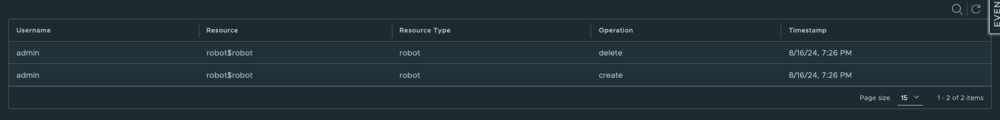
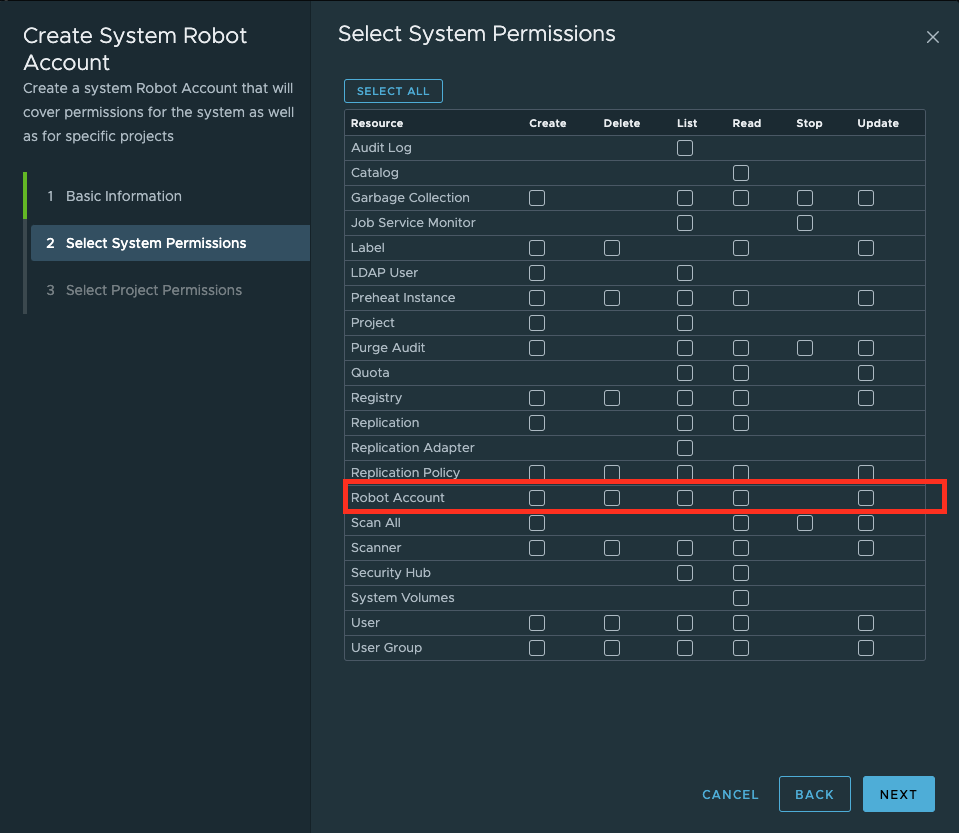

Proposal: Robot account permission enhancement

Author: Yan Wang

Discussion: [goharbor/harbor#20076](https://github.com/goharbor/harbor/issues/20076)

## Abstract

Since v2.10.0, robot accounts in Harbor have been restricted to specific permission scopes. This means that neither system nor project-level administrators can assign permissions to a robot account that fall outside of its designated scope.

## Motivation

Originally, the Harbor UI offered 16 permission options for users, but this was expanded to 40 in v2.10. To address security concerns, Harbor currently restricts the creation of robots with permissions related to user (normal and robot), group, and quota creation/deletion. However, this restriction has disrupted some users' existing pipelines that rely on robots with these prohibited permissions.

## Solution

This proposal suggests introducing a permission enhancement that allows admins to create robot accounts with a restricted permission set—introduced in v2.10—by specifying the selected permissions.
Additionally, by recording the creator of each robot account in the database and audit logs, this feature will help system administrators mitigate security concerns and ensure accountability.

## Non Goal

1. No support for configuring the banned permissions in the harbor v2.10.0
2. No support for granting system configuration permission for a robot

## Personas and User Stories

This section lists the user stories for the different personas interacting with robot account.

* Personas

Robot Account is a System Administrator and Project Administrator operation in Harbor.

* User Stories

1. As a system/project administrator, I can create a project-level robot account with the selected access scope, including the banned scope set in the harbor v2.10.0.
2. The creation and deletion of robot accounts will be recorded in the audit log.
3. As a system administrator, I can identify the creator of each robot account by performing an SQL query in the database.
4. A robot account can create another robot account, but the new account’s scope must be less than or equal to that of the creator.
5. A robot account created by another robot can only be updated or deleted by either the human/system level robot account with the relevant permissions, the creator of the robot account, or the robot account itself.

## Keep track of robot accounts

Over time, as you create more and more robot accounts, and you may lose track of who creates the robot account and which robot account is used for.

1. the creator name of a robot account is a good way to capture the contact person for the account. For new robots that created after this proposal be introduced, Harbor will populate the name
of the creator when creating the robot account. 
2. The new audit logs for robot account creation and deletion are good way for you to track the lifecycle of the created robots.



## Robot accounts that are created and managed by another robot accounts

Robot accounts are principals, it means that you can grant robot account to Harbor resources. However, from the perspective of preventing privilege escalation, generally, a robot account 
cannot grant roles that are higher or more powerful than the roles it possesses. When a robot account creates a new robot account, the new robot account doesn't automatically inherit any roles
or permissions.

Creation: If a robot account has been given the role of robot account creation, it can create or manage other robot accounts but only within the permissions of its own roles.
1. any project level robot account can be created by a system or project level robot account who with the robot creation permission.
2. any system level robot account can be created by a system level robot account who with the robot creation permission.

Deletion/Update: A robot account cannot assign permissions to another robot account that exceed its own permissions.
1. any robot account that created by another robot can be updated by the creator robot or the itself, provided that the update permission has been granted to the creator or the robot itself.
2. any robot account that created by another robot can be deleted by the creator robot or the itself, provided that the delete permission has been granted to the creator or the robot itself.

When a robot account is removed, the robot accounts that were created by that removed account will not be automatically removed. The robot account that were created by the now-deleted robot continue 
to exist and function independently, provide they have the necessary permissions.

Open questions:
1. Is there any limitation for the number of robot accounts that can be created by an existing robot account?
2. Is there any limitation for the number of robot accounts you can create within a single project?

## Scheme Change

Add a new column of creator for table robot.

```
ALTER TABLE robot ADD COLUMN IF NOT EXISTS creator_ref integer;
ALTER TABLE robot ADD COLUMN IF NOT EXISTS creator_type varchar(255);

UPDATE robot SET creator_ref = 0 WHERE creator IS NULL;

```

Examples:

```
6 | test1 |             |          0 | 1727520672 | f        | 2024-08-29 10:51:12.911411 | 2024-08-29 10:51:12.911419 | t       | c3be511635281d7874
8b4204539c8a13 | 4N66mfxj8bsM0BJ0cHYjGJMhvIsCkjbR |       30 | robot$test
7 | test2 |             |          0 | 1727933810 | f        | 2024-09-03 05:36:50.102285 | 2024-09-03 05:36:50.102298 | t       | 423b24f57a0b2e0770
9e206b7eb2c287 | xx7sHhegkZ7N2nvx063pRzk9irbN0ddR |       30 | admin
```

## Prohibited Permissions

1.  System Level

|   Resource    | Action  | Enable |
|:-------------:|:-------:|:------:|
| Configuration |  Read   |   N    |
| Configuration | Update  |   N    |
|   ExportCVE   |  Read   |   Y    |
|   ExportCVE   | Create  |   Y    |
|   LdapUser    |  List   |   Y    |
|   LdapUser    | Create  |   Y    |
|  User-Group   |  List   |   Y    |
|  User-Group   | Create  |   Y    |
|  User-Group   |  Read   |   Y    |
|  User-Group   | Update  |   Y    |
|  User-Group   | Delete  |   Y    |
|     Robot     |  Read   |   Y    |
|     Robot     | Update  |   Y    |
|     Robot     |  List   |   Y    |
|     Robot     | Create  |   Y    |
|     Robot     | Delete  |   Y    |
|     User      |  Read   |   Y    |
|     User      | Update  |   Y    |
|     User      |  List   |   Y    |
|     User      | Create  |   Y    |
|     User      | Delete  |   Y    |
|     Quota     | Update  |   Y    |

2.  Project Level

| Resource  | Action  | Enable |
|:---------:|:-------:|:------:|
|  Member   |  List   |   Y    |
|  Member   | Create  |   Y    |
|  Member   |  Read   |   Y    |
|  Member   | Update  |   Y    |
|  Member   | Delete  |   Y    |
|   Robot   |  Read   |   Y    |
|   Robot   | Update  |   Y    |
|   Robot   |  List   |   Y    |
|   Robot   | Create  |   Y    |
|   Robot   | Delete  |   Y    |



## Data provider

```go

// RobotPermissionProvider defines the permission provider for robot account
type RobotPermissionProvider interface {
	GetPermissions(s scope) []*types.Policy
}

// BaseProvider ...
type BaseProvider struct {
}

// GetPermissions ...
func (d *BaseProvider) GetPermissions(s scope) []*types.Policy {
	return PoliciesMap[s]
}

// NolimitProvider ...
type NolimitProvider struct {
	BaseProvider
}

// GetPermissions ...
func (n *NolimitProvider) GetPermissions(s scope) []*types.Policy {
	if s == ScopeSystem {
		return append(n.BaseProvider.GetPermissions(ScopeSystem),
			&types.Policy{Resource: ResourceRobot, Action: ActionCreate},
			&types.Policy{Resource: ResourceRobot, Action: ActionRead},
			&types.Policy{Resource: ResourceRobot, Action: ActionUpdate},
			&types.Policy{Resource: ResourceRobot, Action: ActionList},
			&types.Policy{Resource: ResourceRobot, Action: ActionDelete},
			
			...
	}
	if s == ScopeProject {
		return append(n.BaseProvider.GetPermissions(ScopeProject),
			&types.Policy{Resource: ResourceRobot, Action: ActionCreate},
			&types.Policy{Resource: ResourceRobot, Action: ActionRead},
			&types.Policy{Resource: ResourceRobot, Action: ActionUpdate},
			&types.Policy{Resource: ResourceRobot, Action: ActionList},
			&types.Policy{Resource: ResourceRobot, Action: ActionDelete},

            ...
	}
	return []*types.Policy{}
}


```