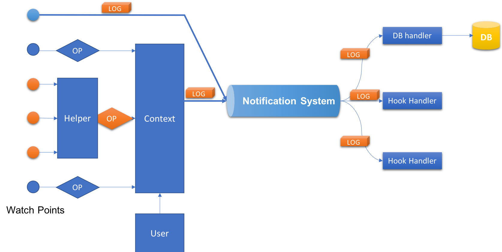

# Access log proposal

Author: [Steven Zou](https://github.com/steven-zou)

## Abstract

The operations applied to any target governed resources by Harbor will be recorded as access log with enough information for future auditing requirement.

## Background

The current access log is designed specific for container image related. It's lack of enough flexibility to enable new operations or new target resource type. Additionally, the information contained in the access log is not rich enough for auditing usage.

## Solution

A flexible access log framework is proposed here to improve the drawbacks of current access log feature.

### Data model

A general access log data model should be created to cover the general log requirement.

```go

type AccessLogItem struct {
    // The ID to identify the log item
    LogID uint64 `json:"log_id"`

    // The operation owner
    Operator struct {
        // ID of the operator
        UID uint64 `json`

        // Name of the operator
        Name string `name`

        // Role info of the operator
        Role struct {
            // ID of the role
            RID uint64 `json:"id"`

            // Name of the role
            Name string `json:"name"`

            // Reference link of the role if existing
            Ref string `json:"ref"`
        } `json:"role"`

        // Reference link of the operator if existing
        Ref string `json:"ref"`
    } `json:"operator"`

    // The target resource of the operation
    Resource struct {
        // ID of the resource
        RID uint64 `json:"id"`

        // Display name of the resource
        DisplayName string `json:"display_name"`

        // The version of the resource if applicable
        Version string `json:"version"`

        // The reference link of the resource if existing
        Ref string `json:"ref"`

        // Flexible placeholders for extending
        Metadata map[string]interface{} `json:"metadata"`
    } `json:"resource"`

    // The operation applied to the target resource
    Operation struct {
        // The catalog that the operation belong to if applicable
        Catalog string `json:"catalog"`

        // The operation name
        Name string `json:"name"`

        // The operation perniciousness DANGER/SAFE/NORMAL etc.
        Level string `json:"level"`
    }

    // The operation result
    Result struct {
        // Http code for the operation
        Code uint `json:"code"`

        // Error message for the operation if applicable
        Error error `json:"error"`
    } `json:"result"`

    // The time when the operation happened
    Timestamp int64 `json:"timestamp"`

    // Flexible placeholders for extending
    Metadata map[string]interface{} `json:"metadata"`
}
```

### Log render style

The access log can be displayed with natural meaningful statement using the below pattern:

```shell
# [ID] [Operator] [result] [operation] [resource] on [timestamp]
# e.g
[1] Steven Zou failed to delete project library on 2018/10/01

# The following terms can be with hyperlinks
# `Steven Zou`
# `project`

# The style (e.g: font color) will be rendered according to the `level` info
```

Access logs will be ordered with `desc` order.

### Work flow

The main work flow of the access log is described in the below graph



#### Overview

In this proposal, the notification system (sub-pub mode) is adopted to distribute the access log item copies to the different interested parties. Multiple handlers can be registered to the system with the `ACCESS_LOG` topic to receive the log items.

```go
// Subscribe
notifier.Subscribe("ACCESS_LOG", &AcceeLogHandler{})

// Publish access log
notifier.Publish("ACCESS_LOG", &AccessLogItem{})
```

There are two typical handler types we'll support as default:
  
* DB handler: It's responsible to persist the access log items to the corresponding database for future querying.
* Hook handler: It's a web hook driver. It will send the access log items to the 3rd parties via http services. Each web hook from 3rd party will be registered as an independent hook handler.

If new handler is required, just implement the handler interface and register it to the notification system.

```go
// NotificationHandler defines what operations a notification handler
// should have.
type NotificationHandler interface {
	// Handle the event when it coming.
	// value might be optional, it depends on usages.
	Handle(value interface{}) error

	// IsStateful returns whether the handler is stateful or not.
	// If handler is stateful, it will not be triggerred in parallel.
	// Otherwise, the handler will be triggered concurrently if more
	// than one same handler are matched the topics.
	IsStateful() bool
}
```

#### Access log item building

When a certain operation triggered at the watch points, a access log item should be built before publishing it to the distribution system. As log item contains several context related info like operator and resource etc., the building procedure becomes a little complicated. As drawn in the above flow graph, there are possible two ways supported to create the log item.

* **By helper**

Many operations can be mapped to http requests. A helper can help to maintain the mappings between operation and http request and catch the http requests at the entry point or base API controller to record the access log automatically based on the pre-defined mappings.

* First, declare the mapping

```go
const CreateChart = &Operation{
    Catalog:"chart",
    Operation: "create",
    Level: "NORMAL",
}

var ChartResourceExtract ResourceExtractor = func(req *http.Request)(*Resource, error){
    // ...
    return &Resource{}, nil
}

AccesslogHelper.Monitor(helper.POST, "/api/chartrepo/namespace/charts", helper.CreateChart, ChartResourceExtract)
```

* Second, helper will filter and catch the matched requests at the entry point (maybe beego filter or base controller) then trigger the related handler to collect the required information.

* Next, inject other general information like current operator and timestamps etc. to build a completed access log item.

```go
AccesslogHelper.InjectContext(log)
```

* Finally, send it to the notification system to publish it to the interested parties.

```go
notifier.Publish("ACCESS_LOG", log)
```

* **Direct**

It means directly creating the log item and getting the required info by various library methods and then assembling them as a completed item. Finally publish it to the distribution system. This method is a basic way to cover some scenarios which are not applicable to the `by helper` way.

e.g:

```go

log:=&AccessLogItem{}
log.Timestamp = time.Now().Unix()
log.Operator = lib.GetUserInfo()
log.Resource = lib.ExtractResourceInfo()
log.Operation = lib.DeleteProjectOP()

notifier.Publish("ACCESS_LOG", log)
```