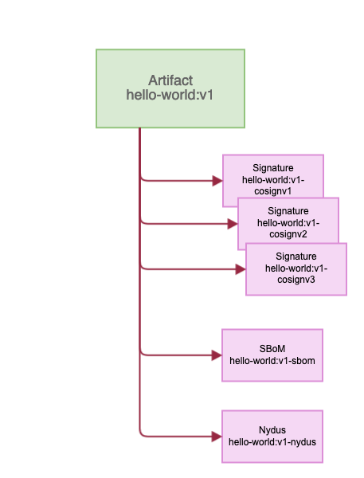
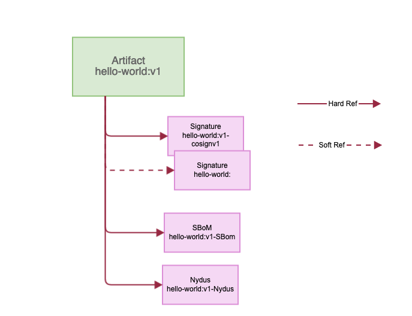
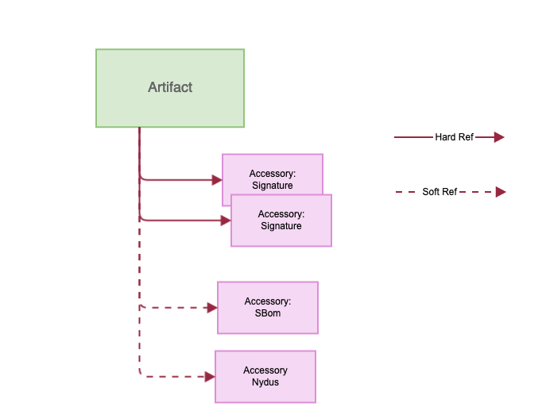

Proposal: Add abstract definition accessory

Author: Yan Wang

## Abstract

Beside to store an artifact into registry, there are requirements on storing secure chain artifacts, like Software Bill of Materials (SBoM) and signatures to provide rich  rich functionality of an artifact.

The proposal is to introduce an abstract definition -- accessory -- to enable Harbor to extend the capabilities for storing artifact with additional stuff.

## Motivation

Artifact Security has become a primary concern, user wants to store the signature, SBoMs to meet their security policy.

## Solution

To provide these capabilities, the abstract definition will provide a specification for storing and discovering an accessory, including the ability to store references between types, enabling a graph of objects.

## Definition

Accessory: Independent, but linked to an existing subject artifact, which enabling the extendibility of an OCI artifact.

* N:1 accessories, enabling multiple accessories to be linked to a single artifact.



* The operation of an accessory is on top of distribution v2 API.

* For the exposure, based on the subject artifact, user has to use the subject digest to discover accessory. Refer to the API.

* [To Be Discussed]The accessory is stored as individual, untagged artifact in Harbor. These Untagged artifacts are not subject to GC if they have a subject reference to an existing artifact.

The biggest challenge for Harbor is to add the new accessory lookup API's, and adjust GC to support accessory.

### Life Cycle Management

Reference: Add an artifact to Harbor, referencing existing content.

**Hard Reference** : The accessory is tied to the subject manifest.

**Soft Reference** : The accessory is not tied to the subject manifest.

The type of linkage of accessory and its subject. This should be discussed.

* By Tag: If the accessory doesn't have a tag, it's hard reference. Otherwise, it's soft.


* By Type: If the accessory is a kind of signature, it's hard reference. However, SBoM is soft.


Bases on the linkage, Harbor treats the accessory as either a standalone artifact or an extra stuff of a subject artifact.

**Deletion**
1. Soft Reference:  If the linkage is Soft Reference, when the subject artifact is removed, the linkage will be removed as well, the accessory becomes an individual artifact.
2. Hard Reference:  If the linkage is Hard Reference, the accessory will be removed together with the subject artifact.

**Garbage Collection**
1. Soft Reference:  If the linkage is Soft Reference, Harbor treats the accessory as normal artifact and will not set it as the GC candidate.
2. Hard Reference:  If the linkage is Hard Reference, Harbor treats the accessory as an extra stuff of the subject artifact. It means, it being tied to the subject artifact and will be GCed whenever the subject artifact is marked and deleted.

### DB scheme

```yaml

CREATE TABLE artifact_accessory (
 id SERIAL PRIMARY KEY NOT NULL,
 /*
    the artifact id of the accessory itself.
 */
 artifact_id int,
 /*
  the subject artifact id of the accessory.
 */
 subject_artifact_id int,
 /*
  the type of the accessory, like signature.cosign.
 */
 type varchar(1024),
 size int,
 digest varchar(1024),
 creation_time timestamp default CURRENT_TIMESTAMP,
 FOREIGN KEY (artifact_id) REFERENCES artifact(id),
 FOREIGN KEY (subject_artifact_id) REFERENCES artifact(id),
 CONSTRAINT unique_artifact_accessory UNIQUE (artifact_id, subject_artifact_id)
);

```

### Accessory Interface

```go
type Reference string
type HardRef Reference
type SoftRef Reference

type Accessory Struct {
	ID                int64                  `json:"id"`
	ArtifactID        int64                  `json:"artifact_id"`
	SubjectArtifactID int64                  `json:"subject_artifact_id"`
	Type              string                 `json:"type"`
	Size              int64                  `json:"size"`
	Digest            string                 `json:"digest"`
	CreationTime      time.Time              `json:"creation_time"`
	Ref               Reference              `json:"-"`
}

func (a Accessory) ReferenceType(ctx context.Context, artifact Artifact) Reference {
    return a.Ref
}

type Signature Struct {
    Accessory
}

type SBoM Struct {
    Accessory
}

```


### Request Artifact Accessory

**List artifact**

1. You can use the `signature.cosign` in the accessories to determine whether an object is signed and to view information about the signature, and you can pull the signature with digest in the registry store,
2. [?]You cannot list the accessories directly via list artifact API.

```yaml

GET /api/v2.0/projects/library/repositories/hello-world/artifacts

{
   ...
   "accessories":[
      {
         "artifact_id":1,
         "subject_artifact_id":81,
         "size": 1234,
         "digest":"sha256:94788818ad901025c81f8696f3ee61619526b963b7dc36435ac284f4497aa7ca",
         "type":"signature.example",
         "icon":"sha256:0048162a053eef4d4ce3fe7518615bef084403614f8bca43b40ae2e762e11e06",
      },
      {
         "artifact_id":2,
         "subject_artifact_id":81,
         "size": 1234,
         "digest":"sha256:94788818ad901025c81f8696f3ee61619526b963b7dc36435ac284f4497aa7cb",
         "type":"sbom.example",
         "icon":"sha256:0048162a053eef4d4ce3fe7518615bef084403614f8bca43b40ae2e762e11e06",
      }
   ],
   ...
}

```

**Request All Artifact Accessories**

```yaml
GET /api/v2.0/projects/library/repositories/hello-world/artifacts/accessories?n=<integer>

```

```yaml
GET /api/v2.0/projects/library/repositories/hello-world/artifacts/accessories?n=10&artifactType={artifactType}
```

Response

```yaml
200 OK
Link: <url>; rel="next"

{
  "accessories": [
    {
      "id": "<int>",
      "digest": "<string>",
      "media_type": "<string>",
      "manifest_media_type": "<string>",
      "size": <integer>
    },
    ...
  ]
}
```


**Delete an artifact**

User Stories outline the behavior:

1. If the top-level artifact is deleted, all the accessories that associate with the artifact are deleted unless it has tag.
2. The accessory can be deleted individually.

```rest
DELETE /api/v2.0/projects/library/repositories/hello-world/artifacts/sha256:1b26826f602946860c279fce658f31050cff2c596583af237d971f4629b57792

HTTP/1.1 200 OK
Server: nginx
Date: Thu, 22 Jul 2021 07:32:22 GMT
Content-Length: 0
Connection: keep-alive
Vary: Cookie
X-Harbor-Csrf-Token: u7bGUcekdbuVAVHuVl9tfuCx5EmJjPMMnL2S5hnPUudZzmZ8EdFX8KhfAIL6Dherx6kX2mk2VrknNghn165ORg==
X-Request-Id: 8d70f12a-9f73-4fc9-9e81-3bed24926254
Strict-Transport-Security: max-age=31536000; includeSubdomains; preload
X-Frame-Options: DENY
Content-Security-Policy: frame-ancestors 'none'
```

**Delete artifact signature(all)**

```rest
DELETE /api/v2.0/projects/library/repositories/hello-world/artifacts/sha256:1b26826f602946860c279fce658f31050cff2c596583af237d971f4629b57792/accessory?type=signature.cosign

HTTP/1.1 200 OK
Server: nginx
Date: Thu, 22 Jul 2021 07:32:22 GMT
Content-Length: 0
Connection: keep-alive
Vary: Cookie
X-Harbor-Csrf-Token: u7bGUcekdbuVAVHuVl9tfuCx5EmJjPMMnL2S5hnPUudZzmZ8EdFX8KhfAIL6Dherx6kX2mk2VrknNghn165ORg==
X-Request-Id: 8d70f12a-9f73-4fc9-9e81-3bed24926254
Strict-Transport-Security: max-age=31536000; includeSubdomains; preload
X-Frame-Options: DENY
Content-Security-Policy: frame-ancestors 'none'
```

**Delete artifact signature(specific)**

```rest
DELETE /api/v2.0/projects/library/repositories/hello-world/artifacts/sha256:1b26826f602946860c279fce658f31050cff2c596583af237d971f4629b57792/accessory?type=signature.cosign&digtest=sha256:94788818ad901025c81f8696f3ee61619526b963b7dc36435ac284f4497aa7cb

HTTP/1.1 200 OK
Server: nginx
Date: Thu, 22 Jul 2021 07:32:22 GMT
Content-Length: 0
Connection: keep-alive
Vary: Cookie
X-Harbor-Csrf-Token: u7bGUcekdbuVAVHuVl9tfuCx5EmJjPMMnL2S5hnPUudZzmZ8EdFX8KhfAIL6Dherx6kX2mk2VrknNghn165ORg==
X-Request-Id: 8d70f12a-9f73-4fc9-9e81-3bed24926254
Strict-Transport-Security: max-age=31536000; includeSubdomains; preload
X-Frame-Options: DENY
Content-Security-Policy: frame-ancestors 'none'
```