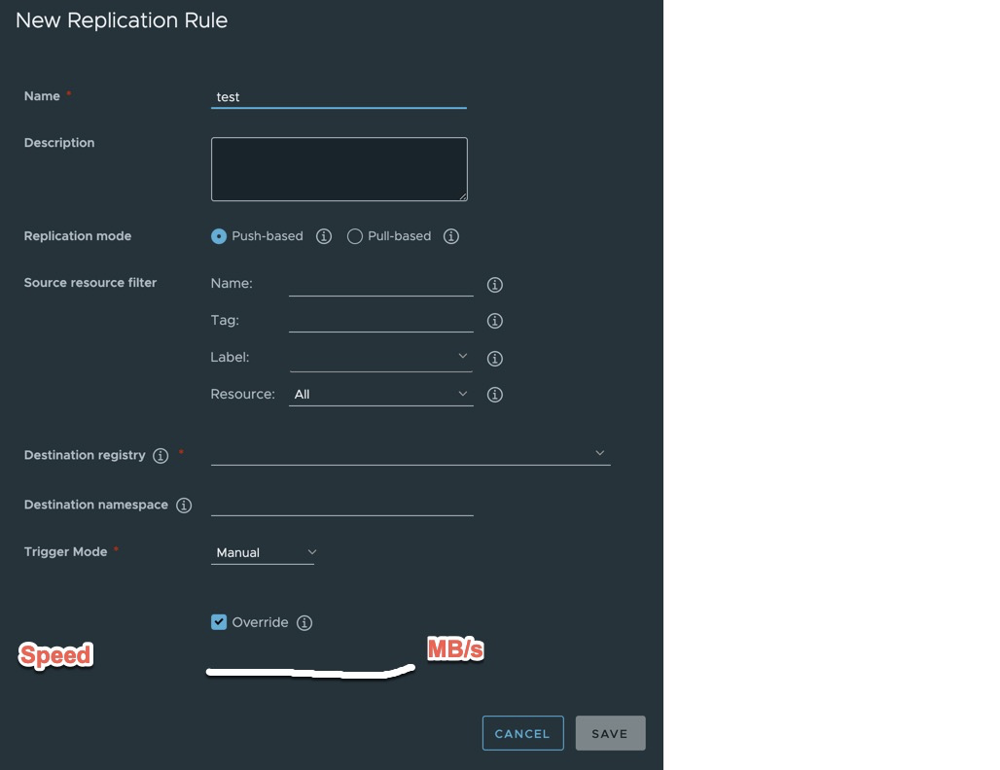
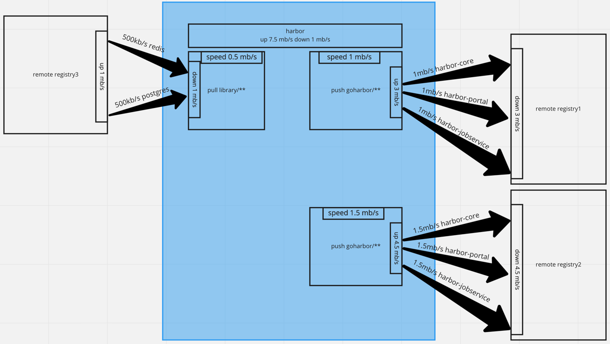
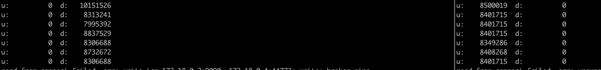

# Proposal: bandwidth limitation for replication

Author: bitsf

Discussion: https://github.com/goharbor/harbor/issues/13194

## Abstract

add the ability to simply control network speed when doing replication jobs

## Background

Some large data centers often distribute artifacts to many edge data centers around the world at the same time, which may occupy the full bandwidth of their backbone network and affect other business scheduling. So when there is no perfect network layer control policy, we can add a simple speed limit algorithm to reduce the problem as much as possible.

## Proposal

Add a read IO limiter when do replication job, and user can specify speed in replication rule, each job will be limited by this. With the default value 10 as the concurrent job num, the max speed for the replication job is 10 * speed.

## Non-Goals

- system level bandwidth limit
- harbor level bandwidth limit
- project level bandwidth limit
- multi job level bandwidth limit

## Rationale

- other level except job level would be much harder to implement as it need to schedule and collaborate between processes and instances

## Compatibility

the default behavior is no speed limiter, use default value `0` as unlimit.

## Implementation

### UI
- user can specify a speed on UI when edit replication rule, this speed is just for one repository replication task, usually max 10 tasks run concurrently in jobservice queue.


### flow

for example

- pull based job from registry3 with 0.5MB/s
- push based job to registry1 with 1MB/s
- push based job to registry2 with 1.5MB/s

result

- harbor upload 7.5 MB/s, download 1 MB/s

### some code methods to limit speed
- use golang.org/x/time/rate, this one is prefered
- use https://github.com/go4org/go4/blob/master/net/throttle/throttle.go
- use https://github.com/efarrer/iothrottler/blob/master/iothrottler.go

#### golang.org/x/time/rate

```
func NewReader(r io.Reader, s float64) io.Reader {
    l := rate.NewLimiter(rate.Limit(s), 1000*1024)
    return &reader{
        r:       r,
        limiter: l,
    }
}
 
func (r *reader) Read(buf []byte) (int, error) {
    n, err := r.r.Read(buf)
    if n <= 0 {
        return n, err
    }
    now := time.Now()
    rv := r.limiter.ReserveN(now, n)
    if !rv.OK() {
        return 0, fmt.Errorf("exceeds limiter's burst")
    }
    delay := rv.DelayFrom(now)
    time.Sleep(delay)
    return n, err
}
```

- test with 8MB speed limit


- test with 800MB speed limit


### API
- Create，Post /api/v2.0/replication/policies
- Modify，Put /api/v2.0/replication/policies/[id]
- Model

```
type Policy struct {
   ID          int64  `json:"id"`
   Name        string `json:"name"`
   Description string `json:"description"`
   Creator     string `json:"creator"`
   // source
   SrcRegistry *Registry `json:"src_registry"`
   // destination
   DestRegistry *Registry `json:"dest_registry"`
   // Only support two dest namespace modes:
   // Put all the src resources to the one single dest namespace
   // or keep namespaces same with the source ones (under this case,
   // the DestNamespace should be set to empty)
   DestNamespace string `json:"dest_namespace"`
   // Filters
   Filters []*Filter `json:"filters"`
   // Trigger
   Trigger *Trigger `json:"trigger"`
   // Settings
   // TODO: rename the property name
   Deletion bool `json:"deletion"`
   // If override the image tag
   Override bool `json:"override"`
   // Operations
   Enabled      bool      `json:"enabled"`
   CreationTime time.Time `json:"creation_time"`
   UpdateTime   time.Time `json:"update_time"`
 
 
   // limit speed at KB/s per job
   Speed  int `json:"speed"`
}
```

### harbor code
in file src/pkg/reg/adapter/quay/adapter.go, method PullBlob(), wrapper the blob reader

## Open issues (if applicable)

https://github.com/goharbor/harbor/issues/13194
