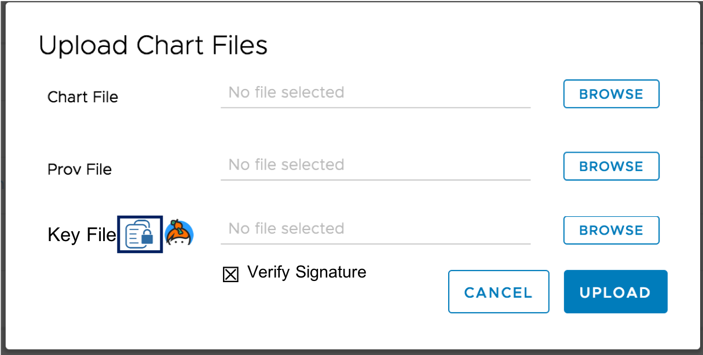
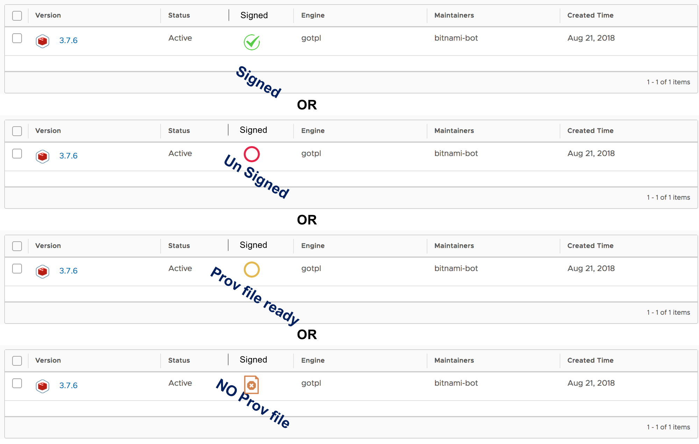
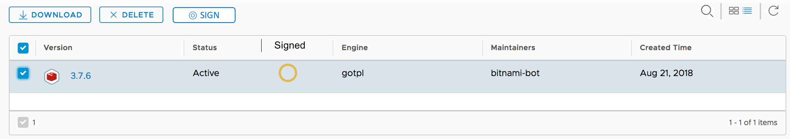
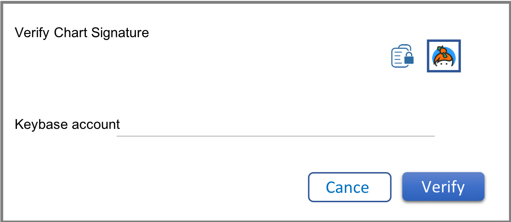
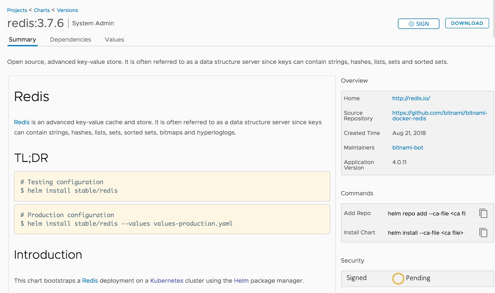

# Proposal: Chart signature verification

Author: [Steven Zou](https://github.com/steven-zou)

## Abstract

Helm charts can be signed with the gpg and the signature will be saved into a `prov` file which can be stored together with the chart `tgz` file. As a Helm chart registry, Harbor should help the end user to verify if the signature `prov` file is valid to the corresponding chart file and show the right signed status to the users through the web portal.

## Background

From the Harbor 1.6.0 release, Harbor starts to support Helm charts management. The signature `prov` files of related charts are also supported. However, in the 1.6.0 release, Harbor just lets user upload the prov file together with the chart file and show the existence of `prov` file of one chart in the web portal, Harbor does not verify if the signature `prov` file of the chart. That's an obvious drawback.

## Solution

To verify the signature of chart, `prov` file and related **public key** file are required. As Harbor has been already supporting `prov` file uploading, the left main work is providing a simple way to let the creator of chart supply a public key which can be used to do the verification and then save the result for future querying. Of course, if the chart version is override, the signature verification will be lost. Referring the helm official document, the following two possible ways can be supported to get the required public key:

* **public key file**

With this way, directly upload the key file to Harbor. The uploading can occur together with chart/prov file uploading or in a separate flow. Harbor can use the uploaded public key to complete the verification process. Please pay attention that, Harbor will not keep the key file, it will only save the verification result.

* **keybase.io service**

If the key is sharing in the `keybase.io` [platform](https://keybase.io/), the user just needs to specify the account name which is owning the sharing key. Then the key can be got via http, e.g:

```shell
curl https://keybase.io/[them]/key.asc
```

Once got the key, the verification process can be completed. Same with key file option, Harbor will not keep the key file, it will only save the verification result.

### Web portal enhancement

* Add `Verify Signature` option in the chart uploading dialog. If the option is checked, additional `key file` field will be displayed to let user upload the related key file.



* Add `Signature` status column in the helm chart version list and grid view. The status includes:
  * `Signed`: The chart signature is successfully verified (required `prov` file and key files are provided).
  * `Unsigned`: The chart signature is failed to verify although the `prov` file and key files are provide. Not matched.
  * `Pending`: Only `prov` file existing but missing verification public key.
  * `Unknown`: No `prov` file existing for that chart.



* Add `Sign` button to start the signing flow if the the signature status is `Pending`. An simplified dialog is opened to let user supply the public key. For other status cases, the button will be disabled.




* Click the `Sign` button will open the verification dialog. As `prov` file is already there, user just needs to supply the key or the keybase.io account to complete the verification process.



* The signature status can also be displayed in the chart version detailed page. If the signature status is `pending`, there will also be a `SIGN` button for user to start the signature verification process.



### Back API extended

The chart signature verification should be defined in a separate method for reuse. The chart service handler interface will be extended to add a new method for signature verification function.

```go
type ServiceHandler interface {
  // ...

  // VerifySignedChart verifies the signature of the specified chart is valid
  //
  // namespace string: the chart namespace.
	// chartName string: the name of the chart, e.g: "harbor"
  // version string: the SemVer version of the chart, e.g: "0.2.0"
  //
  // If the signature is successfully verified, nil error will be returned;
  // Otherwise, non-nil will be got.
  VerifySignedChart(namespace, name, version string, keyring []byte)error

  // ...
}
```

A new chart signature verification API `POST: /api/chartrepo/:repo/charts/:name/:version/verify` is added to support triggering the signature verification action.

The chart uploading operation at front end can call the above API to verify the signature of the chart if user checked the `Verification` option after the chart and `prov` file is successfully uploaded.