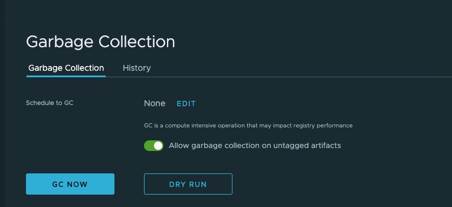

# Proposal:  `Cleanup _upload Folders`

Author: `stonezdj` 

## Abstract

It proposes an approach to cleanup the _upload folders in the backend storage.

## Background

The [distribution](https://github.com/distribution/distribution/) store upload images files in the upload
In some situations, client push image process might be interrupted or timed out, the temporary files created in _upload directories remain even the push operation is completed or canceled. these files might consume much disk space, as described in [issue 15461](https://github.com/goharbor/harbor/issues/15641)

[distribution](https://github.com/distribution/distribution/) provides a configure option in config.yml to purge these files

```
  maintenance:
    uploadpurging:
      enabled: true
      age: 168h
      interval: 24h
      dryrun: false
```

But it is fixed schedule and could not be changed on demand.

Another solution is described in [issue 15461](https://github.com/goharbor/harbor/issues/15641), just run the command manually or in a kubernetes job.

```
find /storage  -path "*/_uploads/*" -type f -mtime +1d |xargs rm -rf
```
But it need to do it manually, and it doesn't support s3, gcs object storage.

## Proposal

Enhance the _upload cleanup by adding the API(`/api/registry/purge`) to the registryctl container.

Adding three configure items:

   1. `purge_upload_on_gc` -- boolean to indicate if enable purge upload directory when GC is running.

   1. `purge_upload_older_than`-- Remove files which are created before the specified hours. Its minimum value is 1, default value is 168.

   1. `purge_upload_async` -- boolean to indicate if the purge process is running async, for dryrun, it always false, means it always run with sync mode. if true, then run the purge process in async mode.

If `purge_upload_on_gc` is true, the cleanup API is called by current garbage collection API. 

## Goal

Provide a way to periodically cleanup the _upload folders in the backend storage.

## Compatibility

The current implementation should work on all supported backend image storages, includes local file system, NFS, s3 storage, azure storage and google storage.

## Implementation

1. Add API to registryctl to wrap the purge function in distribution.
   ```
    POST /api/registry/purge 
   ```
   The sample payload should be 
   ```
   {
     older_than: 168,
     async:     true,
     log_out:    true
   }
   ```
   The sample response should be a list of files need to removed when dry_run is true or aysnc is false.
   ```
   {
     "purged_files": [
       "/data/registry/docker/registry/v2/repositories/library/ubs-analysis-timing/_uploads/xxx",
       "/data/registry/docker/registry/v2/repositories/library/harbor/_uploads/abc",
       "/data/registry/docker/registry/v2/repositories/library/lambda/_uploads/xxs33sxx"
     ]
   }
   ```
   The array size will be limited to 1000 rows, the rows exceed 1000 will be omitted, if no file need to remove, it is emtpy.

2. Update the registryctl client to add function PurgeUpload.

  ```
	PurgeUpload(olderThan int64, dryRun, logOut, async bool) error
  ```
  If run the async is true, the PurgeUpload is running with async mode, to avoid run multiple purge operation in the same time, need to set a key purgeupload_running=true in redis, and set its expire time to 24h, and when the PurgeUpload complete or exit, it should delete the redis key purgeupload_running.

3. Add three options in the UI to the current Garbage Collection configure page.



4. Purge upload folders with GC -- boolean option, when it is true, then the next two opitions are enabled.

   1. Purge upload with age (hours) -- input with an integer value

   1. Purge upload async -- boolean option
  
      These options are sent with the HTTP request and not stored in configure, so they could be vary per schedule.

5. Update the jobservice implemetation of GC to call the PurgeUpload with provided settings.

```
func (gc *GarbageCollector) Run(ctx job.Context, params job.Parameters) error {
	if err := gc.init(ctx, params); err != nil {
		return err
	}

	gc.logger.Infof("start to run gc in job.")
	
	if gc.purgeUpload {
		// TODO: run purge upload with specified purge parameter here
	}
  ...
}  
```

## Open issues

  1. Purge upload dry run is not support, because GC dry run might be timed out.
  1. Because directory doesn't consume much diskspace, only files in upload folders will be removed.
