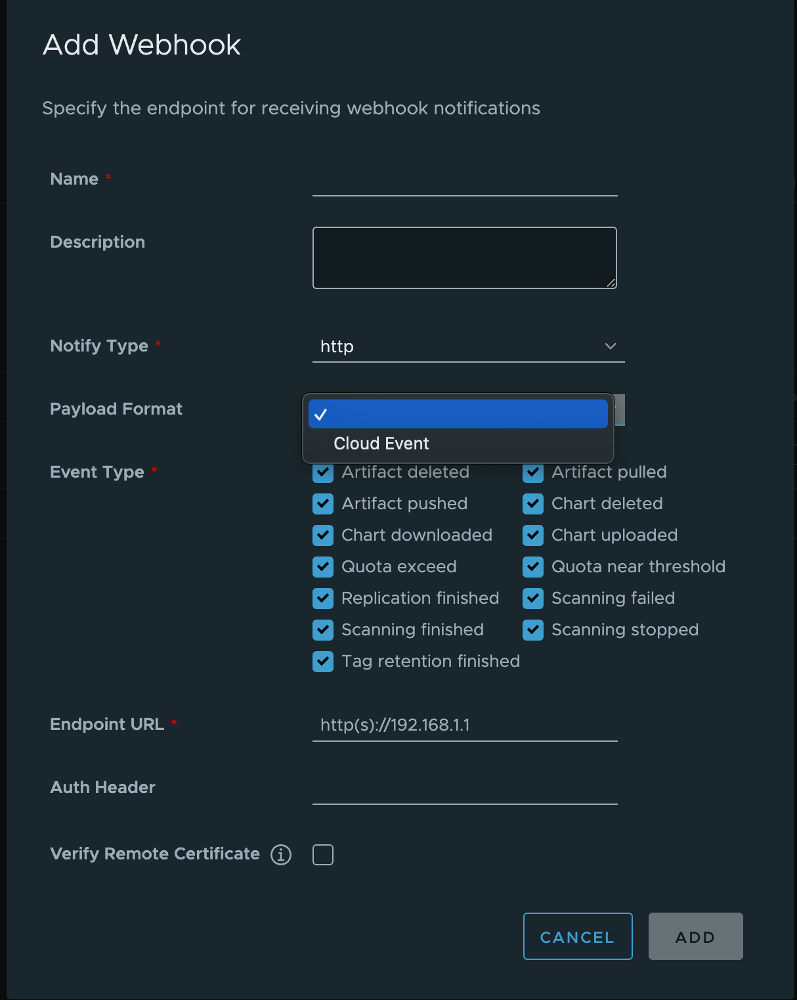
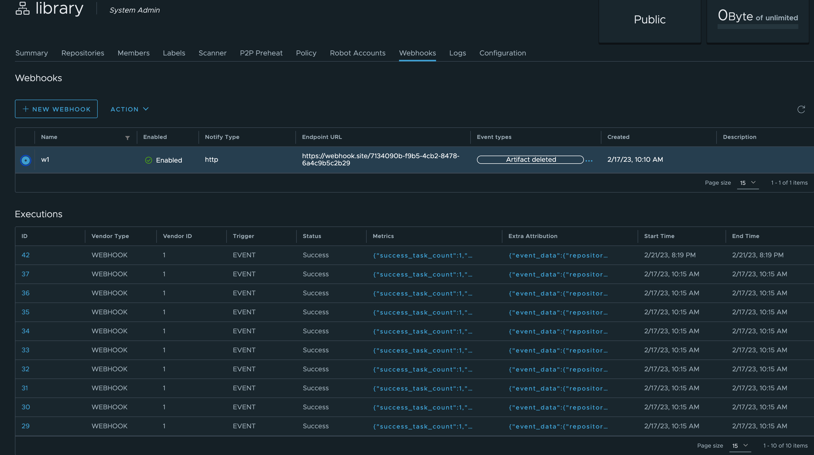
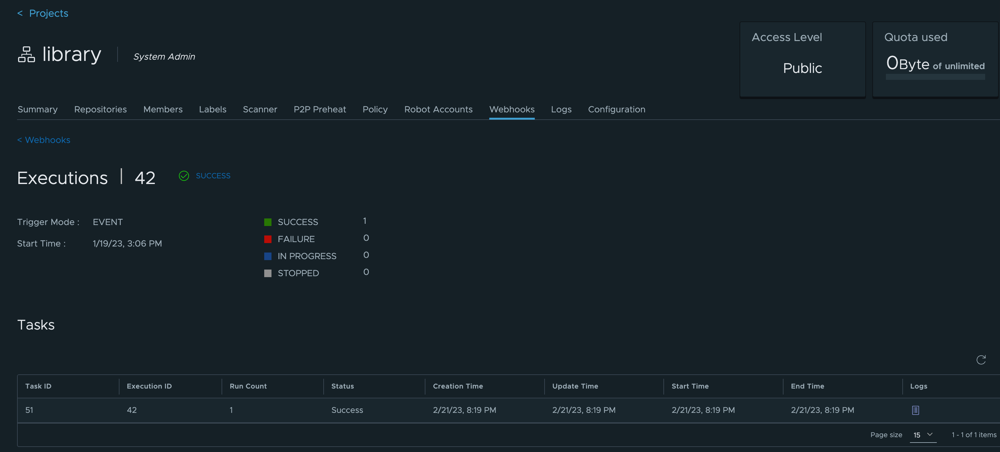

# Proposal: Support CloudEvents For Webhook

Author: ChenYu Zhang/[chlins](https://github.com/chlins)

## Abstract

This proposal aims to do the webhook enhancement in harbor. The major features will be webhook refactor, CloudEvents format support for webhook payload.

## Background

CloudEvents is a specification for describing event data in a common way, and now is also under the Cloud Native Computing Foundation. Harbor already supports send webhook notifications to remote endpoints when events happened, but right now the payload format is fixed by internal, the user cannot modify the body of requests unless update the source code and re-compile component images. As the CloudEvents is the CNCF community specification for event, so harbor would add the integration for it.

## Goals

- Refactor the webhook codebase to migrate the job processing to the common task framework.
- Add the integration of CloudEvents.

## Non-Goals

- Retain all the webhook job histories.(only migrate the last one for every event type)
- Implement all combinations of CloudEvents specifications.(just provide one standard format(JSON))

## Implementation

### Frontend

Add the payload format option selector for http type, currently only CloudEvents supported and will remove the slack notify type but append it as a payload format.



Update the last trigger page to job histories the way like replication.





### Backend

#### Refactor webhook job

In the previous version, harbor has unified the schedule/task framework, other job vendors such as replication, tag retention, scan and garage collection all migrated to this framework, but webhook job is a legacy one, so we should migrate it and then can get better lifecycle management and debug capabilities like query trigger histories and job logs from harbor UI or API. The migration can be summarized as following steps.

##### 1. Create webhook job by manager/controller provided by task package

##### 2. Update the job implementation of WEBHOOK and SLACK, and print more useful logs for debug

##### 3. Introduce the new API as unified job style for operations of webhook jobs

*List the executions for a specific policy*

```rest
GET /api/v2.0/projects/{project_name_or_id}/webhook/policies/{policy_id}/executions
```

Response

```json
[
  {
    "end_time": "2023-01-19T07:06:14Z",
    "id": 46,
    "metrics": {
      "success_task_count": 1,
      "task_count": 1
    },
    "start_time": "2023-01-19T07:06:12Z",
    "status": "Success",
    "trigger": "EVENT",
    "vendor_id": 2,
    "vendor_type": "WEBHOOK"
  },
  {
    "end_time": "2023-01-19T07:05:46Z",
    "id": 45,
    "metrics": {
      "success_task_count": 1,
      "task_count": 1
    },
    "start_time": "2023-01-19T07:05:44Z",
    "status": "Success",
    "trigger": "EVENT",
    "vendor_id": 2,
    "vendor_type": "WEBHOOK"
  }
]
```

*List the tasks for a specific execution*

```rest
GET /api/v2.0/projects/{project_name_or_id}/webhook/policies/{policy_id}/executions/{execution_id}/tasks
```

Response

```json
[
  {
    "creation_time": "2023-01-19T07:06:12Z",
    "end_time": "2023-01-19T07:06:14Z",
    "execution_id": 46,
    "id": 46,
    "run_count": 1,
    "start_time": "2023-01-19T07:06:12Z",
    "status": "Success",
    "update_time": "2023-01-19T07:06:14Z"
  }
]
```

*Get the log of a specific webhook task*

```rest
GET /api/v2.0/projects/{project_name_or_id}/webhook/policies/{policy_id}/executions/{execution_id}/tasks/{task_id}/log
```

Response

```text
2023-01-31T09:12:42Z [INFO] [/jobservice/job/impl/notification/webhook_job.go:88]: start to run webhook job.
2023-01-31T09:12:42Z [INFO] [/jobservice/job/impl/notification/webhook_job.go:103]: request body: 
{"type":"DELETE_ARTIFACT","occur_at":1675156360,"operator":"admin","event_data":{"resources":[{"digest":"sha256:f271e74b17ced29b915d351685fd4644785c6d1559dd1f2d4189a5e851ef753a","tag":"latest","resource_url":"192.168.8.107/library/alpine:latest"}],"repository":{"date_created":1675155445,"name":"alpine","namespace":"library","repo_full_name":"library/alpine","repo_type":"public"}}}
2023-01-31T09:12:44Z [INFO] [/jobservice/job/impl/notification/webhook_job.go:118]: receive response, status code: 200.
2023-01-31T09:12:44Z [INFO] [/jobservice/job/impl/notification/webhook_job.go:125]: send webhook successfully.
```

##### 4. Adjust the legacy API handler logic for compatible of old API

The following legacy APIs are not used widely, so we will add the deprecated mark in the swagger and remove them in the future.

```rest
# This endpoint returns webhook jobs of a project.
GET /api/v2.0/projects/{project_name_or_id}/webhook/jobs
```

```rest
# This endpoint returns last trigger information of project webhook policy.
GET /api/v2.0/projects/{project_name_or_id}/webhook/lasttrigger
```

##### 5. Migrate the old job rows to other tables by unified way in the database

*NOTICE: We may need to care about the performance as the old table never be cleaned.*

The previous notification jobs stored in the table `notification_job`, and this table never be cleaned up, so we can not restore all old rows to table `execution/task`, just migrate the last job for every event type of one webhook policy. The following SQL can help to do the migrations.

```sql
DO $$
DECLARE
    job_group RECORD;
    job RECORD;
    vendor_type varchar;
    new_status varchar;
    status_code integer;
    exec_id integer;
    extra_attrs varchar;
BEGIN
    FOR job_group IN SELECT DISTINCT policy_id,event_type FROM notification_job WHERE event_type NOT IN ('UPLOAD_CHART', 'DOWNLOAD_CHART', 'DELETE_CHART')
    LOOP
        SELECT * INTO job FROM notification_job WHERE
        policy_id=job_group.policy_id
        AND event_type=job_group.event_type
        AND status IN ('stopped', 'finished', 'error')
        ORDER BY creation_time DESC LIMIT 1;
        /* convert vendor type */
        IF job.notify_type = 'http' THEN
            vendor_type = 'WEBHOOK';
        ELSIF job.notify_type = 'slack' THEN
            vendor_type = 'SLACK';
        ELSE
            vendor_type = 'WEBHOOK';
        END IF;
        /* convert status */
        IF job.status = 'stopped' THEN
            new_status = 'Stopped';
            status_code = 3;
        ELSIF job.status = 'error' THEN
            new_status = 'Error';
            status_code = 3;
        ELSIF job.status = 'finished' THEN
            new_status = 'Success';
            status_code = 3;
        ELSE
            new_status = '';
            status_code = 0;
        END IF;

     SELECT format('{"event_type": "%s", "payload": %s}', job.event_type, to_json(job.job_detail)::TEXT) INTO extra_attrs;
        INSERT INTO execution (vendor_type,vendor_id,status,trigger,extra_attrs,start_time,end_time,update_time) VALUES (vendor_type,job.policy_id,new_status,'EVENT',to_json(extra_attrs),job.creation_time,job.update_time,job.update_time) RETURNING id INTO exec_id;
        INSERT INTO task (execution_id,job_id,status,status_code,run_count,creation_time,start_time,update_time,end_time,vendor_type) VALUES (exec_id,job.job_uuid,new_status,status_code,1,job.creation_time,job.update_time,job.update_time,job.update_time,vendor_type);
    END LOOP;
END $$;
```

The migration script can only process the data in the database, for runtime job should use `Jobservice Dashboard` to manage or cleanup.

##### 6. Drop the table `notification_job`

#### Integrate CloudEvents

> CloudEvents is a specification for describing event data in common formats to provide interoperability across services, platforms and systems.

Define a new event data format for harbor webhook by following the [spec](https://github.com/cloudevents/spec/blob/v1.0.2/cloudevents/spec.md).

| Attribute | [Type](https://github.com/cloudevents/spec/blob/v1.0.2/cloudevents/spec.md#type-system) | Description | REQUIRED/OPTIONAL |
| --- | --- | --- | --- |
| id | String | Identifies the event | REQUIRED |
| source | URI-reference | Identifies the context in which an event happened | REQUIRED |
| specversion | String | The version of the CloudEvents specification which the event uses | REQUIRED |
| type | String | This attribute contains a value describing the type of event related to the originating occurrence | REQUIRED |
| datacontenttype | String | Content type of data value | OPTIONAL |
| dataschema | URI | Identifies the schema that data adheres to | OPTIONAL |
| data | Data | The event payload | OPTIONAL |
| subject | String | This describes the subject of the event in the context of the event producer (identified by source) | OPTIONAL |
| time | Timestamp | Timestamp of when the occurrence happened | OPTIONAL |

##### Event Type Mapping

| Original Type | CloudEvents Type |
| --- | --- |
| DELETE_ARTIFACT | harbor.artifact.deleted |
| PULL_ARTIFACT | harbor.artifact.pulled |
| PUSH_ARTIFACT | harbor.artifact.pushed |
| QUOTA_EXCEED | harbor.quota.exceeded |
| QUOTA_WARNING | harbor.quota.warned |
| REPLICATION | harbor.replication.status.changed |
| SCANNING_FAILED | harbor.scan.failed |
| SCANNING_COMPLETED | harbor.scan.completed |
| SCANNING_STOPPED | harbor.scan.stopped |
| TAG_RETENTION | harbor.tag_retention.finished |

##### Interface

Define a interface to handle the event data formation.

```go
type Formatter interface {
    // Format formats the payload to needed format.
    Format(payload *Payload) (http.Header, []byte, error)
}
```

Implement json format driver for original and CloudEvents format driver to support CloudEvents type.

```go
type JsonFormatter struct {}

func (*JsonFormatter) Format(payload *Payload) (http.Header, []byte, error) {
    // do something...

    data, err := json.Marshal(payload)
    if err != nil {
        return nil, err
    }

    return header, data, nil
}
```

```go
type CloudEventsFormatter struct {}

func (*CloudEventsFormatter) Format(payload *Payload) (http.Header, []byte, error) {
    // do something...

    data, err := cloudevents.Marshal(payload)
    if err != nil {
        return nil, err
    }

    return header, data, nil
}
```

##### Example

Push Artifact

```json
{
  "specversion": "1.0",
  "type": "io.goharbor.artifact.pushed",
  "source": "/projects/1/webhook/policies/1",
  "id": "e18c74f8-188e-47ee-861a-bfcd81c3509b",
  "time": "2020-04-05T17:31:00Z",
  "operator": "harbor-jobservice",
  "datacontenttype": "application/json",
  "data": {
   "resources":[
      {
         "digest":"sha256:f271e74b17ced29b915d351685fd4644785c6d1559dd1f2d4189a5e851ef753a",
         "tag":"latest",
         "resource_url":"demo.goharbor.io/library/alpine:latest"
      }
   ],
   "repository":{
      "date_created":1675155445,
      "name":"alpine",
      "namespace":"library",
      "repo_full_name":"library/alpine",
      "repo_type":"public"
   }
  }
}
```

Replication

```json
{
  "specversion": "1.0",
  "type": "io.goharbor.replication.finished",
  "source": "/projects/1/webhook/policies/2",
  "id": "e8bae503-d320-4c9d-b189-912dc182e6e0",
  "time": "2020-04-05T17:31:00Z",
  "operator": "admin",
  "datacontenttype": "application/json",
  "data": {
   "replication":{
      "harbor_hostname":"demo.goharbor.io",
      "job_status":"Success",
      "artifact_type":"image",
      "authentication_type":"basic",
      "override_mode":true,
      "trigger_type":"MANUAL",
      "policy_creator":"admin",
      "execution_timestamp":1675304619,
      "src_resource":{
         "registry_name":"dockerhub",
         "registry_type":"docker-hub",
         "endpoint":"https://hub.docker.com",
         "namespace":"library"
      },
      "dest_resource":{
         "registry_type":"harbor",
         "endpoint":"https://demo.goharbor.io",
         "namespace":"library"
      },
      "successful_artifact":[
         {
            "type":"image",
            "status":"Success",
            "name_tag":"alpine [1 item(s) in total]"
         }
      ]
   }
  }
}
```
