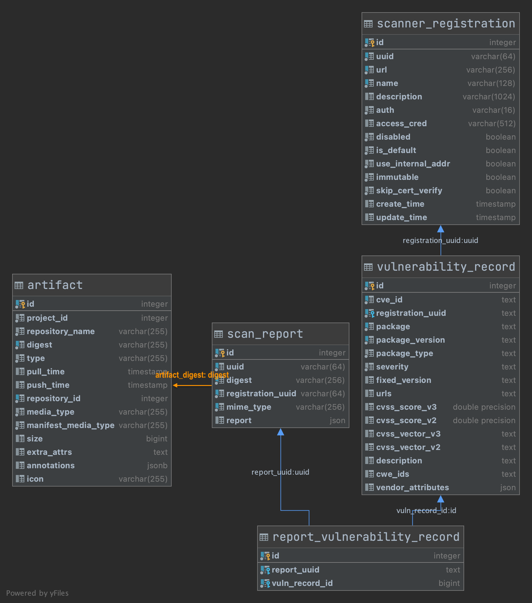

# Proposal: Enhanced data  schema for Cloud-native Workload Vulnerability Data Storage for Analytics, Reporting and Policy Evaluation.

Author: **Prahalad Deshpande (prahaladd@vmware.com)**

## Abstract

This proposal details out a data storage schema for image vulnerability data which in turn would allow advanced reporting, analytics, policy evaluation and integration with third-party systems providing these capabilities.
The contents of this proposal are based on the document describing the Cloud Native Workload - Common Vulnerability Evaluation and Reporting Framework.

## Use cases
The following use cases are addressed by the proposed data  schema

* Provide an extensible schema for storage of vulnerability information
* Allow ad-hoc reporting and analytics on the Image vulnerability data
* Author and share standard reporting queries to fetch image vulnerability data
* Author and share policies that work in conjunction with the enhanced data schema to report on the policy compliance posture of images. 
* Gain deep insights into all aspects of the image compliance posture (licenses,  image file system structure, file content) in addition to traditional OS and software package level vulnerabilities.

## Discussions and related work

* [Cloud Native Workload - Common Vulnerability Evaluation and Reporting Framework](https://docs.google.com/document/d/1KGovi6lF_dZf7LGAnhtTJrEi_Osn4lNc84NRudbZvPQ/)
* [Harbor OPA Integration Proposal](https://github.com/goharbor/community/pull/135)


## Technical Description
An image consists of vulnerabilties or non-compliance of different types. They are largely categorized as below:
* Operating System and software package related
* Image structure related
* Image file content related
* License related

A non-compliance or vulnerability is said to occur whenever there is discrepancy observed between the desired and actual results of a scan triggered for the above type of data.

For e.g., a certain project within Harbor would require that all it's images have packages with the MIT license. The presence of a GPL packages within the container image would trigger a non-compliance.

The scope of this proposal is currently restricted to defining the data schema for the following:
* OS and software package related vulnerabities
* License related vulnerabiitlies will be raised as a spearate proposal since it also requires integrating Harbor with license scanning tools like [Tern](https://www.linuxfoundation.org/blog/2019/12/tern-1-0-0-is-generally-available/)

## Image OS and package level Vulnerabilities

These represent the vulnerabilities within an OS image or software package. The schema to describe such vulnerabilities is presented below. This schema is builds upon the [Pluggable scanner spec](https://github.com/goharbor/pluggable-scanner-spec) and introduces the following new fields as described in the [Pluggable scanner spec API 1.1](https://github.com/goharbor/pluggable-scanner-spec/pull/4)


## Enhancements to the current data storage mechanisms
 
The scan report produced vulnerability scanners in Harbor are stored within a JSON blob within the Harbor DB. This prevents ad-hoc querying of the vulnerability data to provide more richer reporting and analytics

Using a first class RDBMS data to store the data would facilitate the use cases of ad-hoc querying and analytics.

The two steps proposed are:
 * Update the existing `scan_report` table to eliminate the `Report` column with the `json` data type.
 * Create a new table `vulnerability_record` that will contain the normalized vulnerability schema for the images.

### Relation schema database diagram



### Proposed changes to `Report` data structure and hence scan_report table

As can be seen above the `Report` data structure no longer holds a JSON blob for the entire report. Each record is represented by the `VulnerabilityRecord` structure shown below and would be stored in a relational schema structure.

The existing `scan_report` table is still used. The JSON blob within the `scan_report.Report` column contains onlypreliminary information about the scanned artifact and does not contain the list of vulnerabilities.
The `scan_report` is associated with zero to many `vulnerability_records` through the `report_vulnerability_record `junction table.

### Create VulnerabilityReport data structure mapped to vulnerability_data table
```
// VulnerabilityRecord of an individual vulnerability. Identifies an  individual vulnerability item in the scan.
// Since multiple scanners could be registered with the projects, each scanner
// would have it's own definition for the same CVE ID. Hence a CVE ID is qualified along
// with the ID of the scanner that owns the CVE record definition.
// The scanner ID would be the same as the RegistrationUUID field of Report.
// Identified by the `cve_id`, `registration_uuid`, `package` and `package_version`.
type VulnerabilityRecord struct {
	ID               int64    `orm:"pk;auto;column(id)"`
	CVEID            string   `orm:"column(cve_id)"`
	RegistrationUUID string   `orm:"column(registration_uuid)"`
	Package          string   `orm:"column(package)"`
	PackageVersion   string   `orm:"column(package_version)"`
	PackageType      string   `orm:"column(package_type)"`
	Severity         string   `orm:"column(severity)"`
	Fix              string   `orm:"column(fixed_version);null"`
	URLs             string   `orm:"column(urls);null"`
	CVE3Score        *float64 `orm:"column(cvss_score_v3);null"`
	CVE2Score        *float64 `orm:"column(cvss_score_v2);null"`
	CVSS3Vector      string   `orm:"column(cvss_vector_v3);null"` // e.g. CVSS:3.0/AV:L/AC:L/PR:L/UI:N/S:U/C:H/I:N/A:N
	CVSS2Vector      string   `orm:"column(cvss_vector_v2);null"` // e.g. AV:L/AC:M/Au:N/C:P/I:N/A:N
	Description      string   `orm:"column(description);null"`
	CWEIDs           string   `orm:"column(cwe_ids);null"` // e.g. CWE-476,CWE-123,CWE-234
	VendorAttributes string   `orm:"column(vendor_attributes);type(json);null"`
}

```

### Create a junction table to hold the vulnerability record per report
```
//ReportVulnerabilityRecord is relation table required to optimize data storage for both the
//vulnerability records and the scan report.
//identified by composite key (ID, Report)
//Since each scan report has a separate UUID, the composite key
//would ensure that the immutability of the historical scan reports is guaranteed.
//It is sufficient to store the int64 VulnerabilityRecord Id since the vulnerability records
//are uniquely identified in the table based on the ScannerID and the CVEID
type ReportVulnerabilityRecord struct {
	ID           int64  `orm:"pk;auto;column(id)"`
	Report       string `orm:"column(report_uuid);"`
	VulnRecordID int64  `orm:"column(vuln_record_id);"`
}
```

### Example Ad-hoc queries
The types of ad-hoc queries that can be made possible using the above schema are illustrated below

### Number of software artifacts with a particular CVE-ID from all registered scanners

`select count(1) from vulnerability_record where CVEID = '<CVE_ID>'`

### List packages and corresponding images:tag with particular CVE-ID across all projects

```sql
select  vr.package, vr.package_version from vulnerability_record vr
inner join report_vulnerability_record rvr on vr.id = rvr.vuln_record_id
inner join scan_report sr on rvr.report_uuid = sr.uuid
inner join artifact a on sr.digest = a.digest
where a.repository_name = 'library/centos' and sr.mime_type = 'application/vnd.security.vulnerability.report; version=1.1';
```

As can be seen from the above examples; it is evident that such a normalized schema yields for easy reporting and analytics.

### Additional advantages

The SQL schema would also yield to easy `union` or `difference` operations where-in the scan results from multiple scanners for the same `repo:tag` can be merged to provide a more holistic view of the vulnerability structure

Additional advantage would be that the Postgres query planner would be able to optimize the queries required to generate reports or perform other analytics and hence would result in faster response times.

Literature on the web also suggests that in general normalizing the data in tables will reduce the data storage requirements since redundant data such as keys in the JSON document are now first class column names and would not occupy redundant storage 

## Data retention and clean-up

There are no changes proposed to the existing data retention time in Harbor. The clean-up logic would have to consider the normalized schema structure and clean up the data for an image using elementary SQL operations.

Vulnerability data is cleaned up as and when the images artifacts are deleted.

## Changes to Harbor API
The adoption of the new data storage schema for vulnerability records can be done in the following manner

* Phase-1:
  ** Core schema changes
  ** Report data conversion to relational format
  ** Changes to pluggable-scanner APIs to allow 3rd party scanners to send data for additional fields related to CVSS
  ** Stop storage of vulnerability data into JSON report blob within the `scan_report` table
  ** Use relational schema data to build user facing reports.
**Note: No changes to the Harbor API are proposed in this phase**

* Phase-2:
  ** Deprecate the older blob based storage of report data.
  ** Enhanced reports and DAO APIs

## Changes to Pluggable Scanner API
The new vulnerability schema introduces new fields in the `VulnerabilityItem`  related to CVSS 3.0 and CVSS 2.0 scores and the corresponding threat vector representation. Hence scanners having the ability to report these attributes would be able to send the data for these newly introduced fields with the updated Pluggable Scanner API.

A summary of changes to the Pluggable Scanner API are provided below. Further details can be found in the [pull request here](https://github.com/goharbor/pluggable-scanner-spec/pull/4)

1. Increment the minor version of the [Pluggable Scanner Spec API](https://github.com/goharbor/pluggable-scanner-spec) to `1.1`
2. Introduce a new MIME type `application/vnd.scanner.adapter.vuln.report.harbor+json; version=1.1` for the new scan report
3. The API root is unchanged.
 


