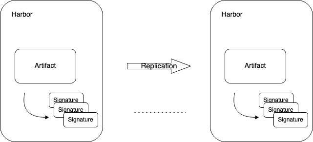

Proposal: Support Cosign signatures in Harbor

Author: Yan Wang

Discussion: https://github.com/goharbor/harbor/issues/15315

## Abstract

Artifact signing and signature verification are security capabilities that you can use to verify the integrity of an artifact.

The proposal is to integrate Cosign and Harbor, **Cosign** is part of the Sigstore project and provides container signing and verification with OCI registry integrations. You can find instructions [here](https://github.com/sigstore/cosign). The signature created by cosign can be stored as an accessory of an OCI artifact. All Harbor features can be applied to the artifacts associated with Cosign signatures. 

## Motivation

In the last few releases, Harbor supports Notary that offers a way to digitally sign images. Notary, an implementation of TUF(The Update Framework), is to store a manifest file linking the image digest with its tag. And Notary is integrated into docker, overall offer a good experience.
However, in some cases, the user chooses to distribute the signed image to others Harbor instances. Some limitations of Notary have caused challenges to its usability and scalability in multi-registry scenarios which has hindered widespread adoption so far.

## Solution

The Cosign signatures are stored in an OCI registry next to the container image, and can be located via a simple name scheme. Thus, Harbor can build up the relationship between the artifact and its Cosign signature in the database, and the Harbor function can use this relationship to determine behavior.

## Goal

1.  Support cosign sign artifact.
2.  All the existing functionality can be applied to the signed artifact with cosign.

## Non Goal

1.  Do not manage Public keys in Harbor side.
2.  Do not support cosign clean/delete(as the delete operation leverages the tag deletion API which is not a required implementation defined by OCI spec, and Harbor does not allow it). 
3.  Do not support cosign copy(cosign pushes the signature firstly to the destination, and then the artifact, Harbor cannot build the reference.)
4.  Do not support verify signature in Harbor side(because of item #1, Harbor cannot verify the signatures without public keys).

## Personas and User Stories

This section lists the user stories for the different personas interacting with cosign.

* Personas

Cosign is the operation of authorized users in Harbor with image push scope.

* User Stories

1.  As a project admin & user, I can use cosign to sign an artifact(single or multiple times).
2.  As a project admin & user, I can delete a cosign signature via Harbor UI/API.
3.  As a project admin & user, I can delete/GC an artifact as well as its cosign signature.
4.  As a project admin & user, I cannot GC an artifact's cosign signature individually.
5.  As a system admin, I can copy an artifact and its signature to another repository.
6.  As a system & project admin, I can reserve an artifact and its signature via retention policy.
7.  As a system & project admin, I can set the content trust policy to block the un-signed artifact pulling. 
8.  As a system admin, I can setup replication rule to replicate artifact with its signature.
9.  As a system admin & project admin, I can setup immutable rule to make the artifact and its signature permanent.

## Installation

Harbor will default support cosign to sign an artifact, that means user do not need to specify cosign support, like `--with-cosign` during installation. 

1. If user specify the option of notary, it means that Harbor support both notary and cosign. In addition to that, Harbor provides two different kinds of signature policies, content trust and cosign.
2. In the future, if Harbor decides to support only one signer in one deployment, just add one more parameter `--with-cosign` for the installer. If user switches the signer from cosign to non-cosign, Harbor will remove all the signatures' data from database and backend. 

## Artifact reference

Cosign signatures are stored as separate artifact in the OCI registry, with only a weak reference back to the artifact they "sign". 
This means, the relationship in the storage cannot guarantee the signatures will not be deleted or garbage-collected when the artifact 
is deleted.


To ensure that the artifact and its signature are operated as a whole, Harbor store the signature as a kind of [accessory](./accessory.md), and with Harbor reference.


### Build reference

1. PUT signature 

Harbor Manifest Middleware (After Response)

```rest
PUT /v2/library/hello-world/manifests/sha256-1b26826f602946860c279fce658f31050cff2c596583af237d971f4629b57792.sig

{
   "schemaVersion":2,
   "config":{
      "mediaType":"application/vnd.oci.image.config.v1+json",
      "size":233,
      "digest":"sha256:d4e6059ece7bea95266fd7766353130d4bf3dc21048b8a9783c98b8412618c38"
   },
   "layers":[
      {
         "mediaType":"application/vnd.dev.cosign.simplesigning.v1+json",
         "size":250,
         "digest":"sha256:91a821a0e2412f1b99b07bfe176451bcc343568b761388718abbf38076048564",
         "annotations":{
            "dev.cosignproject.cosign/signature":"MEUCIQD/imXjZJlcV82eXu9y9FJGgbDwVPw7AaGFzqva8G+CgwIgYc4CRvEjwoAwkzGoX+aZxQWCASpv5G+EAWDKOJRLbTQ="
         }
      }
   ]
}

```


Sample --  Cosign Signature Blob, it's the [simple signing](https://www.redhat.com/en/blog/container-image-signing) format for payloads.

```json

{
   "critical":{
      "identity":{
         "docker-reference":"10.202.250.215/library/hello-world"
      },
      "image":{
         "docker-manifest-digest":"sha256:1b26826f602946860c279fce658f31050cff2c596583af237d971f4629b57792"
      },
      "type":"cosign container image signature"
   },
   "optional":null
}

```

2. Copy Artifact

```rest
POST /api/v2.0/projects/destination/repositories/hello-world/artifacts?from=library/hello-world@sha256:287d623a442ed0b0ca70ac8953950be2278eea95a1a432783b11caca11911af2

```


- copy artifact to the target project
- copy signature to the target project 
- build the reference in the database
    

### Request Artifact Signature

**List signatures**

1. You can use the `signature.cosign` in the accessories to determine whether an object is signed and to view information about the signature, and you can pull the signature with digest in the registry store, 
2. [?]You cannot list the accessories directly via list artifact API.

**Request All Artifact Signatures**

```yaml
GET /api/v2.0/projects/library/repositories/hello-world/artifacts/accessories?n=10&artifactType={artifactType}
```

Response

```yaml
200 OK
Link: <url>; rel="next"

{
  "accessories": [
    {
      "id": "<int>",
      "digest": "<string>",
      "media_type": "<string>",
      "manifest_media_type": "<string>",
      "size": <integer>
    },
    ...
  ]
}
```


**Delete an artifact**

User Stories outline the behavior:

1. If the top-level artifact is deleted, all the signatures that associate with the artifact are deleted.
2. The signature can be deleted individually.

```rest
DELETE /api/v2.0/projects/library/repositories/hello-world/artifacts/sha256:1b26826f602946860c279fce658f31050cff2c596583af237d971f4629b57792

HTTP/1.1 200 OK
Server: nginx
Date: Thu, 22 Jul 2021 07:32:22 GMT
Content-Length: 0
Connection: keep-alive
Vary: Cookie
X-Harbor-Csrf-Token: u7bGUcekdbuVAVHuVl9tfuCx5EmJjPMMnL2S5hnPUudZzmZ8EdFX8KhfAIL6Dherx6kX2mk2VrknNghn165ORg==
X-Request-Id: 8d70f12a-9f73-4fc9-9e81-3bed24926254
Strict-Transport-Security: max-age=31536000; includeSubdomains; preload
X-Frame-Options: DENY
Content-Security-Policy: frame-ancestors 'none'
```

**Delete artifact signature(all)**

```rest
DELETE /api/v2.0/projects/library/repositories/hello-world/artifacts/sha256:1b26826f602946860c279fce658f31050cff2c596583af237d971f4629b57792/accessory?type=signature.cosign

HTTP/1.1 200 OK
Server: nginx
Date: Thu, 22 Jul 2021 07:32:22 GMT
Content-Length: 0
Connection: keep-alive
Vary: Cookie
X-Harbor-Csrf-Token: u7bGUcekdbuVAVHuVl9tfuCx5EmJjPMMnL2S5hnPUudZzmZ8EdFX8KhfAIL6Dherx6kX2mk2VrknNghn165ORg==
X-Request-Id: 8d70f12a-9f73-4fc9-9e81-3bed24926254
Strict-Transport-Security: max-age=31536000; includeSubdomains; preload
X-Frame-Options: DENY
Content-Security-Policy: frame-ancestors 'none'
```

**Delete artifact signature(specific)**

```rest
DELETE /api/v2.0/projects/library/repositories/hello-world/artifacts/sha256:1b26826f602946860c279fce658f31050cff2c596583af237d971f4629b57792/accessory?type=signature.cosign&digtest=sha256:94788818ad901025c81f8696f3ee61619526b963b7dc36435ac284f4497aa7cb

HTTP/1.1 200 OK
Server: nginx
Date: Thu, 22 Jul 2021 07:32:22 GMT
Content-Length: 0
Connection: keep-alive
Vary: Cookie
X-Harbor-Csrf-Token: u7bGUcekdbuVAVHuVl9tfuCx5EmJjPMMnL2S5hnPUudZzmZ8EdFX8KhfAIL6Dherx6kX2mk2VrknNghn165ORg==
X-Request-Id: 8d70f12a-9f73-4fc9-9e81-3bed24926254
Strict-Transport-Security: max-age=31536000; includeSubdomains; preload
X-Frame-Options: DENY
Content-Security-Policy: frame-ancestors 'none'
```

### Signature checker Interface

```go
type PublicKey crypto.PublicKey
type Signature []byte

type PublicKeyProvider interface {
    /*
      Read the public key from given artifact.
    */
    PublicKey(ctx context.Context, artifact Artifact) (PublicKey, error)
  
    /*
      Read all the public key from system.
    */
    PublicKeys(ctx context.Context)  ([]PublicKey, error)
}
  
type Checker interface {
    PublicKeyProvider

    /*
     Check whether there is an signature associated with the artifact
    */
    Check(ctx context.Context, artifact Artifact, opts ...CheckerOpts) (bool, error)
}

// CheckerOpts 
type CheckerOpts interface {
    ApplySignatures(*map[string]string)
}

func LoadChecker(ctx context.Context) (Checker, error) {
    if config.WithNotary() {
      return NotaryChecker{}, nil
    }
    return CosignChecker{}, nil
}

type CosignChecker struct {
}

func (n CosignChecker) PublicKey(ctx context.Context, artifact Artifact) (PublicKey, error) {
    return nil, nil
}
  
func (n CosignChecker) PublicKeys(ctx context.Context, artifact Artifact) ([]PublicKey, error) {
    return nil, nil
}
  
// Check verifies the signature for the given artifact.
//
// This function returns true if the verification succeeded, and false otherwise.
//
// All options are ignored if specified.
func (n CosignChecker) Check(ctx context.Context, artifact Artifact, _ ...CheckerOpts) (bool, error) {
}  

```

### Managing Signed Object

Use this information to know about how you can work with signed objects and how signed object affect system behaviors. Even if you do not sign objects youself, you need to understand how to work with them, and how these signed objects affect routine system administrative tasks.
    
#### Replication

- [P0]As a Harbor administrator, when I configure replication between registries, I should have an option to also replicate Cosign signatures when a signed image is replicated from a remote registry
    1. Replication the artifact to the target Harbor.
    2. Replication the signature to the target Harbor, then the target Harbor will build the reference.
- [P1]As a Harbor administrator, I want to be able to configure Harbor replication to only replicate signed images with their signatures



Note: The key `docker-reference` in the signature json is not used by cosign verify. In other words, the artifact and its signature can be replicated to another Harbor and be validated by cosign.

#### Tag Retention

- You will have an option indicate that whether you want to exclude the signed artifact. 
   - If checked, the hit artifact and its signature will be ignored.
   - If not, the signatures will be removed along with the hit artifact.

#### Copy Artifact

- You will have an option indicate that whether you want to copy the signature as well.
    1. Copy the artifact to the target project.
    2. Copy the signature to the target project.
    3. Build the reference on target project.    

#### Immutable

- If any artifact configured as immutable, all the accessories are immutable.

#### Garbage Collection

- The garbage collector will not remove the signature individually, and if one artifact is a candidate, all the accessories are candidates.
- If the signature is detached from an artifact, it can be GCed.

#### Proxy Cache
- [P1]As a Harbor administrator, I want to configure my pull-through cache settings to also mirror Cosign signatures when mirroring remote images.
- [P1]As a Harbor administrator, I want to configure my pull-through cache to only pull signed images from a remote mirror.

#### Policy Check

- You can apply the content trust policy to the signed object as before.
  - If it checked, you will get an 412 when to pull an un-signed object.

#### Scan

- You cannot scan an artifact's signature.

#### Quota

- Cosign signature consumes the project quota.

#### Robot Account

- You can use the robot account to pull the signature if it has pull permission.

### Behaviors Difference (Notary & Cosign)

1. Signed images:
    - Notary: If user sign an image with notary and restart Harbor without notary enabled, the image will be acted as un-signed.
    - Cosign: If user sign an image with cosign, unless user removes the signature from the artifact, the image will be acted as signed.

2. Target:
    - Notary: Notary attaches the signature to the image tag.
    - Cosign: Cosign attached the signature to the artifact digest(by default).

3. Artifact Deletion:
    - Notary: You cannot remove an artifact without first deleting its signature.
    - Cosign: You can remove an artifact with its signature as you like.
    
### To be discussed

1. Cosign attaches signature to digest by default, should we apply the signature to all tags of an artifact?
   Yes, for the currently, we can just associate the signature with the digest.
2. Cosign can specify the signature repository, do we support it?
   No, From the perspective of permissions, Harbor doesn't support this kind of scenario.
3. Can the signature be added/removed tag or label like other artifact?
   Yes, it can be acted as other artifact.

4. **Tag Signing** 
   
The optional annotations support (via the -a flag to cosign sign) can be used to add extra data to the payload that is signed and protected by the signature. One use-case for this might be to sign a tag->digest mapping.

```shell
cosign sign -key cosign.key -a tag=nothing {harbor}/library/hello-world@sha256:1b26826f602946860c279fce658f31050cff2c596583af237d971f4629b57792
```

```yaml
{
  "Critical": {
    "Identity": {
      "docker-reference": ""
    },
    "Image": {
      "Docker-manifest-digest": "97fc222cee7991b5b061d4d4afdb5f3428fcb0c9054e1690313786befa1e4e36"
    },
    "Type": "cosign container image signature"
  },
  "Optional": {
    "tag": "nothing"
  }
}
```

User can specify anything for the tag attribute, even the tag does not exist. 

Do we need to support this scenario?

Note: Harbor doesn't support the tag signing with optional annotations, Harbor just support sign an artifact(digest).

4. **Index Signing**

Cosign can sign a multi-platform `Index`,  but the signature is attached to the index digest. Should we see all the references are signed?

Note:  Let cosign to recursive signing in Harbor.

5. **Multiple Signatures**

- Immutable Repository

Cosign's model of "appending" signatures won't work for multiple signatures.

```yaml
Pushing signature to: {harbor}/library/hello-world:sha256-1b26826f602946860c279fce658f31050cff2c596583af237d971f4629b57792.sig
error: signing {harbor}/library/hello-world@sha256:1b26826f602946860c279fce658f31050cff2c596583af237d971f4629b57792: 
uploading: PUT https://{harbor}/v2/library/hello-world/manifests/sha256-1b26826f602946860c279fce658f31050cff2c596583af237d971f4629b57792.sig: 
PRECONDITION: Failed to process request due to 'hello-world:sha256-1b26826f602946860c279fce658f31050cff2c596583af237d971f4629b57792.sig' configured as immutable.
```

Issue: [Design: Cosign support for registries with immutable tags](https://github.com/sigstore/cosign/issues/313)

Note: If user needs to push multiple signatures, just turn off the immutable rule, no specific support.

- Garbage Collection

As the multiple signatures share one tag, the previously pushed becomes the untagged artifact. If user run GC with untagged checked, all of these untagged signatures will be removed.

```json
{
  "schemaVersion": 2,
  "config": {
    "mediaType": "application/vnd.oci.image.config.v1+json",
    "size": 342,
    "digest": "sha256:557eefbccf69e772d5fd2eca4799dcd3c9192abbc9defc5fd84694c4e9c2874e"
  },
  "layers": [
    {
      "mediaType": "application/vnd.dev.cosign.simplesigning.v1+json",
      "size": 250,
      "digest": "sha256:91a821a0e2412f1b99b07bfe176451bcc343568b761388718abbf38076048564",
      "annotations": {
        "dev.cosignproject.cosign/signature": "MEQCIHtW3PINNM1ZdfXXoA2416WfkpKNNpHqCEkg9aY5en2oAiBAYfR5HP4oa9AXlLQt+5UxQkwzb5anwNEaHjKmf544QA=="
      }
    },
    {
      "mediaType": "application/vnd.dev.cosign.simplesigning.v1+json",
      "size": 264,
      "digest": "sha256:90a5d9e34b69180dffd28d03433e166d037193f13711535246102ef3499f839b",
      "annotations": {
        "dev.cosignproject.cosign/signature": "MEUCICVyBbxVgsbJUiZJRbf/NaqSHjRd5V9UDzpr1oikXcyyAiEA4uZHYANWHkLSRIDd9+6ynV0tQ21n82+ArcvOUsw13EI="
      }
    }
  ]
}

```

Solution: For GC, the untagged artifact means that one artifact without any tag and are not an accessory.

Issue: [Cosign support for registries with Garbage Collection](https://github.com/sigstore/cosign/issues/507)

### What's Next

1. Public Key management in Harbor.
2. Extend support to Cosign features.
3. Support signature validation.
4. Keep a watchful eye on [Cosign/TUF integration](https://github.com/sigstore/cosign/issues/86).
5. Monitor the PRs on reference: [Proposal: Add References](https://github.com/opencontainers/image-spec/issues/827) and [OCI artifact manifest, Phase 1-Reference Types](https://github.com/opencontainers/artifacts/pull/29)


