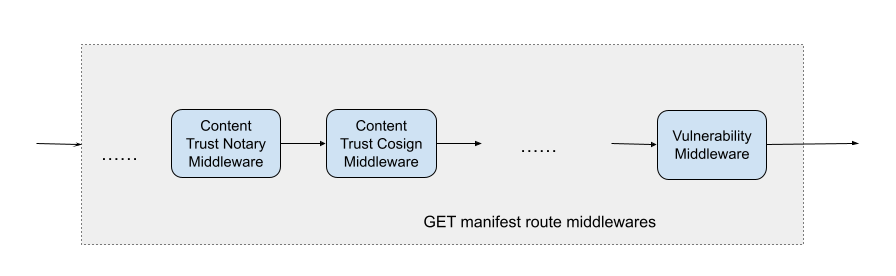
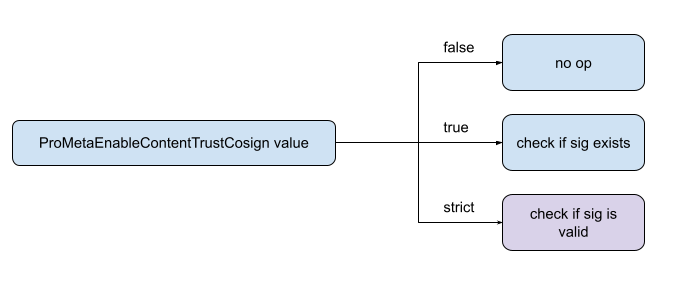
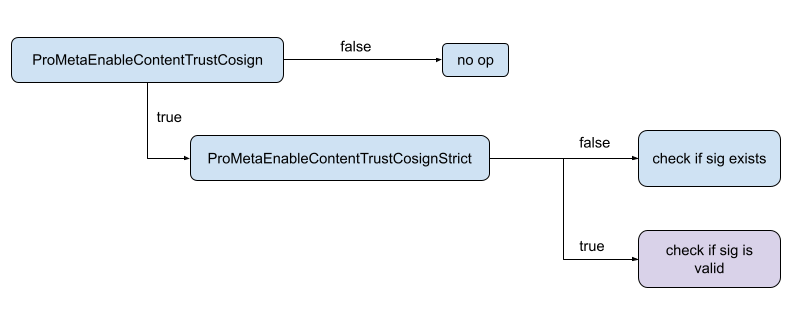
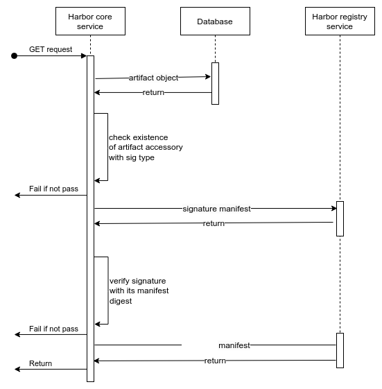

Proposal: Support Cosign strict signatures verification in Harbor

Author: Kara Guo (karaguo), Eric Liu (LiuShuaiyi)

Discussion: https://github.com/goharbor/harbor/issues/18808 

## Abstract

This proposal is to include Cosign signature verification into existing Cosign signature existence checks, with predefined verifiers, to determine whether an artifact is signed by trusted entities, instead of anyone. 

Privileged users configure projects to enable strict signature verification. Besides, harbor can offer end users a way to configure path or reference of public keys or CA certificates, and the verifier automatically picks up the trust anchor to do signature validation. 

## Background and Motivation

Cosign integration is introduced in Harbor v2.5.0, which allows the administrator to configure Harbor projects that require  all artifacts to be signed before they can be pulled. The proposal at https://github.com/goharbor/community/blob/main/proposals/new/cosign-integration.md introduces cosign integration in Harbor, so that cosign signatures are managed as artifact accessories alongside the signed artifacts. As a non-goal, public key management and cosign signature verification is not included. Cosign signature is recognizable by Harbor, but cosign package is not introduced into harbor repository.

However, to check the existence of signatures is not a strong enough check for artifact integrity. Therefore, this proposal aims to add the public key management to Harbor and strong content trust validation.

## User journey

* As a system admin, I can configure public keys and CA certificates
* As a system admin, I can update public keys and CA certificates
* As a system & project admin, I can configure project to enable strict signature verification, so that manifest pull request reaching harbor-core goes through signature verification
  * If verification passes, it routes to harbor-registry and the manifest requested is returned.
  * If verification fails, it returns 412 error code with message The image is not signed in Cosign or The image doesn't pass Cosign signature verification.

## Design
 
### Terminology 

* Content trust cosign middleware: refers to the existing signature verification to check whether the corresponding signature exists or not.
* Content trust strict cosign middleware: refers to the new proposed layer to strictly verify whether the manifest is signed, and signed by trusted entities. 

### How to enable cosign strict verification
A mechanism to enable cosign strict verification is designed to support feature rollout. A global configuration can be set at harbor installation to determine whether the feature is visible to users. On the other hand, a harbor project level configuration allows users to enable or disable the feature at a harbor project level.  

#### Option 1 
The option is to use env variable in harbor core deployment. Harbor core environment variable can look as: 
```go
COSIGN_STRICT_VERIFICATION_ENABLED:true
```

#### Option 2  (preferred)
Another option is to use project schema.

##### Option 2.1 add enum to project schema key enable_content_trust_cosign
A dropdown is added to the project UI page to offer three dropdown options instead of a boolean checkbox.

In detail, at database, Harbor project is managed with schema as:
```go
type Project struct {
        ProjectID    int64                  `orm:"pk;auto;column(project_id)" json:"project_id"`
        OwnerID      int                    `orm:"column(owner_id)" json:"owner_id"`
        Name         string                 `orm:"column(name)" json:"name" sort:"default"`
        CreationTime time.Time              `orm:"column(creation_time);auto_now_add" json:"creation_time"`
        UpdateTime   time.Time              `orm:"column(update_time);auto_now" json:"update_time"`
        Deleted      bool                   `orm:"column(deleted)" json:"deleted"`
        OwnerName    string                 `orm:"-" json:"owner_name"`
        Role         int                    `orm:"-" json:"current_user_role_id"`
        RoleList     []int                  `orm:"-" json:"current_user_role_ids"`
        RepoCount    int64                  `orm:"-" json:"repo_count"`
        Metadata     map[string]string      `orm:"-" json:"metadata"`
        CVEAllowlist allowlist.CVEAllowlist `orm:"-" json:"cve_allowlist"`
        RegistryID   int64                  `orm:"column(registry_id)" json:"registry_id"`
}
```

```go
The metadata map contains feature gates for content trust of both cosign and notary, which are
ProMetaEnableContentTrust       = "enable_content_trust"          // notary
ProMetaEnableContentTrustCosign = "enable_content_trust_cosign"   // cosign
```

One option is to add another value to the project metadata key enable_content_trust_cosign as strict, to gate the signature verification at Harbor project level. In the end, there are three values of the key, as `true`, `false` and `strict`.

Once a request is routed to the harbor core server, the middlewares are executed before handling the request.



In content trust cosign middleware, 



##### Option 2.2  add new key to project schema enable_content_trust_cosign_strict

Another checkbox is added to UI, along with the existing checkbox to enable cosign signature existence check. 

In detail, a new one of key-value pairs is added to the project schema as enable_content_trust_cosign_strict. It takes effect only cosign signature existence check is enabled. The benefit of this option is that it only adds new attributes to database schema instead of changing the values, which provides better version compatibility.



### Trust anchor types
Trust anchor type varies depending on the KMS and how public keys or certificates are managed. Following is a list of examples:

* Path of public keys or CA certificates

Public keys and CA certificates can be managed at users’ local file systems. 

* URL of public keys or CA certificates

Public keys and CA certificates can be reachable by a url.

* KMS key URI

For use cases with KMS providers, the key can be a KMS key url as <provider>://<key>. For example, gcp KMS url can be gcpkms://projects/<name>/locations/<location>/keyRings/<name>/cryptoKeys/<name>/versions/<version>.

### Trust anchor user configuration
For users, the trust anchor adopted by Harbor is supposed to be configurable. One option to do it is to specify trust anchor catalog and corresponding details in harbor core environmental variables as:
* COSIGN_KEY_PATH
* COSIGN_KEY_URL
* COSIGN_CERT_PATH
* COSIGN_CERT_CHAIN_PATH
* Others

### Cosign signature verification



#### Step 1: Check signature existence

Since the middleware content trust cosign and content trust strict cosign are gated by two different mechanisms in parallel, there is no guarantee that content trust cosign is executed before content trust strict cosign. As the first step, the middleware checks the artifact object to verify where there are accessories associated. 

#### Step 2: Read trust anchor data

##### Read data

At Harbor installation, trust anchor user configuration is supposed to be set by users depending on which KMS to use and how CA signing is managed. At runtime, public keys or CA certificates are read and cached in memory to proceed with signature verification.

##### Syncing

One of the improvements is to allow runtime trust anchor refreshing. It enables users to change public keys or CA certificates for the scenarios such as cert rotation or damage recovery. 

For trust anchor types that save content in the local file system, users can manually update their file system to achieve syncing. More specifically, if users host Harbor in docker containers or k8s pods, the trusted CA certs are supposed to be mounted into containers as volumes. Either a directory or file from the Host that is mounted into a docker container, or Kubernetes resources mounted as Kubernetes container volumes, can be synchronized once users modified the source of the trusted CA cert list. 

For trust anchor types that refer to remote KMS service, KMS keeps and returns most up-to-date data while a read request is received.

##### Caching

An easy caching mechanism can be added in memory as a map to preload the trust anchor list. Once a verification error is hit, reloading from the file system can refresh the list. 

#### Step 3: use consign lib

Cosign, as part of the Sigstore project and provides container signing and verification with OCI registry integrations

* Get signature manifest from Harbor registry service

Harbor core middleware needs the corresponding signature manifest to conduct strict signature verification, so it sends a request to the Harbor registry component and the signature manifest is returned. Based on cosign convention, the encoded signature is stored in manifest layer annotations with key dev.cosignproject.cosign/signature

Following is an example of signature manifest:
```yaml
{
  "schemaVersion": 2,
  "mediaType": "application/vnd.oci.image.manifest.v1+json",
  "config": {
    "mediaType": "application/vnd.oci.image.config.v1+json",
    "size": xxx,
    "digest": "sha256:xxx"
  },
  "layers": [
    {
      "mediaType": "application/vnd.dev.cosign.simplesigning.v1+json",
      "size": xxx,
      "digest": "sha256:xxx",
      "annotations": {
        "dev.cosignproject.cosign/signature": "<encoded signature string>"
      }
    }
  ]
}
```

* Strictly verify signature with trusted CA list

To iterate over all trust anchor entities, signatures are only verified upon the list. The artifact will pass verification if any trust anchor entity can verify the artifact

## Non-Goals
* Cosign strict signature verification status shown at UI
