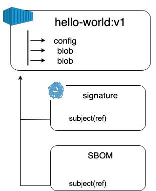
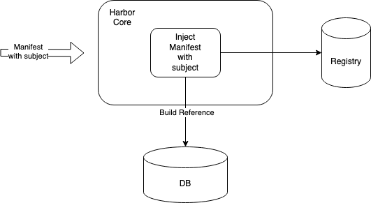
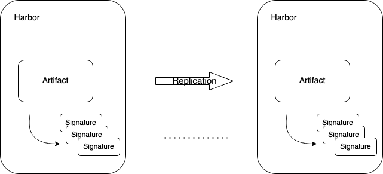

Proposal: Support OCI distribution spec v1.1.0 in Harbor

Author: Yan Wang

## Abstract

Container registries have evolved from being storage locations for container images to becoming repositories for a wide range of artifacts. The Open Container Initiative (OCI) has introduced the OCI Artifact Manifest and the referrers API, which enable users to store and manage additional types of artifacts, such as signed Software Bill of Materials (SBOM), provenance, attestations, and even videos. The referrers API also allows users to establish relationships between artifacts, further enhancing the capabilities of container registries. The OCI 1.1 specifications, which include these new features, are currently in their second release candidate (RC.2) and are expected to be officially released in February 2023.

## Motivation

The need to distribute detached signatures and signed SBOMs for container images has driven the development of new reference types in container registries. The OCI Artifact Manifest provides support for storing signatures, SBOMs, and other references, allowing users to create a graph of related artifacts that can be tracked together or pulled independently. Together with the referrers discovery API, these enhancements to the OCI v1.1 Specifications offer powerful new tools for managing container artifacts and improving supply chain security.

## Goal

Support OCI distribution v1.1.0
1. Recognize and build the linkage of artifacts by using the subject attribute.
2. Support the Referrers api.

## Non Goal

1. Migrate existing Cosign signature.
2. Migrate the existing artifact with subject field.
3. Supports [Referrers Tag Schema](https://github.com/opencontainers/distribution-spec/blob/v1.1.0-rc1/spec.md#referrers-tag-schema) 

## Future Goal

1. Deprecate Cosign version before image spec v1.1.0.
2. Replication/Proxy Cache supports [Referrers Tag Schema](https://github.com/opencontainers/distribution-spec/blob/v1.1.0-rc1/spec.md#referrers-tag-schema).

## Personas and User Stories

This section outlines the user stories for different personas who interact with OCI distribution v1.1.0.

* Personas

Authorized users in Harbor with image push scope.

* User Stories

1. As a project admin and user, I want to be able to push and pull a manifest with a specific subject. 
2. As a project admin and user, I want to be able to delete a manifest with a specific subject. 
3. As a project admin and user, I want to be able to delete an artifact and the manifests that reference it via garbage collection. 
4. As a project admin and user, I want to be unable to garbage collect an artifact's cosign signature individually. 
5. As a system admin, I want to be able to copy an artifact and the manifests that reference it. 
6. As a system and project admin, I want to be able to reserve an artifact and the manifests that reference it via a retention policy. 
7. As a system admin, I want to be able to set up a replication rule to replicate an artifact and the manifests that reference it.


## What's New

***Subject***
An association between two manifests, often used to link an artifact with an image. The "subject" field is present in both the image and artifact manifests.

According to the Distribution Specification v1.1, this property is optional and defines a descriptor for another manifest. The "referrers" API uses this value to establish a relationship with the specified manifest.

```yaml
{
  "schemaVersion": 2,
  "mediaType": "application/vnd.oci.image.manifest.v1+json",
  "config": {
    "mediaType": "application/vnd.oci.image.config.v1+json",
    "size": 7023,
    "digest": "sha256:b5b2b2c507a0944348e0303114d8d93aaaa081732b86451d9bce1f432a537bc7"
  },
  "layers": [
    {
      "mediaType": "application/vnd.oci.image.layer.v1.tar+gzip",
      "size": 32654,
      "digest": "sha256:9834876dcfb05cb167a5c24953eba58c4ac89b1adf57f28f2f9d09af107ee8f0"
    },
    {
      "mediaType": "application/vnd.oci.image.layer.v1.tar+gzip",
      "size": 16724,
      "digest": "sha256:3c3a4604a545cdc127456d94e421cd355bca5b528f4a9c1905b15da2eb4a4c6b"
    },
    {
      "mediaType": "application/vnd.oci.image.layer.v1.tar+gzip",
      "size": 73109,
      "digest": "sha256:ec4b8955958665577945c89419d1af06b5f7636b4ac3da7f12184802ad867736"
    }
  ],
  "subject": {
    "mediaType": "application/vnd.oci.image.manifest.v1+json",
    "size": 7682,
    "digest": "sha256:5b0bcabd1ed22e9fb1310cf6c2dec7cdef19f0ad69efa1f392e94a4333501270"
  },
  "annotations": {
    "com.example.key1": "value1",
    "com.example.key2": "value2"
  }
}
```



***N/A*** The subject field for image-index: https://github.com/opencontainers/image-spec/pull/1020

***Referrers List*** 
A list of manifests with a subject relationship to a specified digest. The referrers list is generated with a query to a registry.

***artifactType***
The descriptors MUST include an artifactType field that is set to the value of artifactType for an artifact manifest if present, or the configuration descriptor's mediaType for an image manifest.

```yaml
GET /v2/<name>/referrers/<digest>
Link: <url>; rel="next"

{
  "schemaVersion": 2,
  "mediaType": "application/vnd.oci.image.index.v1+json",
  "manifests": [
    {
      "mediaType": "application/vnd.oci.image.manifest.v1+json",
      "size": 1234,
      "digest": "sha256:a1a1a1...",
      "artifactType": "application/vnd.example.sbom.v1",
      "annotations": {
        "org.opencontainers.artifact.created": "2022-01-01T14:42:55Z",
        "org.example.sbom.format": "json"
      }
    },
    {
      "mediaType": "application/vnd.oci.artifact.manifest.v1+json",
      "size": 1234,
      "digest": "sha256:a2a2a2...",
      "artifactType": "application/vnd.example.signature.v1",
      "annotations": {
        "org.opencontainers.artifact.created": "2022-01-01T07:21:33Z",
        "org.example.signature.fingerprint": "abcd"
      }
    }
  ]
}

```

Request with filtering(artifactType):

```yaml
GET /v2/<name>/referrers/<digest>?artifactType=application/vnd.example.sbom.v1

{
  "schemaVersion": 2,
  "mediaType": "application/vnd.oci.image.index.v1+json",
  "manifests": [
    {
      "mediaType": "application/vnd.oci.image.manifest.v1+json",
      "size": 1234,
      "digest": "sha256:a1a1a1...",
      "artifactType": "application/vnd.example.sbom.v1",
      "annotations": {
        "org.opencontainers.artifact.created": "2022-01-01T14:42:55Z",
        "org.example.sbom.format": "json"
      }
    }
  ]
}

```

***Referrers Tag Schema***

    <alg>-<ref>

* <alg>: the digest algorithm (e.g. sha256 or sha512)
* <ref>: the digest from the subject field (limit of 64 characters)

This tag should return an image index matching the expected response of the referrers API. Maintaining the content of this tag is the responsibility of clients pushing and deleting image and artifact manifests that contain a subject field.

### Benefits

In order to ensure secure supply chain processes, it is crucial to distribute signatures, software bill of materials (SBOMs), and scan results along with container images or Web Assemblies. Several years ago, registries lacked standards and tools for natively storing, discovering, and pulling a graph of Open Container Initiative (OCI) artifacts. To address this issue and enhance the capabilities of registries, a new artifact manifest attribute was introduced that can describe and query relationships between objects stored in a registry without altering existing content.

## Artifact reference

Harbor has already defined an [accessory](./accessory.md) to clarify the connection between the subject manifest and the linked manifests.

### Build reference



A registry MUST accept an otherwise valid manifest with a subject field that references a manifest that does not exist, allowing clients to push a manifest and referrers to that manifest in either order.

```yaml

CREATE TABLE artifact_accessory (
 id SERIAL PRIMARY KEY NOT NULL,
 /*
    the artifact id of the accessory itself.
 */
 artifact_id int,
 /*
  the subject artifact id of the accessory.
 */
 subject_artifact_id int,
 /*
  the type of the accessory, like signature.cosign.
 */
 type varchar(1024),
 size int,
 digest varchar(1024),
 creation_time timestamp default CURRENT_TIMESTAMP,
 FOREIGN KEY (artifact_id) REFERENCES artifact(id),
 FOREIGN KEY (subject_artifact_id) REFERENCES artifact(id),
 CONSTRAINT unique_artifact_accessory UNIQUE (artifact_id, subject_artifact_id)
);
```

Needs to be updated

```yaml
DROP FOREIGN KEY (subject_artifact_id)
Update column subject_artifact_id to subject_artifact_digest
```

### Managing Artifact with subject

Use this information to know about how you can work with artifact with subject and how artifact with subject affect system behaviors. 

#### Deleting Manifests

User Stories outline the behavior(***Hard***):

1. If the top-level artifact is deleted, all the manifests that associate with the artifact are deleted.
2. The manifests with subject can be deleted individually.

***[N/A]***
How are registries expected to behave when a subject is deleted? https://github.com/opencontainers/distribution-spec/issues/378
    
#### Replication



When pushing/pulling an image or artifact manifest with the subject field , and the referrers API is available.

    Tooling that copies images between registries may recursively query for referrers and copy them.

#### Tag Retention

- If any artifact configured as retained, all the manifests pointing to it are retained.

#### Copy Artifact

- Tooling that copies images between projects may recursively query for referrers and copy them.  

#### Immutable

- If any artifact configured as immutable, all the manifests pointing to it are immutable.

#### Garbage Collection

- An untagged manifest with a subject field pointing to an existing manifest should not be removed. 
- When a manifest is deleted by a garbage collection policy or by an API request, all untagged artifacts that referred to that manifest may be cleaned by garbage collection.

#### Proxy Cache

When proxying an image or artifact manifest with the subject field , and the referrers API is available.

    Tooling that proxies images between registries may recursively query for referrers and copy them.

### To be discussed
N/A****

