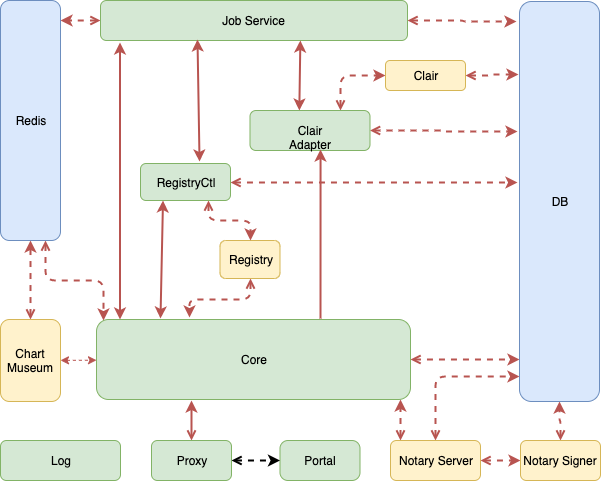

# Proposal: `Enable TLS Between Components`

Author: `<Qian Deng / ninjadq>`

## Abstract

Https is more secure then http, So we propose to give user an option to enable TLS between every components of harbor to improve the security of Harbor.

## Background

Everyone knows that http is insecure. But currently Harbor components are still using http to communicate with each other. Even it is inside the container network. The potential problems are still exist.

For example, some companies has policy to disallow their software use http for security concern. In addition, there are some advanced user who use harbor in a large scale environment in which harbor components do not deployed in one machine and they are not use docker-compose network. In this situation, some sensitive infomation will expose to the intranet.

Besides the potention issues. Move http to https is also an industry trend. We can find so many articles about deprecatting http currently.

## Proposal

[A precise statement of the proposed change.]

This PR propose to give user an option to use https when communicating between components if they all maintained by Harbor maintainer(green rectangle in digram) their communication directions are highlighted by red line. Moreover, Try best to support the the third party components (yellow rectangle) and data components(green rectangle) to communicating with harbor maintained components which is red dashed line in the following digram.



Component pairs

|               |               |      |      |
| ------------- | ------------- | ---- | ---- |
| Core          | Proxy         | p0   |      |
| Core          | Job Service   | p0   |      |
| Core          | RegistryCtl   | p0   |      |
| Core          | Clair Adapter | p0   |      |
| Job Service   | RegistryCtl   | p0   |      |
| Job Service   | Clair Adapter | p0   |      |
| Registryctl   | Registry      | p1   |      |
| Registry      | Core          | p1   |      |
| DB            | Core          | p1   |      |
| DB            | Job Service   | p1   |      |
| DB            | Clair Adapter | p1   |      |
| DB            | Registryctl   | p1   |      |
| DB            | Clair         | p1   |      |
| DB            | Notary server | p1   |      |
| DB            | Notary signer | p1   |      |
| Clair Adapter | Clair         | p1   |      |
| Notary Server | Notary Signer | p1   |      |
| Redis         | Core          | p1   |      |
| Redis         | Jobservice    | p1   |      |
| Redis         | Chart Museum  | p1   |      |

To achieve this goal, we need to:

1. Provide a CA cert (manage CAs is complicated, in this Proposal we only use one CA to sign all certs)
1. Provide key and cert pair for each components, and they signed by a CA who provide ca cert in 1
1. Let every applications inside all containers to trust CA provided by 1
1. Enable components tls feature. The rule to deside if enable tls between components or not is that
    1. If components are maintained by harbor
* Then implement related logics.
    2. If components is third party product
    * If Already provided the tls service. Then enable it
        * If tls is not supoorted or hard to enable. Then do not enable tls this time


1. Change the prepare script to deploy and mount these certs to correct place

1. Migrate script to handle config migrating

1. Enable mutual TLS authentication if possible

1. Enable TLS between Harbor with third party component like DB, Redis, Chartmuseum if possible

1. Must considering scenario of Helm Chart

## Non-Goals

1. Manage certs for user
2. Generate cert or key for user
3. Enable TLS between Portal and Proxy. Because Portal only contains static file.

## Rationale

Pros:

* More secure
* Possible to remove logic that use the secretkey to communicate

Cons:

* Performance lost
* More complicated to setup Harbor
* May cause failure when migrating from previous version if not configured correctly

## Compatibility

1. Not compatible if you migrated from previous version and enable this feature. Because it need more cert files.

## Implementation

[A description of the steps in the implementation, who will do them, and when.]

### Provide an config option

Add an option in `harbor.yml` to provide cert files. https config item may look like this

```yaml
internal_tls:
  trust_ca_dir: /trust/ca/dir
  core_certificate: /your/core/certificate/path
  core_private_key: /your/core/private/key/path
  clair_adapter_certificate: /your/clair/adapter/certificate/path
  clair_adapter_private_key: /your/clair/adapter/private_key/path
  job_service_certificate: /your/job/service/certificate/path
  job_service_private_key: /your/job/service/private_key/path
  registry_ctl_certificate: /your/registry/ctl/certificate/path
  registry_ctl_private_key: /your/registry/ctl/private/key/path
  ...

```

### Load Security Related Files

First of all we should load all the trust CAs into the container.

We can mount `/trust/ca/dir` to `/harbor_cust_cert` in container. The `install_cert.sh` will append them automatically.

But two things need concern,

* one is that let prepare failure early if file is illegal
* another one is remove `ca_bundle` in storage settings. Becaus it's duplicate with `trust_ca_dir` . And need to migrate `ca_bundle` if configured it

### Add the Logic to Enable SSL in Codes

#### Enable Server Side SSL

Most of components are written in Go. So we need enable ssl in the server side like this

```go
cer, err := tls.LoadX509KeyPair("server.crt", "server.key")
if err != nil {
    log.Println(err)
    return
}

config := &tls.Config{Certificates: []tls.Certificate{cer}}
ln, err := tls.Listen("tcp", ":443", config) 
if err != nil {
    log.Println(err)
    return
}
defer ln.Close()
```

If compoent is use Beego as web framework, we can set the beego config file like this

```json
beego.BConfig.Listen.EnableHTTPS = false
beego.BConfig.Listen.HTTPSCertFile = "conf/ssl.crt"
beego.BConfig.Listen.HTTPSKeyFile = "conf/ssl.key"
```

#### Enable Client Side SSL

If mutual ssl is required, we also need to enable client side ssl

Golang can enable it like this

```go
cert, err := tls.LoadX509KeyPair("client.crt", "client.key")
if err != nil {
        log.Fatal(err)
}

client := &http.Client{
        Transport: &http.Transport{
                TLSClientConfig: &tls.Config{
                        RootCAs:      caCertPool,
                        Certificates: []tls.Certificate{cert},
                },
        },
}
```

Nginx should add config like this

```nginx
server {
 ...
 ssl_verify_client on;
 ...
}
```

#### Make CI work After Enable SSL

We need generate certs and keys for each components and update ci configuration files.
