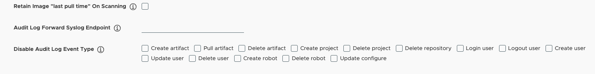
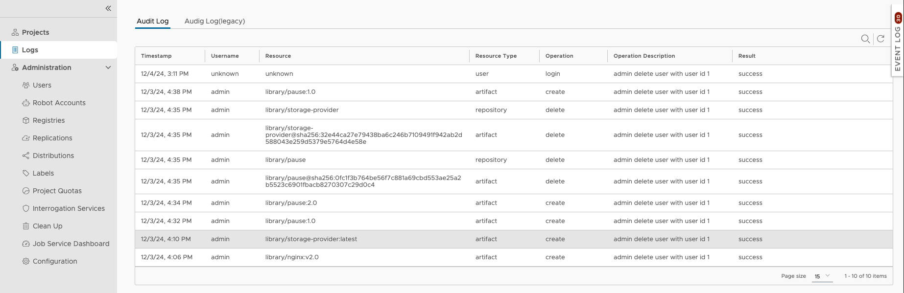
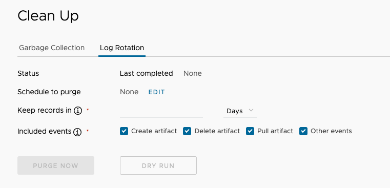

Proposal: Enhance Audit Log

Author: Stone Zhang

# Abstract

Enhance the audit log to include more information about the actions taken by users in the system. such as user login/logout, user creation/deletion, configuration change etc.

# Background

Harbor is an important component in the cloud-native software security supply chain, it is used to store and distribute artifact through the software develement lifecycle. many users concern about the audit log to log important security events in the Harbor, so that every security incident can be traceable. They want to enrich the event type to add the following:

1. User login, include success and failed login
1. User create/delete
1. Project member add/remove, including user and group member
1. Configuration change, including system-level config and project-level configure
1. Project policy change: include the tag retention, and immutable policy change
1. Audit log cleanup schedule or execution

With the above event type, the Harbor administrator can trace the user's behavior in the system, and know who has done what in the system, and when it happened, and the source of the request. make the Harbor more secure and traceable.

# Related requirement issues

- https://github.com/goharbor/harbor/issues/21148
- https://github.com/goharbor/harbor/issues/20295
- https://github.com/goharbor/harbor/issues/20293
- https://github.com/goharbor/harbor/issues/20292
- https://github.com/goharbor/harbor/issues/18351
- https://github.com/goharbor/harbor/issues/15134
- https://github.com/goharbor/harbor/issues/14277
- https://github.com/goharbor/harbor/issues/4426
- https://github.com/goharbor/harbor/issues/11996

# Personas and User Stories

1. As a Harbor administrator, I want to know who has logged in/logout to the system, so that I can trace the user's behavior in the system.
1. As a Harbor administrator, I want to know who has created/updated/deleted a user, so that I can trace the user's behavior in the system.
1. As a Harbor administrator, I want to know who has added/removed a project member, so that I can trace the user's behavior in the system.
1. As a Harbor administrator, I want to know who has changed the system configuration, so that I can trace the user's behavior in the system.
1. As a Harbor administrator, I want to know who has changed the project configuration, so that I can trace the user's behavior in the system.
1. As a Harbor administrator, I want to know who has changed the project policy, so that I can trace the user's behavior in the system.

# Solution

## Event Format
The audit log ext format is defined as follow:

```go
type AuditLogExt struct {
    ID           int64     `orm:"pk;auto;column(id)" json:"id"`
    ProjectID    int64     `orm:"column(project_id)" json:"project_id"`
    Operation    string    `orm:"column(operation)" json:"operation"`
    OperationDescripton string
    OperationResult string
    ResourceType string    `orm:"column(resource_type)"  json:"resource_type"`
    Resource     string    `orm:"column(resource)" json:"resource"`
    Username     string    `orm:"column(username)"  json:"username"`
    OpTime       time.Time `orm:"column(op_time)" json:"op_time" sort:"default:desc"`
}
```

## Middleware to capture the audit log event

Create an audit log middleware which captures the HTTP request and response of v2.0 related APIs
If the request is a PUT method, it usually indicate an update operation 
If the request is a DELETE method, it usually indicate a delete operation
Use a ResponseWriter to get response code and the response header,  
If the http response code between 200 and 201, then it is considered to be success,  others should be failure.
If it is a POST event, it maybe a create operation, then the Location should be put in the response header, the audit log could retrieve the resource id from the location field.

## Audit Log Handling Flow

In the current audit log flow, the audit log is handled asynchronously, the audit log event is sent to the event queue, and the audit log handler will fetch the event from the queue, call ResolveToAuditLog, and create an audit log item.
```
Metadata --> notification.Event -> Resolve to Event -> Resolve to Audit Log Event
```

Under this framework, if need to add a new event type, it requires the following steps:

1. Add new event metadata in the controller/event/metadata folder and implement the Resolve method to resolve the current Metadata to the event.
1. Add new event type in the controller/event/topic.go file, and implement the ResolveToAuditLog method to resolve the current event to the audit log.
1. Add topic for each event type in the controller/event/topic.go file, and register the event handler in the controller/event/handler.go file.
1. Update the controller/event/handler/init.go file to add the auditlogHandler to subscribe to the new event type.
1. Update the controller/event/handler/auditlog/auditlog.go file to handle the new event type.

The above steps are cumbersome and error-prone when there are too many event types. To simplify the process, we can create a common event metadata and a common event that can handle all events related to the v2.0 API. When an event occurs, create a metadata and call notification.AddEvent(ctx, event, true) to send the event queue. The middleware will process the event in the queue when the request is complete. These events will be handled asynchronously. These events will be sent to same topic, the audit log handler will fetch the event from the queue, call ResolveToAuditLog, and create an audit log item.

The common event metadata should include the context information of the current event and resolve it into a CommonEvent. it includes all required context information of the current event.  and implement the Resolve method to resolve the current Metadata to common event.

```go
type Metadata struct {
	Ctx context.Context
	// Username requester username
	Username string
	// RequestPayload http request payload
	RequestPayload string
	// RequestMethod
	RequestMethod string
	// ResponseCode response code
	ResponseCode int
	// RequestURL request URL
	RequestURL string
	// ResponseLocation response location
	ResponseLocation string
}
```

## Log Middleware

There is an existing log middleware to add the 'X-Request-ID' to the request context, we can update the log middleware to capture the audit log event.
The following is the diagram of the log middleware, notification middleware and the request event queue.


In the BuildAndPublish(event) method call, it will resolve the Metadata into an event and send it to different topics, for each topic, there are different handlers to handle it, such as audit log handler. it will resolve the event to audit log and save it in database or forward to logger aggregator.

The following is the code snippet of the log middleware to capture the audit log event.

```go

func Middleware() func(http.Handler) http.Handler {
    ...
    // Add audit log middleware
		enableAudit := false
		urlStr := r.URL.String()
		username := "unknown"
    // check the current request should be captured by http method and URL
    ...
    // use a wrapper to get the response code and response header
		rw := &ResponseWriter{
			ResponseWriter: w,
			statusCode:     http.StatusOK,
		}

		next.ServeHTTP(rw, r)

		if enableAudit {
			ctx := r.Context()
			event := &commonevent.Metadata{
				Ctx:              ctx,
				Username:         username,
				RequestMethod:    r.Method,
				RequestPayload:   requestContent,
				RequestURL:       urlStr,
				ResponseCode:     rw.statusCode,
				ResponseLocation: rw.header.Get("Location"),
			}
      // check if current event should be captured and send to the event queue via PreCheck, if not, skip to AddEvent.
      ...

			notification.AddEvent(ctx, event, true)
		}
}
```

Except the logout, which is a GET method and is required to be captured by the audit log, so we need to add a regular expression to match the logout event. Any request with POST, PUT, DELETE method will be captured by the log middleware, and the audit log event will be sent to the event queue.
According to the REST API standard, response codes between 200 and 201 is considered to be successful; others should be considered failures. 

1. If it is a POST event, it maybe a create operation, then the Location should be put in the response header, the audit log could retrieve the resource id from the location field.
1. If it is a PUT event, it maybe an update operation, the resource id should be retrieved from the request URL.
1. If it is a DELETE event, it maybe a delete operation, the resource id should be retrieved from the request URL.
1. If it is a GET event, it maybe a query operation and can be ignored.

If the API of create/delete/update follows the REST API standard, and the the response code and response header are set correctly, and the base URL has and only has the resource ID in the end, it could be covered by basic event type.

If the Event is not a basic event type, we need to add a new resolver to resolve the common event to the specific event type.

## Event Resolve 

The common event metadata includes all context information of the current event, the Resolve method can resolve to different event types according to the request URL and request method.

```go
var urlResolvers = map[string]Resolver{
	`/api\/v2\.0\/configurations$`:                   configureEventResolver,
	`/c\/login$`:                                     loginEventResolver,
	`/c\/log_out$`:                                   loginEventResolver,
	`/api\/v2\.0\/users$`:                            userResolver,
	`^/api/v2\.0/users/\d+/password$`:                userResolver,
	`^/api/v2\.0/users/\d+/sysadmin$`:                userResolver,
	`^/api/v2\.0/users/\d+$`:                         userResolver,
	`^/api/v2.0/projects/\d+/members`:                projectMemberResolver,
	`^/api/v2.0/projects/\d+/members/\d+$`:           projectMemberResolver,
	`^/api/v2.0/projects$`:                           projectResolver,
	`^/api/v2.0/projects/\d+$`:                       projectResolver,
	`^/api/v2.0/retentions$`:                         tagRetentionResolver,
	`^/api/v2.0/retentions/\d+$`:                     tagRetentionResolver,
	`^/api/v2.0/projects/\d+/immutabletagrules$`:     immutableTagEventResolver,
	`^/api/v2.0/projects/\d+/immutabletagrules/\d+$`: immutableTagEventResolver,
	`^/api/v2.0/system/purgeaudit/schedule$`:         purgeAuditResolver,
}


// Resolve parse the audit information from CommonEventMetadata
func (c *Metadata) Resolve(event *event.Event) error {
	for url, r := range urlResolvers {
		p := regexp.MustCompile(url)
		if p.MatchString(c.RequestURL) {
			return r.Resolve(c, event)
		}
	}
	return nil
}

```
For each basic event type, we can create a resolver to resolve the common event to the specific event type, such as userResolver, projectResolver etc.
For other event type, which can not be resolved by the current resolver, we can add a new resolver to resolve the common event to the specific event type. such as the projectMemberResolver, loginEventResolver, purgeAuditResolver, etc. these resolver also implements the Resolver interface. the following chart shows the relationship between the Resolver and the specific event type resolver.


The following chart shows how the common event metadata is resolved to the specific event type, and the specific event is resolved to common event and then to the audit log.


## Disable Specific Audit Log Event 
Because there are lots of event types add to the audit log, some user might need to skip some unwanted event type. to disable it, the user need to configure audit_log_disable like that
```
create_user, delete_user, update_user
```
It skip to log the user create, user delete, user update event to audit log table.

In the log middleware, check if the current Metadata should be captured

```go
			// If this event is not captured, we don't need to add it to the notification
			if !event.PreCheck(ctx) {
				return
			}
```

The Metadata's PreCheck method will match the url pattern and event resolver to check if current event is disabled. if it is disabled, it will skip calling SendEvent() method to save the subsequent overhead. the following is the code snippet of the PreCheck method.

```go
func (c *Metadata) PreCheck(ctx context.Context) (bool, string) {
	for urlPattern, r := range urlResolvers {
		p := regexp.MustCompile(urlPattern)
		if p.MatchString(c.RequestURL) {
			return r.PreCheck(ctx, c.RequestURL, c.RequestMethod)
		}
	}
	return false, ""
}
```

In the handler of audit log, add condition to check if the current <operation>_<resourcetype> is enabled, default value is enabled for all event type.
```go
func (h *Handler) Handle(ctx context.Context, value interface{}) error {
	...
		if auditLog != nil && config.AuditLogEnabled(ctx, fmt.Sprintf("%v_%v", auditLog.Operation, auditLog.ResourceType)) {
			_, err := audit.Mgr.Create(ctx, auditLog)
			if err != nil {
				log.Debugf("add audit log err: %v", err)
			}
		}
	...
}
```
With this feature, the previous configure option `pull_audit_log_disable` can be deprecated. Just use `audit_log_disable` to disable the unwanted event type.

## Cleanup Audit Log

Because purge audit log will delete the audit log periodically,  and it allow user to select the event to purge, the new type of event should be added to the selection, such as user login/logout, user create/delete, project member add/remove, configuration change, project policy change. it involves too many event type, so we can categorize all these events as `other events` type. 

## API change

Add a new API to query the audit log ext event. the API is `/api/v2.0/auditlog-exts`, the user can filter the audit log event by the operation, resource_type, resource, the operation description and operation result are visible to users.

```
  /auditlog-exts:
    get:
      summary: Get recent logs of the projects which the user is a member of
      description: |
        This endpoint let user see the recent operation logs of the projects which he is member of
      tags:
        - auditlog
      operationId: listAuditLogsExt
      parameters:
        - $ref: '#/parameters/requestId'
        - $ref: '#/parameters/query'
        - $ref: '#/parameters/sort'
        - $ref: '#/parameters/page'
        - $ref: '#/parameters/pageSize'
      responses:
        '200':
          description: Success
          headers:
            X-Total-Count:
              description: The total count of auditlogs
              type: integer
            Link:
              description: Link refers to the previous page and next page
              type: string
          schema:
            type: array
            items:
              $ref: '#/definitions/AuditLogExt'
        '400':
          $ref: '#/responses/400'
        '401':
          $ref: '#/responses/401'
        '500':
          $ref: '#/responses/500'
```

The audit log v2 is avaible at project level, the API is  `/api/v2.0/projects/{project_name}/auditlog-exts`, the user can filter the audit log event by the operation, resource_type, resource. and only the project level admin can view the audit log event. and only display the event of current project.

```
  /projects/{project_name}/auditlog-exts:
    get:
      summary: Get recent logs of the projects
      description: Get recent logs of the projects
      tags:
        - project
      operationId: getLogsExt
      parameters:
        - $ref: '#/parameters/projectName'
        - $ref: '#/parameters/requestId'
        - $ref: '#/parameters/query'
        - $ref: '#/parameters/sort'
        - $ref: '#/parameters/page'
        - $ref: '#/parameters/pageSize'
      responses:
        '200':
          description: Success
          headers:
            X-Total-Count:
              description: The total count of auditlogs
              type: integer
            Link:
              description: Link refers to the previous page and next page
              type: string
          schema:
            type: array
            items:
              $ref: '#/definitions/AuditLogExt'
        '400':
          $ref: '#/responses/400'
        '401':
          $ref: '#/responses/401'
        '500':
          $ref: '#/responses/500'
```

The AuditLogExt is defined as follow

```
  AuditLogExt:
    type: object
    properties:
      id:
        type: integer
        description: The ID of the audit log entry.
      username:
        type: string
        description: Username of the user in this log entry.
      resource:
        type: string
        description: Name of the resource in this log entry.
      resource_type:
        type: string
        description: Type of the resource in this log entry.
      operation:
        type: string
        description: The operation in this log entry.
      operation_description:
        type: string
        description: The operation's detail description
      operation_result:
        type: boolean
        description: the operation's result, true for success, false for fail
      op_time:
        type: string
        format: date-time
        example: '2006-01-02T15:04:05Z'
        description: The time when this operation is triggered.
```

In order to provide a list of audit log event types to disable in configuration pannel, the API `/api/v2.0/auditlog-exts/events` provide the event types ID and names.

```
  /auditlog-exts/events:
    get:
      summary: Get all event types of audit log
      description: |
        Get all event types of audit log
      tags:
        - auditlog
      operationId: listAuditLogEventTypes
      parameters:
        - $ref: '#/parameters/requestId'
      responses:
        '200':
          description: Success
          schema:
            type: array
            items:
              $ref: '#/definitions/AuditLogEventType'
        '400':
          $ref: '#/responses/400'
        '401':
          $ref: '#/responses/401'
        '500':
          $ref: '#/responses/500'
```
and it returns the `AuditLogEventType`

```
  AuditLogEventType:
    type: object
    properties: 
      event_type: 
        type: string
        description: the event type, such as create_user
```

## Related UI changes

### Disable Audit Log Event Type

Add a new configuration item in the system configuration page to disable the unwanted audit log event type.
Add the `audit_log_disable` configuration item in the Configuration -> System Settings page, the user can select the event type to disable the audit log event, the event type should be separated by comma. Because the event type is the combination of operation and resource type, the user can input the operation and resource type to disable the audit log event. it is a string type configuration item. all audit log event types are retrieved from the API `/api/v2.0/auditlog-exts/events`.




### Audit Log Page

Update audit log page to display the audit log ext event and the previous audit log, the user can filter the audit log event by the operation, resource_type, resource, the operation description and operation_result are visible to users.



Under each project's audit log page, the UI should be updated to display the audit log ext event and the previous audit log. 

### Cleanup Audit Log

In the previous implementation, only image related event types could be selected to purging, such as create/delete/pull. we need to add more options to select new event types. Because there are too many event types to display in the UI, just provide an `Other Events` option to select all other resources to clean up. The cleanup operation will also apply to the legacy audit log table.





## Schema Change

Because previous audit_log table maybe contains large amount of old records, it might cause the update to this table very slow during the schema migration when upgrade. we create a new table to store the new audit log event, and the old audit log table will be deprecated in future.

The audit_log_ext table schema: 

```sql
create table if not exists audit_log_ext
(
	id BIGSERIAL PRIMARY KEY NOT NULL,
	project_id bigint,
	operation varchar(50) null,
	resource_type varchar(50) null,
	resource varchar(50) null,
	username varchar(50) null,
	op_desc varchar(500) null,
	success boolean default true,
	payload text null,   --reserved column
	source_ip inet null, --reserved column
	op_time timestamp default CURRENT_TIMESTAMP
);

-- add index to the audit_log_ext table
CREATE INDEX IF NOT EXISTS idx_audit_log_ext_op_time ON audit_log_ext(op_time);
CREATE INDEX IF NOT EXISTS idx_audit_log_ext_project_id_optime ON audit_log_ext(project_id, op_time);
CREATE INDEX IF NOT EXISTS idx_audit_log_ext_project_id_resource_type ON audit_log_ext(project_id, resource_type);
CREATE INDEX IF NOT EXISTS idx_audit_log_ext_project_id_operation ON audit_log_ext(project_id, operation);

```

Because the audit log can be forworad to log process endpoints such as LogInsight, ELK(Elastic Logstash Kibana) etc, adding the `op_desc` operation description makes the information more readable to the end user.

The `success` field is true when it is success, otherwise it is false.
`payload` and `source_ip` are reserved columns.

## Security

In previous implementation, the audit log is visible to all users, because there are lot of sensitive information might be store in the audit log, in this release, the audit log is only visible to the project admin role and system admin role.

## Compatibility

The new audit log event type is compatible with the previous audit log event type, the previous audit log event type is still supported, all audit log event will be logged in the audit log ext table.
After enabling Audit Log Forward Syslog Endpoint option, it can be forwarded to the log processing endpoints such as LogInsight, ELK(Elastic Logstash Kibana) etc. and user can
enable `Skip Audit Log Database` option to skip to write audit log in the database. when it is forward to external log processing system, the user should query the logs in the external system.
see document: https://goharbor.io/docs/2.12.0/administration/log-rotation/


## Failure Cases

Because the audit log is handled asynchronously in the harbor-core container, if the harbor-core crashes before the audit log is recorded, the audit log event in the queue will be lost. Considering the low likelihood of this situation occurring, we believe this risk is acceptable and won't discuss it in this proposal.

## Breaking Changes

The audit log is only visible to the project admin role and system admin role. for a normal user not in project admin neither sys admin, the audit log should be invisible in the UI.

## Non-Goals

1. The current audit log is based on the http middleware, it means it can only capture the event has http request and http response, and it is initiated by the user, usually it is a user action. for system level background job, such as the job service, the event is not captured by the audit log. it is out of the scope of this proposal.

1. User login event only includes logins through browser, it does not include basic authentication by Docker CLI such as `docker login`, nor does it include basic authentication when calling  RESTful APIs. 

1. Tracking the client IP address: usually `x-forwarded-for` contains the IP address of the client, in cloud native applications, the ingress, or loadbalancer will set  this field to the IP of its pod, and result in the information inaccurate. maybe in future we could have a better solution to solve this problem, just keep the reserved column empty.

1. The Harbor 2.13.0 will support audit log event of user login, user create/delete/update, configuration update etc. the rest audit log event, such as project create/update/delete will be implement in future release with the same framework.


