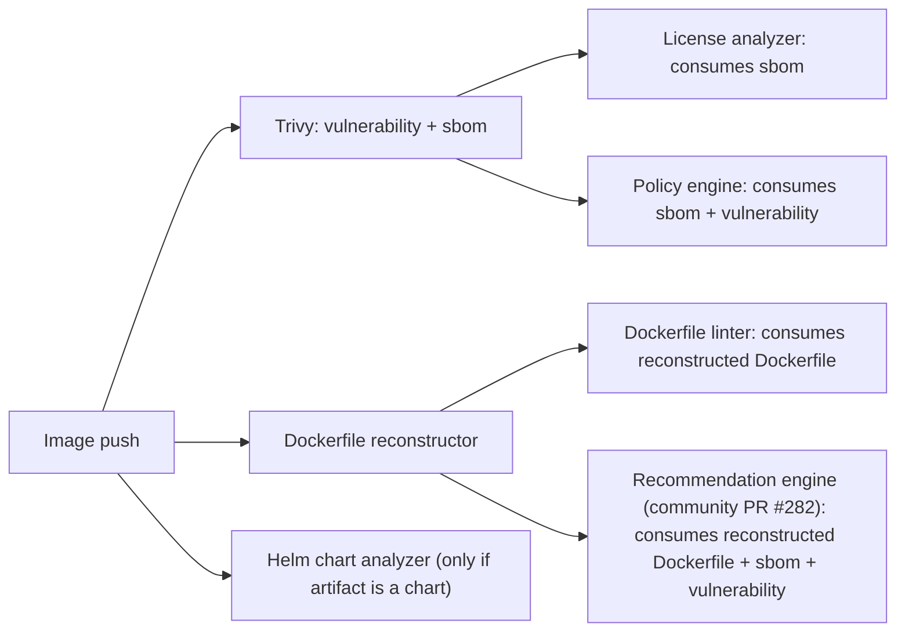

# Proposal: Extend the Pluggable Scanner Spec for General-Purpose Image Analysis and Chaining

Author: Vadim Bauer (@vad1mo, 8gears)

Discussion:
* TBD — issue to be opened against `goharbor/pluggable-scanner-spec`
* Related: [Proposal: Image Optimization & Recommendation Engine (#282)](https://github.com/goharbor/community/pull/282) — depends on this proposal to receive structured inputs (reconstructed Dockerfile, SBOM, prior scan reports) from upstream analyzers.
* Precedent: [Proposal: Pluggable Image Vulnerability Scanning](../pluggable-image-vulnerability-scanning_proposal.md) — established the adapter framework in 2019. This proposal completes the long-term objective stated there but explicitly deferred ("multi-scanner support… should be a new proposal based upon this work").
* Precedent: [Proposal: SBOM Generation and Scan](sbom_gen_scan.md) — first non-vulnerability capability added to the spec (v1.2.0, Jun 2024). Validated the MIME-typed extension path this proposal generalizes.

## TOC

- [Abstract](#abstract)
- [Background](#background)
  - [Current Spec (v1.2.0)](#current-spec-v120)
  - [Current Harbor Implementation](#current-harbor-implementation)
  - [What Blocks Generalization Today](#what-blocks-generalization-today)
- [Proposal](#proposal)
  - [Spec Changes (v1.3, additive)](#spec-changes-v13-additive)
  - [Harbor Core Changes (all additive)](#harbor-core-changes-all-additive)
  - [Example Chained Flow](#example-chained-flow)
  - [Example New Capabilities](#example-new-capabilities)
- [Non-Goals](#non-goals)
- [Rationale](#rationale)
- [Compatibility](#compatibility)
- [Implementation](#implementation)
- [Open Issues](#open-issues)

## Abstract

Today the [Harbor Pluggable Scanner Spec](https://github.com/goharbor/pluggable-scanner-spec) (v1.2.0, June 2024) models only two capabilities: `vulnerability` and `sbom`. This proposal extends the spec and the Harbor scanner subsystem into a **general-purpose image-analysis plugin framework** that supports arbitrary scanner types — Dockerfile reconstruction, Dockerfile/Helm best-practice linting, license analysis, image composition, secret detection, malware, policy evaluation, attestations — and **chains** them so the output of one adapter can feed another.

All changes are designed to be **wire-compatible with v1.2**: existing adapters (Trivy, Aqua, Sysdig, Anchore, Snyk, in-house) MUST continue to register, scan, and return reports against the extended Harbor unmodified.

This proposal unblocks adjacent community work that depends on richer pre-computed inputs, including the [Image Optimization & Recommendation Engine (#282)](https://github.com/goharbor/community/pull/282), which requires a reconstructed Dockerfile and SBOM produced by upstream analyzers to operate.

## Background

The pluggable scanner framework introduced in 2019 ([proposal](../pluggable-image-vulnerability-scanning_proposal.md)) was deliberately scoped to "phase 1": image vulnerability scanning, with a "single scanner at a time in use across all projects" and the explicit intent to avoid API decisions that would block later capabilities. SBOM (v1.2.0, 2024) was added inside that envelope.

Five years later, the spec is used in production by multiple commercial and open-source adapters. The MIME-typed extension path proved sound. What did not get built is the rest of the long-term objective described in the original proposal:

> "The set of scans that should be executed on artifacts in the project — Examples: vulnerability scan, software license scan, malware scan. Artifacts to be scanned examples: images, helm charts, CPAN bundles."

This proposal closes that gap.

### Current Spec (v1.2.0)

| Endpoint | Purpose |
|----------|---------|
| `GET /api/v1/metadata` | Adapter declares name, vendor, version, capabilities (consumes/produces MIME types) |
| `POST /api/v1/scan` | Submit artifact + requested capability; returns `scan_request_id` |
| `GET /api/v1/scan/{id}/report` | Poll report by `Accept` MIME; honors `Retry-After` |

Capability types defined: `vulnerability`, `sbom`. Report MIME types include `application/vnd.security.vulnerability.report+json; version=1.1`, `application/vnd.scanner.adapter.vuln.report.harbor+json; version=1.0`, and `application/vnd.security.sbom.repo+json; version=1.0`.

### Current Harbor Implementation

Architectural foundations are already permissive:

- **Capability model**: `ScannerCapability{Type, ConsumesMimeTypes[], ProducesMimeTypes[]}`. `Type` is already a free string.
- **Handler registry**: `RegisterScanHandler(requestType string, handler Handler)`. Vulnerability and SBOM both register here; the registry pattern naturally supports N handlers.
- **Report storage**: `scan_report` table keyed on `(digest, registration_uuid, mime_type)` — already MIME-agnostic.
- **SBOM precedent**: registered via `scan.RegisterScanHandler(v1.ScanTypeSbom, &scanHandler{…})`; the closest blueprint for adding a new scan type.

### What Blocks Generalization Today

1. **One scanner per project.** `getScannerOfProject` returns a single registration. A project cannot fan out to a Dockerfile-reconstruction adapter + a Helm linter + a Trivy scanner simultaneously.
2. **Implicit type allowlist.** Although `ScannerCapability.Type` is a free string, the report resolver (`SupportedMimes`), UI tabs, and `ScanType*` constants enumerate only `vulnerability` and `sbom`.
3. **No declared chaining.** Adapters cannot say "I consume the SBOM produced by another scanner" or "I consume a reconstructed Dockerfile." Each adapter pulls the original artifact from the registry independently.
4. **No generic produced-artifact contract.** SBOM is stored as an accessory OCI artifact, but the path is hard-wired in the SBOM handler.
5. **Vulnerability-shaped report summary.** Severity counts (`severity_*`) are baked into the `Report` DAO. New report types have no generic summary slot.

## Proposal

A minor (additive) spec revision — **v1.3** — plus a set of corresponding additive changes to Harbor core. Every change must satisfy the [Compatibility](#compatibility) principles below; if a candidate change cannot be made backward-compatible, it is deferred to v2.0.

### Spec Changes (v1.3, additive)

Every field below is **optional**. Adapters that omit them get exactly v1.2 behavior. Harbor uses presence-based feature detection.

1. **Open the capability namespace** (no schema change — `type` is already a free string). Document a reserved set, with vendor-prefixed extensions for proprietary types:
   - `vulnerability` (existing)
   - `sbom` (existing)
   - `dockerfile.reconstruct` — produces a synthesized `Dockerfile`
   - `dockerfile.lint` — best-practice findings; consumes an image or a reconstructed Dockerfile
   - `helm.lint` / `helm.analyze` — for OCI-stored Helm chart artifacts
   - `image.composition` — base-image lineage, layer waste, size breakdown
   - `license` — SPDX license extraction (commonly consumes SBOM)
   - `secret` — leaked credentials
   - `malware`
   - `policy` / `attestation` — OPA/Rego, Kyverno; consumes any prior report
   - Vendor-prefixed: e.g. `x-acme.binary-provenance`

2. **Declared inputs** *(optional, default = none)*. Add `consumes_capabilities: []string` to `ScannerCapability` so Harbor can build a DAG. Default empty ⇒ standalone scanner, current v1.2 behavior.

3. **First-class produced artifacts** *(optional)*. Add `produces_artifacts: []ArtifactDescriptor` (mediaType + naming convention) for adapters that push results back as OCI accessory artifacts. Generalizes the SBOM accessory pattern. Default empty ⇒ reports returned inline only.

4. **Richer metadata** *(all optional)*. `display_name`, `description`, `documentation_url`, `icon`, `summary_schema` (JSON Schema describing the report summary), `severity_vocabulary`. Missing `summary_schema` ⇒ UI uses the current vulnerability/SBOM-shaped renderer.

5. **Streaming / long-running reports** *(optional)*. Adapter may return `report_url` (signed URL) in addition to or instead of the inline JSON body. Harbor MUST still accept the existing inline-JSON path.

6. **Capability-level config** *(optional)*. Per-capability `config_schema` (JSON Schema). Missing ⇒ Harbor passes no extra config, exactly as today.

7. **MIME header versioning unchanged.** `application/vnd.scanner.adapter.scan.request+json; version=1.1` remains the default. v1.3-aware adapters may advertise `version=1.2` for requests that include chained-report payloads; Harbor negotiates downward to `1.1` for adapters that do not advertise.

8. **No removed or renamed fields.** `vendor`, `version`, `name`, `capabilities[].type`, `consumes_mime_types`, `produces_mime_types` keep exact v1.2 names and shapes.

### Harbor Core Changes (all additive)

1. **N scanners per project (additive).** Keep the existing `project_scanner` single-binding row as the "primary scanner" for backward compatibility. Add a `project_scanner_binding(project_id, registration_uuid, capability_types[], priority, enabled)` join table alongside it. Projects that never use the new UI continue to behave exactly as today. `getScannerOfProject` returns the primary; a new endpoint returns the full binding list.

2. **Capability-level resolution (with v1.2 fallback).** When a scan request asks for `vulnerability` (the only thing v1.2 clients ever ask for), Harbor resolves it via the existing project-scanner path. Multi-capability resolution kicks in only for requests that opt in via the new endpoint, or for scanners that advertise non-vulnerability capabilities.

3. **Scan plan / DAG executor.** New planning component:
   - Input: artifact + requested capabilities (or "all enabled for project").
   - Output: ordered execution plan respecting `consumes_capabilities`. A plan with one node and no inputs is indistinguishable from a v1.2 scan.
   - Execute as a single parent job with child jobs, passing prior report URIs/digests to downstream adapters via an **optional** field in the scan request body. v1.2 adapters ignore the field.

4. **Generic report storage (additive columns).** Add `summary jsonb` and `capability_type` columns to `scan_report`. Existing `severity_*` columns stay and continue to be populated for `vulnerability` reports — existing DAO queries keep working. The legacy `(digest, registration_uuid, mime_type)` unique key is preserved.

5. **Generic UI tab framework (with legacy renderers as default).** Keep the current Vulnerability and SBOM tab components as registered defaults for those capability types. Add a capability-type renderer registry so new types render from `summary_schema` (or a JSON viewer fallback). Existing scanners and reports look identical to today.

6. **OpenAPI additions (no breaking edits).** Existing operations are untouched. New endpoints:
   - `GET /scanners/{id}/capabilities` — flatten + describe.
   - `GET|POST|DELETE /projects/{id}/scanner-bindings` — manage multi-bindings.
   - `POST /projects/{id}/repositories/{r}/artifacts/{ref}/scan` gains an **optional** `capability_types[]` query param (omit ⇒ current behavior).
   - `GET /projects/{id}/repositories/{r}/artifacts/{ref}/additions/{capability_type}` — generic addition fetch (existing `/additions/vulnerabilities` and `/additions/sbom` continue to work).

7. **Webhook + audit events (additive).** Existing `SCANNING_COMPLETED` / `SCANNING_FAILED` keep firing for vulnerability scans. New per-capability events (`SCANNING_{CAPABILITY}_COMPLETED`) are emitted in addition. Subscribers see new event types only if they explicitly subscribe.

8. **CLI/automation (additive).** Existing `harbor artifact scan` invocations behave identically. New flags: `harbor scanner list-capabilities`, `harbor artifact scan --capability dockerfile.reconstruct`.

### Example Chained Flow

Harbor builds this DAG from the bound scanners' declared capabilities, runs nodes in topological order, and stores each report against `(digest, registration_uuid, mime_type)`.

### Example New Capabilities

| Capability | Consumes | Produces |
|------------|----------|----------|
| `dockerfile.reconstruct` | OCI image manifest | `application/vnd.scanner.adapter.dockerfile+text; version=1.0` |
| `dockerfile.lint` | OCI image manifest **or** `dockerfile.reconstruct` output | `application/vnd.scanner.adapter.lint.report+json; version=1.0` |
| `helm.lint` | OCI Helm chart manifest | `application/vnd.scanner.adapter.helm.report+json; version=1.0` |
| `image.composition` | OCI image manifest | `application/vnd.scanner.adapter.composition+json; version=1.0` |
| `license` | `sbom` output | `application/vnd.scanner.adapter.license.report+json; version=1.0` |
| `policy` | `vulnerability` + `sbom` outputs | `application/vnd.scanner.adapter.policy.report+json; version=1.0` |

## Non-Goals

1. **Not a v2.0 spec.** This proposal is explicitly a backward-compatible minor revision. v2.0 is reserved for a future cycle if a genuine break becomes unavoidable.
2. **Not changing the adapter deployment model.** Adapters remain externally deployed, out-of-tree, managed by their vendors. No in-tree adapter implementations are added.
3. **Not defining the contents of new report schemas.** This proposal opens the namespace and defines the framing (MIME types, summary_schema, chaining). Concrete report schemas for `dockerfile.reconstruct`, `helm.lint`, etc., are follow-up work — each new capability type warrants its own focused spec note.
4. **Not enforcing chains as policy gates.** A failing downstream scanner does not block push or pull. Policy enforcement on chained results is a separate concern (existing `policy` workflows are unchanged).
5. **Not orchestrating remediation.** Producing a Dockerfile or recommendation is in scope; rebuilding the user's image is not. That responsibility sits with downstream tooling (e.g. [#282](https://github.com/goharbor/community/pull/282)).
6. **Not changing the existing UI for vulnerability or SBOM tabs.** Those keep their current bespoke renderers as defaults under the new registry.

## Rationale

**Why extend rather than fork.** A v2.0 fork would split the ecosystem and break every existing adapter. The spec's MIME-typed, capability-list design was forward-compatible by intent (per the 2019 proposal: "extensible to triggering multiple Scanner Adapters for a single scan request… without changing the contract"). Realizing that intent is a v1.3 minor.

**Why chaining at the spec level, not just in Harbor core.** Without `consumes_capabilities` declared on the adapter side, Harbor would have to hard-code which adapter feeds which — fragile and unscalable. Declaring inputs at the adapter level lets Harbor compute the DAG generically, lets adapter authors version their input expectations alongside their output formats, and lets third-party tools (Tekton tasks, CI pipelines) consume the same metadata.

**Why declared inputs over implicit ordering.** "Always run Trivy first" is a special-case hack. Many future capabilities will have multiple valid input combinations (a license analyzer that can consume either an SBOM or scan the image directly). Declared inputs let adapters express that.

**Why a JSON-Schema-driven UI registry.** Bespoke per-capability UI components would push every new capability through Harbor portal release cycles, defeating the pluggability premise. A schema-driven renderer with bespoke fallbacks for the two existing types is the smallest change that scales.

**Reduces feature-request and PR pressure on Harbor core.** Today, every new analysis idea — "scan Helm charts for best practices", "detect leaked secrets", "produce a model card for AI artifacts", "evaluate this policy" — lands as either an issue against `goharbor/harbor` or an in-tree PR that core maintainers must review, merge, support, and ship on Harbor's release cadence. Many such requests stall because they don't fit core scope. A capability-open spec turns the same requests into **out-of-tree adapters** that the community can build, ship, version, and maintain independently — exactly the model the 2019 proposal endorsed for vulnerability scanning ("Development independent of Harbor processes, no burden on core maintainers"). Core maintainers keep ownership of the framework; the long tail of analyzer logic moves to where the domain expertise lives. This is the same dynamic that made the Backstage plugin model, Grafana datasources, and Kubernetes CRDs sustainable.

#### Worked Example: CycloneDX SBOM Support

A recurring user request is "support CycloneDX SBOMs alongside SPDX." This is a near-perfect illustration of how the current closed model creates work that the proposed model would eliminate.

**The spec already supports both formats.** The v1.2 OpenAPI definition (`scanner-adapter-openapi-v1.2.yaml`) declares the SBOM format as a query parameter — `sbom_media_type` — whose enum is `application/spdx+json` **or** `application/vnd.cyclonedx+json`. The scan request body likewise declares `sbom_media_types: [...]` as a list. Adapter-side, the contract is open.

**Harbor hardcodes SPDX.** In `src/pkg/scan/sbom/sbom.go` the constant `sbomMediaTypeSpdx = "application/spdx+json"` is referenced in nine places: the requested media type sent to the adapter, the report-fetch URL, the artifact accessory annotation (`"SPDX JSON SBOM"`), DAO lookups, and report storage. There is no project- or scanner-level way to pick CycloneDX.

Adding CycloneDX today therefore requires:

1. A `goharbor/harbor` core PR touching the SBOM handler, DAO queries, accessory annotation, and tests.
2. A UI change to let users choose the format per project or per scanner.
3. A swagger update and OpenAPI regeneration.
4. A wait for the next Harbor release train.

Under the v1.3 model proposed here, the same change is **zero Harbor-core code**:

1. The adapter advertises both formats via its capability metadata (the spec already permits this).
2. The project-scanner binding stores the chosen `sbom_media_type` (a generic per-binding config slot covered by point 1 of the new bindings table; alternatively, captured by the optional `config_schema` from spec change #6).
3. Harbor passes the value through opaquely to the existing `sbom_media_type` query parameter — no new code path required.

Same outcome, no Harbor release dependency, no core-maintainer review burden. Generalizes to any future format (SWID, in-toto attestations, vendor-specific SBOM dialects) without further core PRs.

**Alternative: keep capabilities closed, build chaining outside Harbor.** Could implement everything as a CI pipeline reading scan results via API. Rejected because it (a) duplicates the resolution/storage logic already in Harbor, (b) loses Harbor's role as the canonical artifact-analysis surface, (c) makes the recommendation engine and similar features impossible to deliver as Harbor-native UX.

**Alternative: implement chaining in Harbor only, leave spec alone.** Rejected because Harbor would have to maintain an internal mapping of which capability feeds which — every new adapter would require a Harbor code change.

## Compatibility

Backward compatibility is a **hard requirement** of this proposal, not a risk to mitigate. The existing scanner adapter ecosystem (Trivy, Aqua, Sysdig, Anchore, Snyk, and in-house adapters) must continue to work without modification.

Concrete guarantees:

1. **Wire-compatible.** Any v1.2 adapter, unmodified, must continue to register, scan, and return reports against the new Harbor. No code change, no recompilation, no config tweak. v1.2 traffic stays on v1.2 MIME types and headers.
2. **Additive only.** All new spec fields are optional, with explicit defaults that reproduce v1.2 behavior. No renamed fields, no tightened validation, no removed endpoints, no changed JSON shapes for existing capabilities.
3. **Minor version, not major.** v1.3 advertises new optional fields. Adapters opting in get richer integration; adapters that don't are first-class.
4. **Presence-based feature detection.** Harbor detects v1.3 support by presence of new metadata fields (e.g., `consumes_capabilities`, `summary_schema`). Absence ⇒ fall back to v1.2 semantics.
5. **Additive DB migrations.** New columns, new tables, new indexes only. Existing `scan_report` columns (`severity_*`, etc.) stay populated for `vulnerability` reports. New `summary jsonb` is added alongside, not in place of, the legacy columns.
6. **Additive REST API.** Existing endpoints (`getScannerOfProject`, `setScannerOfProject`, `/additions/vulnerabilities`, `/additions/sbom`, etc.) keep their semantics. New multi-scanner endpoints live next to them.
7. **UI graceful degradation.** The current Vulnerability and SBOM tab renderers are registered as defaults for those capability types. New types fall back to `summary_schema`-driven rendering, then to a generic JSON viewer.
8. **Conformance harness.** A public conformance test suite (`scanner-spec-conformance`) verifies that any v1.2 adapter passes against a v1.3 Harbor, and that a v1.3 Harbor still accepts v1.2 wire traffic. Required gate before declaring v1.3 stable.

## Implementation

The work splits into independent tracks that can proceed in parallel after Track 1 is accepted.

**Track 1 — Spec.** Open an issue against `goharbor/pluggable-scanner-spec`. Draft v1.3 with the field additions above. Achieve maintainer sign-off; this is the gating step for everything else.

**Track 2 — Conformance harness.** Publish `scanner-spec-conformance` (Go binary + container) that runs the v1.2 + v1.3 spec test suite against any adapter URL. Existing adapters (Trivy, Aqua, Sysdig, Anchore, Snyk) must pass v1.2 conformance unmodified. Required artifact before declaring v1.3 stable.

**Track 3 — Reference adapter.** Extend [harbor-scanner-trivy](https://github.com/goharbor/harbor-scanner-trivy) to advertise v1.3 metadata while still passing v1.2 conformance. Write a minimal `harbor-scanner-dockerfile` adapter implementing `dockerfile.reconstruct` to validate the chaining path end-to-end.

**Track 4 — Harbor backend.** Additive DB migration (`project_scanner_binding` table; `summary` + `capability_type` columns on `scan_report`), DAG planner/executor in the scan controller, scan job changes behind presence-based feature detection, swagger additions, OpenAPI regen. Existing integration tests must pass unchanged.

**Track 5 — Harbor UI.** Generic capability tab framework with the current Vulnerability/SBOM tabs as registered defaults; `summary_schema`-driven renderers for new types; scanner-binding multi-select page in project configuration.

Each Harbor-side PR carries a checklist item: "v1.2 adapter unchanged, v1.2 client unchanged, existing reports render unchanged."

## Open Issues

1. **DB cost.** N reports per artifact per capability per scanner can grow `scan_report` significantly. Need a retention/eviction policy per capability (latest-N, time-based, or per-capability quotas).
2. **Job storm.** A 10-scanner project on a `scan_all` push can flood JobService. Per-capability concurrency caps and a per-artifact "scan budget" need design.
3. **OCI artifact pollution.** Multiple adapters pushing accessories increases registry storage. Need accessory GC tied to scanner unregistration / capability disablement.
4. **Severity normalization.** Non-vulnerability scanners may use orthogonal severity scales. The UI should display per-capability summaries without forcing vulnerability semantics; `severity_vocabulary` metadata enables this, but rendering conventions need design.
5. **Auth between chained scanners.** Today each adapter pulls the artifact with credentials Harbor passes. For chained adapters consuming prior reports, Harbor must either mint short-lived report-fetch tokens, inline the prior report into the scan request body, or push prior outputs as OCI accessories the downstream adapter pulls. Trade-offs to be worked out in the spec discussion.
6. **Capability namespace governance.** Reserved capability strings (`license`, `secret`, `malware`, etc.) need a stewardship process. Proposal: track in the spec repo similarly to OCI media-type reservations.
7. **Relationship to AI-Model-Processor proposal.** The [AI-model-processor proposal](AI-model-processor.md) treats AI-model artifacts as a new artifact class. Chained analyzers on AI-model artifacts (e.g., model-card extraction, license analysis on the model weights) would naturally fit under this framework. Cross-reference required.
