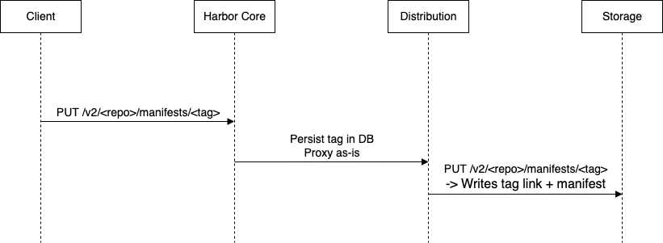

Proposal: Garbage Collection Performance Enhancement

Author: Yan Wang

Discussion: goharbor/harbor#12948 goharbor/harbor#19986

## Abstract

During manifest deletion, Harbor performs additional cleanup of tag links in the backend registry storage through the Distribution v2 API. In cloud storage environments (e.g., S3), deleting these tag links is slow and negatively impacts GC performance. 
This proposal introduces an optimization to avoid persisting tags in the backend, enabling faster garbage collection cycles.

## Motivation

Harbor currently proxies manifest and tag pushes to the backend registry (Distribution). This results in both manifest blobs and tag link files being written to the underlying storage. 
During garbage collection, each tag link must be removed explicitly via a Distribution API call, which is slow in object storage setups. For example, S3 may take multiple seconds per tag deletion.

## Solution

This proposal introduces a solution to improve GC performance by eliminating backend tag file overhead, simplifying GC logic, and delivering performance gains.

### Background

Since harbor v2.0, harbor no longer leverages tags in the back-end storage. Tags are stored both in the storage and database, and harbor core interacts with the storage using digests.This means users can still pull-by-tag, but on the harbor core side the tag is translated into the corresponding digest, and the request is proxied as a pull-by-digest.
In short, Harbor stores the tag information but doesn’t actually use it when interacting with storage — which is why we eventually need to clean it up.

A concrete scenario:

    Push harbor-instance/library/hello-world:latest into Harbor.
    Remove the latest tag from the UI.
    Attempt to pull harbor-instance/library/hello-world:latest — the client will report not found.
    However, the tag file still exists in the backend storage at this point because Harbor does not sync it, nor is there a need to.

### Tag Landing

Push with Tag (current behavior):

Modify Harbor's proxy logic to avoid writing tag link files to the backend. When a manifest with a tag is pushed:

1. Harbor Core will extract the tag and persist it in its own database. 
2. The proxy request to the backend registry is rewritten to use the manifest's digest instead of the tag (PUT /v2/[repo]/manifests/[digest]).

Push with Digest (Proposed Behavior):

We would see the Tag is not landed in the background storage.

### Tag Deletion

As mentioned earlier, Harbor will no longer create tag files in the backend storage. As a result, tag deletion will not be necessary for the garbage collection process for newly pushed artifacts. The remaining question is how to handle existing tag files during garbage collection.

This proposal introduces a checkbox in the garbage collection configuration to control this behavior:

1. Checked – Garbage collection will follow the current behavior and delete tag files.
2. Unchecked – Garbage collection will skip tag file deletion, improving performance.

## Non Goals

    This proposal does not address the distribution v3 upgrade. We are aware that upstream distribution v3 introduces several improvements, particularly around tag lookup and deletion. 
    However, this proposal specifically focuses on removing tag deletion from garbage collection.

## Compatibility and Consistency

1. No breaking changes; tag permissions are enforced at the API level.
2. Harbor will ensure consistency between tags and digests at the DB level.
3. Harbor CLI, APIs, and UI will continue to function as expected.

## OCI Object Background

I will take the hello-world:latest as an example to demonstrate the issue and solution. 

After I push the image into Harbor, there are blobs, manifests & tag links are generated in the storage side (current behavior).

After I removed this artifact from harbor(either via UI or API) and perform a GC, harbor will remove those layers and tag links.
The performance bottleneck occurs during the tag deletion phase. Harbor relies on Distribution’s native tag deletion logic, which invokes the underlying storage driver to traverse all tags — a process that becomes slow, especially on object storage systems where directory traversal is costly. 

GC logs (With the call of distribution API to delete tags):

    2025-07-21T10:00:40Z [INFO] [/jobservice/job/impl/gc/garbage_collection.go:419]: [ad65aa8b-fdc7-4d84-a6ee-f2113fe85cc4][1/3] delete blob from storage: sha256:6d3e4188a38af91b0c1577b9e88c53368926b2fe0e1fb985d6e8a70040520c4d
    2025-07-21T10:00:40Z [INFO] [/jobservice/job/impl/gc/garbage_collection.go:448]: [ad65aa8b-fdc7-4d84-a6ee-f2113fe85cc4][1/3] delete blob record from database: 2, sha256:6d3e4188a38af91b0c1577b9e88c53368926b2fe0e1fb985d6e8a70040520c4d
    2025-07-21T10:00:40Z [INFO] [/jobservice/job/impl/gc/garbage_collection.go:419]: [ad65aa8b-fdc7-4d84-a6ee-f2113fe85cc4][2/3] delete blob from storage: sha256:14d59e6670a4d8e5c7219244632954350f4ab9d11cab29f3f52429097260a9e3
    2025-07-21T10:00:40Z [INFO] [/jobservice/job/impl/gc/garbage_collection.go:448]: [ad65aa8b-fdc7-4d84-a6ee-f2113fe85cc4][2/3] delete blob record from database: 1, sha256:14d59e6670a4d8e5c7219244632954350f4ab9d11cab29f3f52429097260a9e3
    2025-07-21T10:00:40Z [INFO] [/jobservice/job/impl/gc/garbage_collection.go:336]: [ad65aa8b-fdc7-4d84-a6ee-f2113fe85cc4][3/3] delete the manifest with registry v2 API: library/hello-world, application/vnd.docker.distribution.manifest.v2+json, sha256:ec06ff94ef8731492058cbe21bc15fb87ec0b98afc20961955200e7e70203c67
    2025-07-21T10:00:40Z [INFO] [/jobservice/job/impl/gc/garbage_collection.go:365]: [ad65aa8b-fdc7-4d84-a6ee-f2113fe85cc4][3/3] delete manifest from storage: sha256:ec06ff94ef8731492058cbe21bc15fb87ec0b98afc20961955200e7e70203c67
    2025-07-21T10:00:40Z [INFO] [/jobservice/job/impl/gc/garbage_collection.go:393]: [ad65aa8b-fdc7-4d84-a6ee-f2113fe85cc4][3/3] delete artifact blob record from database: 1, library/hello-world, sha256:ec06ff94ef8731492058cbe21bc15fb87ec0b98afc20961955200e7e70203c67
    2025-07-21T10:00:40Z [INFO] [/jobservice/job/impl/gc/garbage_collection.go:401]: [ad65aa8b-fdc7-4d84-a6ee-f2113fe85cc4][3/3] delete artifact trash record from database: 1, library/hello-world, sha256:ec06ff94ef8731492058cbe21bc15fb87ec0b98afc20961955200e7e70203c67
    2025-07-21T10:00:40Z [INFO] [/jobservice/job/impl/gc/garbage_collection.go:419]: [ad65aa8b-fdc7-4d84-a6ee-f2113fe85cc4][3/3] delete blob from storage: sha256:ec06ff94ef8731492058cbe21bc15fb87ec0b98afc20961955200e7e70203c67
    2025-07-21T10:00:40Z [INFO] [/jobservice/job/impl/gc/garbage_collection.go:448]: [ad65aa8b-fdc7-4d84-a6ee-f2113fe85cc4][3/3] delete blob record from database: 3, sha256:ec06ff94ef8731492058cbe21bc15fb87ec0b98afc20961955200e7e70203c67
    2025-07-21T10:00:40Z [INFO] [/jobservice/job/impl/gc/garbage_collection.go:477]: 2 blobs and 1 manifests are actually deleted

After enabling the new behavior and pushing the image again, only blobs and manifests are written; no tag link is created.

After I removed this artifact from harbor(either via UI or API) and perform a GC, harbor will remove layers, no tag links to delete.

GC logs (Without the call of distribution API to delete tags):

    2025-07-21T07:56:08Z [INFO] [/jobservice/job/impl/gc/garbage_collection.go:393]: [e5dad442-c1e9-44c9-bea9-ab0c660e69a7][1/3] delete blob from storage: sha256:6d3e4188a38af91b0c1577b9e88c53368926b2fe0e1fb985d6e8a70040520c4d
    2025-07-21T07:56:08Z [INFO] [/jobservice/job/impl/gc/garbage_collection.go:422]: [e5dad442-c1e9-44c9-bea9-ab0c660e69a7][1/3] delete blob record from database: 2, sha256:6d3e4188a38af91b0c1577b9e88c53368926b2fe0e1fb985d6e8a70040520c4d
    2025-07-21T07:56:08Z [INFO] [/jobservice/job/impl/gc/garbage_collection.go:393]: [e5dad442-c1e9-44c9-bea9-ab0c660e69a7][2/3] delete blob from storage: sha256:14d59e6670a4d8e5c7219244632954350f4ab9d11cab29f3f52429097260a9e3
    2025-07-21T07:56:08Z [INFO] [/jobservice/job/impl/gc/garbage_collection.go:422]: [e5dad442-c1e9-44c9-bea9-ab0c660e69a7][2/3] delete blob record from database: 1, sha256:14d59e6670a4d8e5c7219244632954350f4ab9d11cab29f3f52429097260a9e3
    2025-07-21T07:56:08Z [INFO] [/jobservice/job/impl/gc/garbage_collection.go:339]: [e5dad442-c1e9-44c9-bea9-ab0c660e69a7][3/3] delete manifest from storage: sha256:ec06ff94ef8731492058cbe21bc15fb87ec0b98afc20961955200e7e70203c67
    2025-07-21T07:56:08Z [INFO] [/jobservice/job/impl/gc/garbage_collection.go:367]: [e5dad442-c1e9-44c9-bea9-ab0c660e69a7][3/3] delete artifact blob record from database: 1, library/hello-world, sha256:ec06ff94ef8731492058cbe21bc15fb87ec0b98afc20961955200e7e70203c67
    2025-07-21T07:56:08Z [INFO] [/jobservice/job/impl/gc/garbage_collection.go:375]: [e5dad442-c1e9-44c9-bea9-ab0c660e69a7][3/3] delete artifact trash record from database: 1, library/hello-world, sha256:ec06ff94ef8731492058cbe21bc15fb87ec0b98afc20961955200e7e70203c67
    2025-07-21T07:56:08Z [INFO] [/jobservice/job/impl/gc/garbage_collection.go:393]: [e5dad442-c1e9-44c9-bea9-ab0c660e69a7][3/3] delete blob from storage: sha256:ec06ff94ef8731492058cbe21bc15fb87ec0b98afc20961955200e7e70203c67
    2025-07-21T07:56:08Z [INFO] [/jobservice/job/impl/gc/garbage_collection.go:422]: [e5dad442-c1e9-44c9-bea9-ab0c660e69a7][3/3] delete blob record from database: 3, sha256:ec06ff94ef8731492058cbe21bc15fb87ec0b98afc20961955200e7e70203c67
    2025-07-21T07:56:08Z [INFO] [/jobservice/job/impl/gc/garbage_collection.go:451]: 2 blobs and 1 manifests are actually deleted

## Side Effects

For existing tag files, if the tag deletion option is disabled, any tags already persisted in the backend before enabling this feature will remain. These can be treated as orphaned tag links. While their presence in the backend is harmless, they may cause minor disk clutter.

## Future Work

1. Code impletation bases on the proposed mentioned above.
2. Add a cleanup tool to remove orphaned tag link files (optional).
3. Benchmark GC performance in a real S3 environment before and after the change.
4. This tag deletion is intended as a temporary measure and can be removed in a future release. By then, most artifacts in Harbor will be tagless, eliminating the need for explicit user configuration.
