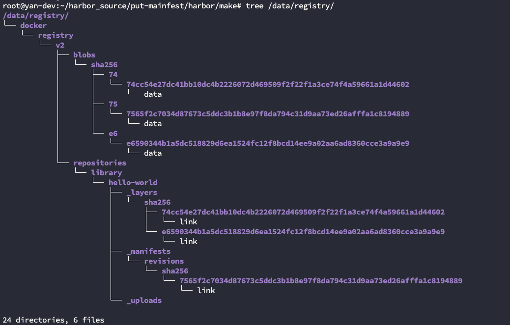

Proposal: Garbage Collection Performance Enhancement

Author: Yan Wang

Discussion: goharbor/harbor#12948 goharbor/harbor#19986

## Abstract

During manifest deletion, Harbor performs additional cleanup of tag links in the backend registry storage through the Distribution v2 API. In cloud storage environments (e.g., S3), deleting these tag links is slow and negatively impacts GC performance. 
This proposal introduces an optimization to avoid persisting tags in the backend, enabling faster garbage collection cycles.

## Motivation

Harbor currently proxies manifest and tag pushes to the backend registry (Distribution). This results in both manifest blobs and tag link files being written to the underlying storage. 
During garbage collection, each tag link must be removed explicitly via a Distribution API call, which is slow in object storage setups. For example, S3 may take multiple seconds per tag deletion.

## Solution

This proposal presents three options for improving GC performance, with Option 3 as the preferred and proposed solution.

### Option 1: Skip Tag Deletion

    Introduce a user-configurable option to skip tag deletion in the backend when removing manifests. This would eliminate the API call that slows down GC but leaves orphaned tag files in the backend.

#### Pros: Simple to implement, immediate performance gain.
#### Cons: Leaves tag files behind, may cause confusion or inconsistencies for users browsing storage directly.

### Option 2: Batch Tag Deletion via Upstream Patch

    Backport the upstream change from Distribution to support batch deletion of tags (introduced in later versions of the registry). This allows multiple tag links to be deleted in one API call.

#### Pros: Compatible with current Distribution behavior, improves performance.
#### Cons: Limited gain, still depends on Distribution API and backend performance.

### Option 3: Do Not Land Tag Files in Backend (Proposed)

    Modify Harbor's proxy logic to avoid writing tag link files to the backend. When a manifest with a tag is pushed:
       
        Harbor Core will extract the tag and persist it in its own database.
        The proxy request to the backend registry is rewritten to use the manifest's digest instead of the tag (PUT /v2/<repo>/manifests/<digest>).

#### Pros: Eliminates backend tag file overhead completely, simplifies GC logic, significant performance gain.
#### Cons: Existing tag files will not be deleted unless explicitly handled.

## Data Flow Diagrams

Push with Tag (current behavior):

Push with Digest (Proposed Behavior):

We would see the Tag is not landed in the background storage.

## Main Points

    Tags are persisted only in Harbor’s database, not in backend storage.

    On artifact pull/push, Harbor proxies the request with digest instead of tag.

    No more tag deletion API calls to backend are needed during GC, the tag deletion becomes instant (DB-level operation only).

    GC becomes faster, especially in object storage.

## Non Goals

    This proposal does not attempt to clean up previously written tag link files.

## Compatibility and Consistency

    No breaking changes; tag permissions are enforced at the API level.

    Harbor will ensure consistency between tags and digests at the DB level.

    Harbor CLI, APIs, and UI will continue to function as expected.

## Oci Object Background

I will take the hello-world:latest as an example to demonstrate the issue and solution. 

After I push the image into Harbor, there are blobs, manifests & tag links are generated in the storage side (current behavior).

After I removed this artifact from harbor(either via UI or API) and perform a GC, harbor will remove those layers and tag links.
The performance bottleneck occurs during the tag deletion phase. Harbor relies on Distribution’s native tag deletion logic, which invokes the underlying storage driver to traverse all tags — a process that becomes slow, especially on object storage systems where directory traversal is costly. 

GC logs (With the call of distribution API to delete tags):

    2025-07-21T10:00:40Z [INFO] [/jobservice/job/impl/gc/garbage_collection.go:419]: [ad65aa8b-fdc7-4d84-a6ee-f2113fe85cc4][1/3] delete blob from storage: sha256:6d3e4188a38af91b0c1577b9e88c53368926b2fe0e1fb985d6e8a70040520c4d
    2025-07-21T10:00:40Z [INFO] [/jobservice/job/impl/gc/garbage_collection.go:448]: [ad65aa8b-fdc7-4d84-a6ee-f2113fe85cc4][1/3] delete blob record from database: 2, sha256:6d3e4188a38af91b0c1577b9e88c53368926b2fe0e1fb985d6e8a70040520c4d
    2025-07-21T10:00:40Z [INFO] [/jobservice/job/impl/gc/garbage_collection.go:419]: [ad65aa8b-fdc7-4d84-a6ee-f2113fe85cc4][2/3] delete blob from storage: sha256:14d59e6670a4d8e5c7219244632954350f4ab9d11cab29f3f52429097260a9e3
    2025-07-21T10:00:40Z [INFO] [/jobservice/job/impl/gc/garbage_collection.go:448]: [ad65aa8b-fdc7-4d84-a6ee-f2113fe85cc4][2/3] delete blob record from database: 1, sha256:14d59e6670a4d8e5c7219244632954350f4ab9d11cab29f3f52429097260a9e3
    2025-07-21T10:00:40Z [INFO] [/jobservice/job/impl/gc/garbage_collection.go:336]: [ad65aa8b-fdc7-4d84-a6ee-f2113fe85cc4][3/3] delete the manifest with registry v2 API: library/hello-world, application/vnd.docker.distribution.manifest.v2+json, sha256:ec06ff94ef8731492058cbe21bc15fb87ec0b98afc20961955200e7e70203c67
    2025-07-21T10:00:40Z [INFO] [/jobservice/job/impl/gc/garbage_collection.go:365]: [ad65aa8b-fdc7-4d84-a6ee-f2113fe85cc4][3/3] delete manifest from storage: sha256:ec06ff94ef8731492058cbe21bc15fb87ec0b98afc20961955200e7e70203c67
    2025-07-21T10:00:40Z [INFO] [/jobservice/job/impl/gc/garbage_collection.go:393]: [ad65aa8b-fdc7-4d84-a6ee-f2113fe85cc4][3/3] delete artifact blob record from database: 1, library/hello-world, sha256:ec06ff94ef8731492058cbe21bc15fb87ec0b98afc20961955200e7e70203c67
    2025-07-21T10:00:40Z [INFO] [/jobservice/job/impl/gc/garbage_collection.go:401]: [ad65aa8b-fdc7-4d84-a6ee-f2113fe85cc4][3/3] delete artifact trash record from database: 1, library/hello-world, sha256:ec06ff94ef8731492058cbe21bc15fb87ec0b98afc20961955200e7e70203c67
    2025-07-21T10:00:40Z [INFO] [/jobservice/job/impl/gc/garbage_collection.go:419]: [ad65aa8b-fdc7-4d84-a6ee-f2113fe85cc4][3/3] delete blob from storage: sha256:ec06ff94ef8731492058cbe21bc15fb87ec0b98afc20961955200e7e70203c67
    2025-07-21T10:00:40Z [INFO] [/jobservice/job/impl/gc/garbage_collection.go:448]: [ad65aa8b-fdc7-4d84-a6ee-f2113fe85cc4][3/3] delete blob record from database: 3, sha256:ec06ff94ef8731492058cbe21bc15fb87ec0b98afc20961955200e7e70203c67
    2025-07-21T10:00:40Z [INFO] [/jobservice/job/impl/gc/garbage_collection.go:477]: 2 blobs and 1 manifests are actually deleted

After enabling the new behavior and pushing the image again, only blobs and manifests are written; no tag link is created.

After I removed this artifact from harbor(either via UI or API) and perform a GC, harbor will remove layers, no tag links to delete.

GC logs (Without the call of distribution API to delete tags):

    2025-07-21T07:56:08Z [INFO] [/jobservice/job/impl/gc/garbage_collection.go:393]: [e5dad442-c1e9-44c9-bea9-ab0c660e69a7][1/3] delete blob from storage: sha256:6d3e4188a38af91b0c1577b9e88c53368926b2fe0e1fb985d6e8a70040520c4d
    2025-07-21T07:56:08Z [INFO] [/jobservice/job/impl/gc/garbage_collection.go:422]: [e5dad442-c1e9-44c9-bea9-ab0c660e69a7][1/3] delete blob record from database: 2, sha256:6d3e4188a38af91b0c1577b9e88c53368926b2fe0e1fb985d6e8a70040520c4d
    2025-07-21T07:56:08Z [INFO] [/jobservice/job/impl/gc/garbage_collection.go:393]: [e5dad442-c1e9-44c9-bea9-ab0c660e69a7][2/3] delete blob from storage: sha256:14d59e6670a4d8e5c7219244632954350f4ab9d11cab29f3f52429097260a9e3
    2025-07-21T07:56:08Z [INFO] [/jobservice/job/impl/gc/garbage_collection.go:422]: [e5dad442-c1e9-44c9-bea9-ab0c660e69a7][2/3] delete blob record from database: 1, sha256:14d59e6670a4d8e5c7219244632954350f4ab9d11cab29f3f52429097260a9e3
    2025-07-21T07:56:08Z [INFO] [/jobservice/job/impl/gc/garbage_collection.go:339]: [e5dad442-c1e9-44c9-bea9-ab0c660e69a7][3/3] delete manifest from storage: sha256:ec06ff94ef8731492058cbe21bc15fb87ec0b98afc20961955200e7e70203c67
    2025-07-21T07:56:08Z [INFO] [/jobservice/job/impl/gc/garbage_collection.go:367]: [e5dad442-c1e9-44c9-bea9-ab0c660e69a7][3/3] delete artifact blob record from database: 1, library/hello-world, sha256:ec06ff94ef8731492058cbe21bc15fb87ec0b98afc20961955200e7e70203c67
    2025-07-21T07:56:08Z [INFO] [/jobservice/job/impl/gc/garbage_collection.go:375]: [e5dad442-c1e9-44c9-bea9-ab0c660e69a7][3/3] delete artifact trash record from database: 1, library/hello-world, sha256:ec06ff94ef8731492058cbe21bc15fb87ec0b98afc20961955200e7e70203c67
    2025-07-21T07:56:08Z [INFO] [/jobservice/job/impl/gc/garbage_collection.go:393]: [e5dad442-c1e9-44c9-bea9-ab0c660e69a7][3/3] delete blob from storage: sha256:ec06ff94ef8731492058cbe21bc15fb87ec0b98afc20961955200e7e70203c67
    2025-07-21T07:56:08Z [INFO] [/jobservice/job/impl/gc/garbage_collection.go:422]: [e5dad442-c1e9-44c9-bea9-ab0c660e69a7][3/3] delete blob record from database: 3, sha256:ec06ff94ef8731492058cbe21bc15fb87ec0b98afc20961955200e7e70203c67
    2025-07-21T07:56:08Z [INFO] [/jobservice/job/impl/gc/garbage_collection.go:451]: 2 blobs and 1 manifests are actually deleted

## Side Effects

    Tags already persisted in backend storage before enabling this feature will remain. These can be considered orphaned tag links.

    The existence of such orphaned tag files in the backend is harmless but may lead to minor disk clutter.

## Future Work

    Code impletation bases on the proposed mentioned above.

    Add a cleanup tool to remove orphaned tag link files (optional).

    Benchmark GC performance in a real S3 environment before and after the change.
