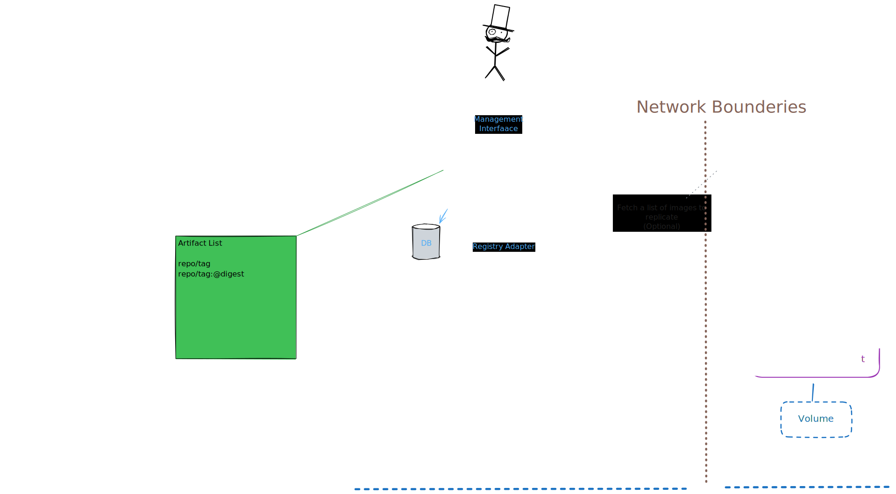
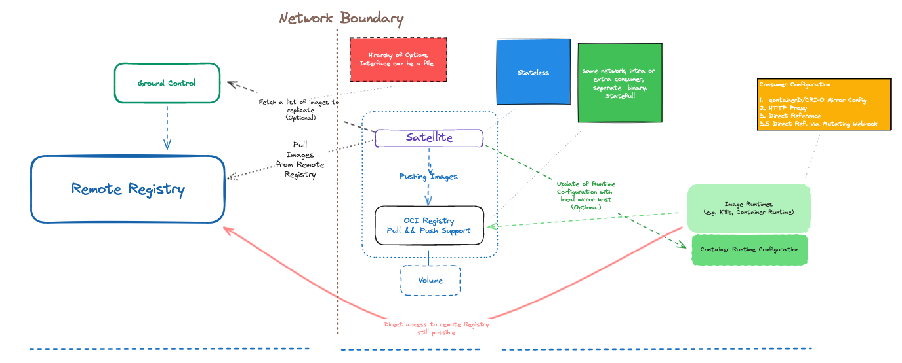
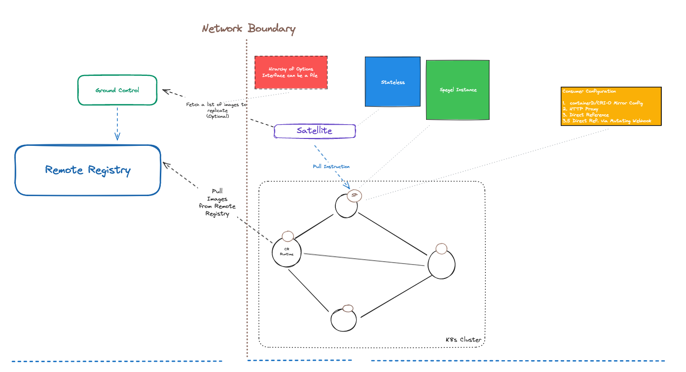
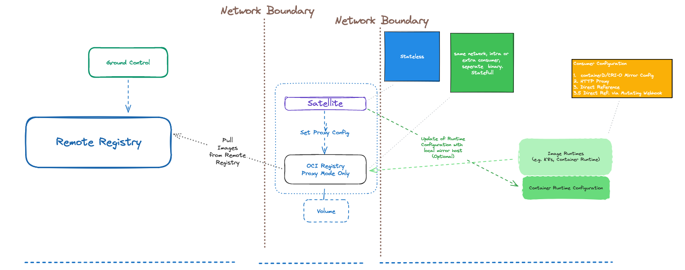

# Proposal: `Harbor Satellite`

Authors: Vadim Bauer / [Vad1mo](https://github.com/Vad1mo), Csaba Almasi, Philip Laine, David Huseby / [dhuseby](https://github.com/dhuseby),  Roald Brunell / [OneFlyingBanana](https://github.com/OneFlyingBanana), Prasanth / [bupd](https://github.com/bupd) 

## Abstract

Harbor Satellite aims to bring Harbor container registries to edge locations, ensuring consistent, available, and integrity-checked images for edge computing environments. This proposal outlines the development of a stateful, standalone satellite that can function as a primary registry for edge locations and as a fallback option if the central Harbor registry is unavailable.

## Background

In recent years, containers have extended beyond their traditional cloud environments, becoming increasingly prevalent in remote and edge computing contexts. These environments often lack reliable internet connectivity, posing significant challenges in managing and running containerized applications due to difficulties in fetching container images. To address this, the project aims to decentralize container registries, making them more accessible to edge devices. The need for a satellite that can operate independently, store images on disk, and run indefinitely with stored data is crucial for maintaining operations in areas with limited or no internet connectivity.

## Proposal

The proposed change is to develop "Harbor Satellite", an extension to the existing Harbor container registry. This extension will enable the operation of decentralized registries on edge devices.

Harbor Satellite will synchronize with the central Harbor registry, when Internet connectivity permits it, allowing it to receive and store images. This will ensure that even in environments with limited or unreliable internet connectivity, containerized applications can still fetch their required images from the local Harbor Satellite.

Harbor Satellite will also include a toolset enabling the monitoring and management of local decentralized registries.

## Non-Goals

T.B.D.

## Rationale

Deploying a complete Harbor instance on edge devices in poor/no coverage areas could prove problematic since :

- Harbor wasn't designed to run on edge devices.(e.g. Multiple processes, no unattended mode)
- Harbor could behave unexpectedly in poor/no connectivity environments.
- Managing hundreds or thousands of container registries is not operationally feasible with Harbor
- Harbor would be too similar to a simple registry mirror

Harbor Satellite aims to be resilient, lightweight and will be able to keep functioning independently from Harbor instances.

## Compatibility

Compatibility with all container registries or edge devices can't be guaranteed.

## Implementation

<em>Basic Harbor Satellite Diagram</em>

### Overall Architecture

Harbor Satellite, at its most basic, will run in a single container and will be divided in the following 2 components :

- **Satellite** : Is responsible for moving artifacts from upstream (using Skopeo/Crane/Other), identifying the source and reading the list of images that needs to be replicated. Satellite will also be able to modify and manage the container runtimes. configuration in sync so that container runtime does not fetch images from remote.
- **OCI Registry** : Is responsible for storing required OCI artifacts locally (using zotregistry or docker registry).
- **Ground Control** : Is responsible for the artifact synchronization with edge locations and function as a service endpoint for satellites. Ground control will register and authenticate satellites, provide a list of images that should be present on the satellite, and facilitate seamless replication of container images to edge locations. Ground Control includes adapters for different central registries, enabling seamless synchronization of image lists across various sources.

### Ground Control Responsibilities

<em>Ground Control</em>

1. **Authentication and Registration:**
    - **Satellite Authentication:** Ground Control authenticates each satellite to ensure that only authorized devices can request and receive image updates. This prevents unauthorized access and ensures that image distribution is controlled and secure.
    - **Satellite Registration:** Each satellite must register with Ground Control before it can request image lists. This registration process involves validating the satellite’s credentials and recording its details in Ground Control, establishing a trusted relationship between the satellite and Ground Control.

2. **Image List Management:**
    
    - **Maintaining Image Lists:** Ground Control maintains a detailed list of container images, including their tags and digests, that are required by the satellites. These lists are kept up-to-date and are readily available for distribution to registered satellites.
    - **List Provisioning:** Satellites periodically request the image list from Ground Control. Ground Control responds with the most recent list, ensuring that the satellite always has the latest images required for its operations.

3. **Adaptability with Central Registries:**
    
    - **Adapters for Multiple Registries:** Ground Control includes adapters that allow it to interface with various central container registries. This capability ensures that it can synchronize image lists with multiple sources, regardless of the registry's specific implementation or API.
    - **Synchronization of Image Lists:** Using these adapters, Ground Control can pull image updates from different central registries and update its managed image list accordingly. This enables the seamless integration of images from various sources, providing a comprehensive and updated list to satellites.

4. **Independent Satellite Operation:**
    
    - **Decentralized Functioning:** Ground Control enables satellites to operate independently by providing them with the necessary image lists. Satellites fetch and manage their own images based on the lists provided, reducing their dependency on real-time connectivity to a central registry.
    - **Offline Resilience:** In the event of connectivity issues with Ground Control, satellites can continue to serve the required images from their local storage, ensuring uninterrupted operations in edge environments.

### Specific Use Cases

Harbor Satellite may be implemented following 1 or several of 3 different architectures depending on its use cases :

1. **Replicating from a remote registry to a local registry.**  
In this basic use case, the stateless satellite component will handle pulling images from a remote registry and then pushing them to the local OCI compliant registry. This local registry will then be accessible to other local edge devices who can pull required images directly from it.
_(A direct access from edge device to the remote registry is still possible when network conditions permit it)._  
The satellite component may also handle updating container runtime configurations and fetching image lists from Ground Control, a part of Harbor.  
The stateful local regsitry will also need to handle storing and managing data on local volumes.  
A typical use case would work as follows :  
_In an edge computing environment where IoT devices are deployed to a location with limited or no internet connnectivity, these devices need to run containerised images but cannot pull from a central Harbor registry. A local Harbor Satellite instance can be deployed and take up this role while Internet connectivity is unreliable and distribute all required images. Once a reliable connection is re-established, the Harbor Satellite instance will be able to pull required images from its central Harbor registry and thus store up to date images locally._

<em>Use case #1</em>

2. **Replicating from a remote regsitry to a local Spegel Registry**  
The stateless satellite component send pull instructions to Spegel instances running with each node of a Kubernetes cluster. The node will then directly pull images from a remote registry and share it with other local nodes, removing the need for each of them to individually pull an image from a remote registry.  
The network interfaces (boundaries) represented in this use case should and will be the same as those represented in use case #1  
A typical use case would work as follows :  
_In a larger scale edge computing environment with a significant amount of IoT devices needing to run containerised applications, a single local registry in might not be able to handle the increased amount of demands from edge devices. The solution is to deploy several registries to several nodes who are able to automatically replicate images across each other thanks to Spegel instances running together with each node. The Satellite component will use the same interface to instruct each node when, where and how to pull new images that need to be replicated across the cluster._

<em>Use case #2</em>

3. **Proxying from a remote regsitry over the local registry**  
The stateless satellite component will be in charge of configuring the local OCI compliant registry, which will be running in proxy mode only. This local registry will then handle pulling necessary images from the remote registry and serving them up for use by local edge devices.  
A typical use case would work as follows :  
_When, for a number of possible different reasons, the remote registry side of the diagram would not be able to produce a list of images to push down to the Harbor Satellite, the Satellite would then act as a proxy and forward all requests from edge devices to the remote registry. This ensures the availability of necessary images without the need for a pre-compiled list of images_

<em>Use case #3</em>

### Container Runtime Configuration

In each of these use cases, we need to ensure that IoT edge devices needing to run containers will be able to access the registry and pull images from it. To solve this issue, we propose 4 solutions :

1. By using **containerd** or **CRI-O** and  configuring a mirror within them.
2. By setting up an **HTTP Proxy** to manage and optimize pull requests to the registry.
3. By **directly referencing** the registry.
4. By **directly referencing** the registry and using Kubernetes' mutating webhooks to point to the correct registry.

## Open issues (if applicable)

T.B.D.
