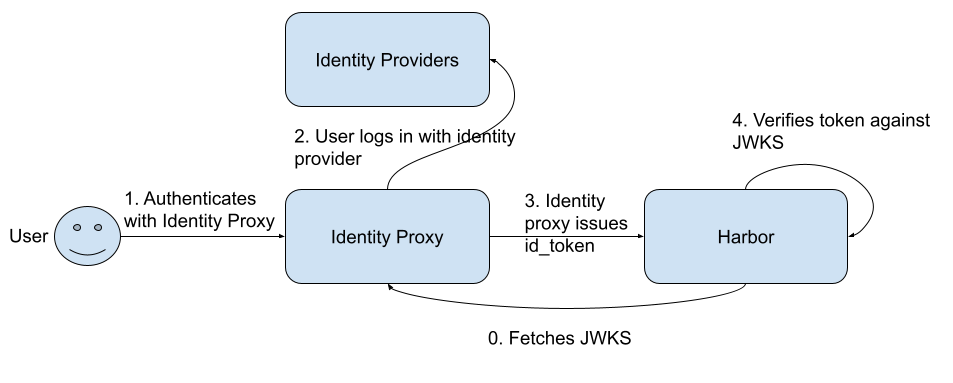
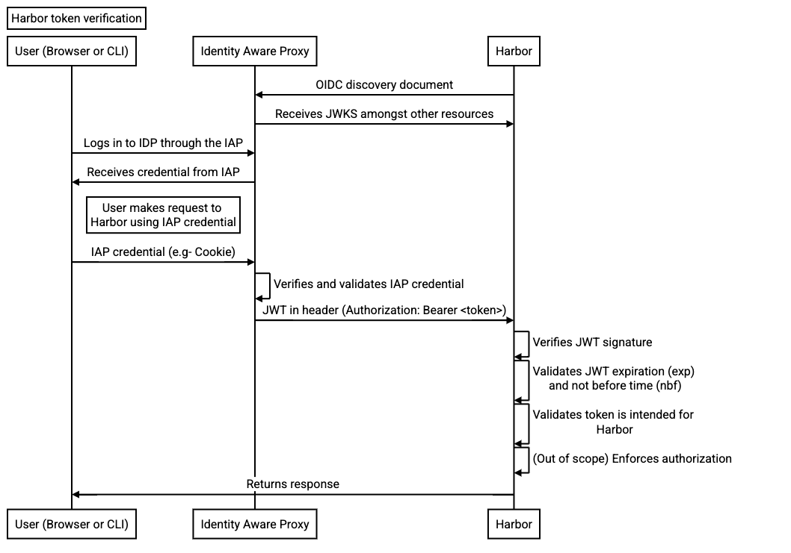
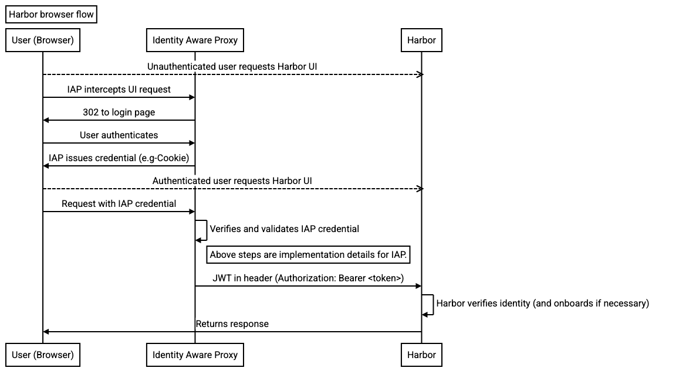
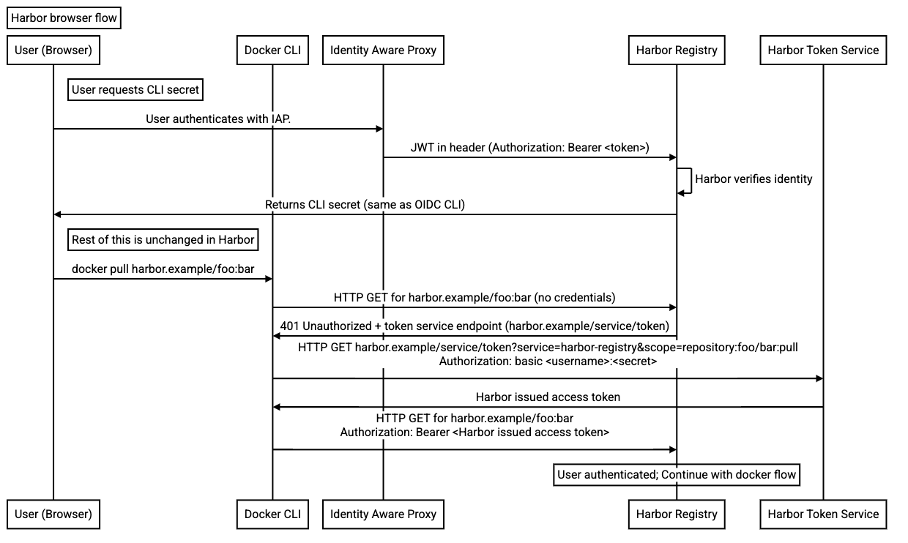

# Harbor Proposal: Identity Aware proxy authentication mode

Author: Sheng Jiang/shengjiang3, Eric Liu/LiuShuaiyi

Date: Oct 30, 2023

## Abstract

Proposes an approach to delegate Authentication decisions to external
authentication authority in Harbor.

## Background

Currently, Harbor supports the OIDC protocol for authentication. An organization
can configure Harbor to use an OIDC identity provider to provider
authentication. However, there are some scenarios where additional support is
needed, for example:

- If SAML or LDAP is used for the identity provider.
- If more than one OIDC provider needs to be used.
- Integrating Harbor with Single Sign-On (SSO) within an organization. For
  example, if the organization runs Harbor behind a reverse proxy (e.g- Istio)
  that federates identity providers (e.g- Dex).

## Proposal

Add another authentication option, letting the identity provider authenticate
and issue an identity token while Harbor assumes the role of an application that
consumes the identity token. Harbor would act as an OIDC token verifier. The
goal is to allow Harbor to plug in to an upstream OIDC identity proxy allowing
an SSO credential to authenticate with Harbor.

This opens up the use case where an identity proxy (such as Dex) can be
configured to support multiple identity providers and pass on an identity token
that is used by Harbor.

Alternatively, Harbor could be integrated as a proxied application running
behind NGINX. NGINX can be configured to provide SSO by acting as the relying
party to an OIDC identity provider. As a result, the identity token passed by
NGINX could also be used as the identity of the user inside of Harbor.

### Key terms

Identity Aware proxy (IAP) - A reverse proxy that provides authentication. Also
known as auth proxy. Identity token (ID token) - Artifact that proves that the
user has been authenticated (source).

### High Level design

The new authentication option allows Harbor to trust the identity tokens issued
by an identity aware proxy (such as Dex). The identity aware proxy is OIDC
compatible. As such, Harbor is to be configured to fetch the JWKS from the
identity aware proxy and to use the JWKS to verify the ID tokens issued by the
identity aware proxy. Once the token is verified and validated, Harbor can use
the identity inside the ID token as the user identity.

This is a slight deviation from the existing OIDC authentication mode where
Harbor is directly configured to authenticate with the identity provider.

### Configuration

Since the new authentication mode in Harbor plays the role as an OIDC verifier,
the following OIDC attributes are needed:

- Name: The name of the OIDC provider.
- Issuer URL: The identity provider's URL. This is used to locate the OIDC
  discovery document typically found at /.well-known/openid-configuration.
- Expected Audiences (optional): A comma separated list of identifiers that
  Harbor is recognized by. The audience claim in the JWT should contain one of
  the audiences configured in the list.
- User claim: The claim in the JWT to use as the user name. The default is the
  `sub` claim in the OIDC specification.
- Groups claim: The claim in the JWT to locate the user’s groups.
- Certificate authority data: base64 encoded PEM encoded certificate for the
  identity proxy.
- Header name: HTTP header to get the ID token.
- `enable_session_cookie` [Optional]: When set to `true`, after successful
  identity aware proxy authentication, Harbor will assign the user a cookie. As
  a result, the identity aware proxy will only have to provide the header to the
  login endpoint. The cookie will be used for authenticating all other routes.

The identity aware proxy should be able to be configured using the portal and/or
the API.

### Validating a token

In the Identity Aware Proxy authentication mode, Harbor will look for the ID
token in the Authorization header (Authorization: Bearer <JWT>).

- The token will be a JWT Bearer token.
- The token will be issued by the IAP after the user has authenticated through
  the IAP.
- The token will be signed using the private key corresponding to the public
  keys available in the JWKS endpoint.

The user contained in the ID token should only be used after verifying and
validating the ID token:

1. Verify the signature of the JWT using the JWKS.
   1. Harbor can periodically refresh the JWKS.
   1. Fetch the JWKS if a JWT with an unknown key ID is received.
      - Back off if the JWKS was fetched recently to prevent too many requests
        to the proxy.
   1. Ensure that alg cannot be none.
1. Validate that the token is not expired or not valid yet.
   - Check the exp and nbf claims.
1. Validate that the token is intended for Harbor.
   - Check the aud claim for any of the expected audiences.
1. The validated token can be used for authorization enforcement and user
   identification.

The ID token is a short lived token so each token should be verified and
validated independently. The ID token cannot be refreshed by Harbor to get a new
token.

### Obtaining identity from the token

The identity is obtained from the token by looking for the user and groups claim
specified in the Identity Aware Proxy configuration.

The user claim specifies the claim in the JWT to obtain the user name from. The
value in this claim is to be used to identify the user within Harbor (for
example authorization policies). The user name in the user claim needs to be
unique across the IAP.

The groups claim specifies the claim in the JWT to obtain the groups from. The
groups claim value is in the form of a list.

### User access from a browser

The first time Harbor sees a token for a given user claim, Harbor can on-board
the user into the Harbor database (is this necessary?). The user name in the
user claim is the username to onboard with.

If the request has a valid bearer token, then the user should not be shown the
Harbor login page and instead should be taken directly to the portal.

### User access from the CLI (docker)

The user flow for CLI can follow the same flow as OIDC CLI flow. The user gets
the CLI secret from the UI and uses the CLI secret in the docker CLI which means
that the OIDC CLI flow should also support IAP.

The IAP issues ID tokens after authenticating the user credentials. The
limitation is that the user must refresh the ID token in Harbor in order for the
secret to remain valid since the IAP does not send the refresh token.

Once the user is authenticated and accessing the UI, the user can obtain the CLI
secret and use the CLI secret.

## Non-Goals

- Support for non-OIDC protocols such as SAML or LDAP.

- Support for authorization by the identity provider.

- Using access tokens from the OIDC provider.

## Rationale

### Alternatives

#### Authentication with Kubernetes TokenReview

Harbor auth proxy (link) uses Kubernetes token review to validate the token.
However, Harbor auth proxy also relies on an endpoint that isn’t well
documented. Since Harbor auth proxy already makes use of Kubernetes TokenReview
to authenticate a token, an alternative to the Identity Aware Proxy would be
support authentication via Kubernetes TokenReview as a first order option.
Kubernetes TokenReview would operate as a webhook that Harbor can delegate
authentication decisions to.

Required configurations:

- Host name: This is the Kubernetes API server evaluating the TokenReview.
- Certificate: Certificate establishing the TLS connection.
- Audiences (recommended): The audiences for tokens intended for Harbor.

#### UI:

- The token to authenticate is sent in the Authorization header as a bearer
  token.
- The TokenReview ensures that the token is intended for Harbor by checking the
  audience in the token if it is provided.
- The username and groups are provided in the TokenReview status upon successful
  authentication.
- Automatically onboard the user using the username if this is the first time
  the user has signed in.
- Skip the sign in page if the user is authenticated.

#### CLI:

- The docker CLI sends the token to the Token Service in the authorization basic
  header.
- The username in the Authorization basic header is a filler string. The secret
  contains the token.
  - AWS uses a filler string for the user name:
    https://docs.aws.amazon.com/AmazonECR/latest/userguide/getting-started-cli.html
  - Azure also uses a filler string for the user name:
    https://learn.microsoft.com/en-us/azure/container-registry/container-registry-authentication?tabs=azure-cli#az-acr-login-with---expose-token

### Auth Proxy using trusted headers for identification

Harbor lives behind an auth proxy that authenticates access to Harbor. The
mechanism authenticating access through the auth proxy is not important.
However, after authenticating access, the auth proxy passes the identity of the
user as a string in a configurable header (e.g- X-AuthProxy-UserName).

Harbor would trust and use the user name passed in from the configurable header
as the user name within Harbor. When Harbor gets a username that it has not seen
before, Harbor should auto-onboard the user into the user database.

Configuration options:

- Header name (Required): This is the header where the username can be found.
- Allowed sources (Optional): List of hosts or IPs the auth proxy requests can
  be forwarded from.

## Trade-offs

Pros of IAP:

- Delegates authentication to an external identity authority. The external
  identity authority can manage the authentication logic so that Harbor only
  needs to verify and use the credentials.
- Harbor explicitly verifies the identity token against the published public
  keys.

Disadvantages of IAP:

- The Harbor issued access token depends on the ID token. Short lived ID token
  means that the user has to authenticate often.

# Compatibility

This adds a new authentication method that doesn’t conflict with any existing
ones.

# Implementation

1. Create configuration items for auth proxy configuration, and update UI to
   enable the configuration via Portal.
1. Create a table (separate from the OIDC table) for sub, username, CLI secret.
1. Add security context to handle the id token.
