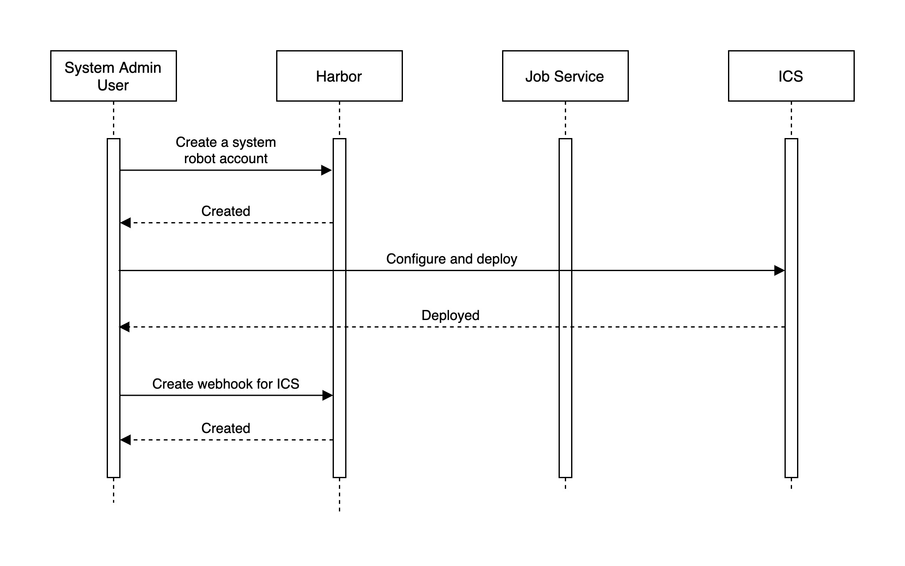
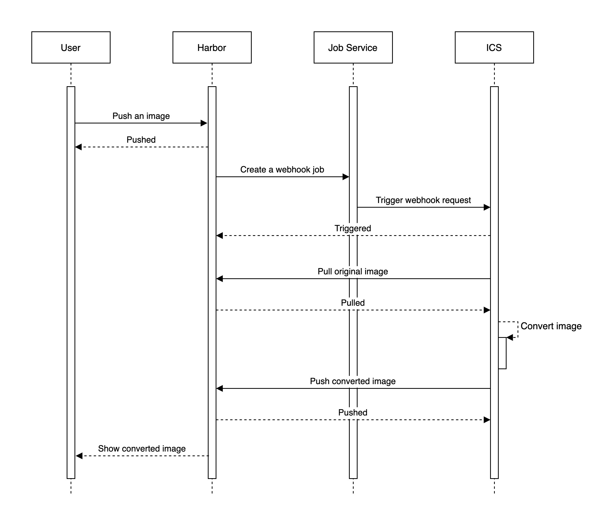
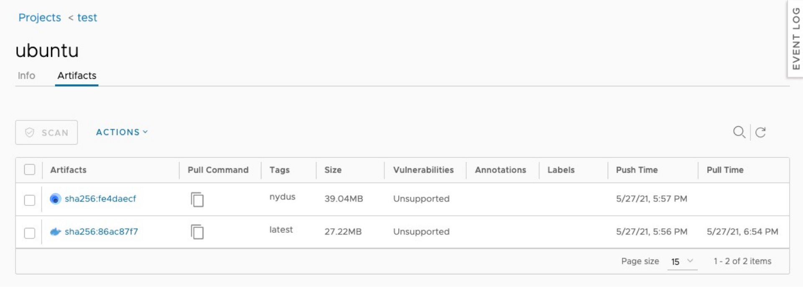
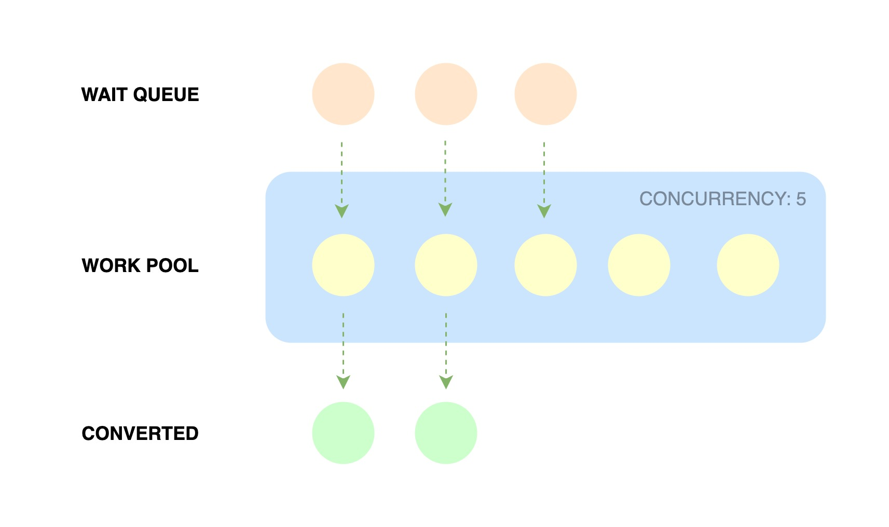

# Proposal: Image Conversion Service

Author: Song Yan / [imeoer](https://github.com/imeoer), Bo Liu / [liubogithub](https://github.com/liubogithub), Tao Peng / [bergwolf](https://github.com/bergwolf)

Discussion: [Harbor Image Acceleration Bi-Weekly Discussion](https://hackmd.io/cL7QSuDZTt20DxC8fz5Qug?view)

## Abstract

Automatically convert image to accelerated image, cover Nydus and eStargz, and more formats in the future.

## Background

**Harbor:** Project Harbor is an open source trusted cloud-native registry project that stores, signs, and scans content. Harbor extends the open source Docker Distribution by adding the functionalities usually required by users such as security, identity, and management. Having a registry closer to the build and run environment can improve the image transfer efficiency. Harbor supports replication of images between registries and also offers advanced security features such as user management, access control, and activity auditing. For more details, please refer to [README](https://github.com/vmware/harbor/blob/master/README.md).

**Nydus:** Nydus image is a container accelerated image format provided by the Dragonfly image-service project, which offers the ability to pull image data on demand, without waiting for the entire image pull to complete and then start the container. It has been put in production usage and shown vast improvements over the old OCI image format in terms of container launching speed, image space, and network bandwidth efficiency, as well as data integrity. The Nydus image can also serve as an example and reference implementation for the on-going OCI image spec v2 discussion. For more details, please refer to [README](https://github.com/dragonflyoss/image-service).

**eStargz:** eStargz is a lazily-pullable image format proposed by [stargz snapshotter project](https://github.com/containerd/stargz-snapshotter). Lazy pulling means a container can run without waiting for the pull completion of the image and necessary chunks of the image are fetched on-demand. This format is compatible to OCI/Docker images so this can be pushed to standard container registries (e.g. ghcr.io) as well as this is still runnable even on eStargz-agnostic runtimes including Docker. eStargz format is based on stargz image format by CRFS but comes with additional features like runtime optimization and content verification. For more details, please refer to [README](https://github.com/containerd/stargz-snapshotter).

Pulling image is one of the time-consuming steps in the container lifecycle. Research shows that time to take for pull operation accounts for 76% of container startup time [FAST '16](https://www.usenix.org/node/194431). The P2P-based file distribution system can help reduce network latency when pulling images at runtime, saving network bandwidth and greatly reducing the impact of registry single point of failure, which is very important for large-scale container scaling scenarios. This research [FAST '16](https://www.usenix.org/node/194431) also shows that only about 6.4% of the data is read at runtime, meaning that most of the data take up and wastes network bandwidth and container startup time when pulling images or doing advance preheat of images. Accelerated image formats like Nydus and eStargz aim to address this issue, and they do a lot of work on data de-duplication, end-to-end data integrity, and the compatibility for OCI artifacts spec and distribution spec. Harbor combines the P2P system and accelerated image format to provide a large-scale efficient, secure joint image solution for the container ecosystem.

## Proposal

### Overview

Introducing a standalone image conversion service (ICS for short) designed to provide Harbor with the ability to automatically convert user images to accelerated images. When a user does something such as artifact push, Harbor will use the webhook to notify the ICS daemon based on the rules configured by the user, and the Nydus, eStargz, etc. drivers integrated into the ICS will convert the respective image formats.

### Workflow

As a project admin user:

- Create a system robot account and configure robot name and secret to the ICS to grant the permission to pull and push images.
- Configure ICS to give robot permission and select a image conversion driver, such as Nydus or eStargz, then deploy as a webhook handle service.
- Create a new http type webhook, set the endpoint url provided by ICS, allows to configure when to trigger image conversion based on event types (such as artifact push) and filter conditions (such as repository name).



As a user:

- Push an image that meets the webhook rules for conversion, wait a while and will see the converted image in the web console, it may be the original image that was overwritten or a new one, depends on the ICS configuration.



### Harbor Side

#### Webhook

The design principle of this proposal is to decouple the ICS component from the harbor core as much as possible to keep it independent, with ICS acting as a webhook server and harbor using webhook request to notify the ICS service to trigger image conversion action. For example, an accelerated image conversion can be triggered when an artifact push event occurs, involving the following webhook configuration:

- Notify Type: ICS acts as an http server to listen for webhook request, so select to http;
- Event Type: Usually the artifact push is chosen, but other options can also be considered;
- Endpoint URL: The endpoint address of ICS http server listens;
- Auth Header: The http auth header checks configured on the ICS side are used by the ICS to verify the webhook request source;
- Verify Remote Certificate：Determine whether the webhook should verify the certificate of ICS endpoint;

The following features is not yet supported in the current version of harbor and should be proposed and implemented:

- Webhook Filter: Harbor should provide some filtering rules to allow users to decide which images can be converted by ICS, such as limiting to a specified repository or tag;
- Webhook Re-schedule：The ability to automatically re-trigger a webhook request or allow the user to manually trigger it if the webhook request fails to be sent (e.g. ICS endpoint is unreachable), or if the image conversion fails on ICS;

#### Image Icon

In order for users to be able to distinguish converted images on the web console, harbor needs to recognize image formats and put corresponding icons on the web console, such as like this:



### ICS Side

#### Conversion Driver

Image conversion is implemented by Driver, which is defined here as the Driver Interface that needs to be implemented by image format providers.

```golang
type Driver interface {
  // Type returns the name of image format provider, e.g. nydus, estargz.
  Type() string
  // CheckHealth returns a nil error, means that the driver works fine.
  CheckHealth() error
  // Convert the source image to the target image, where Option provides
  // some conversion options. If successful, the conversion result will
  // be returned, otherwise a non-nil error will be returned.
  Convert(ctx context.Context, src ocispec.Descriptor, opt Option) (dst *ocispec.Descriptor, error)
}
```

```golang
type Auth struct {
  // Base64 encoded <username:password> string.
  Auth string
  // For insecure HTTP registry.
  Insecure bool
}
```

```golang
type Option struct {
  // Mapping of registry hostname to auth.
  Auths map[string]Auth
  // Some conversion options supported by the image format provider,
  // passed as key-value pairs.
  Config map[string]interface{}
}
```

```golang
type Result struct {
  // The description of converted target image, which contains information
  // such as Digest and Size of the image manifest.
  Target ocispec.Descriptor
}
```

#### Conversion Queue

ICS implements a simple work pool to support concurrent execution of image conversion tasks. When the work pool is full, newly submitted conversion tasks wait in a queue until a free worker is available in the work pool, as shown in the following figure:



#### Conversion Notification

In order to keep the components decoupled, ICS and Harbor do not provide a separate notification mechanism for conversion completion events. User can use webhook and filter to get these events in a timely manner, for example by creating a webhook with event type `artifact push` and filter tag `nydus`.

#### Configuration

The configuration of ICS can be written to a `config.yml` file, which has the following fields:

```yaml
# The IP address or hostname provided to harbor webhook request.
hostname: 0.0.0.0

# http related config
http:
  # Port for http, default is 8081. If https enabled, this port will redirect
  # to https port.
  port: 8081

# https related config
https:
  # https port for harbor, default is 443.
  port: 443
  # The path of cert and key files.
  certificate: /path/to/certificate
  private_key: /path/to/private_key

# The API endpoint to accept webhook request.
# e.g. `POST http://$hostname:$port/conversion`
endpoint: /conversion

# The API endpoint provided to external metric/monitor service.
metric:
  enabled: false
  port: 9091
  path: /metrics

# The http auth header is used to verify the webhook request.
auth_header: Bearer test

# Specify the maximum number of tasks that can run concurrently when there
# are multiple image conversions.
maximum_concurrency: 5

# Configure how to access registry when pulling and pushing images, support
# multiple registries.
auths:
  # The IP address or hostname of registry.
  harbor1.example.com:
    # Base64 encoded <username:password> string.
    auth: dGVzdAo=
    # For insecure HTTP registry.
    insecure: false

# Log configurations, the driver will inherit these.
log:
  # Options are debug, info, warning, error, fatal.
  level: info

rules:
  # Convert Docker media types to OCI media types.
  oci: true
  # Use the source image reference as the target image reference.
  overwrite: false
  # Add a suffix to the tag of source image reference to be used as the target
  # image reference, for example adding suffix `_nydus`:
  # SourceRef: localhost:5000/ubuntu
  # TargetRef: localhost:5000/ubuntu:latest_nydus
  # It's conflict with `overwrite` option.
  target_suffix: nydus
  # Convert images for specified platforms, set to `*` will convert for all
  # platforms.
  platform: linux/amd64,linux/arm64

# Configure the image conversion driver.
driver:
  # The name of the image format provider, should be nydus, estargz, etc.
  type: <see below>
  # Some conversion options supported by the image format provider.
  config: <see below>
```

Currently ICS only supports the configuration of one driver, different drivers have their own supported configuration items, the following example shows some for Nydus and eStargz drivers.

```yaml
driver:
  type: nydus
  config:
    # Merge OCI & Nydus manifest to manifest index for target image.
    multi_platform: true
    # Work directory path for nydus image conversion.
    work_dir: /path/to/work/directory
    # The nydus builder binary path.
    builder_path: /path/to/nydus/builder
    # The build cache image is used to speed up the conversion of nydus image.
    # Use another tag of target image reference as a cache image reference.
    # For example:
    # TargetRef: localhost:5000/ubuntu:latest_nydus
    # BuildCacheRef: localhost:5000/ubuntu:nydus_cache
    build_cache_tag: nydus_cache
    # Specify the version of cache image, if the existed remote cache image
    # does not match the version, cache will be dropped.
    build_cache_version: v1
```

```yaml
driver:
  type: estargz
  config:
    # eStargz compression level, should be 0, 1, 9, -1.
    estargz_compression_level: 9
    # eStargz chunk size.
    estargz_chunk_size: 0
    # Convert tar.gz layers to uncompressed tar layers.
    uncompress: false
```

#### Operability

##### Garbage Collection

The image conversion process generates some intermediate data that may not be used for some time or permanently, so a garbage collection (GC) mechanism is needed to reduce the disk space usage. Currently, we leave the GC control to the Driver of image format provider. In the future, we can let the ICS actively monitor the disk space usage and trigger the interface method provided by the Driver to achieve centrally controlled GC when the usage exceeds the configured high threshold percent.

##### Runtime Metric

The ICS provides an HTTP API to external services such as Prometheus to collect runtime metrics, providing the following metric items:

| Metric Name                      | Metric Type  | Metric Label   | Description                            |
| -------------------------------- | ------------ | -------------- | -------------------------------------- |
| conversion_succeed_total         | Counter      | -              | Number of successful conversions       |
| conversion_failed_total          | Counter      | -              | Number of failed conversions           |
| conversion_inflight_tasks        | GaugeVec     | ["ref", "tag"] | Number of concurrent conversion tasks  |
| conversion_duration_seconds      | HistogramVec | ["ref", "tag"] | Duration time of successful conversion |
| webhook_request_total            | Counter      | -              | Number of webhook requests             |
| webhook_request_duration_seconds | HistogramVec | ["ref", "tag"] | Duration time of webhook request       |

The API design is as follow:

Request:

```
GET /metrics
```

Response(healthy):

```
200 OK

{
  "conversion_succeed_total": 5,
  "conversion_failed_total": 0,
  "conversion_inflight_tasks": 2,
  "conversion_duration_seconds": 30.18,
  "webhook_request_total": 7,
  "webhook_request_duration_seconds": 0.01
}
```

##### Health Check

The ICS provides an HTTP API to the Harbor health check service to confirm that the image conversion is working fine, which is implemented by calling the Driver's `HealthCheck` method.

The API design is as follow:

Request:

```
GET /health
```

Response(healthy):

```
204 OK
```

Response(unhealthy):

```
500 Internal Server Error

<Error Message>
```

##### Load Balance

The ICS does not have load balance capability in single node deployment. In multi-node distributed deployments, since the ICS service is stateless, load balance can be achieved using an external reverse proxy, such as nginx, which can be configured as follows:

```
http {
    upstream ics {
        server ics-1:8081;
        server ics-2:8081;
        server ics-3:8081;
    }

    server {
        listen 8081;
        location / {
            proxy_pass http://ics;
        }
    }
}
```

## Rationale

An alternative approach is to integrate the ICS into harbor like vulnerability scanner, but the problem with this is that it's more invasive and the harbor service becomes bloated, whereas the webhook interaction makes the components lighter and the ICS can be deployed and maintained separately.

## Implementation

1. Implement webhook filter and re-schedule features in harbor core and web console [Non-Goal on this proposal] (Yan Wang);
2. Implement image conversion service (ICS) and write related documents (Song Yan);
3. Integrate ICS into harbor live demo (Song Yan);

## To Be Discussed

1. How does the user know if a conversion task has succeeded or failed?
2. How does the user trigger the conversion of an existing image?
3. How to avoid the inconsistency between the original image and the converted image when doing frequent image conversions? (Proposed by @reasonerjt)
4. How to collect metric under ICS multi-instance deployments?
