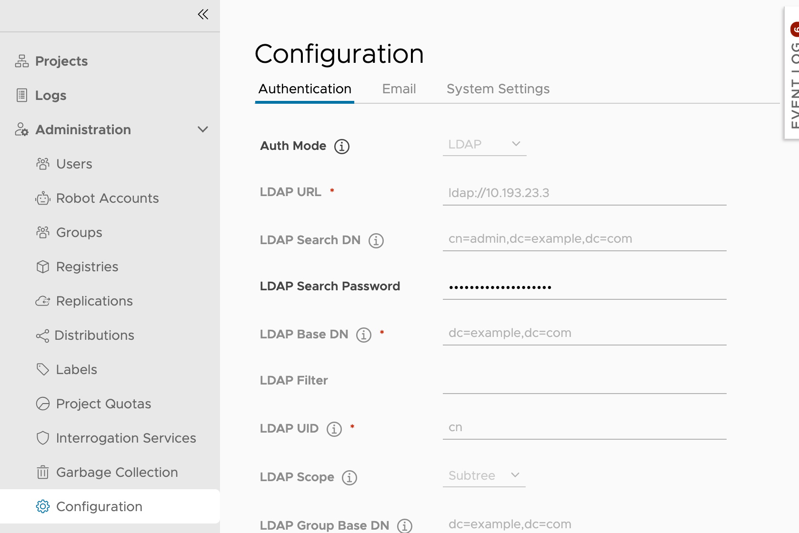

# Proposal:  `Overwrite configuration by environment variables`

Author: `stonezdj`

## Abstract

Proposal to override the Harbor configuration with environment variables.

## Background

Before Harbor 1.8, it is easier to configure external authentication by environment variables. After Harbor 1.8, it is could be configured by REST API to change the configuration, but it is not easy to issue the command and check the result in DevOps. and it is inconvenient when the Harbor instance is deployed in the Kubernetes environment. as discussed in issue [#8076](https://github.com/goharbor/harbor/issues/8076)

## Proposal

We can enhance the current configuration by adding some environment variables to overwrite the Harbor configuration.

CONFIG_OVERWRITE_JSON='' which contains the JSON format of the init configuration, for example:
```
CONFIG_OVERWRITE_JSON={"auth_mode":"ldap_auth","ldap_base_dn":"dc=example,dc=com","ldap_url":"ldap.myexample.com"}
```
When CONFIG_OVERWRITE_JSON is provided, all user settings cannot be changed, the only way to change is to update the CONFIG_OVERWRITE_JSON and restart the container.

The configure panel in read-only mode is the following.



## Goal

The overwrite config by env feature is only used for DevOps, when the overwrite configure env is provided, all user settings become read-only and can not be changed in configure pannel.
All user configure items are stored in the Harbor database.

## Non-Goals

All user configure is not configurable anymore when there is a overwrite configure setting detected. make the user configure item partially editable is not in the scope of the current implementation.
To change settings, users need to update the environment variable and restart Harbor.

## Implementation

Add an OverwriteConfig method to the config controller, and call this method in the main function, after database is ready and before any other API service or asnyc job start. When there is an CONFIG_OVERWRITE_JSON env provided, all user configure is marked to read-only and only can be initialized by this environment variable. It stops the core process for any error in the OverwriteConfig.

When user configure items is going to be overwitten by the environment variable, all settings should have the same format as the PUT request for /api/v2.0/configurations. OverwriteConfig verifies the configuration with the same logic as the REST API request, for example, it checks if the auth_mode will be changed, if there is any custom user exist in the harbor_user table, then the auth_mode cannot be updated. The core process exits if there is any check error happens in OverwriteConfig. All overwrited configures should be persisted in the database table "properties".

Only user configure settings can be initialized by the CONFIG_OVERWRITE_JSON, if CONFIG_OVERWRITE_JSON contains any system configure setting, it terminate the core init process with error.

If the previous instance is installed with an CONFIG_OVERWRITE_JSON provide, this environment is lost after the core container restart, then it should work like a normal Harbor without config overwrite setting, previous settings in the CONFIG_OVERWRITE_JSON is already persistent in the Harbor database.

If there are two or more core instances, which use the same database store, it might be the latest core container's CONFIG_OVERWRITE_JSON overwrite that of the previous core container. If there is any inconsistency between the configuration of each core, it should be a erroneous situation. The CONFIG_OVERWRITE_JSON env settings should always be identical among these harbor core instances.

In the configure API /api/v2.0/configurations, if the read-only flag is true, it returns the HTTP 403 error for PUT method.

### Impact to the existing feature

The configure items become gray when the item is read-only, and any update operation returns HTTP 403 error.

## Open issues

* All engineering work should be tracked by the Epic:[#14494](https://github.com/goharbor/harbor/issues/14494)
* All password field can be updated in configure pannel, it may require the UI to make some change it to make the password read-only.
