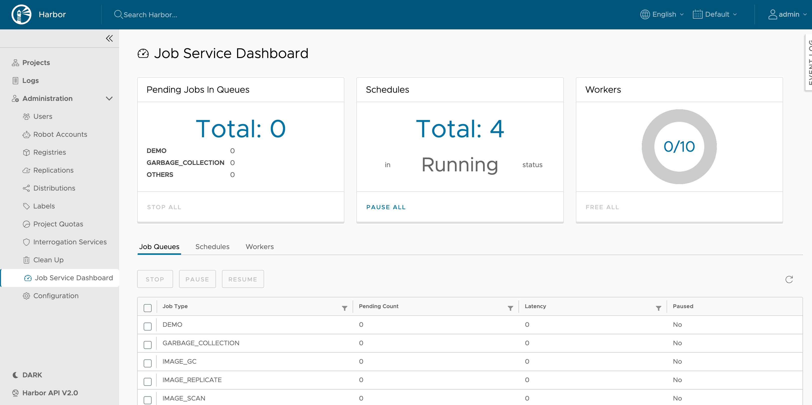
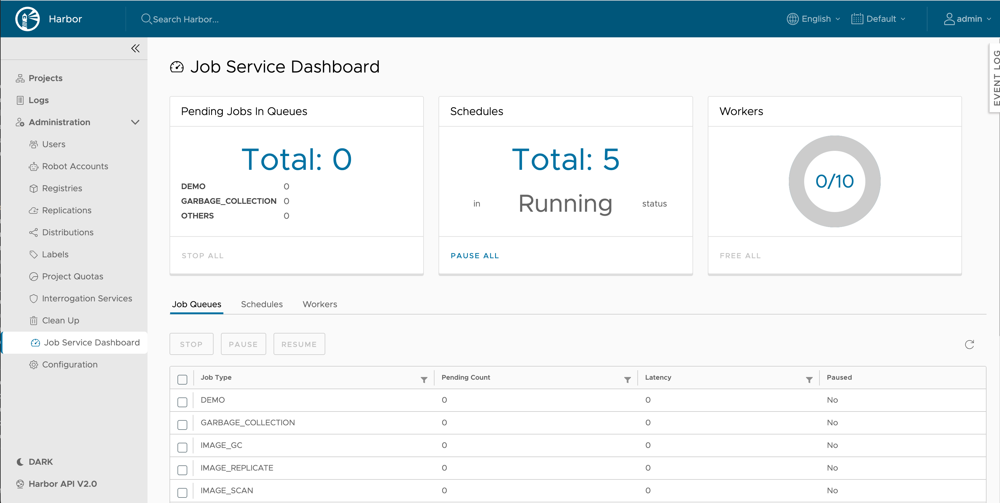
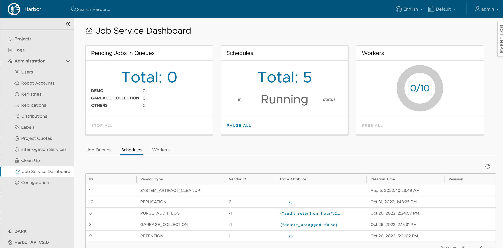
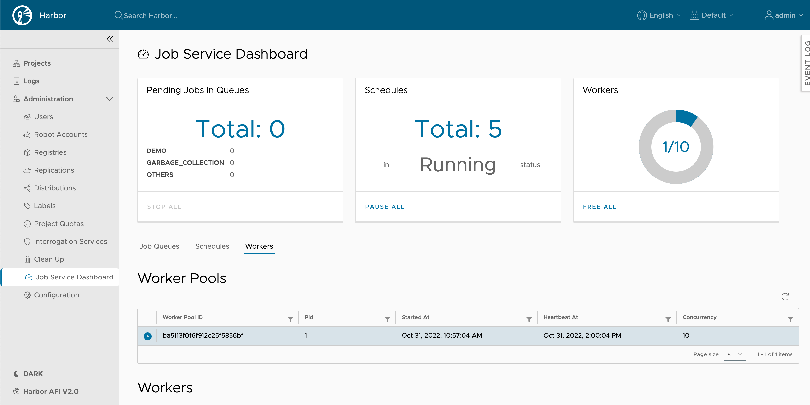

# Proposal: Jobservice monitoring

Author: stonezdj

Discussion: 
    [#16921](https://github.com/goharbor/harbor/issues/16921)
    [#17347](https://github.com/goharbor/harbor/issues/17347)
    [#15170](https://github.com/goharbor/harbor/issues/15170)
    [#17423](https://github.com/goharbor/harbor/issues/17423)

## Abstract

Jobservice monitor provide a way to check the job service worker pool status and provide a way to stop the job service task.

## Background

Jobservice is the framework to schedule different task in async mode, tasks include replication, garbage collection, image scan, tag retention, webhook, export CVE report and purge audit log. some tasks might be scheduled in high frequency such as replication job, some task are scheduled in low frequency, such as GC job. some might have a long duration, some might complete in short interval. because the tasks are executed in the same job service worker pool, they have some impact on each others, and when there is something wrong with the job service workers, such as the workers are blocked by long running tasks, it is difficult for user to diagnostic, mitigate and recover the execution of the job task. in this proposal, we provide a way to check the job service worker status and allow administrator user to take action on the job or schedule.

## User stories

* As an administrator, he/she can check the status of the jobservice worker status, include the vendor type, the duration of this job, and other detailed information about the current task.
* As an administrator, he/she can stop a running job.
* As an administrator, he/she can check the pending jobs count in the queue for different job types
* As an administrator, he/she can stop and clean jobs in the pending job queue.
* As an administrator, he/she can pause or resume jobs in the pending job queue.
* As an administrator, he/she can check the job task schedule.
* As an administrator, he/she can pause/resume all job task schedule.

## Personas

Only Harbor administrators could access the jobservice dashboard to check the job status and take action on the job.

## Non Goals

* Use a different system pool for GC job and scan all job
Some system specific tasks such as GC, scan all, purge audit log, cleanup system artifact are important but less urgent, they should allocate dedicate workers to run. how to design another worker pool to run the system task is out of the scope of current proposal.

## Compatibility

The current solution is part of the Harbor REST API, it doesn't require to interact with the other Harbor instances, previous Harbor instance jobservice task, worker is visible after upgrade.

## Implementation

There are REST api provided:

### 1. List job service worker pools

GET /api/v2.0/jobservice/pools

Response:
```
[ 
	{
	  "worker_pool_id": "066799d491d9aae88021bcf0",
		"started_at": 1662427462,
		"heartbeat_at": 1662449533,
		"concurrency": 10,
		"host": "myrelease-harbor-jobservice-86d4b9858-9c6rh",
		"pid": 1
	},
	{
		"worker_pool_id": "8edd61d3b029ab5c8a8181f1",
		"started_at": 1662427458,
		"heartbeat_at": 1662449529,
		"concurrency": 10,
		"host": "myrelease-harbor-jobservice-86d4b9858-q928w",
		"pid": 1
	}
]
```

### 2. List job service worker status


GET /api/v2.0/jobservice/pools/{pool_id}/workers

When the pool_id is all, it return all workers in all pools. it will list all workers in the pool, include which has no job running now.
Response
```
[
	{
		"worker_id": "097667e8391cb9851689c168",
		"job_name": "REPLICATION",
		"job_id": "e2d2033e770b125002a067dc",
		"started_at": 1661153741,
		"args": "{\"dst_resource\":\"{ ...",
		"checkin": "",
		"checkin_at": 0
	},
     ....
	{
		"worker_id": "4c9f561db607336733d248ea",
		"job_name": "REPLICATION",
		"job_id": "2da291ba520b2ca820a3abe2",
		"started_at": 1661153742,
		"args": "{\"dst_resource\":\"{ ...",
		"checkin": "",
		"checkin_at": 0
	}]
```

Redis Key:

```
{harbor_job_service_namespace}:worker_pools
{harbor_job_service_namespace}:worker_pools:<worker_pool_id>
{harbor_job_service_namespace}:worker_pools:<worker_pool_id>:inprogress
{harbor_job_service_namespace}:worker:<worker_id>
```
### 3. Stop job task in running state

PUT /api/v2.0/jobservice/jobs/{job_id}

Payload: Empty

Response: HTTP code to indicate the status
Redis Key:

```
{harbor_job_service_namespace}:worker:<worker_id>
{harbor_job_service_namespace}:job_stats:<job_id>
```

After update the job status in redis, the job runner will check the job status and stop the job. and also will update the status in the task table. if the job_id is all, it will stop all running jobs.

### 4. List job service pending jobs

GET /api/v2.0/jobservice/queues
Response

```
[{
	"job_type": "REPLICATION",
	"count": 100,
	"latency": 3600,
	"paused": false,
},
{
	"job_type": "GARBAGE_COLLECTION",
	"count": 2,
	"latency": 600,
	"paused": false,
}]

```
The job_type is the job vendor type, and the count is the total jobs in the queue, the latency is the max latency of the jobs in the queue.

### 5. Stop, Pause or Resume the pending job in the queue

PUT /api/v2.0/jobservice/queues/{job_type}

Payload: 
```
{
	"action": "stop", "pause" or "resume"
}
```
Redis Key:

```
{harbor_job_service_namespace}:jobs:<job_type>:paused
{harbor_job_service_namespace}:jobs:<job_type>
```

| Action | Description |
| --- | --- |
| stop | Stop all pending jobs in the queue and stop the subsequent retry, mark the task as stopped in task table |
| pause | Pause to pickup job from the queue, the new job will not be executed, but new task could be enqueued |
| resume | Resume to pickup job from the queue, previous paused job will continue |

When job_type is all, indicate to ignore the attribute job_types list, the take action will execute on all job types.

### 6. List all schedules

GET /api/v2.0/jobservice/schedules

Response:
```
[
	{
		"id": 1, 
		"vendor_type": "REPLICATION",
		"vendor_id": 1,
		"status": "Enable",
		"trigger": "Manual",
		"extra_attrs": "{}"
		"creation_time": "2016-11-11T11:11:11Z",
		"start_time": "2018-05-01T00:00:00Z",
		"end_time": "2018-05-01T00:00:00Z"
		"status_revision": "1661797396"
	},
	{
		"id": 2, 
		"vendor_type": "REPLICATION",
		"vendor_id": 1,
		"status": "Enable",
		"trigger": "SCHEDULE",
		"extra_attrs": "{}",
		"creation_time": "2016-11-11T11:11:11Z",
		"start_time": "2018-05-01T00:00:00Z",
		"end_time": "2018-05-01T00:00:00Z"
		"status_revision: "1661797396"
	}
]
```

### 7. Get Scheduler status

GET /api/v2.0/jobservice/schedulerstatus

Response:
```
{ "paused": "true" }
```
If the scheduler is paused, paused is true. and the scheduler will not be executed. this API is visible to all login users.

### UI

Add a new menu item in the Administration -> Job Service Dashboard 

In this dashboard it includes the information about pending jobs, schedules and worker pools.



There are tree dashboards for each metrics type

* Job Queues -- It displays the pending jobs in all job service queues, count by different types

* Schedules -- It displays the schedules running in the job service 

* Workers - It displays the busy/free works in all pools

For each item there is a detail information table.

#### 1. Job Queues



Admin user could stop the selected pending job types. or pause/resume the execution of a specific job types.

#### 2. Schedules


Admin user could pause/resume the execution of schedule.

#### 3. Worker Pools


When user select the worker pool in the worker pool, it display the workers under this pool in the workers table. (single item selection)

Admin user could free the selected worker by stoping the running task in the worker.

### Other UI changes

If an user create a schedule when the scheduler is paused, there should be an error message to indicate the scheduler is paused.
When an user access the replication, GC, and tag retention page when the scheduler is paused, there is a warning message to indicate the scheduler is paused in the UI.

## Open issues (if applicable)

* Stop the replication task in error state could change into running state because of the retry mechanism.

## Terminology

* Worker Pool - jobservice pool which manage a set of worker, each worker pool has a name and a set of workers.
* Worker - The job service worker which is responsible for executing the job.
* Schedule - The schedule is a job which is scheduled to run periodically. it could trigger another job or execute the job directly. 
* Job/Task - The basic element of job service work unit, stands for the work need to do.