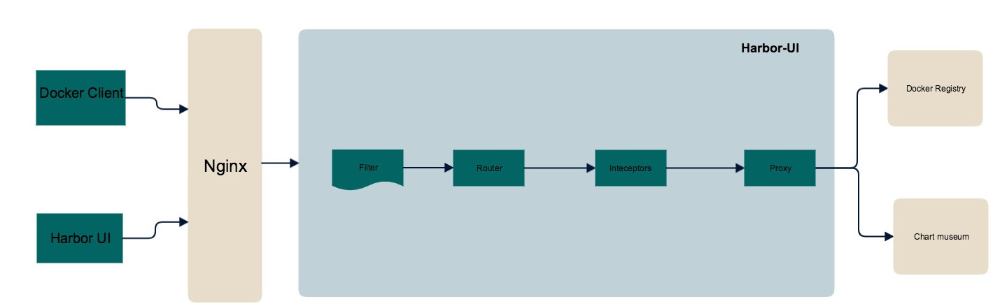

Proposal: Support metadata in Harbor 

Author: Yan Wang

## Abstract
The traditional way to integrate Harbor with CI/CD is just to see it as a image/helm storage. All of the information on CI system and testing framework are lost in Harbor. This proposal introduces the deep integrating Harbor with CI/CD system, automates the process of shipping new code and enable fully traceable images/helm charts.

## Solution
CI/CD system uploads the images/helms together with build/code information into Harbor, which enables the capability of developer to view these in registry, and make it easy to trace code commit and build pipeline message. 
This proposal describes three parts, that are how to publish metadata into Harbor, how to present metadata in Harbor portal and how to use metadata in Harbor.

## Proposal 
1, How to publish metadata into Harbor — Harbor provides API to handle CRUD of metadata, to enable fully tracebable docker builds and charts.

API
1, /api/{source}/{source_id}/metadata   POST 
Generate metadata for sources

2, /api/{source}/{source_id}/metadata/?name   GET 
Get metadata bases on name

3, /api/{source}/{source_id}/metadata/:name   PUT
Update metadata 
 
4, /api/{source}/{source_id}/metadata/:name   DELETE 
Delete metadata

Data model
type metadata struct {
	ID uint64 `json:"id"`
	SourceID int64 `json:"source_id"`
	Name string `json:"name"`
	Value string `json:"value"`
	Description string	`json:"description"`
	CreationTime time.Time    `json:"creation_time"`
	UpdateTime   time.Time    `json:"update_time"`
}

DB schema
create table harbor_resource_metadata (
	 id SERIAL NOT NULL,
	 metadata_id int NOT NULL,
	 resource_id int,
	 name varchar(256),
	 value varchar(256),
	 description varchar(1024),
	 creation_time timestamp default CURRENT_TIMESTAMP,
	 update_time timestamp default CURRENT_TIMESTAMP,
	 PRIMARY KEY(id)
);

The user could integrate the API of harbor metadata into their CI/CD pipeline, and provides the informations want to be used. 

2, how to present metadata in Harbor portal — Harbor portal customize render for different kind of metadata
It is a Data-Driven reporting interface, Harbor portal could predefine several kinds of viewer for different kinds metadata, like yaml, json, junit and etc. 

User Cases:
User could trace basic info of image/helm charts， like author, creation time and ect.
User could trace code commit info by clicking git/svn link.
User could trace build system info by clicking CI link.

Data Spec -- build info(json), it could be rendered by harbor portal and aligned with image/chart.
{
   // required ...
   "buildName": "build_web_app",
   "buildNumber": "10",
   "buildRevision":"gf23478jhe36",
   "sourceRepo": "https://github.com/goharbor",
   "comment": "Debug a bug fix.",
   "status": "fail",
   "url":"https://jenkins/job/test/1"
   //customized ...
   "key": "value"
}

3, how to use metadata in Harbor — Harbor provides mechanism to let user to set rules base on metadata
Currently, Harbor provides inteceptors to filter docker request, and provide capablity to config docker pull rules like content trust and vul scan.
Harbor should extend this capability of intercepters to filter request to helm chart repository.  

Rules should support basic OP command, EQUALS, NOTEQUALS, CONTAINS, NOTCONTAINS, IN, NOTIN. 

* User could define rules to use the metadata.
User Cases:
User set “branch EQUALS release”, that means the image could not be pulled as it’s not packaged by release branch code.
User set “testresults NOTEQUALS pass”, that means the image could not be pulled as the test is failure.

As the webhook proposal has been submitted, here we suppose that harbor supports webhook.

* User could customize webhook to trigger their CD pipeline, once any new image is pushed into harbor, harbor will generate an event that
coutains the info of this image, include general build info, vul resuts, and signature. 

User Cases:
User add listener to webhook, trigger the stage environment system by build info -- status EQUALS pass.
User add listener to webhook, trigger the stage environment system by build info -- branch IN release, stage

