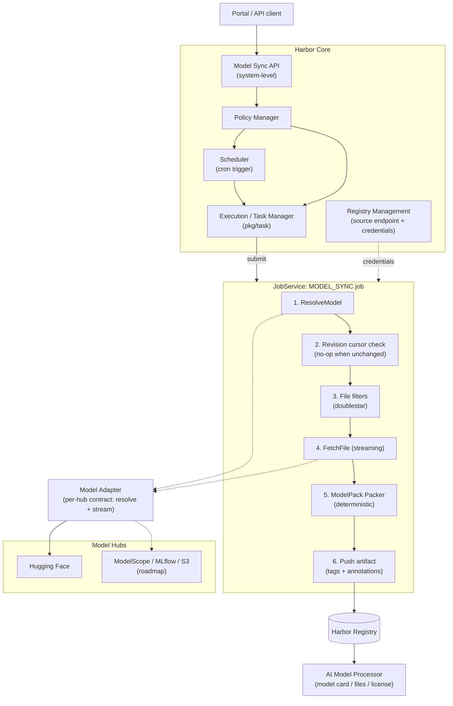
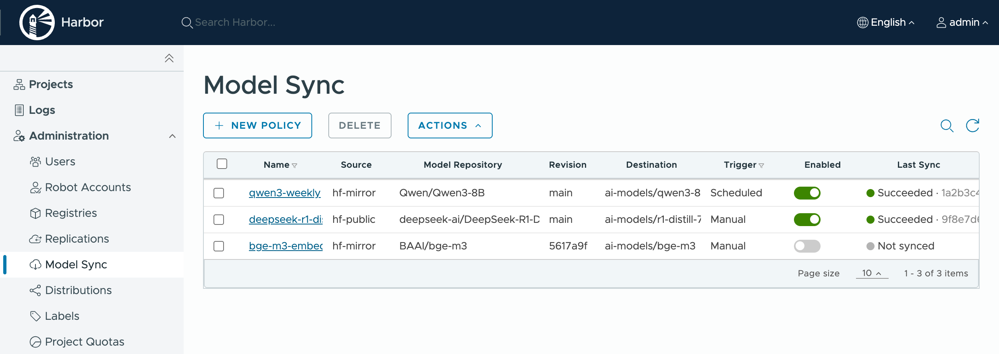
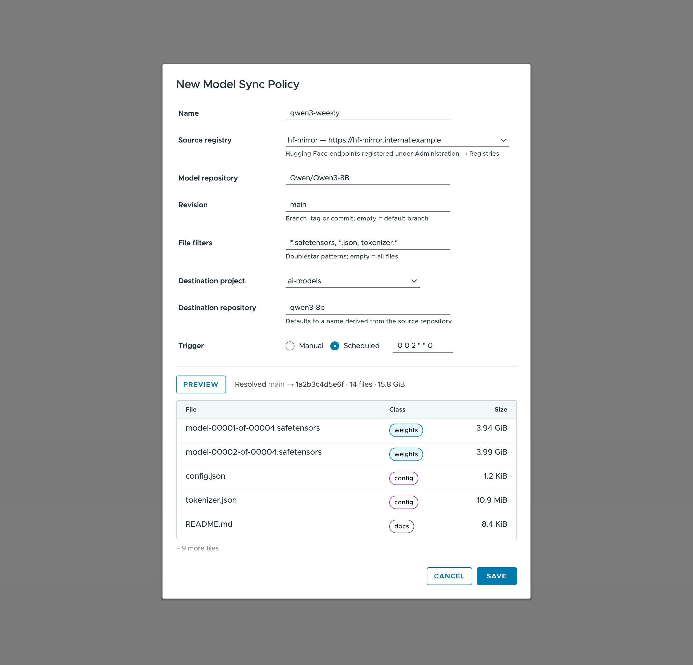
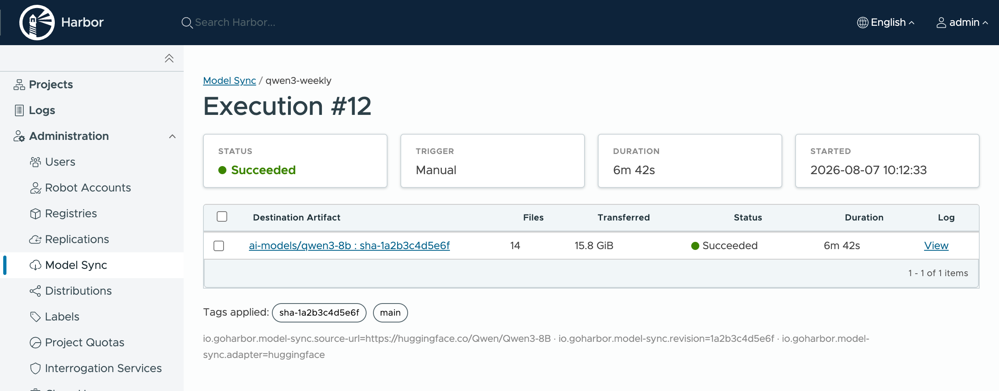

# Proposal: Model Sync Adapter Framework

Author: [Chenyu Zhang](https://github.com/chlins), [Yan Wang](https://github.com/wy65701436)

Discussion: [goharbor/community#296](https://github.com/goharbor/community/issues/296)

## Abstract

This proposal introduces a Model Sync Adapter Framework to Harbor: a dedicated, extensible framework that syncs AI models from upstream model hubs (Hugging Face first) into Harbor as OCI artifacts packaged according to the [ModelPack Model Spec](https://github.com/modelpack/model-spec). The framework runs parallel to Harbor's replication architecture and reuses its proven building blocks (adapter interface, policy/filter/trigger, and execution/task management) while defining a dedicated Model Adapter contract tailored for model hubs, where the `fetch → convert → push` transformation is a first-class stage of the pipeline.

## Motivation

With the [AI Model Processor](./AI-model-processor.md), Harbor already understands OCI model artifacts: it recognizes the model artifact type, parses model metadata, and renders the model card, file list, and license in the UI. What is still missing is a supported on-ramp. Getting a model from Hugging Face, the de facto hub for open models, into Harbor today requires an out-of-band `download → convert → push` loop that every team scripts differently.

This friction matters to three groups who want Harbor in this path:

- Teams standardizing on OCI model artifacts, who want models managed next to container images with the same RBAC, quota, retention, and audit capabilities.
- Air-gapped and regulated organizations, which must pull public models into a governed boundary with recorded provenance.
- Platform teams building AI infrastructure, who need model distribution (including P2P acceleration) to work from a single registry source of truth.

A one-off "Hugging Face import" feature would solve today's request but not tomorrow's: the same need exists for ModelScope, MLflow, S3-hosted model repositories, and future hubs. What Harbor needs is an abstraction, not a feature.

## Goals

1. Define a narrow, hub-agnostic **Model Adapter contract** (resolve + stream) so new model sources are registrations, not core changes.
2. Ship a **Hugging Face adapter** as the reference implementation.
3. Provide **system-level sync policies**, managed by Harbor administrators exactly like replication policies, with manual and scheduled (cron) triggers, file filters, and revision-cursor idempotence.
4. Package models as **ModelPack model-spec OCI artifacts deterministically**, so the same upstream revision always produces the same artifact digest.
5. Reuse Harbor's **registry management** for source endpoints and credentials (encrypted at rest), and **execution/task management** for observability.
6. Keep the OCI replication framework untouched.

## Non-Goals

1. Exporting or pushing models from Harbor back to upstream hubs.
2. A lazy pull-through (proxy-cache style) mode for model hubs.
3. Converting between model formats (e.g. safetensors ↔ GGUF); files are synced as-is.
4. Any change to the existing OCI replication adapters or replication semantics.
5. Model serving or inference concerns.

## Personas and User Stories

**Platform engineer (air-gapped / regulated org).**
As a platform engineer administering Harbor, I want to define system-level policies that pull approved models from Hugging Face (through our internal mirror) into curated projects on a schedule, so the decision about what crosses the boundary stays central and consumers inside never reach the public internet.

**ML engineer.**
As an ML engineer, I want the models my services depend on to live in the same registry as my container images, pullable with standard OCI clients, so my deployment pipeline has one artifact store and one set of credentials.

**Compliance officer.**
As a compliance officer, I want every imported model to record its source URL, upstream revision, and license, so provenance is auditable long after the import happened.

## Architecture



The framework mirrors the architectural pattern that replication and P2P preheat have proven: **Adapter Interface + Policy/Filter/Trigger + Execution/Task Manager**. The pieces:

- **Source registration.** Model hubs are registered through the existing registry management with a new registry type (e.g. `huggingface`), carrying the endpoint (default `https://huggingface.co`, custom endpoints supported for mirrors) and an optional access token, encrypted at rest by the existing mechanism. The type implements only the base adapter surface (info / health check); it advertises no replication-supported resource types, so it never appears as a replication policy candidate.
- **Sync policy.** System-level and administrator-managed, mirroring replication policies. Specifies the source registry, the hub-side model repository, a revision expression (branch, tag, or immutable revision ID), optional file filters, the destination project and repository, and the trigger.
- **Execution and tasks.** A new `MODEL_SYNC` job kind in JobService, driven through `pkg/task` like replication, GC, and preheat. This provides executions, tasks, status, and logs with no new bookkeeping infrastructure.
- **Model Adapter.** The per-hub contract, detailed below.
- **Packer.** A hub-independent component that assembles the fetched files into a model-spec OCI artifact deterministically and pushes it to the local registry.

## Model Adapter Contract

The contract is deliberately narrow: resolve and stream. Everything OCI (layout, digests, manifests, pushing) is owned by the framework, so adapters never need to fake registry semantics:

```go
// ModelRef identifies a model in an upstream hub.
type ModelRef struct {
    Repository string // hub-side identifier, e.g. "Qwen/Qwen3-8B"
    Revision   string // branch, tag, or immutable revision ID; empty means the default branch
}

// File describes one file of a resolved model revision.
type File struct {
    Path   string
    Size   int64
    SHA256 string // content digest when the hub provides one (e.g. Git LFS objects); empty otherwise
}

// Revision is an immutable snapshot of a model.
type Revision struct {
    Ref      string            // the ref as requested
    ID       string            // immutable revision identifier (e.g. a git commit SHA)
    Files    []File
    Metadata map[string]string // model card fields: license, pipeline tag, library, ...
}

// Adapter is implemented once per model hub and registered through a factory,
// following the same registration pattern as replication adapters and preheat providers.
type Adapter interface {
    // Info returns the adapter metadata and capabilities.
    Info(ctx context.Context) (*Info, error)
    // HealthCheck verifies endpoint reachability and credential validity.
    HealthCheck(ctx context.Context) error
    // ResolveModel resolves ref to an immutable revision snapshot.
    ResolveModel(ctx context.Context, ref ModelRef) (*Revision, error)
    // FetchFile opens a streaming reader for one file at the resolved revision,
    // starting at offset to support resumption.
    FetchFile(ctx context.Context, rev *Revision, path string, offset int64) (io.ReadCloser, error)
}
```

The contract has been paper-validated against ModelScope (git-based, revision semantics equivalent to Hugging Face); adapters for MLflow and S3-compatible sources are on the roadmap and will inform whether revision synthesis (for sources without native revisions) needs a contract extension.

## Packaging and Determinism

The packer converts a resolved revision into a model-spec artifact under these rules:

1. Files are ordered lexicographically by path.
2. Each file becomes **one raw-bytes layer** (no tar, no compression), typed by the model-spec file class (weights, config, code, docs).
3. The model-spec config is serialized canonically (sorted keys, no timestamps), carrying the model card metadata (source URL, revision, license, and other card fields).
4. The manifest is assembled with a stable field order.

Consequently, **the same upstream revision with the same file filters always produces a bit-identical artifact digest**. This determinism is the foundation for:

- **Idempotence.** A sync run is a no-op when the policy cursor matches the upstream revision and the destination artifact exists; the digest doubles as a reconciliation check when the cursor is lost.
- **Streaming.** For hub files that carry a content digest (Hugging Face LFS objects expose SHA-256), the blob can be pushed while streaming, with no full-model materialization on local disk. Files without a hub-provided digest (typically small, non-LFS) are hashed by the framework during packing.
- **Deduplication and distribution.** Identical layers dedupe across artifacts and instances, and raw per-file layers are friendly to P2P distribution systems.

Tagging and provenance:

- An immutable tag `sha-<12-char revision>` is always applied; when the policy tracks a branch, the branch name is applied as a moving tag.
- Manifest annotations record provenance: `io.goharbor.model-sync.source-url`, `io.goharbor.model-sync.revision`, `io.goharbor.model-sync.adapter`.

## Data Model and Schema Changes

One new table for policies; executions and tasks reuse the `pkg/task` infrastructure with a new vendor type `MODEL_SYNC` (no new tables):

```sql
CREATE TABLE model_sync_policy (
    id SERIAL PRIMARY KEY,
    name VARCHAR(256) NOT NULL,
    description TEXT,
    dest_project_id INT NOT NULL,      -- destination project, like replication's destination namespace
    enabled BOOLEAN NOT NULL DEFAULT TRUE,
    registry_id INT NOT NULL,           -- source endpoint + credential (registry management)
    src_repository VARCHAR(512) NOT NULL,
    src_revision VARCHAR(256),          -- branch/tag/revision expression; empty = default branch
    file_filters TEXT,                  -- JSON array of doublestar patterns
    dest_repository VARCHAR(512),       -- defaults to a name derived from the source repository
    trigger_type VARCHAR(64) NOT NULL,  -- 'manual' | 'scheduled'
    cron VARCHAR(64),
    last_synced_revision VARCHAR(256),  -- idempotence cursor
    creation_time TIMESTAMP DEFAULT CURRENT_TIMESTAMP,
    update_time TIMESTAMP DEFAULT CURRENT_TIMESTAMP,
    UNIQUE (name)
);
```

## API

All endpoints are system-level and follow the replication API layout. Policy and execution management requires the Harbor system administrator role. This mirrors Harbor's existing convention that whatever moves external content across the registry boundary (registry endpoints, replication policies, proxy-cache wiring) is an administrator concern; once content is inside a project, that project's RBAC and quota govern it as usual.

| Method | Endpoint | Description |
| --- | --- | --- |
| POST | `/model-sync/policies` | Create a policy |
| GET | `/model-sync/policies` | List policies |
| GET | `/model-sync/policies/{id}` | Get a policy |
| PUT | `/model-sync/policies/{id}` | Update a policy |
| DELETE | `/model-sync/policies/{id}` | Delete a policy |
| POST | `/model-sync/policies/{id}/executions` | Trigger a sync manually |
| GET | `/model-sync/policies/{id}/executions` | List executions |
| GET | `/model-sync/executions/{eid}/tasks` | List tasks of an execution |
| GET | `/model-sync/executions/{eid}/tasks/{tid}/log` | Task log |
| POST | `/model-sync/preview` | Resolve a source and list files without importing |

## UI

- **Registry management**: the new source type appears in the existing "New Registry Endpoint" flow (endpoint, optional token, health check).
- **Administration**: a "Model Sync" section alongside Replications, with the policy list, a creation wizard (source, model repository, revision, filters, destination project and repository, trigger; with a preview step backed by the preview API), and execution/task views consistent with replication's presentation.

The mockups below illustrate the three primary views.

**Policy list (Administration → Model Sync):**



**Policy creation with source preview:**



**Execution detail with provenance (applied tags and source annotations):**



## Security Considerations

- Access tokens live in registry management, encrypted at rest by the existing mechanism, and are never returned by any API.
- Outbound traffic to model hubs originates only from JobService.
- Imported artifacts are ordinary project artifacts: project quota, RBAC, retention, GC, and audit logging all apply unchanged.

## Rationale

Three approaches were considered:

**1. A standalone, per-hub import feature.** Solves exactly one hub; every additional source duplicates API, UI, scheduling, and bookkeeping. Rejected.

**2. Extending the OCI replication adapters.** Attractive on the surface: replication already has adapters, policies, filters, and triggers. It was rejected on evidence:

- The `ArtifactRegistry` contract is manifest- and digest-addressed end to end (`PullManifest`, `PullBlob(repository, digest)`, `MountBlob`, ...). Model hubs have neither manifests nor universally digest-addressed content, so an adapter must fabricate registry semantics it cannot honor.
- Replication's idempotence compares source and destination digests of the *same* artifact. Model sync is a *conversion*: the source has no OCI digest, so the core skip/override semantics do not apply.
- An earlier proof-of-concept integrating Hugging Face through the replication adapter interface ran into these impedance mismatches directly ([KubeCon session](https://www.youtube.com/watch?v=0eiXSogHxmQ)).
- Harbor has removed a non-OCI upstream adapter before (ArtifactHub, together with the chartmuseum backend), which is a signal about the long-term cost of pretending non-OCI sources are registries.

**3. A dedicated parallel framework (chosen).** Reuses the proven pattern (adapter + policy/filter/trigger + execution/task) without touching the OCI contract. Harbor already maintains a healthy precedent for a narrow, parallel provider framework: the P2P preheat providers (`Self / GetHealth / Preheat / CheckProgress`), stable since v2.1.

## Compatibility

- Purely additive: one new table, new API endpoints, a new job kind, a new registry type. No changes to replication, the proxy cache, or any OCI-serving path.
- Produced artifacts are standard OCI and standard model-spec: the existing AI Model Processor renders them without modification, and quota, GC, retention, robot accounts, and webhooks apply as for any artifact.
- Air-gapped deployments configure a mirror endpoint on the source registration; nothing else changes.

## Implementation Plan

**Phase 1 (target v2.17):**
- Framework: adapter contract and factory registration, `huggingface` registry type, policy manager and schema, `MODEL_SYNC` job, deterministic model-spec packer, system-level API.
- Hugging Face adapter (resolve via the Hub API, stream files, LFS digest reuse).
- UI: policy management under Administration (alongside Replications), guided creation with preview, execution/task views.

**Phase 2:**
- ModelScope adapter as the second implementation validating the contract.
- Filter and preview UX refinement.
- Evaluation of MLflow and S3-compatible sources (revision synthesis), and exploration of a pull-through mode for model hubs as a separate proposal.

## Open Issues

1. Files without a hub-provided SHA-256 (non-LFS files expose only a git SHA-1) are hashed by the framework during packing; this is expected to cover small files only, and behavior for large non-LFS files needs validation against real repositories.
2. Canonical serialization rules for the model-spec config (key ordering, timestamp handling) should be confirmed with the model-spec project, and contributed upstream if needed, since determinism depends on them.
3. Raw per-file layer media types: confirm the current model-spec media type set fully covers uncompressed raw layers for all file classes.
4. Hugging Face Hub API pagination and rate limits for very large repositories need verification during implementation.
5. Quota enforcement timing for streamed pushes (reserve-then-commit vs commit-time accounting).
6. The exact v1 UI scope (wizard depth, preview richness) is open for maintainer feedback.
7. Project-level self-service (e.g. read visibility or manual trigger rights for destination project members on top of administrator-managed policies) is deliberately deferred until the system-level workflow settles; adding it later is purely additive.

## References

- ModelPack Model Spec: https://github.com/modelpack/model-spec
- Discussion issue: https://github.com/goharbor/community/issues/296
- AI Model Processor proposal: [AI-model-processor.md](./AI-model-processor.md)
- P2P preheat provider framework (precedent): [p2p_preheat_proposal.md](../p2p_preheat_proposal.md)
- KubeCon proof-of-concept session: https://www.youtube.com/watch?v=0eiXSogHxmQ
- CNCF blog "The Weight of AI Models": https://www.cncf.io/blog/2026/03/27/the-weight-of-ai-models-why-infrastructure-always-arrives-slowly/
- Hugging Face Hub API: https://huggingface.co/docs/hub/api
