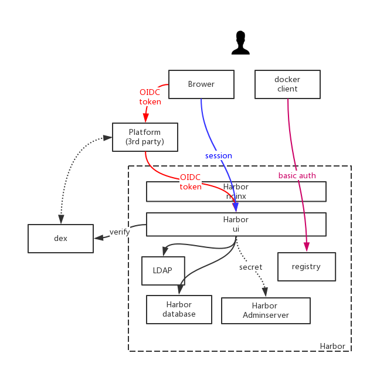

# Proposal: `OIDC support`

Author: `silenceshell` / [silenceshell](https://github.com/silenceshell)

Discussion: [#5358](https://github.com/goharbor/harbor/issues/5358)

## Abstract

Allow user call harbor API by OIDC authentication.

## Background

**OIDC**

OpenID Connect 1.0 is a simple identity layer on top of the OAuth 2.0 protocol. It allows clients to verify the identity of the End-User based on the authentication performed by an Authorization Server, as well as to obtain basic profile information about the End-User in an interoperable and REST-like manner.

OpenID Connect allows clients of all types, including Web-based, mobile, and JavaScript clients, to request and receive information about authenticated sessions and end-users. The specification suite is extensible, allowing participants to use optional features such as encryption of identity data, discovery of OpenID Providers, and session management, when it makes sense for them.

see also [Welcome to OpenID Connect](https://openid.net/connect/)

**dex**

Dex is an identity service that uses OpenID Connect to drive authentication for other apps.

Dex acts as a portal to other identity providers through "connectors." This lets dex defer authentication to LDAP servers, SAML providers, or established identity providers like GitHub, Google, and Active Directory. Clients write their authentication logic once to talk to dex, then dex handles the protocols for a given backend.

see also [dex](https://github.com/dexidp/dex)

## Proposal

In our environment, we use dex as our authentication provider. When end users login, user will get an token from dex, then user could call api with the token.

For example, user call k8s api on our platform website, the token will be passed to k8s apiserver, then apiserver call dex api to authenticate the request: verify the token, get user info,  etc.

We use Harbor as our docker registry, and end users wants to get/search their projects/images on our platform website, instead of on harbor web ui. It is much convenient for end user, for they do not have to login another website.

So we want Harbor to support OIDC authentication. Then, we can call harbor api from our platform website with the token generated by dex, and harbor can call dex api to verify the token.

### Detail

Harbor organize all authentication filter in `reqCtxModifiers`, so we add a new kind called `oidcTokenReqCtxModifier` to `reqCtxModifiers`.

We call harbor api with http header like: `Authentication: Bearer {token}`. Then in `SecurityFilter`, the request will fail on all exists ReqCtxModifier like secret, basicAuth, session; then harbor will call `oidcTokenReqCtxModifier.Modify` to verify the request.

In this function, we will get the bearer token from the request, and call dex api to verify the token. If success, we can get user info from dex, then `NewSecurityContext` and `setSecurCtxAndPM` for further usage.

## Non-Goals

NA

## Rationale

NA

## Compatibility

None

## Implementation

I have implemented this feature and have run for a couple of months, and it works fine.

## Open issues (if applicable)

None