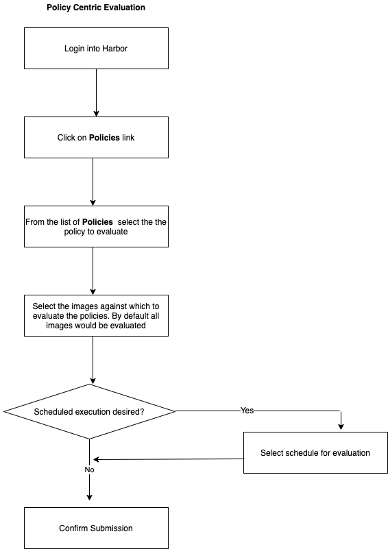
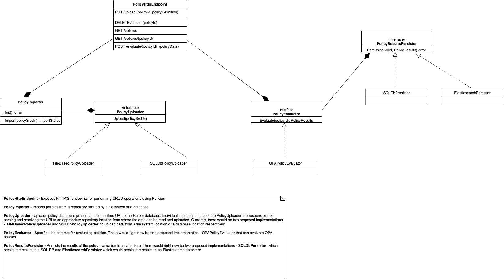

# Proposal: Integrate Harbor with Open Policy Agent

Author: Prahalad Deshpande

## Abstract
This proposal introduces an integration between Harbor and the [Open Policy Agent](https://www.openpolicyagent.org/). This integration will allow users to evaluate and enforce custom policies on images being stored and retrieved from Harbor. Additionally, the integration would also allow a variety of security and compliance enforcement checks to be performed as a part of the build and deploy pipelines by exposing a uniform set of APIs.
The motivation behind this proposal is the Common Vunerability Schema Specification for the Cloud Native Workload. Integrating Harbor with OPA will introduce rich policy evaluation capabilities within Harbor in addition to opening up to other potential integrations with the tools for enforcement of IT GRC compliance in the cloud native ecosystem

## Background
Harbor currently has support for scanning images for OS vulnerabilities using the [pluggable scanner framework](https://github.com/goharbor/pluggable-scanner-spec). Using the framework, end users can use OS vulnerability scanners of their choice to understand the OS vulnerabilities present within the system. However, reporting capabilities of Harbor with respect to the security and compliance posture of the images persisted within it is very minimal and is restricted to providing a summarized aggregate for the High, Medium and Low vulnerabilities within the images. There are some other crucial limitations such as:
* The scanning for vulnerabilities is scoped to images within a project of which the end user is a member
* There is no mechanism available for the end users to utilize the results of the scan to make further actionable decisions  for e.g. quarantining the image or prevent creation of Pod workloads from these images in Kubernetes clusters.
* There is also no mechanism right now to "slice and dice" the results of the vulnerability evaluation.
  
The above limitations introduce shortcoming in addressing of critical security use cases of the enterprise security administrator who is concerned about the security and compliance posture of the applications being deployed and the container registry itself (including identification of projects containing the offending images) as opposed to individual project level granularities.
Additionally, from the dev-ops perspective; it is not possible to build a deployment criteria that prevents deploying a service based out of an image not satisfying the acceptance criteria or pre-empt the creation of deployment artifacts (e.g. Helm charts) when the deployments use images that do not satisfy the acceptance criteria.
Additionally, there also exists a critical requirement for the end user to be able to author complex policies that can evaluate the results of an image scan and produce an output that flags the image as matching or failing the acceptance criteria and also share the policies across departments to implement and enforce set of best practices uniformly.

To address the above requirements and use cases, an integration between Harbor and [Open Policy Agent](https://www.openpolicyagent.org/) is proposed. Open Policy Agent (OPA) is the policy authoring and evaluation framework that is being adopted widely by the Cloud Native Computing Foundation. Refer to [OPA Integrations](https://www.openpolicyagent.org/docs/latest/ecosystem/) to see a set of compelling and interesting integrations.

##Use Cases

### Security Admin Persona
* What are the **Critical** vulnerabilities present in my **Harbor registry**?
* Which images are impacted by **CVE-12345** which has been flagged as business critical?
* Which Helm charts use images with **Critical** vulnerabilities?
* Where can I get access to a summary report on a regular cadence?
* What **Services** out in the field use an image containing **CVE-12345**?
* I have a set of enterprise wide "Acceptance for Use" critieria that must be satisified. How can I identify images that satisfy these criteria and those that do not?
* How can I share the best practice checks that I have designed with my enterprise partner organizations so all maintain the same level of compliance?
* I want to evaluate images against standard IT-GRC policies (PCI, HIPAA) and score images against these policies.
* I want to apply custom scoring policy on images based on my organization's acceptance criteria. I then want to ensure that images with low score are not permitted to be used when launching any workloads.
  

### Dev Ops Persona

* Do not deploy a service S which uses images containing a **Critical** vulnerability **V**
* Fail the creation of Helm charts if they use an image with **Critical** vulnerabilities.

### Application Developer/Owner Persona
* Pull images having that have a PCI compliance policy evaluation score greater than 8 out of 10

### Project Owner Persona
* Quarantine images whose PCI compliance policy evaluation score is less than 8
* Do not replicate images having vulnerability **CVE-12345** to any destination.
* Do not replicate images with low PCI scores to my production Harbor registry.

  
As can be seen from the use cases above; there is a requirement to persist the results of a scan or vulnerability evaluation in a format that supports ad-hoc querying as well as presentable within a report.

Additionally, there also exists a critical requirement for the end user to be able to author complex policies that can evaluate the results of an image scan and produce an output that flags the image as matching or failing the acceptance criteria and also share the policies across departments to implement and enforce set of best practices uniformly.

## Proposal

The next sections describe the user workflows, low level architectures and messaging flow that enable the Harbor - OPA integration

### Harbor Policy Agent User Workflow

Keeping adherance the multi-tenancy tenets of Harbor, OPA policies would be  scoped at a per-user level and would be availble for use across **all** projects of which the user is a member. This level of scoping will satisfy the following scenarios:
* Users can author policies relevant to the projects that they manage or a member of and ensure that images within those projects can evaluated against the policies
* Helps easy migration to a cloud based deployment where-in each user would be a tenant and could own multiple projects against which the policies can be evaluated.
* To satisfy the use case of an uber registry wide or organization specific Security Admin persona, a new user account for the Security Admin can be created and all enterprise wide acceptance policies can be placed under the Security Admin account. Security Admins can then run evaluations against these policies either on demand or inline with a scan or using a periodinc schedule.

* **Note Security Admin Persona is not within the scope of this proposal and would need to be treated as a separate proposal**

The below sub-sections detail some of the proposed workflows. Instead of providing a UI mockup, the focus is on the segues through which the user will navigate to accomplish actions related to Policy evaluation and reporting

**Images and icons need to be finalized and are used for illustration purposes only**

#### Accessing Policy Functionality in Harbor

The below mockup shows the mechanism of accessing the Policy functionality within harbor

#### Policy Upload User Workflow

#### Policy Evaluation - Policy Centric Workflow

The below diagram depicts the user workflow to be followed for a policy centric evaluation i.e. the policy is a reference point against which images are evaluated

#### Policy Evaluation - Policy Centric Workflow

The below diagram depicts the user workflow to be followed for a image centric evaluation i.e. the image is a reference point against which policies are evaluated

#### Policy Evaluation Reporting Workflow

The next sections detail the low level architecture and component view and interaction diagrams for the Harbor Policy Agent

### Harbor Policy Agent Component View

The **Harbor Policy Agent** provides policy evaluation and reporting capabilities within the Harbor ecosystem. A component view of the policy agent is shown below

The core components of the policy evaluation and reporting layer are
* Policy Agent 
* PostgresSQL DB
* Elasticsearch

#### Policy Agent
The **Policy Agent** contains all the required components for processing OPA policies, evaluating them and then persisting the results of the evaluation to the Postgres DB and Elasticsearch store. Each layer within the **Policy Agent** performs a specific responsibility
* Vulnerability Data Fetch layer - responsible for loading vulnerability an scan data from a set of data stores. The data stores could be based out of a File system or a Database.
* Policy layer - responsible for Policy storage, retrieval and evaluation using th OPA framework. The layer has been further detailed in sections below.
* Storage Layer - responsible for providing the required storage abstractions to various data stores for the policy evaluation results and optionally any additional data.
* Reporting layer - responsible for exposing a set of REST APIs,  for querying policy and evaluation data and metrics.

#### PostgresSQL DB
The PostgresSQL DB will store the results of the policy evaluation process in a normalized form that allows for ad-hoc query of the data.

#### ElasticSearch
The Elasticsearch data store will store the results of the policy evaluation indexed by the text contents so that a Full Text Search capability is available on the policy data and the policy evaluation results.

### Harbor Policy  Agent Low Level Design

The low level (interface and struct level) components of the Policy Agent are specified in the below diagram

### Harbor Policy Agent Policy Upload Workflow

The below sequence diagram depicts the interactions between the various components of the **Harbor Policy Agent** during the Policy upload process

### Harbor Policy Agent Policy Evaluation Workflow

Harbor Policy Evaluation can be triggered in any of the below three forms
* Inline with an image scan - Policy evaluation happens immediately after an image scan completes
* On demand - Policy evaluation is triggered by the user by specifying a policy Id and an image id for the purposes of the scan
* Scheduled - Policy evaluation can be scheduled to trigger off exactly once or at a periodic interval.
  
The below sequence diagram depicts the interactions between the various components of the **Harbor Policy Agent** during the Policy evaluation process. It also depicts how Harbor interacts with the Policy Agent using the Policy HTTP Endpoint to trigger a policy evaluation.

##Misc Considerations

###  Multi-tenancy

The proposed solution 

### Deployment

The **Harbor Policy Agent** would be deployed as a service within a container alongside other services that make up the Harbor installation.
