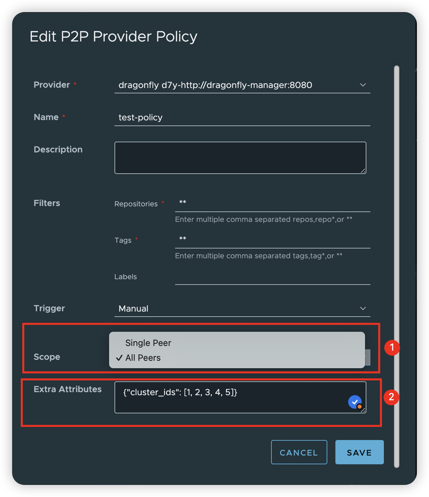

# Proposal: P2P Preheat Enhancement

Author: [Chenyu Zhang](https://github.com/chlins)

## Abstract

This proposal aims to expand the p2p preheat policy to accommodate a wider range of configurations and scenarios.
To achieve this, one options will be added to the policy: extra attributes.

## Motivation

The current Harbor p2p preheat policy offers basic options like filters and triggers. However, these are tailored
from Harbor's perspective, omitting the p2p or preheat viewpoints, particularly in today's AI-driven scenarios.
Users might need to preheat images to p2p clusters with additional p2p related configurations or parameters.
This proposal aims to broaden the p2p preheat policy to accommodate more flexible configurations and scenarios.

## Solution

Add the following options to the p2p preheat policy:

- extra_attrs: The additional attributes that can be used to configure the preheat for vendor or provider specified arguments.
This is a key-value pair as JSON format, and it's optional.

## Goal

1. Provides an extended parameter for users to specify provider-related or unique configurations.

## Personas and User Stories

This section lists the user stories regarding this enhancements for the different personas interacting with the p2p preheat.

* Personas

P2P Preheat is a System Administrator and Project Administrator operation in Harbor.

* User Stories

1. As a system/project administrator, I can create/update a p2p preheat policy with the scope set to "single_peer" or "all_peers".  (if use Dragonfly as p2p provider)
2. As a system/project administrator, I can create/update a p2p preheat policy with extra attributes to configure the preheat for vendor or provider specified arguments.
(e.g: I can set the cluster ids for dragonfly provider)

* Scenario Cases

1. If the user using the dragonfly as p2p provider, when he sets the scope to "single_peer", the preheat will only preheats the image to one peer in the cluster.
2. If the user using the dragonfly as p2p provider, when he sets the scope to "all_peers", the preheat will preheats the image to all peers in the cluster.
3. If the user using the dragonfly as p2p provider, when he sets the extra_attrs to {"cluster_ids": [1, 2, 3]}, the preheat will only preheats the image to the specified clusters.

## Scheme Changes

The schema changes are as follows:

```sql
ALTER TABLE p2p_preheat_policy ADD COLUMN IF NOT EXISTS extra_attrs json;
```

## UI

The UI changes are as follows:

1. Add a new field named "Scope" to the p2p preheat policy page, which can be set to "single_peer" or "all_peers". (only customization for dragonfly provider)
2. Add a new field named "Extra Attributes" to the p2p preheat policy page, which is a key-value pair as JSON format.



## API

No any breaking change for preheat policy, and not introduce the new APIs, just add the new field `extra_attrs` to payload for existing APIs.

Payload example:

```json
{
  "creation_time": "2024-10-30T07:11:36.349Z",
  "enabled": true,
  "filters": "[{\"type\":\"repository\",\"value\":\"**\"},{\"type\":\"tag\",\"value\":\"**\"}]",
  "id": 4,
  "name": "test",
  "project_id": 1,
  "provider_id": 2,
  "provider_name": "d7y",
  "trigger": "{\"type\":\"manual\",\"trigger_setting\":{\"cron\":\"\"}}",
  "extra_attrs": "{\"cluster_ids\":[1,2,3], \"scope\":\"single_peer\"}",
  "update_time": "2024-10-30T07:46:14.497Z"
}
```
