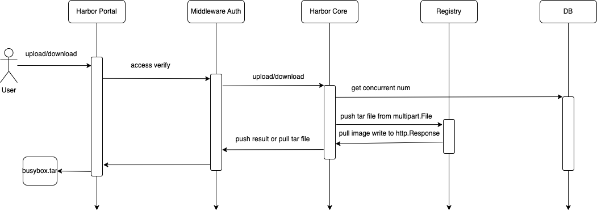

# Upload or Download Artifacte from portal

Author: Leng Rongfu

## Abstract
Current users, upload artifacts to the current registry from the Harbor portal, or download artifacts.


## Background
Currently, push/pull images must be able to access the registry service. However, in some enterprises, users are denied access to the /v2 interface of the core service on their local machines, and can only access the Harbor portal page. Therefore, it is more convenient to upload or download images on the page.


## User Stories

### Story 1
As a system administrator, you can upload or download images from any project.

### Story 2
As a project administrator, you can upload or download images from the current project.

### Story 3
As a user, when you have the push image permission for a certain project, you can upload images to that project.

### Story 4
As a user, when you have the pull image permission for a certain project, you can download images to that project.

### Story 6
As a user, when you not have the pull or push image permission for a certain project, you not can download or upload images to that project.

## Premise
1, The portal can be accessed normally.

## Proposal

We propose the following solutions:

1. Add "Upload Image" and "Download Image" buttons to the Action section on the Repositories detail page.
2. When a user has the push image permission, the "Upload Image" button is clickable.
3. When a user has the pull image permission, the "Download Image" button is clickable.
4. Because it consumes resources, system administrators can set the number of concurrent uploads or downloads allowed.

### APIs for upload/download image

 1. Upload image

    ```
    POST /api/v2.0/projects/{project}/repositories/{repositorie}/artifacts/upload?tag=v1
    Content-type: form-data
    Body: file
    
    ```
    
 2. Download image

    ```
    GET /api/v2.0/projects/{project}/repositories/{repositorie}/artifacts/download?tag=v1
    
    ```


### DB scheme

> ConfigEntry is System Setting use table.
```
type ConfigEntry struct {
	ID    int64  `orm:"pk;auto;column(id)" json:"-"`
	Key   string `orm:"column(k)" json:"k"`
	Value string `orm:"column(v)" json:"v"`
}
```
Key: `upload_concurrent`
Key: `download_concurrent`

### Configuration Manager

Add the function to configure the limit of concurrent uploads or downloads on the System Setting page, and store it in the ConfigEntry database table through the Configuration Controller.


Use `src/controller/config/controller.go` `Controller` to manager concurrent.


### ArtifactAPI 

```go
type ArtifactAPI interface {
  UploadArtifact(ctx context.Context, params artifact.UploadArtifactParams) middleware.Responder
  DownloadArtifact(ctx context.Context, params artifact.DownloadArtifactParams) middleware.Responder
}

type UploadArtifactParams {
  HTTPRequest *http.Request `json:"-"`
  XRequestID *string
  tag string
  ProjectName string
	RepositoryName string
}

type DownloadArtifactParams{
  HTTPRequest *http.Request `json:"-"`
  XRequestID *string
  tag string
  ProjectName string
	RepositoryName string
}
```

### Solution



Image uploading and downloading are performed in the Harbor-core service. During uploading, the input stream is read from the http.Request and then directly pushed to the registry. During downloading, the image is pulled from the registry and then directly written into the http.ResponseWriter.

#### Use skopeo tools

use `skopeo` command tools to push or pull image.

```go
func uploadHandler(w http.ResponseWriter, r *http.Request) {
  file, _, err := r.FormFile("file")
  cmd := exec.Command("skopeo", "copy","docker-archive:/dev/stdin", "docker://registry.com/library/busybox:v1")
	cmd.Stdin = file
	cmd.Stdout = os.Stdout
	cmd.Stderr = os.Stderr
}
func downloadHandler(w http.ResponseWriter, r *http.Request) {
  cmd := exec.Command("skopeo", "copy", "--format=v2s2", "--quiet", "docker://registry.com/library/busybox:v1", "docker-archive:/dev/stdout")
	cmd.Stdin = os.Stdin
	cmd.Stdout = w
	cmd.Stderr = os.Stderr
}
```

#### Use Regclient

use `github.com/regclient/regclient` project to push or pull image.

```go
func uploadHandler(w http.ResponseWriter, r *http.Request) {
  file, _, err := r.FormFile("file")
  imageRef, err := ref.New("registry.com/library/busybox:v1")
  err = regClient.ImageImport(context.Background(), imageRef, &file)
}

func downloadHandler(w http.ResponseWriter, r *http.Request) {
  imageRef, err := ref.New("registry.com/library/busybox:v1")
  regClient.ImageExport(context.Background(), imageRef, w)
}
```

