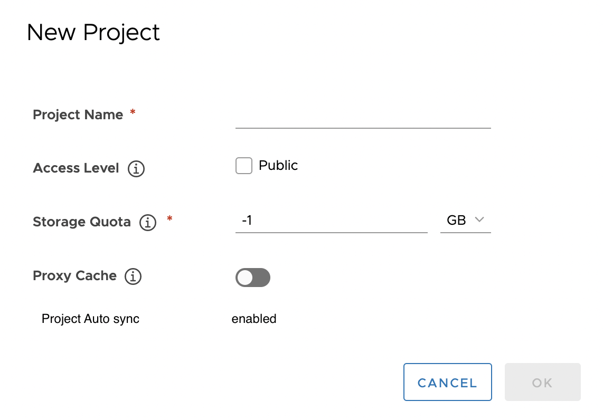
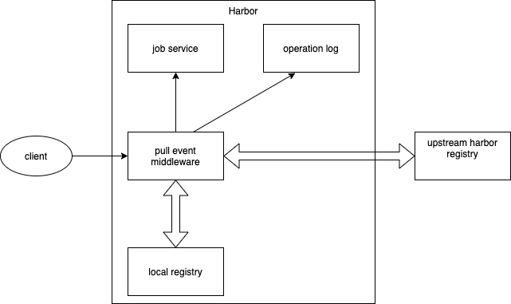
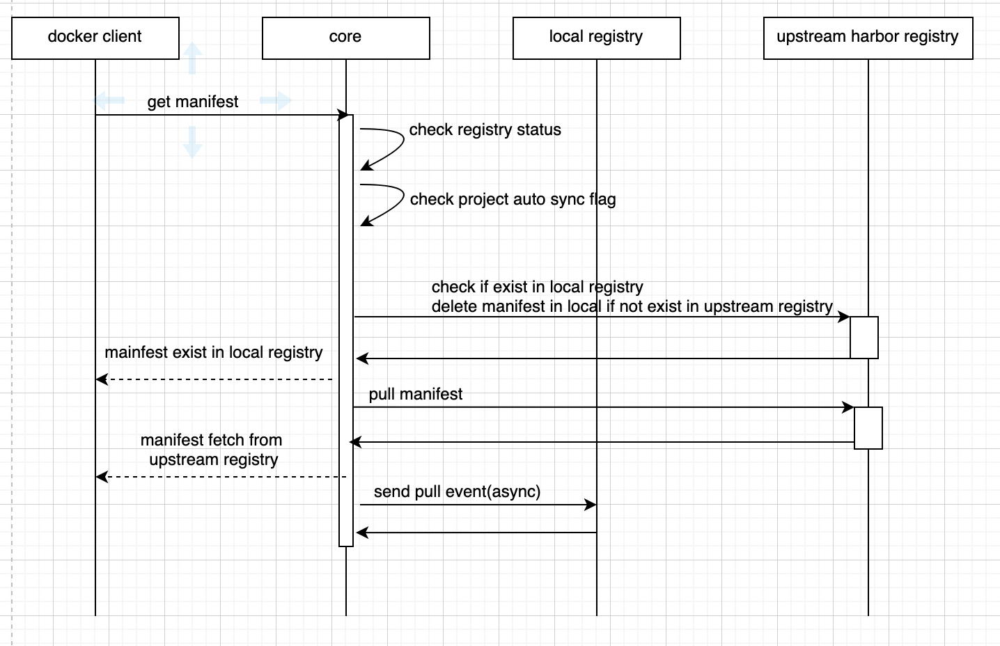

# Proposal:  `Auto-synced Project`

Author: `yunkunrao`

## Abstract

It proposes an approach to enable Harbor to support auto-synced project.

## Background

Briefly, current replication policy doesn't support event-based trigger mode for pull-based replication mode. And alternative solution proxy cache seems to have a similar function, but it has it's own limitation that docker image namespace has to be changed with a new proxy cache project as the prefix.

## Proposal

We can enhance the current project implementation by adding a auto-synced project type.

As a Harbor system admin, the user can create a new auto-synced project in Harbor, and associate an existing registry to it for synchronization.



As a common user in Harbor, if the user is already login and has the permission to the proxy project. if he need to pull the image:
```
docker pull <harbor_servername>/dockerhub_proxy/example/hello-world:latest
```
If user create a auto-synced project whose name should be the same as project name in upstream Harbor registry, the user can pull the image without any proxy cache project prefix and image will be auto-synced from upstream registry:

```
docker pull <harbor_servername>/example/hello-world:latest
```
For kubernetes, it's totally transparent and mutating webhook is no longer needed compared with proxy cache project.

When a pull request comes to the auto-synced project, if the image doesn't exist in local registry, it pulls the image from the upstream registry and stores the image in local registry which is similar to proxy cache project. But this is not a whole story. It's on the one hand. On the other hand, the pull image operation will trigger a artifact pull event asynchronously. When job service receive the event, it will start a replication task which is responsible for copy the image from upstream registry to local registry. It should be noted that when the image doesn't exist in upstream registry. The image will be delete from local registry. 

## Goal

The pull event middleware involves pull requests to container images, we will compare the pull command under these conditions:

* Pull image from a normal Harbor project
* Pull image from a auto-synced project with all images are cached in local

Because like the proxy project, the auto-synced project has some concurrent limitation on the request, the overall image pull performance degradation must less than 50%.

## Non-Goals

The current solution proxy container images request on project level and replicate the image from upstream registry to local registry, is not a whole Harbor server level. In other words, it's a enhancement but not a replacement for the proxy cache project.

The proxied artifact only includes container images.

Like the proxy cache project to preserve the image consistency, all push requests to auto-synced project is not allowed. Other project related features are  unchanged. Content trust is disabled by default in the auto-synced project. Other features related to Harbor projects, such as the project membership, label, scanner, tag retention policy, robot account, web hooks, CVE whitelist should work as they were.

## Terminology

* Upstream registry — The upstream registry from which local registry can pull the image. Currently, auto-synced project only support Harbor registry.
* Auto-synced Project - Auto-synced is a enhancement to proxy cache project. Its name should be the same as project name in upstream Harbor registry. Combine proxy cache with Harbor job service, the image replication job can be triggerred by docker pull command. 

## Compatibility

Support to proxy the dockerhub.com or Harbor.
Support docker client and containerd.

## Implementation

### Basic mechanism

A docker image pull command can be decomposed into several HTTP request. For example:
```
docker pull library/hello-world:latest
```
The HTTP request to get the content of manifest library/hello-world:latest, this request will send to the repository, and the repository intercept the request to the example/hello-world:sha256:xxxxxxxx, and its response with that of get the manifest blob.

```
# The background HTTP authentication request which can be handled by replication adapter 
GET /v2/
GET /service/token?account=admin&scope=&scope=repository%3Alibrary%2Fhello-world%3Apush%2Cpull&service=harbor-registry
GET /v2/library/hello-world/manifests/latest
# change to actual request in background
GET /v2/library/hello-world/blobs/sha256:92c7f9c92844bbbb5d0a101b22f7c2a7949e40f8ea90c8b3bc396879d95e899a
```
The client parses the content of the manifest, then get all dependency blobs.
```
GET /v2/library/hello-world/blobs/sha256:1b930d010525941c1d56ec53b97bd057a67ae1865eebf042686d2a2d18271ced
GET /v2/library/hello-world/blobs/sha256:fce289e99eb9bca977dae136fbe2a82b6b7d4c372474c9235adc1741675f587e
```

In summary, the proxy middleware need to handle the GET method to manifests and blobs.

### Components


### Get manifest

To enable the auto-synced feature in Harbor, it is required to add a pull event middleware, which detects HTTP requests of docker pull command. If it is a request to get the manifest, get it in the upstream Harbor registry and proxied the latest manifest to the client, then start a image replication job asynchronously, if the manifest doesn't exist in the target server, clean it from the auto-synced project if exist.


### Get blob

For get blob request, it tries to get the blob in local registry first, if not exist, get the blob from the upstream Harbor registry, then store the content to the local registry. When same request comes the second time, then serves the request with the stored content. When the upstream registry is offline, serves the pull request like a normal project.

This get blob middleware reuses proxy cache middleware. The details info can be found at [Proxy Project](./pull_through_proxy_cache.md)

### HEAD method of manifest and blob

Because there is no use case that requires to proxy HEAD request, it won't be proxied.

### Push Image

The proxy server forbid the push request to the proxy project. it uses middleware to check. In order to maintain image consistency, image can only be synced from upstream Harbor registry, not the other way around.

### Replication Policy

Auto-synced project can be triggerred by pull-based replication policy with event-based trigger mode.

### Data Models

Add a column auto_synced in project table, if the auto_synced is true, the project is auto-synced project.

### API Change

Add a new field in the project API for POST and GET

Method | URL  | Request Body   | Response
---   | ---- | -------------- | ---------
POST | /projects | { "project_name": "sample_project","auto_synced":true,registry_id": 1,"metadata": {"public": "true"}} | 200 - Updated metadata successfully. <br/>400 - Invalid request. <br/>401 - User need to log in first. <br/>403 - User does not have permission to the project. <br/>404 - Project or metadata does not exist. <br/>500 - Internal server errors.
GET | /projects |    | 200 - { "project_name": "sample_project", "auto_synced":true,registry_id": 1 } <br/>400 - Invalid request. <br/>401 - User need to log in first. <br/>403 - User does not have permission to the project. <br/>404 - Project or metadata does not exist. <br/>500 - Internal server errors.

### Impact to existing feature

Name  | Change | Justification |
------|  ------ | --------------------------- 
Pull image  |  Yes    |  Discussed in implementation
Push image  |  Yes    |  It is not allowed to push image to a auto-synced project, but it is supported to push to the normal project. this feature reuse proxy middleware.
content trust | Yes | Disabled
RBAC  |  No     | If current user has permission to access the current project, pull image and cache the images.  each role include guest, master, developer, admin can use the proxy to pull image from remote server. if current user has no permission to access the current project, it returns 404 error to the client.
Tag retention | No |
Quota | No | Cached images are stored in local through replication adapter, its push requests are handled by core middleware, there is no need to handle the quota in the proxy middleware.
vulnerability scan | No |
AuditLog | No |
